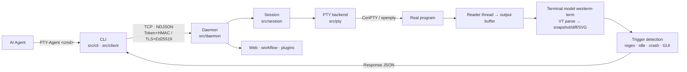
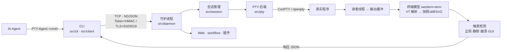

<div align="center">

# PTY-Agent

<div id="lang-switch" style="margin-bottom: 10px">
  <a href="#en" style="text-decoration:underline;color:inherit;font-weight:bold">English</a>
  ·
  <a href="#zh" style="text-decoration:none;color:gray">中文</a>
</div>

</div>

<div id="en" style="display:block">

<div align="center">

**Let AI use terminals like a real user**

Drive REPLs, debuggers, TUIs, installers, long-running services, and coding agents — getting **what the user actually sees on screen**, not just a raw stdout byte stream.

</div>


```
┌─ PTY-Agent ─────────────────────────────────────────────────────────────────┐
│ $ app.py exec dbg -c "cdb.exe myapp.exe" -t "0:000" --timeout 5             │
│                                                                             │
│ ─────────────────────────────── matched ───────────────────────────────     │
│ Microsoft (R) Windows Debugger Version 10.0.11451.4                         │
│ 0:000>                                                                      │
│ ───────────────────────────────────────────────────────────────────────     │
│ [exec · matched · 0.42s]  dbg  running  pty                                 │
└─────────────────────────────────────────────────────────────────────────────┘
```

---

## Features

- ✨ **Shell · CUI · TUI** — use terminals like a human: start sessions, send keys, wait for prompts, read screens
- ✨ **Cross-platform** — Windows / Linux, macOS coming soon
- ✨ **Real-time Web monitoring** — watch and control every terminal session, collaborate live
- ✨ **Sandbox** — restrict AI operations to the workspace, prevent accidental damage
- ✨ **Plugin system** — extend functionality freely
- **AI secondary analysis** — pipe long logs, large outputs, even rendered **terminal screenshots** to another AI
- **Sub-agents** — launch OpenCode / Claude Code / ... across harnesses, managed centrally
- **Workflow orchestration** — multi-session DAG choreography
- **Remote terminal access** — SSH-like experience

---

## Why PTY-Agent?

Traditional agents can't run `ssh`, `gdb`, `cdb`, or any program that **asks you a question**.

| Traditional approach | PTY-Agent |
|---|---|
| No TTY — program falls back to non-interactive mode | Real pseudo-terminal |
| "Run and check" only | Persistent sessions |
| Can't "wait for a specific prompt" | `-t "<regex>"` trigger, return on match |
| Hangs / crashes / popups → caller hangs, user waits | Timeout, GUI detection, crash detection — all return cleanly |
| Raw byte stream | **Rendered terminal snapshot** |

## Quick overview

| | |
|---|---|
| **Mode** | `pty` (default, screen snapshot, for TUI/REPL); `--subprocess` (incremental output + stderr, for compile/download) |
| **Return reasons** | `ok` / `matched` / `timeout` / `idle` / `ended` / `crashed` / `gui` / `cancelled` / `notify` |
| **Output filtering** | `-l N`, `-g "<regex>"`, `-s` incremental diff, `--column N`, `-o` export `.svg/.png/.jpg/.txt` |
| **Input** | `send` raw text; `advsend` supports `{ctrl+c}` `{enter}` `{f1}`~`{f12}`, newline `lf/crlf/cr/none`; mouse `click/drag/scroll/hover/press/grep` with `--grep` coordinate lookup |
| **Async** | `--notify` returns immediately, pick up results via `wait` / `notice <nid>`, non-blocking |
| **Orchestration** | `workflow` YAML DAG: dependency parallelism, `if` conditions (AST safe eval), `retry`, `on_error` |
| **Web** | Browser terminal (xterm.js + Web RIME IME), FastScreen streaming, VNC remote desktop, default `127.0.0.1:18766` |
| **Sandbox** | Windows opt-in: Job Object + restricted token, workspace-only writes, CPU/memory/process/wall-clock quotas |

## Installation

Compilation is required. **Download the pre-built Release package**, or clone and run `build.py`.

One-line install via the script (auto-detects platform, fetches latest release, installs as a Skill):

**Windows (PowerShell):**
```powershell
irm https://raw.githubusercontent.com/ming-14/PTY-Agent/main/install.ps1 | iex
```

**Linux / macOS:**
```bash
curl -fsSL https://raw.githubusercontent.com/ming-14/PTY-Agent/main/install.sh | bash
```

## Architecture



## Configuration

Config files are in `config/`, overridable via env vars `PTY_AGENT_<KEY>`, restart required.

```
CLI ──token──▶ 127.0.0.1:10520    (local dev, strong auth)
CLI ──basic──▶ 0.0.0.0  :10521    (local dev, weak auth)
CLI ──tls────▶ 0.0.0.0  :18767    (remote access)
Browser ──────▶ 127.0.0.1:18766    (Web UI)
```

| File | Purpose |
|---|---|
| `common.toml` / `shared.toml` | Data dir (`~/.pty-agent`), default terminal size, protocol buffers |
| `daemon/daemon.toml` | 3 listeners, buffers, default timeout (120s), auth & keys |
| `daemon/sandbox.toml` | Sandbox toggle & quota (default: off) |
| `client/client.toml` | `CONNECT_MODE = basic\|token\|tls`, TOFU strict mode |

Note: disable `SINGLE_INSTANCE` if running two PTY-Agent instances on one machine.

---

## Docs

| Doc | Description |
|---|---|
| [ARCHITECTURE.md](docs/ARCHITECTURE.md) | `src/` package architecture, module layering, call chains |
| [CLI.md](docs/CLI.md) | CLI reference |
| [WORKFLOW.md](docs/WORKFLOW.md) | Workflow orchestration (YAML steps, parallelism, conditions, retry) |
| [PLUGINS_API.md](docs/PLUGINS_API.md) | Plugin development guide |
| [CONFIG.md](docs/CONFIG.md) | Configuration reference |

---

</div>

<summary style="cursor:pointer;font-size:1.5em;font-weight:bold">中文</summary>

---

## feature

- ✨ 轻松操作**Shell · CUI · TUI** —— 真正像人一样使用终端：起会话、发按键、等提示符、看屏幕 ✨
- ✨ **Windows / Linux 跨平台** —— 将来还会支持 MacOS ✨
- ✨ **实时 Web 监控** —— 实时接管每一个终端会话，也可以一起协作 ✨
- ✨ **沙箱系统** —— 启用后，AI 只在工作区工作，根本上防止删盘 
- ✨ **强大的插件系统** -- 需要什么功能，随意扩展
- **AI 二次分析，长上下文一步就好** —— 把长日志、大段输出、甚至渲染后的**终端图片**直接交给另一个 AI，一步返回结论
- **子 Agent：跨 Harness 启动，统一管理** —— OpenCode / Claude Code / ... 支持扩展
- **workflow 多会话编排**
- **跨机访问终端** —— 支持 ssh 般的体验

---

## 为什么需要它

常规 Agent 跑不了 `ssh`、跑不了 `gdb`、跑不了 `cdb`，也跑不了任何会**反问你一句**的程序

| 传统调用 | PTY-Agent |
| --- | --- |
| 无 TTY，程序自动降级为非交互模式 | 真实伪终端 |
| 只能"跑完再看" | 可使用持久化终端 |
| 无法"等到出现某个提示符" | `-t "<regex>"` 正则触发器，命中即返回 |
| 卡住 / 崩溃 / 弹窗 → 调用方一起卡死、user白白等待 | 静默超时、GUI 窗口、崩溃、进程退出 —— 全部可感知、可返回 |
| 拿到原始字节流 | 拿到渲染后的**终端屏幕快照** |

## 能力速览

| | |
| --- | --- |
| **运行模式** | `pty`（默认，屏幕快照，适合 TUI/REPL）；`--subprocess`（增量输出 + stderr 分离，适合编译/下载） |
| **自定义返回条件** | `ok` / `matched` / `timeout` / `idle` / `ended` / `crashed` / `gui` / `cancelled` / `notify` |
| **结果裁剪** | `-l N`、`-g "<regex>"`、`-s` 增量 diff、`--column N`、`-o` 导出 `.svg/.png/.jpg/.txt` |
| **输入** | `send` 原样；`advsend` 支持 `{ctrl+c}` `{enter}` `{f1}`~`{f12}` 等控制字符；行尾 `lf/crlf/cr/none`，鼠标`click/drag/scroll/hover/press/grep`，`--grep "<regex>"` 用文本反查坐标，不必数行列 |
| **异步** | `--notify` 立即返回，条件满足后由 `wait` / `notice <nid>` 取回，不阻塞自己 |
| **编排** | `workflow` YAML DAG：依赖并行、`if` 条件（AST 白名单安全求值）、`retry`、`on_error` |
| **Web** | 浏览器终端（xterm.js + Web RIME 中文输入法）、FastScreen 屏幕流、VNC 远程桌面，默认 `127.0.0.1:18766` |
| **沙箱** | Windows opt-in：Job Object + 受限令牌，仅工作目录可写，内存/CPU/进程数/墙钟配额 |

## 安装

该 Skill 需要编译，**请下载 Release 的预编译包**，或者 clone 之后使用`build.py`编译

一行安装（自动判断平台、拉取最新 Release、安装为 Skill）：

Windows（PowerShell）：

```powershell
irm https://raw.githubusercontent.com/ming-14/PTY-Agent/main/install.ps1 | iex
```

Linux / macOS：

```bash
curl -fsSL https://raw.githubusercontent.com/ming-14/PTY-Agent/main/install.sh | bash
```

## 它是怎么工作的



## 配置

配置集中在 `config/`，可用环境变量 `PTY_AGENT_<KEY>` 覆写，改完需重启进程

```
CLI ──token──▶ 127.0.0.1:10520    (本地开发强验证)
CLI ──basic──▶ 0.0.0.0  :10521    (本地开发弱验证，没问题开这一个就好)
CLI ──tls────▶ 0.0.0.0  :18767    (提供跨机访问)
浏览器 ───────▶ 127.0.0.1:18766    (Web)
```

| 文件 | 管什么 |
| --- | --- |
| `common.toml` / `shared.toml` | 数据目录（`~/.pty-agent`）、默认终端尺寸、协议缓冲 |
| `daemon/daemon.toml` | 三监听器、缓冲区、默认超时（120s）、认证与密钥 |
| `daemon/sandbox.toml` | 沙箱开关与配额（默认关闭） |
| `client/client.toml` | `CONNECT_MODE = basic\|token\|tls`、TOFU 严格模式 |

注意：如果一台设备要开启两个 PTY-Agent，请关闭单实例锁`SINGLE_INSTANCE`

---

## 文档

| 文档 | 说明 |
| --- | --- |
| [ARCHITECTURE.md](docs/ARCHITECTURE.md) | `src/` 包模块化架构设计，为代码维护与扩展提供指导 |
| [CLI.md](docs/CLI.md) | 命令行帮助文档 |
| [WORKFLOW.md](docs/WORKFLOW.md) | Workflow 脚本编排使用文档（YAML 步骤定义、依赖并行、条件、重试） |
| [PLUGINS_API.md](docs/PLUGINS_API.md) | 插件开发指南（Plugin API） |
| [CONFIG.md](docs/CONFIG.md) | 配置说明 |
