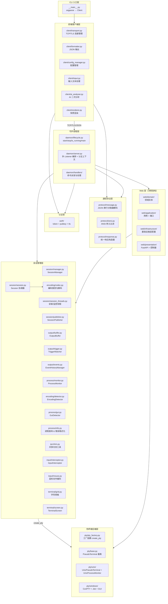
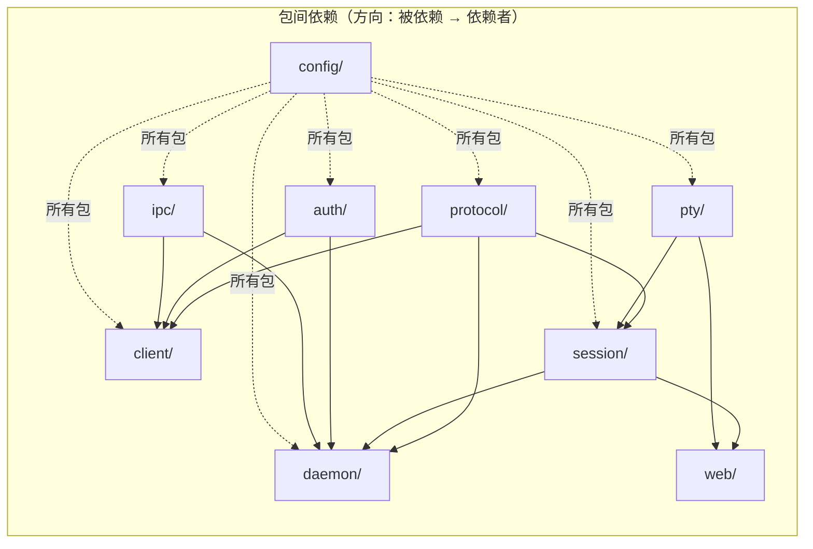

# pty-agent 架构设计

> 规范版本位于 [desgin/ARCHITECTURE.md](desgin/ARCHITECTURE.md)，本文件为其副本。
>
> 本文档描述 `src/` 包的模块化架构设计，为代码维护与扩展提供指导。

---

## 1. 概述

PTY-Agent 是一个通过伪终端（PTY）与交互式 CLI 程序双向通信的命令行代理。守护进程以独立子进程运行，首次执行命令时自动启动。支持同机 IPC（明文 + token 认证）与跨机访问（TLS + pubkey 认证）双端口架构，并提供 Web 管理界面、FastScreen 屏幕流、VNC 远程桌面等扩展能力。

**子命令**：`start | stop | status | list | exec | send | read | kill | events | closewin | mouse | wait | file <read|write|edit|grep|glob|upload|download> | set-default | keygen`

---

## 2. 架构设计原则

项目遵循以下设计原则：

1. **单一职责**：每个模块只做一件事
2. **高内聚低耦合**：相关功能内聚到同一模块，模块间通过明确定义的接口通信
3. **平台隔离**：Windows 特有代码完全隔离在 `pty/windows/` 子包下，Unix 平台零加载
4. **配置集中**：所有常量统一在 `config/` 包管理（TOML 文件 + 加载器）
5. **可测试性**：每个模块可独立测试，方便 mock
6. **可扩展性**：新增 PTY 后端只需添加单个文件；新增 CLI 子命令流程清晰
7. **清洁架构（洋葱模型）**：Web 层采用四层结构（domain → application → infrastructure → presentation），依赖只能从外层指向内层

---

## 3. 重构后架构

### 3.1 目录结构总览

```
src/
├── __main__.py              # CLI 入口（参数解析 + 配置管理 + 命令派发，918 行）
│
├── assets/                  # ═══════ 静态资源 ═══════
│   └── fonts/
│       ├── config.json      # 字体配置
│       └── LICENSE.txt      # 字体许可证
│
├── config/                  # ═══════ 配置中心（TOML 文件 + 加载器） ═══════
│   ├── __init__.py          # 包导出
│   ├── _loader.py           # TOML 加载/展平/合并工具（load_toml / flatten / merge）
│   ├── common.py            # 共有配置加载（common.toml + IS_WINDOWS / DATA_DIR / PROJECT_ROOT）
│   ├── daemon.py            # 守护进程配置加载（common + daemon + logging + web.toml + PORT_FILE / LOG_DIR）
│   ├── client.py            # 客户端配置加载（common + client.toml）
│   ├── files.py             # 文件工具配置加载（files.toml + RG_EXE 自动探测）
│   ├── common.toml          # 共有配置（终端默认值 / DAEMON_HOST / 压缩 / 输入限制 / 认证开关 / AI 超时）
│   ├── daemon.toml          # 守护进程配置（端口 / 缓冲 / 超时 / 命名资源 / SHM / TLS 服务端）
│   ├── client.toml          # 客户端配置（连接超时 / TLS 客户端 / TOFU）
│   ├── files.toml           # 文件工具配置（读/写/搜索上限、忽略目录、RG_EXE）
│   ├── logging.toml         # 日志配置（级别 / 格式 / 轮转 / logger 分组）
│   ├── web.toml             # Web 服务器配置（监听 / 密码认证 / VNC / fastscreen / 网页端默认值）
│   ├── vnc.toml             # VNC 运行时配置（端口 / 密码 / 日志，由 winvnc 读取）
│   └── vnc.example.toml     # VNC 配置示例
│
├── protocol/                # ═══════ 通信协议层 ═══════
│   ├── message.py           # Message 类（JSON 换行分隔协议：编码 / 解码 / 发送 / 接收）
│   ├── ansi.py              # ANSI 转义序列过滤（strip_ansi）
│   └── response.py          # Response 类（统一响应构建器，CLI/TCP/WS 共用）
│
├── auth/                    # ═══════ 认证层（可插拔认证与消息签名） ═══════
│   ├── __init__.py          # 导出共享基础设施
│   ├── base.py              # 抽象接口（Authenticator / CredentialProvider / MessageSigner）
│   ├── keys.py              # Ed25519 密钥实体（PublicKey / PrivateKey / 生成/加载/指纹）
│   ├── context.py           # AuthContext（连接级认证上下文，绑定出站签名器/入站验证器/认证器）
│   ├── composite.py         # CompositeAuthenticator（OR/AND 组合认证器）
│   ├── or_verifier.py       # OrVerifier（入站多认证方式 OR 分发验签）
│   ├── token/               # ═══ Token + HMAC 认证（同机，对称双向） ═══
│   │   ├── __init__.py
│   │   ├── authenticator.py # TokenAuthenticator + TokenCredentialProvider
│   │   └── signer.py        # HmacMessageSigner（HMAC-SHA256）
│   ├── pubkey/              # ═══ Ed25519 公钥认证（跨机，非对称单向） ═══
│   │   ├── __init__.py
│   │   ├── authenticator.py # PubkeyAuthenticator + PubkeyCredentialProvider
│   │   └── signer.py        # Ed25519MessageSigner
│   └── tls/                 # ═══ TLS 基础设施 ═══
│       ├── __init__.py
│       ├── cert_manager.py  # CertificateManager（自签证书生成/加载/指纹计算）
│       └── known_hosts.py   # KnownHosts（TOFU 信任存储，类似 SSH known_hosts）
│
├── client/                  # ═══════ 前端客户端层 ═══════
│   ├── transport.py         # TCP/TLS 连接管理 + Client 类（自动启动守护进程，自动路由明文/TLS，1030 行）
│   ├── tls_transport.py     # TLSClient（TLS 连接 + TOFU 证书验证，pubkey 跨机模式）
│   ├── formatter.py         # 响应格式化输出（仅 JSON 模式，直接 json.dumps 到 stdout）
│   ├── renderer.py          # 终端快照渲染器（GDI+BuiltinGlyphs / SVG / Pillow 回退 / 纯文本，1151 行）
│   ├── config_manager.py    # 会话级内存配置管理（守护进程侧，--default 临时覆盖）
│   ├── input.py             # 输入文本处理（process_input / unescape_json_string / expand_control_characters / safe_print）
│   └── ai_analyser.py       # AI 二次分析模块（调用 bin/aichat 分析 outputStream，170 行）
│
├── daemon/                  # ═══════ 守护进程层 ═══════
│   ├── __main__.py          # 入口（`python -m src.daemon`），转调 lifecycle.main()
│   ├── lifecycle.py         # 生命周期管理：start_daemon / stop_daemon / is_running / main / setup_client_logging（740 行）
│   ├── server.py            # DaemonServer（多 Listener 编排 + 认证上下文构建 + 生命周期，469 行）
│   ├── listener.py          # Listener（单端口 accept 循环，封装明文/TLS 传输 + AuthContext）
│   ├── single_instance.py   # 单实例互斥锁（防止多守护进程同时运行）
│   ├── handler.py           # RequestHandler 兼容导出（委托 handlers/ 子包）
│   └── handlers/            # ═══ 命令处理器子包（每命令一文件 + 派发器） ═══
│       ├── __init__.py
│       ├── base.py          # DaemonHandler 基类 + HandlerContext
│       ├── dispatcher.py    # DaemonDispatcher（消息派发到各 handler）
│       ├── exec_handler.py  # exec 命令处理
│       ├── send_handler.py  # send 命令处理
│       ├── read_handler.py  # read 命令处理
│       ├── list_handler.py  # list 命令处理
│       ├── kill_handler.py  # kill 命令处理
│       ├── events_handler.py # events 命令处理
│       ├── stop_handler.py  # stop 命令处理
│       ├── closewin_handler.py # closewin 命令处理
│       ├── mouse_handler.py # mouse 命令处理
│       ├── status_handler.py # status 命令处理
│       ├── wait_handler.py  # wait 命令处理
│       ├── file_read_handler.py # file read 命令处理
│       ├── file_write_handler.py # file write 命令处理
│       ├── file_edit_handler.py # file edit 命令处理（create/replace/delete）
│       ├── file_grep_handler.py # file grep 命令处理（rg 双引擎）
│       ├── file_glob_handler.py # file glob 命令处理（rg 双引擎）
│       ├── file_upload_handler.py # file upload 命令处理（握手→二进制帧传输）
│       ├── file_download_handler.py # file download 命令处理（握手→二进制帧传输）
│       └── utils.py         # 处理器工具函数（compress_screen_buffer / map_reason / build_result / attach_screen_buffer 等约 15 个）
│
├── files/                    # ═══════ 文件工具用例层（read/write/edit/grep/glob/upload/download） ═══════
│   ├── __init__.py           # 聚合导出工具函数集合
│   ├── paths.py              # 路径工具：会话 cwd 解析（resolve_session_path）/边界判定/git-bash 检测
│   ├── state.py              # 读写状态机：FileRecordStore（readTime/writeTime）
│   ├── diff.py               # unified diff 生成 + additions/removals 统计
│   ├── history.py            # FileHistoryStore（SQLite 版本链，~/.pty-agent/history.db）
│   ├── permission.py         # 权限检查器（D3：仅保留接口，直接放行）
│   ├── errors.py             # 工具异常类型（FileToolError / FileReadRequiredError 等）
│   ├── read/
│   │   └── reader.py         # file read 用例：大小/行数限制、行号输出、图片检测、相似名建议
│   ├── write/
│   │   └── writer.py         # file write/file edit 用例：状态机→diff→权限→落盘→history
│   ├── search/
│   │   ├── grep.py           # file grep 用例：rg 引擎 + 纯 Python 降级
│   │   ├── glob_.py          # file glob 用例：rg --files + 递归 glob 降级
│   │   └── ignore.py         # SkipHidden 过滤（隐藏文件 + 忽略目录清单）
│   └── transfer/             # ═══ file upload/download 传输业务（两端共用） ═══
│       ├── common.py         # 帧协议常量/错误类型（TransferError/TransferTimeoutError/TransferAbortedError）
│       ├── scan.py           # 本地/远端树扫描（清单生成）
│       ├── map.py            # 路径映射（远端↔本地 relpath 对齐）
│       ├── judge.py          # 覆盖判定（相同跳过/不同拒绝提示 --force）
│       ├── client_upload.py  # CLI 侧上传驱动（握手→清单→逐文件→进度）
│       ├── client_download.py # CLI 侧下载驱动
│       ├── daemon_upload.py  # daemon 侧上传接收（落盘→校验→rename→history→映射）
│       └── daemon_download.py # daemon 侧下载发送（扫描→逐文件发送）
│
├── pty/                     # ═══════ 伪终端后端层 ═══════
│   ├── pty_factory.py       # 工厂函数 create_pty + 平台检测
│   ├── base.py              # PseudoTerminal 抽象基类
│   ├── unix/                # ═══ Unix 子包 ═══
│   │   ├── pty_impl.py      # UnixPseudoTerminal（os.openpty + fork + termios）
│   │   ├── process.py       # UnixProcessMonitor + UnixNotification（pgid 进程树追踪 + waitpid 轮询崩溃检测）
│   │   └── shells.py        # Shell 检测函数（detect_available_shells / format_shell_info / resolve_default_shell）
│   └── windows/             # ═══ Windows 子包（仅 Win32 加载） ═══
│       ├── win32_api.py     # Windows ctypes 类型定义 + 全部 API 函数绑定（507 行）
│       ├── conpty.py        # WindowsPseudoTerminal（CreatePseudoConsole 路径，1001 行）
│       ├── condrv.py        # ConDrvPseudoTerminal（NT NtOpenFile 直连路径，已禁用，1128 行）
│       ├── conpty_handle.py # ConPtyHandle（HPCON + inW/outR 句柄三件套，I/O 与 resize）
│       └── shells.py        # Shell 检测函数（detect_available_shells / format_shell_info / resolve_default_shell）
│
├── ipc/                     # ═══════ 进程间通信层 ═══════
│   └── shm.py               # 共享内存工具（端口/PID + 认证令牌 + HMAC 密钥读写，349 行）
│
├── terminal/                # ═══════ 终端屏幕层 ═══════
│   ├── grid.py              # tmux 风格字符网格（scrollback + visible，reflow 重排，631 行）
│   ├── grid_screen.py       # GridScreen（pyte.Screen 适配层，同步 pyte.buffer 到 Grid，493 行）
│   └── screen.py            # TerminalScreen（pyte VT 序列解析 → 字符网格 → 屏幕快照，549 行）
│
├── session/                 # ═══════ 会话管理层 ═══════
│   ├── manager.py           # SessionManager（会话 CRUD + stop_all）
│   ├── session.py           # Session 协调器（组合各子组件，委托线程管理，932 行）
│   ├── session_threads.py   # SessionThreads + SessionComponents（后台读者/监控线程管理，407 行）
│   └── publisher.py         # SessionPublisher（订阅者与结束回调管理，向 Web 层发布会话状态）
│
├── encoding/                # ═══════ 编码探测层（独立子包） ═══════
│   ├── codec.py             # 编码探测与解码纯函数（detect_decode / decode_strip_tail / auto_detect / 智能裁剪）
│   └── detector.py          # EncodingDetector（编码探测状态管理）
│
├── output/                  # ═══════ 输出处理层（独立子包） ═══════
│   ├── buffer.py            # OutputBuffer（线程安全输出缓冲区）
│   ├── trigger.py           # TriggerMatcher + safe_regex_search（触发条件匹配 + ReDoS 防护）
│   └── events.py            # EventHistoryManager + PendingEvent（事件队列 + 历史 + 存在性检测）
│
├── process/                 # ═══════ 进程处理层（独立子包） ═══════
│   ├── base.py              # ProcessTreeTracker 抽象基类 + ProcessNotification + 进程信息实体
│   ├── monitor.py           # ProcessMonitor（进程树 diff + IOCP 排空 + 崩溃检测）
│   ├── info.py              # 进程查询与错误格式化（_get_process_name / _get_process_path / _format_exit_code_message / _format_pty_error / _get_process_tree 等，538 行）
│   ├── gui.py               # GuiDetector（GUI 窗口轮询检测，2s 节流）
│   ├── win32_error.py       # Windows NTSTATUS/Win32 错误码格式化（translate_windows_error / format_process_exit_code / format_create_process_error）
│   ├── unix/                # ═══ Unix 子包 ═══
│   │   └── pgid_tracker.py  # PgidProcessTreeTracker（进程组追踪 + waitpid 轮询崩溃检测）
│   └── windows/             # ═══ Windows 子包 ═══
│       ├── api.py           # Windows API 绑定（Job 相关 ctypes 声明）
│       ├── job_tracker.py   # JobProcessTreeTracker（Job Object 追踪 + IOCP 实时通知 + KILL_ON_JOB_CLOSE）
│       └── gui_monitor.py   # GuiWindowMonitor + GuiWindowInfo（EnumWindows GUI 窗口轮询）
│
├── input/                   # ═══════ 输入处理层 ═══════
│   ├── interceptor.py       # InputInterceptor（SGR 鼠标/键盘 VT 拦截 + 鼠标动作执行，426 行）
│   └── mouse.py             # 鼠标动作编码与坐标解析（MouseActionEncoder / Coord / MatchRegion / grep_screen）
│
├── web/                     # ═══════ Web 服务器层（洋葱架构） ═══════
│   ├── server.py            # WebServer 兼容导出 shim（实现迁移至 presentation/server.py）
│   ├── history.py           # HistoryStore 兼容导出 shim
│   ├── application/         # ═══ 用例层（应用层） ═══
│   │   ├── adaptive_lock.py # AdaptiveLockService（自适应尺寸排他锁 + 接管机制）
│   │   ├── dispatcher.py    # MessageDispatcher（WebSocket 消息分发）
│   │   ├── handlers.py      # WebSocket 消息处理器（每类型一 handler，约 27 个 handler 类，1224 行）
│   │   ├── ports.py         # 应用层端口抽象（9 个 ABC：SessionRepository / HistoryRepository / OutboundMessageChannel / ConnectionContext / SystemStatsProvider / ShellProvider / EventPublisher / CursorLocatorServicePort / ThreadExecutor，320 行）
│   │   └── services.py      # MessageEncoderService + SubscriptionService（跨用例服务）
│   ├── domain/              # ═══ 领域层 ═══
│   │   ├── entities.py      # 领域实体（ActiveSession / HistorySession / HistoryDetail / OutputChunk / SystemStats / SessionEndedInfo / SessionEvent / SessionDetail）
│   │   └── settings_schema.py # Web 设置项 Schema（get_defaults）
│   ├── infrastructure/      # ═══ 基础设施层 ═══
│   │   ├── __init__.py      # 汇总导出所有适配器
│   │   ├── thread_executor.py # ThreadExecutorImpl
│   │   ├── cursor_locator_adapter.py # CursorLocatorAdapter（封装 bin/cursorlocator 光标定位器）
│   │   ├── auth/
│   │   │   └── session_store.py # SessionStore（Web 认证会话 token 存储，线程安全）
│   │   ├── repositories/    # 仓储适配器
│   │   │   ├── history_store.py         # HistoryStore（SQLite 持久化，341 行）
│   │   │   ├── history_repository_adapter.py
│   │   │   └── session_repository_adapter.py
│   │   ├── system/          # 系统服务
│   │   │   ├── shell_provider.py        # ShellProviderImpl
│   │   │   └── stats_provider.py        # SystemStatsProviderImpl（Windows/Linux 系统资源统计）
│   │   └── web/             # Web 基础设施
│   │       ├── connection_context.py    # WebSocketConnectionContext（多会话订阅）
│   │       ├── event_publisher.py       # EventPublisherImpl
│   │       └── fastapi_transport.py     # FastAPIWebSocketTransport
│   ├── presentation/        # ═══ 展示层 ═══
│   │   ├── server.py        # WebServer 实现（FastAPI + uvicorn，664 行）
│   │   └── controllers/
│   │       ├── websocket_controller.py  # WebSocketController
│   │       ├── fastscreen_controller.py # FastScreen 流端点（566 行）
│   │       ├── settings_controller.py   # 设置 REST 端点
│   │       └── auth_controller.py       # Web 密码认证 REST 端点（login/logout/status，213 行）
│   └── static/              # 前端静态资源（分层架构，与后端洋葱架构对应）
│       ├── index.html
│       ├── login.html
│       ├── service-worker.js
│       ├── css/             # 13 个 CSS 文件（base/layout/components/terminal/theme/sidebar/tabbar/settings/dialogs/responsive/devconsole/fastscreen/vnc）
│       ├── js/
│       │   ├── app.js                          # 前端入口
│       │   ├── domain/                         # 领域层（state/settingsSchema/logger/formatters/constants）
│       │   ├── application/                    # 应用层（settingsStore/ports/messageHandlers）
│       │   ├── infrastructure/                 # 基础设施层（wsClient/storage/settingsStorage/auth/domUtils/fontLoader/rimeManager/terminalAdapter/terminal/）
│       │   │   └── terminal/                   # 终端子模块（shared/scroll/scale/mouseMode/lifecycle/input/events/cursorDebug）
│       │   └── presentation/                   # 展示层
│       │       ├── controllers/events.js
│       │       └── views/                      # 视图（9 个：vnc/ui/sizeSelector/settings/sessionHandlers/fastscreen/devConsole/detail/autohide）
│       └── vendor/                             # 第三方资源
│           ├── xterm/                           # xterm.js + 插件
│           ├── rime/                            # Rime 输入法 WASM + 字典
│           ├── rikkajs/                         # shimeji 桌面宠物
│           └── novnc/                           # noVNC 前端（core/ + app/ + vendor/pako/）
│
├── fastscreen/              # ═══════ 快速屏幕流层 ═══════
│   ├── adapter.py           # FastScreenAdapter（桥接 bin/fastscreencore CaptureEngine）
│   ├── ports.py             # FastScreenServicePort（服务抽象接口）
│   ├── server.py            # 独立 aiohttp 流服务器（322 行）
│   └── streamers/           # 流编码器子包
│       ├── manager.py       # StreamManager + SharedSession（多客户端共享会话）
│       ├── h264.py          # H264Streamer
│       ├── h264_mse.py      # H264MSEStreamer
│       ├── mjpeg.py         # MjpegStreamer
│       └── encoding/        # 编码工具子包
│           ├── fmp4.py      # FMP4Muxer（fragmented MP4 封装）
│           ├── h264.py      # H264Encoder
│           └── mjpeg.py     # JPEG/PNG 编码
│
└── vnc/                     # ═══════ VNC 远程桌面层 ═══════
    ├── adapter.py           # VncAdapter（管理 winvnc.exe，实现 VncServicePort）
    ├── password_loader.py   # VNC 密码模块隔离加载（load_vnc_password_module）
    ├── ports.py             # VncServicePort（服务抽象接口）
    ├── process_manager.py   # VncProcessManager（winvnc 启停 + 随机密码 + Job 绑定，447 行）
    └── src/
        └── vnc_password.py  # VNC 密码生成/验证（UltraVNC DES）
```

> 注：noVNC 前端静态资源位于 `web/static/vendor/novnc/`，非 `vnc/src/`。`vnc/src/` 仅含 `vnc_password.py`。WebSocket→VNC TCP 代理由守护进程 `/vnc/websockify` 端点直接实现，无需 websockify 子进程。

### 3.2 分层架构图



### 3.3 各层详细说明

#### 3.3.1 `protocol/` — 通信协议层

**定位**：被 `client/` 和 `daemon/` 双方共同依赖的基础层，零业务逻辑。

| 模块 | 类/函数 | 职责 |
|------|---------|------|
| `message.py` | `Message.encode(obj)` → `bytes` | 将 dict 编码为 JSON 行 + `\n` + UTF-8 |
| `message.py` | `Message.decode(data)` → `dict` | 从 bytes 解码为 dict |
| `message.py` | `Message.send(sock, obj)` | 发送一条消息到 socket |
| `message.py` | `Message.recv(sock)` → `dict\|None` | 从 socket 接收一条消息（带缓冲的行读取） |
| `message.py` | `Message._recv_buffers` | 连接级别的接收缓冲区（按 fileno 索引） |
| `ansi.py` | `strip_ansi(text)` → `str` | 去除 ANSI 颜色/样式码，保留清屏/光标等控制序列 |
| `ansi.py` | `_ANSI_RE` | 匹配 CSI SGR + OSC 的正则（光标/清屏不匹配） |
| `response.py` | `Response` 类 | 统一响应构造器（静态方法 `error` / `ok` / `result` 等，CLI/TCP/WS 共用） |

**设计要点**：
- `Message` 维持静态类设计（无状态），所有方法为 `@staticmethod`
- `_recv_buffers` 字典保持类级别，不污染 socket 对象
- `strip_ansi` 与任何业务逻辑无关，独立可测；仅过滤 SGR 颜色/样式码 + OSC 窗口标题，保留清屏/光标定位等语义控制序列
- 控制序列（`\x1b[2J` 清屏、`\x1b[H` 归位、`\x1b[K` 清行等）不受 `keep_ansi` 影响，始终保留在输出中

#### 3.3.2 `client/` — 前端客户端层

**定位**：封装与守护进程的通信（明文 TCP / TLS），向 CLI 入口提供简洁接口。支持同机 SHM 发现（token 认证）与跨机 TLS 连接（pubkey 认证）自动路由。

| 模块 | 类/函数 | 职责 |
|------|---------|------|
| `transport.py` | `Client` 类 | 向 CLI 暴露 `cmd_start()` / `cmd_stop()` / `cmd_status()` / `cmd_list()` / `cmd_exec()` / `cmd_send()` / `cmd_read()` / `cmd_kill()` / `cmd_events()` / `cmd_closewin()` / `cmd_mouse()` / `cmd_wait()` |
| `transport.py` | `Client._connect()` | 自动路由连接：pubkey 跨机模式（`CLIENT_AUTH_METHOD=="pubkey"` 且 `DAEMON_REMOTE_HOST` 非空）→ TLS 连接（`_connect_tls`）；其他模式 → 明文连接 + SHM 发现（`_connect_plain`，守护进程未运行则自动启动） |
| `transport.py` | `Client._connect_plain()` | 明文 TCP 连接（同机 SHM 发现端口 + 注入认证令牌 + 加载 HMAC 密钥） |
| `transport.py` | `Client._connect_tls()` | TLS 连接（pubkey 跨机模式）：加载私钥 → 构建 KnownHosts → TLSClient 建立 TLS + TOFU 验证 |
| `transport.py` | `Client._send_recv(msg)` | 发送请求 + 接收响应（完整的一次往返，自动注入认证凭证 + 消息签名） |
| `transport.py` | `Client._handle_output()` | `--output` 文件输出：解压 screenBufferZ → 调用 renderer 写入文件 |
| `transport.py` | `Client._apply_ai_analysis()` | AI 二次分析：调用 `ai_analyser.analyse_response()` 用 AI 输出覆盖原 outputStream |
| `transport.py` | `_decompress_screen_buffer()` | 解压 gzip+base64 编码的 screenBufferZ 为 screenBuffer |
| `transport.py` | `_has_shell_operators(cmd)` | 检测 shell 操作符 token（`\|`, `||`, `&`, `&&`, `;`, `>`, `<`, `>>`） |
| `transport.py` | `_parse_iso_time(s)` | 解析 ISO 8601 时间字符串为 Unix 时间戳 |
| `transport.py` | `_read_daemon_port()` | 从共享内存读取端口 |
| `transport.py` | `_load_signer_and_providers()` | 根据认证方式加载签名器和凭证提供者 |
| `tls_transport.py` | `TLSClient` 类 | TLS 客户端连接器：建立 TLS 连接 + TOFU 证书验证（CERT_NONE + 自定义指纹比对，类似 SSH known_hosts） |
| `tls_transport.py` | `TLSClient.connect()` → `ssl.SSLSocket` | TCP 连接 + TLS 握手 + 获取服务端 DER 证书 → 计算 SHA-256 指纹 → TOFU 验证（首次自动信任，后续比对，不匹配按 `TOFU_STRICT` 拒绝或警告） |
| `formatter.py` | `set_debug_mode(enabled)` | debug 输出开关（控制是否移除 `debugInformation` 字段） |
| `formatter.py` | `_strip_debug_info(obj)` | 递归移除所有 `debugInformation` 字段 |
| `formatter.py` | `print_response(resp)` | 打印守护进程响应：直接 `json.dumps(resp, ensure_ascii=False)` 到 stdout |
| `renderer.py` | `render_to_file(path, response)` | 根据文件后缀选择渲染器（GDI/SVG/Pillow/纯文本），写入文件 |
| `renderer.py` | `render_svg_string(buf, compression_level)` | 渲染 SVG 为字符串（供 `--response-format svg` 使用，支持压缩等级） |
| `renderer.py` | `_expand_lines(buf)` | 将稀疏/全量 `lines` 统一展开为全量二维数组（兼容旧格式） |
| `config_manager.py` | `ConfigManager` 类 | 客户端配置管理器，支持 `--default` 临时覆盖默认值（按 session 持久化到守护进程侧） |
| `config_manager.py` | `ConfigManager.get()` / `set()` / `show()` | 读取/设置/展示配置 |
| `config_manager.py` | `parse_terminal_size(size_str)` | 解析终端尺寸字符串（如 "80x24"） |
| `input.py` | `process_input(text)` → `str` | 完整 JSON 反转移 + 控制字符展开 + 自动追加换行（用于 send 命令） |
| `input.py` | `unescape_json_string(text)` → `str` | 仅解码 `\"` 和 `\\`（用于 exec 命令，避免误转义 Windows 路径） |
| `input.py` | `expand_control_characters(text)` | 展开 `\n`/`\r`/`\t` 等控制字符转义 |
| `input.py` | `safe_print(text, **kwargs)` | 安全打印（自适应控制台编码，GBK 终端强制 UTF-8 输出） |
| `ai_analyser.py` | `analyse_response(resp, mode, prompt, output_file, timeout)` | 对 PTY response 做 AI 二次分析，返回替换后的 response（outputStream 被覆盖为 AI 输出） |
| `ai_analyser.py` | `_load_aichat()` | 动态导入 `bin/aichat/common.py`（importlib 按文件路径加载，模块缓存） |
| `ai_analyser.py` | `_build_session_args(uid)` | 构造 aichat 会话续聊参数（`--session <uid> --save-session`） |

**设计要点**：
- `Client._connect()` 自动路由明文/TLS 连接：pubkey 跨机模式（`CLIENT_AUTH_METHOD=="pubkey"` 且 `DAEMON_REMOTE_HOST` 非空）走 TLS（`_connect_tls`），其他模式走明文 SHM 发现（`_connect_plain`）
- 明文模式 `_connect_plain()` 在 `is_running()` 返回 False 时自动 `start_daemon()`，无需用户手动 start；TLS 模式 `_connect_tls()` 不自动启动（远程守护进程需手动管理）
- **formatter.py 仅支持 JSON 模式**：`print_response` 直接 `json.dumps(resp, ensure_ascii=False)` 输出到 stdout，不再有自然语言模式。所有非命令响应（守护进程启停信息、配置查询、帮助文本、警告等）均以 JSON 格式输出：`{"type":"info","message":"..."}` / `{"type":"config","content":"..."}` / `{"type":"help","content":"..."}` / `{"type":"warning","message":"..."}`
- `_SHOW_DEBUG` 全局标志控制是否移除 `debugInformation` 字段：`--no-debug` 或 `--default debug off` 关闭后，`_strip_debug_info` 递归移除所有 `debugInformation`
- `ConfigManager` 管理调用级默认配置（timeout/newline/encoding/keep_ansi/send_eol/response_format/svg_compression_level/terminal_size/ai_analyse/ai_prompt/debug/always_return_snapshot），`--default` 设置的值通过 `client_defaults` 字段发送给守护进程按 session UID 存储，会话结束后自动清理。`cmd_*()` 方法在构建请求时应用配置默认值
- `--default` 支持多个键值对（`action="append"`），设置值发送给守护进程按 session 存储，后续调用自动从 `sessionDefaults` 合并
- 每个 `cmd_*` 方法仅负责构建请求 dict + 调用 `_send_recv` + 调用 `print_response`
- **AI 二次分析**（`ai_analyser.py`）：exec/send/read/mouse 的 `--ai-analyse` 启用后，phase-1 守护进程返回 response 后，phase-2 调用 `bin/aichat` 对 outputStream 做二次分析，分析结果覆盖原 outputStream。三种模式：`none`（不分析）/ `fileOutput`（用 `aichat -f <文件>` 喂 AI）/ `responseOutput`（把 outputStream 拼进 prompt 喂 AI）。失败时回退原始 response 并追加 warning 字段，不阻断主流程。会话记忆通过 `response.uid` 作为 `aichat --session` 名实现按会话续聊

#### 3.3.3 `daemon/` — 守护进程层

**定位**：多端口 TCP/TLS 服务器，接收客户端请求，委派会话管理/PTY 层处理，返回响应。双端口架构支持明文 Listener（token 认证，同机 SHM 发现）与 TLS Listener（pubkey 认证，跨机访问）同时运行。

| 模块 | 类/函数 | 职责 |
|------|---------|------|
| `lifecycle.py` | `is_running()` → `bool` | ping-pong 探测守护进程存活 |
| `lifecycle.py` | `start_daemon()` | 以子进程方式启动守护进程（Win: DETACHED_PROCESS，Unix: 双 forks），动态端口 + 共享内存 |
| `lifecycle.py` | `stop_daemon(force)` | 停止守护进程：pubkey 跨机模式先通过 TLS 连接远程 daemon 停止，TLS stop 失败且 `force=True` 时回退到本地强制终止；明文模式通过 SHM 查找 + TCP stop → 强制 kill |
| `lifecycle.py` | `main()` | 守护进程入口：端口参数解析 + DaemonServer.run() |
| `lifecycle.py` | `setup_client_logging()` | 客户端日志配置（由 `__main__.py` 调用） |
| `lifecycle.py` | `_safe_print(text)` | 安全打印：JSON 模式下输出 `{"type":"info","message":"..."}` 到 stdout |
| `lifecycle.py` | `_find_free_port()` | 查找随机可用 TCP 端口 |
| `lifecycle.py` | `_setup_logging()` | 配置日志（仅文件输出 UTF-8，无控制台；`DAEMON_LOG_LEVEL=None` 时添加 NullHandler 阻止 lastResort 泄漏） |
| `lifecycle.py` | `_ping_daemon(port)` / `_find_daemon_port()` / `_find_daemon_pid()` | ping 探测 / 从 SHM 查找端口 / 查找守护进程 PID |
| `server.py` | `DaemonServer` 类 | 多 Listener 编排（明文 + TLS 双端口）、认证上下文构建、令牌轮换、`run()` / `stop()` / `_cleanup()` |
| `server.py` | `DaemonServer._build_token_auth_context()` | 构建 Token 认证上下文（明文 Listener 使用）：HMAC 对称签名，daemon 双向签/验 |
| `server.py` | `DaemonServer._build_pubkey_auth_context()` | 构建公私钥认证上下文（TLS Listener 使用）：Ed25519 非对称单向，daemon 仅验请求（fail-closed） |
| `server.py` | `DaemonServer._schedule_rotate()` / `_rotate_token()` | 令牌定时轮换（30 分钟周期 + 2 分钟宽限，仅 token 认证模式） |
| `listener.py` | `Listener` 类 | 单端口 accept 循环封装：bind() / start() / stop()，封装明文/TLS 传输类型 + AuthContext |
| `listener.py` | `Listener._accept_loop()` | accept 循环：每连接创建处理线程，TLS 模式在 accept 后自动 wrap_socket |
| `single_instance.py` | `SingleInstanceLock` | 单实例互斥锁（Windows 命名互斥锁 / Unix 文件锁） |
| `handler.py` | `RequestHandler` 类 | 兼容导出（委托 `handlers/` 子包），接收 AuthContext，`handle()` 派发到各命令处理器 |
| `handlers/base.py` | `DaemonHandler` 基类 / `HandlerContext` | 命令处理器抽象基类 + 上下文容器（manager / auth_context / server） |
| `handlers/dispatcher.py` | `DaemonDispatcher` | 消息派发：按 `msg["type"]` 路由到对应 handler 的 `handle()` 方法 |
| `handlers/exec_handler.py` | `ExecHandler` | exec 命令处理（含快照模式/触发流程，`_run_snapshot_flow` / `_run_trigger_flow` / `_run_no_trigger_flow`） |
| `handlers/send_handler.py` | `SendHandler` | send 命令处理 |
| `handlers/read_handler.py` | `ReadHandler` | read 命令处理 |
| `handlers/list_handler.py` | `ListHandler` | list 命令处理 |
| `handlers/kill_handler.py` | `KillHandler` | kill 命令处理 |
| `handlers/events_handler.py` | `EventsHandler` | events 命令处理 |
| `handlers/stop_handler.py` | `StopHandler` | stop 命令处理 |
| `handlers/closewin_handler.py` | `CloseWinHandler` | closewin 命令处理 |
| `handlers/mouse_handler.py` | `MouseHandler` | mouse 命令处理 |
| `handlers/status_handler.py` | `StatusHandler` | status 命令处理 |
| `handlers/wait_handler.py` | `WaitHandler` | wait 命令处理（恒等待指定秒数） |
| `handlers/file_read_handler.py` | `FileReadHandler` | file read 命令处理（大小/行数/图片限制，成功读后刷新状态机） |
| `handlers/file_write_handler.py` | `FileWriteHandler` | file write 命令处理（读前写检查，成功写后落历史版本） |
| `handlers/file_edit_handler.py` | `FileEditHandler` | file edit 命令处理（create/replace/delete 三分支） |
| `handlers/file_grep_handler.py` | `FileGrepHandler` | file grep 命令处理（rg 双引擎 + 降级） |
| `handlers/file_glob_handler.py` | `FileGlobHandler` | file glob 命令处理（rg 双引擎 + 降级） |
| `handlers/file_upload_handler.py` | `FileUploadHandler` | file upload 命令处理（握手校验 → daemon_upload 二进制帧接收落盘） |
| `handlers/file_download_handler.py` | `FileDownloadHandler` | file download 命令处理（握手校验 → daemon_download 扫描发送） |
| `handlers/utils.py` | 处理器工具函数 | `compress_screen_buffer` / `map_reason` / `filter_snapshot_lines` / `build_hint` / `validate_field` / `attach_screen_buffer` / `build_result` / `apply_lines_grep` / `apply_client_defaults` 等约 15 个 |

**设计要点**：
- `daemon/lifecycle.py` 承担生命周期管理职责（启动/停止/检测/入口），`daemon/__main__.py` 仅转调 `lifecycle.main()`
- `DaemonServer` 编排多个 `Listener`（双端口）：明文 Listener（token 认证，SHM 同机发现）+ TLS Listener（pubkey 认证，跨机访问），两者可同时运行；仅开 pubkey 为 TLS-only 模式（无明文端口、无 SHM 发布）
- `Listener` 封装单端口 accept 循环，传输类型（`"plain"` / `"tls"`）和 `AuthContext` 在构造时绑定，TLS 模式在 accept 后自动 `wrap_socket`
- `handlers/` 子包采用每命令一文件的派发器模式：`DaemonDispatcher` 按 `msg["type"]` 路由到对应 `DaemonHandler` 子类，新增命令只需添加 handler 文件 + 注册到派发器
- `RequestHandler` 不直接操作 socket 读写（通过 `Message` 完成），便于测试
- `start_daemon()` 自动计算项目根目录作为子进程 `cwd`（`__file__` 向上 3 层），确保 `python -m src.daemon` 无论从何目录调用都能找到 `src` 包
- 子进程 `stderr` 重定向到 `daemon.log`（而非 `DEVNULL`），启动崩溃时可在日志中看到完整 Traceback
- `stop_daemon()` 支持 TLS 模式：pubkey 跨机模式先通过 TLS 连接远程 daemon 停止，TLS stop 失败（如 TOFU 指纹不匹配）且 `force=True` 时回退到本地强制终止（通过互斥锁定位 PID）

#### 3.3.4 `pty/` — 伪终端后端层

**定位**：封装不同平台/路径的 PTY 实现，向 `session/` 层提供统一的 `PseudoTerminal` 接口。

| 模块 | 类/函数 | 职责 |
|------|---------|------|
| `pty_factory.py` | `create_pty(command, cols, rows, cwd, env, encoding)` → `PseudoTerminal` | 工厂函数，按优先级尝试各后端 |
| `base.py` | `PseudoTerminal` | 抽象基类：`read()` / `write()` / `drain()` / `close()` / `fileno()` / `get_child_pid()` / `get_exit_code()` / `get_type()` / `inject_mouse_event()`。进程树管理已迁出至 `process/` 包（ProcessTreeTracker），PTY 基类不再持有 |
| `unix/pty_impl.py` | `UnixPseudoTerminal` | `os.openpty()` + `os.fork()` + `execvpe()`，非阻塞 I/O |
| `unix/process.py` | `UnixProcessMonitor` | Unix 进程树监控：基于 pgid 追踪进程树，waitpid 轮询崩溃检测，os.killpg 终止 |
| `unix/process.py` | `UnixNotification` | Unix 进程通知（与 Windows `JobNotification` 接口对齐：`is_crash()` / `is_exit()` / `is_spawn()`） |
| `unix/shells.py` | `detect_available_shells()` / `format_shell_info()` / `resolve_default_shell()` | Shell 检测函数（枚举可用 shell + 解析默认 shell） |
| `windows/win32_api.py` | 全部 `_*` ctypes 类型 + API 绑定 | 集中管理 Windows API 声明（唯一的 API 声明文件） |
| `windows/conpty.py` | `WindowsPseudoTerminal` | `CreatePseudoConsole` API 路径（进程树追踪与 IOCP 通知经 tracker，见 `process/windows/job_tracker.py`） |
| `windows/conpty_handle.py` | `ConPtyHandle` | HPCON + inW/outR 句柄三件套：读写 / resize / 继承句柄分发（沙箱与原生 ConPTY 共用） |
| `windows/condrv.py` | `ConDrvPseudoTerminal` | `NtOpenFile("\\Device\\ConDrv\\Server")` 直连路径（I/O 不完整，已禁用） |
| `windows/shells.py` | `detect_available_shells()` / `format_shell_info()` / `resolve_default_shell()` | Shell 检测函数（枚举可用 shell + 解析默认 shell） |

> 注：Job Object 封装（原 `pty/windows/job.py`）、GUI 窗口检测（原 `pty/windows/gui_monitor.py`）、Windows 错误码格式化（原 `pty/windows/win32_error_msg.py`）已随进程管理重构迁入 `process/` 包（`process/windows/job_tracker.py` / `process/windows/gui_monitor.py` / `process/win32_error.py`），详见 3.3.5 等章节。

**设计要点**：
- `base.py` 定义了最小接口契约，所有具体 PTY 后端必须实现全部方法
- `drain()` 方法：`read()` 后立即调用，将 OS 管道缓冲区中所有当前就绪数据一次性取回。解决程序输出被多次 `read` 打散的问题，确保触发检测在完整数据块上进行
  - Unix PTY：非阻塞 `os.read` 循环排空
  - Windows ConPTY：`PeekNamedPipe` 检查可用字节 + `ReadFile` 读取
  - Windows ConDrv：同名管道 + `PeekNamedPipe` + 重叠 I/O 排空
- `windows/` 子包仅在 `IS_WINDOWS` 为 True 时才被导入（在 `pty_factory.py` 中条件导入），Unix 平台零开销
- `windows/win32_api.py` 作为唯一的 Windows API 声明文件，便于审计和维护；`_CONDRV_OK = False` 控制 ConDrv 后端禁用
- `create_pty` 工厂（Windows 优先级）：沙箱（`[sandbox] enabled=true` 且传入 `SandboxProcessTreeTracker` 时）> ConDrv 直连（`_CONDRV_OK` 控制，当前禁用）> `WindowsPseudoTerminal`（ConPTY）；Unix 使用 `UnixPseudoTerminal`，无 subprocess 回退
  - 命令归一化：工厂入口统一处理 `command`（`str` 时按 shell 语义 `shlex.split` 拆分，后端统一消费 `List[str]`），避免逐字符展开
  - 沙箱是安全边界：`[sandbox] enabled=true` 时**带沙箱 tracker 的会话强制走沙箱**（创建失败不回退原生）；未带 tracker（None）的裸后端调用视为非沙箱会话，回退原生后端
  - 注意：ConDrv 直连因 I/O 不完整已禁用（`_CONDRV_OK=False`），仅保留源码供后续调试/恢复。
- Unix 进程监控基于 process group (pgid)：子进程通过 `os.setsid()` 创建新会话，同会话内所有子/孙进程共享 pgid，利用 pgid 追踪/杀死进程树。崩溃检测采用 waitpid 轮询（与 Windows IOCP 推送不同），由 `_monitor_loop` 每 2 秒调用 `drain_notifications()`
- 新增 PTY 后端只需：创建新文件 → 继承 `PseudoTerminal` → 在 `create_pty` 的优先级链中添加

#### 3.3.5 `session/` — 会话管理层

**定位**：管理 PTY 会话的生命周期，通过**组合模式**将职责委派给独立子组件。

| 模块 | 类/函数 | 职责 |
|------|---------|------|
| `manager.py` | `SessionManager` | `create_session(id, command, encoding, shell, cwd, env, cols, rows)` / `get_session()` / `list_sessions()` / `remove_session()` / `stop_all()` |
| `session.py` | `Session` 类（协调器，932 行） | 属性：`id`, `uid`, `command`, `running`, `snapshot_mode`, `exit_code`, `error_message`, `encoding`, `pty_type`, `output_offset`, `gui_windows`, `processes`, `cwd` |
| `session.py` | `Session.start()` / `stop()` | 创建 PTY + 启动读者/监控线程 + 组件重置 / 优雅关闭 |
| `session.py` | `Session.write_input()` / `send_signal()` | 写入输入到 PTY（编码感知） / 发送信号（SIGINT/SIGTERM/SIGHUP，Windows 用 GenerateConsoleCtrlEvent） |
| `session.py` | `Session.perform_mouse_action()` / `update_mouse_mode_from_console()` | 执行鼠标动作（委托 InputInterceptor） / 从控制台更新鼠标模式 |
| `session.py` | `Session.resize(cols, rows)` | 调整终端尺寸（PTY + TerminalScreen + InputInterceptor 同步） |
| `session.py` | `Session.set_trigger()` / `wait_for_trigger()` / `clear_trigger()` | 触发条件管理（委托 TriggerMatcher） |
| `session.py` | `Session.consume_events()` / `peek_events()` / `get_all_events()` / `check_event_existence()` | 事件消费/窥探/全量查询/存在性检测（委托 EventHistoryManager） |
| `session.py` | `Session.close_window()` | 关闭 GUI 窗口（委托 GuiDetector） |
| `session.py` | `Session.get_snapshot()` / `get_snapshot_diff()` / `get_snapshot_diagnostics()` / `export_screen_buffer()` / `capture_scrollback()` / `clear_scrollback()` | 终端屏幕快照 / 变化行 / 诊断信息 / 稀疏缓冲区 / 捕获 scrollback / 清除 scrollback（委托 TerminalScreen） |
| `session.py` | `Session.set_snapshot_trigger()` / `check_snapshot_trigger()` / `check_snapshot_idle_timeout()` / `notify_snapshot_changed()` | 快照级触发匹配 |
| `session.py` | `Session.detect_encoding()` | 编码探测（委托 EncodingDetector） |
| `session.py` | `Session.get_pty_process_list()` / `get_pty_child_pid()` | 查询 PTY 进程列表 / 子进程 PID |
| `session_threads.py` | `SessionThreads` | 后台读者线程 + 监控线程管理（启动/停止/循环逻辑） |
| `session_threads.py` | `SessionComponents` | 子组件引用容器数据类（pty_provider / out_buf / trig_mat / proc_mon / tracker / gui_detector / screen / session_id / on_exit / session_ref） |
| `session_threads.py` | `_capture_exit_code_retry()` | 带重试的退出码获取（retries=10） |
| `session_threads.py` | `_extract_crash_error_from_output()` / `_clean_error_candidate()` | 从输出提取崩溃错误信息 / 清理错误候选文本 |
| `publisher.py` | `SessionPublisher` | 订阅者与结束回调管理，向 Web 层发布会话状态变更（会话创建/结束/输出更新等） |

> 注：`encoding/`、`output/`、`process/`、`input/` 已从 `session/` 子包迁移为顶层独立包，`TerminalScreen` 已迁移至 `terminal/screen.py`，`shm_utils.py` 兼容导出已移除（共享内存功能统一由 `ipc/shm.py` 提供）。详见 3.1 目录结构。

**设计要点**：
- `Session` 不直接创建 PTY 实例，而是通过 `create_pty()` 工厂获得
- Session 通过 `@property` 公开子组件：`session.output_buffer` / `session.trigger_matcher` / `session.event_history` / `session.process_monitor` / `session.publisher` / `session.input_interceptor`
- `Session._reader_loop()` 和 `_monitor_loop()` 已迁移到 `session_threads.py` 的 `SessionThreads` 类中，Session 通过组合持有 `SessionThreads` 实例，避免自身过于臃肿
- `SessionComponents` 数据类将后台线程所需的所有子组件引用打包传递，避免循环依赖
- `encoding/codec.py` 将编码探测逻辑从 `Session` 类中抽离为纯函数，便于测试
- `EncodingDetector` 维护编码状态（`encoding` / `_encoding_locked`），`detect_decode()` 在 `get_output` 中调用可修改状态，`decode_only()` 在持锁路径 `TriggerMatcher.check` 中使用无副作用
- `GuiDetector` 封装 GUI 窗口检测逻辑（2s 节流轮询），从 Session 中独立出来
- `InputInterceptor` 封装 SGR 鼠标/键盘 VT 序列拦截与鼠标动作执行，从 Session 中独立出来
- `SessionPublisher` 管理订阅者（Web WebSocket 连接）与结束回调，实现会话状态向 Web 层的发布
- 触发检测基于 `threading.Event`，线程安全
- 输出缓冲区大小上限由 `config/` 包集中控制（`MAX_OUTPUT_BUFFER`，定义于 `daemon.toml`）
- `OutputBuffer` 内部使用 `RLock`（可重入锁），允许 `_reader_loop` 在持锁上下文中调用 `append()`
- `encoding/codec.py` 新增智能裁剪（`_utf8_trim_tail` / `_gbk_trim_tail` / `_smart_trim`），避免线性截断性能损耗

#### 3.3.6 `auth/` — 认证层

**定位**：可插拔的认证与消息签名基础设施，被 `client/` 和 `daemon/` 双方共同依赖。采用清洁架构，将两种认证方式（token/HMAC 和 pubkey/Ed25519）作为独立子包实现，共享抽象接口。

| 模块 | 类/函数 | 职责 |
|------|---------|------|
| `base.py` | `Authenticator`（ABC） | 服务端认证器抽象接口：`authenticate(msg) → bool` 验证客户端身份 |
| `base.py` | `CredentialProvider`（ABC） | 客户端凭证提供者抽象接口：`enrich(msg) → dict` 向消息附加认证凭证 |
| `base.py` | `MessageSigner`（ABC） | 消息签名器抽象接口：`sign(obj)` / `verify_and_strip(msg)` / `signature_fields` |
| `keys.py` | `PublicKey` / `PrivateKey` | Ed25519 密钥实体，OpenSSH 格式兼容，SHA-256 指纹（与 `ssh-keygen -lf` 一致） |
| `keys.py` | `generate_keypair()` / `load_authorized_keys()` / `_compute_fingerprint()` / `_check_private_key_permissions()` | 密钥对生成 / authorized_keys 文件加载（指纹→PublicKey 映射）/ 指纹计算 / 私钥权限检查 |
| `context.py` | `AuthContext` | 连接级认证上下文：绑定 `outbound_signer`（出站签名）、`inbound_verifier`（入站验证）、`authenticator`（身份认证） |
| `composite.py` | `CompositeAuthenticator` | 组合认证器：OR 模式（任一通过即放行）/ AND 模式（全部通过） |
| `or_verifier.py` | `OrVerifier` | OR 分发验证器（入站专用）：按消息携带的签名字段选择对应子验证器验签，任一通过即放行 |
| `token/authenticator.py` | `TokenAuthenticator` | Token 认证器：通过 SHM 令牌验证客户端身份，支持轮换与宽限期 |
| `token/authenticator.py` | `TokenCredentialProvider` | Token 凭证提供者：从 SHM 读取令牌注入到请求消息 |
| `token/signer.py` | `HmacMessageSigner` | HMAC-SHA256 消息签名器：对称密钥，双向签名（请求签+验，响应签+验） |
| `pubkey/authenticator.py` | `PubkeyAuthenticator` | 公钥认证器：校验 `pubkey_fp` 是否在 authorized_keys 白名单（fail-closed） |
| `pubkey/authenticator.py` | `PubkeyCredentialProvider` | 公钥凭证提供者：向消息注入 `pubkey_fp` 字段 |
| `pubkey/signer.py` | `Ed25519MessageSigner` | Ed25519 消息签名器：非对称单向（请求签名，响应不验签），白名单验签 |
| `tls/cert_manager.py` | `CertificateManager` | 自签证书管理：首次启动自动生成 TLS 证书，计算 SHA-256 指纹（类似 SSH host key） |
| `tls/known_hosts.py` | `KnownHosts` | TOFU 信任存储：首次连接自动信任证书指纹，后续比对（类似 SSH known_hosts） |

**设计要点**：
- 两种认证方式独立分包：`token/`（同机，SHM 发现，对称双向签名）和 `pubkey/`（跨机，TLS 传输，非对称单向签名），互不依赖
- Token + HMAC 对称认证：HMAC 密钥通过 SHM 传递，daemon 既能签响应（出站）也能验请求（入站），复用同一 `HmacMessageSigner` 实例
- Ed25519 非对称单向认证：daemon 仅验请求（入站），不签响应（无私钥），客户端持私钥签请求，响应裸传
- `CLIENT_AUTH_METHOD` 单选模式：客户端只能选一种认证方式（`"token"` / `"pubkey"` / `"none"`），必须在 `ENABLE_TOKEN_AUTH` / `ENABLE_PUBKEY_AUTH` 开启列表内
- `OrVerifier` 聚合多个子验证器的 `signature_fields`，供 `Message.recv` 判断消息是否携带签名（区分"有签名需验证"与"无签名"）
- `AuthContext` 是框架层对象，每个 `Listener` 持有一个，描述该端口的认证方式
- TLS 层提供证书自管理（`CertificateManager`）和 TOFU 信任存储（`KnownHosts`），无需部署 CA 证书到客户端
- `keygen` 子命令（`__main__.py:_cmd_keygen`）调用 `generate_keypair()` 生成 Ed25519 密钥对并写入文件

### 3.4 `config/` — 配置中心（TOML 文件 + 加载器）

配置系统从单文件 `config.py` 重构为 `config/` 包，采用 TOML 文件分离守护进程与客户端配置，支持跨机部署时各机器独立配置。

#### 3.4.1 配置文件

| 文件 | 适用范围 | 主要配置项 |
|------|---------|-----------|
| `common.toml` | Daemon + Client 共有 | 终端默认值（`DEFAULT_COLS`/`DEFAULT_ROWS`）、`DAEMON_HOST`、压缩等级、输入长度限制、认证开关（`ENABLE_TOKEN_AUTH`/`ENABLE_PUBKEY_AUTH`/`CLIENT_AUTH_METHOD`）、公钥路径配置、AI 分析超时（`AICHAT_TIMEOUT`） |
| `daemon.toml` | 仅 Daemon | `DEFAULT_DAEMON_PORT`、缓冲区上限、超时、命名资源、共享内存、Token/HMAC SHM 名称、TLS 服务端配置（`PUBKEY_LISTEN_HOST`/`PORT`、`TLS_CERT_DIR`/`FILE`/`KEY`、`TLS_CERT_VALIDITY_DAYS`、`TLS_CERT_SUBJECT_CN`） |
| `client.toml` | 仅 Client | 连接/触发超时、TLS 客户端配置（`DAEMON_REMOTE_HOST`/`PORT`、`KNOWN_HOSTS_FILE`、`TOFU_STRICT`） |
| `logging.toml` | 日志 | 日志级别、格式、轮转策略、logger 分组（DAEMON/WEB/CLIENT） |
| `web.toml` | Web 服务器 | `ENABLE_WEB`/`WEB_HOST`/`WEB_PORT`/`WEB_PASSWORD_HASH`、VNC 集成（`ENABLE_VNC`/`VNC_WINVNC_PATH`）、fastscreen 参数（`ENABLE_FASTSCREEN`/`FASTSCREEN_*`）、网页端设置默认值（`DEFAULT_THEME`/`RIKKA_ENABLED`/`IME_*` 等） |
| `vnc.toml` | VNC 运行时 | VNC 端口/密码/日志配置（由 winvnc.exe 读取，非 Python 加载） |
| `vnc.example.toml` | VNC 配置示例 | 同上，供用户参考 |

#### 3.4.2 加载机制

| 模块 | 职责 |
|------|------|
| `_loader.py` | `load_toml(filename)` 读取 TOML 文件 → `flatten(d)` 将嵌套 section 展平为 flat key→value（同名 key 冲突抛 `ValueError`）→ `merge(*sources)` 合并多个展平字典（跨文件同名 key 冲突抛 `ValueError`） |
| `common.py` | 加载 `common.toml`，追加运行时属性 `IS_WINDOWS`、`DATA_DIR`、`PROJECT_ROOT` |
| `daemon.py` | 加载 `common.toml` + `daemon.toml` + `logging.toml` + `web.toml`，追加 `PORT_FILE`、`LOG_DIR`，复用 `common` 的 `IS_WINDOWS`/`DATA_DIR`/`PROJECT_ROOT` |
| `client.py` | 加载 `common.toml` + `client.toml`，复用 `common` 的 `IS_WINDOWS`/`DATA_DIR`/`PROJECT_ROOT` |

**加载流程**：

```
TOML 文件 → load_toml() → 嵌套 dict
                             ↓
                    flatten() → flat key→value dict
                             ↓
               merge(common, daemon, logging, web) → 统一命名空间
                             ↓
               globals().update() → 模块级常量（可直接 import）
```

**配置分离理由**：守护进程与客户端运行在不同机器时（跨机 TLS 部署），各机器只需部署对应的 TOML 文件。TLS 服务端配置（证书路径、监听地址）仅存在于 `daemon.toml`；TLS 客户端配置（远程主机、known_hosts、TOFU 严格模式）仅存在于 `client.toml`。同一 key 在不同 TOML 文件中重复定义会在 `merge()` 时抛出 `ValueError`，防止静默覆盖。

> 注：`vnc.toml` / `vnc.example.toml` 是 VNC 运行时配置文件，由 `winvnc.exe` 直接读取，不经过 Python `_loader.py` 加载。

---

## 4. 新增子系统

### 4.1 `process/windows/job_tracker.py` — Job Object 进程树追踪

> 历史：Job Object 封装原位于 `pty/windows/job.py`，随进程管理重构迁入 `process/` 包（见 3.3 目录结构）。PTY 后端（`WindowsPseudoTerminal`）通过 `create_process_tracker()` 获取 tracker，不再直接持有 Job。

```python
class JobProcessTreeTracker:
    """Windows Job Object 进程树追踪器（ProcessTreeTracker 端口实现）

    追踪整个进程树（含子/孙进程），支持:
    - KILL_ON_JOB_CLOSE：关闭句柄时自动终止所有关联进程
    - 查询 Job 内所有进程 PID 列表
    - 获取单个子进程退出码（用于崩溃检测）
    - IOCP 实时通知（spawn / exit / crash）
    """
```

| 方法 | 功能 |
|------|------|
| `register_root(hprocess)` | 将进程分配到 Job（子进程自动继承） |
| `get_process_list()` | 获取 Job 内所有进程的 PID 列表 |
| `get_process_exit_code(pid)` | 获取单个进程退出码（STILL_ACTIVE → None） |
| `drain_notifications()` | 消费 IOCP 实时通知队列 |
| `kill_tree()` / `terminate()` | KILL_ON_JOB_CLOSE 终止所有进程 |
| `close()` | 关闭 Job 句柄 → 终止所有进程 |

所有后端经 `Session.create_process_tracker()` 获得 tracker：Windows 沙箱启用时返回 `SandboxProcessTreeTracker`（win-sandbox 委派），否则 `JobProcessTreeTracker`；Unix 用 pgid 追踪（`PgidProcessTreeTracker`）。

### 4.2 `process/windows/gui_monitor.py` — GUI 窗口检测

> 历史：GUI 窗口检测原位于 `pty/windows/gui_monitor.py`，随进程管理重构迁入 `process/` 包。

```python
class GuiWindowMonitor:
    """GUI 窗口检测器

    轮询 EnumWindows，交叉比对窗口所属进程 PID 是否在会话进程树内。
    - 基于 hwnd 去重，同一窗口只上报一次
    - 线程安全（使用锁保护内部状态）
    - 通过 SendMessage(WM_CLOSE) 关闭指定窗口
    """
```

| 方法 | 功能 |
|------|------|
| `poll()` | 轮询检测新增 GUI 窗口 |
| `close_window(hwnd)` | 发送 WM_CLOSE 关闭窗口 |
| `close_process_windows(pid)` | 关闭指定进程的所有窗口 |

GUI 检测**默认启用**，`SessionThreads` 监控线程每 2s 轮询，`exec/send` 等待 trigger 时也自动轮询。

### 4.3 事件系统（`output/events.py`）

Session 内部维护 **待处理事件队列** 和 **事件历史记录**，实时记录：

| 事件类型 | 触发条件 |
|---------|---------|
| `process_spawn` | 新进程在 Job 内创建 |
| `process_exit` | 进程退出 Job（退出码 = 0） |
| `process_crash` | 进程退出码 ≠ 0（异常崩溃） |
| `gui_window` | 检测到新 GUI 窗口 |

**存在性检测**：每个事件可通过 `EventHistoryManager.check_existence()` 检测关联进程/窗口是否仍存活。`still_active` 字段随 events 命令返回。

**历史记录**：`consume_events()` 将待处理事件移入 EventHistoryManager 的历史队列，`get_all_events()` 返回历史 + 待处理全部事件。

**崩溃自动返回**：`process/monitor.py:ProcessMonitor.check_events()` 检测到 `process_crash` 时设置 `crash_event`（`threading.Event`），`wait_for_trigger()` 在轮询循环中优先检测该标志，检测后立即返回 `reason="crashed"`，无需等待读线程 EOF。

事件消费方式：
- `exec/send` 返回时通过 `_build_result(consume_events=True).debug.pending_events` **自动附带并消费**待处理事件
- `events <id>` 命令单独拉取**所有事件**（历史 + 待处理，不消费），支持 `--last` / `--since` / `--until` 过滤
- 每个事件附带 `still_active` 字段（存在性检测）
- `list` 命令显示 `!N` 标记表示有待处理事件
- 事件 `time` 字段为 ISO 8601 格式（如 `"2026-06-07T18:00:00.12"`），非原始 Unix 时间戳

### 4.4 独立监控线程

每个 Session 通过 `SessionThreads` 启动一个**独立监控线程**，每 2 秒检测 GUI 窗口、补全进程列表变更和自然退出：

```python
def _monitor_loop(self):
    while not self._stop_event.is_set():
        self._proc_mon.drain_notifications()  # IOCP 实时通知（非阻塞）
        self._gui_detector.check(pty, session_id)
        self._proc_mon.check_events()         # 轮询补充（IOCP 未覆盖的变更）
        # 自然退出检测：进程列表为空 → 主动触发会话结束
        # （进程列表来自 tracker：PTY 基类无 get_process_list；
        #   沙箱后端的 Job 回调排除根进程，必须经 tracker 探测）
        if pty and not self._stop_event.is_set():
            try:
                pids = comp.tracker.get_process_list()
                if pids is not None and len(pids) == 0:
                    session = comp.session_ref()
                    if session and session.running:
                        session._on_all_processes_exited()
            except Exception:
                pass
        self._stop_event.wait(2.0)
```

### 4.5 Job Object IOCP 实时通知

进程崩溃检测通过 **I/O 完成端口（IOCP）** 实现，无需轮询：

1. `JobProcessTreeTracker.__init__()`（`process/windows/job_tracker.py`）创建 IOCP + 关联 Job Object
2. 后台线程 `_notification_loop()` 调用 `GetQueuedCompletionStatus` 等待通知
3. Windows 推送消息：`_JOB_OBJECT_MSG_NEW_PROCESS(3)` / `_JOB_OBJECT_MSG_EXIT_PROCESS(4)` / `_JOB_OBJECT_MSG_ABNORMAL_EXIT_PROCESS(5)`
4. 通知存入线程安全队列，`drain_notifications()` 消费（`ProcessMonitor` 每轮调取）
5. 根据退出码判定崩溃（不依赖消息类型）：非零且非 STILL_ACTIVE → `process_crash`

同时设置 `DIE_ON_UNHANDLED_EXCEPTION`（job_tracker.py）和 `SetErrorMode`/`SetThreadErrorMode`（conpty.py），崩溃时**不弹对话框**直接退出。

> 沙箱（win-sandbox）路径：`SandboxProcessTreeTracker` 经 win-sandbox 的 Job 回调提供同类通知，但**显式排除根进程**（native 端 notif.pid != process.pid 过滤），根进程退出由 `SandboxSessionManager.get_exit_code()` 经 `Process.wait(timeout_ms=0)` 探测，配合监控线程的空进程列表检测触发自然结束。

### 4.6 动态端口 + 共享内存

守护进程每次启动随机选取可用端口，通过 `ipc/shm.py` 发布和获取：

- `daemon/lifecycle.py`：`_find_free_port()` 获取随机端口 → `write_daemon_info_to_shm()` 写入命名 mmap（Win）/ port 文件（Unix）
- `daemon/server.py`：入口 `main()` 通过 `--port N` 参数接收端口号
- `client/transport.py` + `daemon/lifecycle.py:is_running()`：`read_port_from_shm()` 获取端口号
- 不再需要固定端口 18765，彻底解决端口冲突和 TIME_WAIT 问题
- Unix 回退：通过 `daemon.port` 文件传递端口号（当 mmap 不可用）

### 4.7 认证系统

双端口架构下，认证系统支持两种方式，分别对应不同端口：

**Token 认证（明文端口，同机 IPC）**：

客户端与守护进程之间的明文 TCP 连接通过**认证令牌**验证身份，防止同用户下其他进程越权操作：

- 守护进程启动时生成 32 字节随机令牌（hex 编码），通过 `write_auth_token()` 写入共享内存
- 客户端发送请求时附带令牌，守护进程的 `TokenAuthenticator` 验证匹配后才处理
- 令牌每 `AUTH_TOKEN_ROTATE_INTERVAL`（30 分钟）轮换一次
- 旧令牌有 `AUTH_TOKEN_GRACE_PERIOD`（2 分钟）宽限期，轮换后不影响进行中的连接
- 配合 HMAC-SHA256 对称消息签名（`HmacMessageSigner`），双向验证消息完整性
- `read_auth_token()` / `write_auth_token()` / `cleanup_auth_shm()` 封装在 `ipc/shm.py`

**Pubkey 认证（TLS 端口，跨机访问）**：

跨机场景下通过 **Ed25519 公钥认证 + TLS 传输**验证身份：

- 客户端持 Ed25519 私钥签名请求（`Ed25519MessageSigner`），守护进程通过 `authorized_keys` 白名单验签（`PubkeyAuthenticator`）
- 非对称单向认证：客户端签请求，守护进程验请求；响应不签名（裸传）
- TLS 传输层由 `CertificateManager` 自动管理自签证书，客户端通过 `KnownHosts` TOFU 验证（类似 SSH known_hosts）
- `CLIENT_AUTH_METHOD` 单选模式决定客户端使用哪种认证方式（`"token"` / `"pubkey"` / `"none"`）

> 详见 3.3.6 `auth/` 认证层 和 4.14 双端口架构。

### 4.8 `process/win32_error.py` — Windows 错误码格式化

> 历史：Windows 错误码格式化原位于 `pty/windows/win32_error_msg.py`，随进程管理重构迁入 `process/` 包。

提供 Windows 特有错误退出码（NTSTATUS、Win32 错误码）的格式化输出：

| 函数 | 功能 |
|------|------|
| `translate_windows_error(code)` | 根据内置名称表 + FormatMessageW 格式化错误码 |
| `format_process_exit_code(code)` | 格式化进程退出码（含 NTSTATUS 十六进制显示） |
| `format_create_process_error(code)` | 格式化 CreateProcessW 失败信息 |

内置常见 NTSTATUS 名称映射（STATUS_ACCESS_VIOLATION、STATUS_DLL_NOT_FOUND 等）和 Win32 错误码名称（ERROR_FILE_NOT_FOUND 等），辅助崩溃诊断。

### 4.9 `terminal/` — 终端屏幕快照

使用 pyte 库将 PTY 输出的 VT 序列流解析为字符网格，提供用户真正看到的终端界面文本：

```python
class TerminalScreen:
    """终端屏幕快照管理器

    线程安全地维护一个 pyte.Screen 实例，通过 feed() 喂入 PTY 输出的
    原始 VT 序列字节，pyte 内部解析并维护字符网格。
    snapshot() 方法返回当前终端屏幕的可见文本。
    """
```

| 模块 | 类 | 职责 |
|------|-----|------|
| `grid.py` | `GridCell` / `GridLine` / `Grid` | tmux 风格字符网格（scrollback + visible），`reflow()` 利用 `LINE_WRAPPED` 标记合并/拆分行，实现 resize 时不丢内容 |
| `grid_screen.py` | `GridScreen(Screen)` | pyte.Screen 子类，feed 时同步 pyte.buffer 到 Grid，resize 时调用 `Grid.reflow()` 重排再同步回 pyte |
| `screen.py` | `TerminalScreen` | VT 序列解析 → 字符网格 → 屏幕快照 |

| 方法 | 功能 |
|------|------|
| `feed(data: bytes)` | 喂入 VT 序列数据（reader 线程每次读到数据时调用） |
| `snapshot() → str` | 返回当前终端屏幕快照（去除行尾空白和底部空行） |
| `export_buffer() → dict` | 导出稀疏字符网格（仅非默认单元格，含列号 `c` 字段） |
| `diagnostics() → dict` | 返回诊断信息（pyte 状态、feed 计数、display 行数等，用于调试空快照） |
| `resize(cols, rows)` | 调整终端尺寸 |
| `reset()` | 重置屏幕状态 |
| `capture_scrollback() → str` | 捕获 scrollback 历史内容 |
| `clear_scrollback()` | 清除 scrollback |

**设计要点**：
- reader 线程每次读到数据后同步调用 `screen.feed(data)`，确保 pyte 屏幕与 PTY 输出同步
- `snapshot()` 和 `feed()` 通过 `threading.Lock` 保护，线程安全
- pyte 不可用时 `available` 返回 False，`snapshot()` 返回空字符串
- 快照为空时响应附带 `snapshotDiagnostics` 字段辅助诊断
- `export_buffer()` 使用稀疏格式：仅传输非默认单元格（空格+default颜色+非粗体），每个单元格含 `c`（列号）、`d`（字符）、`f`（前景色）、`b`（背景色）、`bo`（粗体）。典型 80×24 终端从全量 1920 项减少到数十项
- 服务端通过 `_compress_screen_buffer()` 对稀疏 JSON 进行 gzip+base64 压缩，客户端通过 `_decompress_screen_buffer()` 解压
- `renderer.py` 中 `_expand_lines()` 将稀疏格式展开为全量二维数组，同时兼容旧版全量格式
- `Grid` 参考 tmux `grid.c` 的设计：`linedata` 是连续列表 `[scrollback..., visible...]`，`hsize` 是 scrollback 行数，`sy` 是可见行数，每行 `GridLine` 持有 cells 列表 + flags（`LINE_WRAPPED` 软换行标记）

### 4.10 快照模式（snapshot-mode）

`exec --snapshot-mode` 启动的会话进入快照模式，行为如下：

| 命令 | 快照模式行为 |
|------|------------|
| `exec` | 等待并返回终端屏幕快照。支持 `--trigger`（匹配快照文本）、`--idle-timeout`（检测屏幕无变化）、`--idle-after-first-output` |
| `send` | 发送输入后等待，返回屏幕快照。同样支持 trigger/idle-timeout |
| `read` | 直接返回当前屏幕快照（无需 `--snapshot` 参数） |

**设计要点**：
- `Session.snapshot_mode` 字段标记会话是否处于快照模式
- `handler._run_snapshot_flow()` 实现快照模式专用流程：
  - 无 trigger/idle-timeout 时：等待 `--timeout` 秒后返回快照
  - 有 trigger 时：轮询快照文本检查正则匹配，匹配成功立即返回
  - 有 idle-timeout 时：检测屏幕快照是否变化，无变化超过指定秒数后返回
  - trigger 和 idle-timeout 可同时使用
- `TriggerMatcher.set_snapshot_trigger()` / `check_snapshot()` 实现快照级别的触发匹配
- `--always-return-snapshot on/off` 配置项可自动启用快照模式
- 非 snapshot-mode 会话也可通过 `--snapshot` 参数（`read --snapshot` / `send --snapshot`）单次获取快照（守护进程 `_handle_send`/`_handle_read` 检查 `msg.get("snapshot")`）
- `--snapshot-diff`/`-s` 仅返回屏幕变化的行：`Session.get_snapshot_diff()` 对比 `_last_snapshot_lines`，首次返回完整快照，后续只返回 `行号:内容` 格式的变化行。需快照模式，与 `--response-format svg` 互斥
- `--response-format svg` 通过 `include_screen_buffer` 隐式请求屏幕缓冲区，`_attach_screen_buffer` 在 `snapshot` 或 `include_screen_buffer` 时调用

### 4.11 `client/renderer.py` — 终端快照渲染器

将 `screenBuffer` 渲染为图片或写入文本文件，支持四种渲染路径：

| 渲染路径 | 文件格式 | 依赖 | 渲染方式 |
|---------|---------|------|---------|
| GDI + BuiltinGlyphs | `.png` / `.jpg` / `.bmp` | Windows + Pillow | GDI `ExtTextOutW` + 几何图元绘制 U+2500-U+259F（参考 Windows Terminal） |
| SVG | `.svg` | 无（零依赖） | XML 矢量图，Consolas 等宽字体，`<text>` 元素逐行渲染 |
| Pillow 回退 | `.png` / `.jpg` / `.bmp` | Pillow（可选） | 像素精确，TrueType 字体回退链（GDI 失败时降级） |
| 纯文本 | `.txt` / `.log` / 其他 | 无 | 直接写入 `outputStream` / `stdout` 内容 |

**GDI + BuiltinGlyphs 渲染器**（Windows 首选）：

参考 Windows Terminal 的 `BuiltinGlyphs` 模块，对 U+2500-U+259F（Box Drawing + Block Elements）使用 GDI `FillRect` 几何图元绘制，而非字体字形渲染，彻底消除字符间隙：

| 字符范围 | 渲染方式 | 说明 |
|---------|---------|------|
| U+2500-U+257F | `_SHAPE_LIGHT` / `_SHAPE_HEAVY` 线条 | 1/6 或 1/4 单元格宽的矩形，支持交叉、角落、T 型等全部变体 |
| U+2580-U+259F | `_SHAPE_FILL` 填充矩形 | 半块/象限/阴影字符，精确像素对齐 |
| U+2550-U+256C | `_SHAPE_EMPTY_RECT` 空心矩形 | 双线边框字符（╔╗╚╝╠╣╦╩╬） |
| U+256D-U+2570 | `_SHAPE_ROUND_RECT` 圆角矩形 | ╭╮╯╰ 圆角弧线 |
| 其他字符 | `ExtTextOutW` 字体渲染 | 系统自动字体回退（CJK → 微软雅黑等） |

**指令表数据驱动**：`_get_box_drawing_table()` 返回 160 个字符（U+2500-U+259F）的绘制指令，每条指令为 9 元组 `(shape, bx_frac, bx_lw_off, by_frac, by_lw_off, ex_frac, ex_lw_off, ey_frac, ey_lw_off)`，坐标计算公式为 `pixel = frac * cellSize + offset * lineWidth`，与 Windows Terminal 的 `Pos_Lut` 偏移机制等价。

**字符宽度计算**：`_char_width()` 优先使用 `wcwidth` 库（正确处理 CJK 双宽、零宽字符、组合字符），回退到 `unicodedata.east_asian_width()`。

**关键函数**：

| 函数 | 功能 |
|------|------|
| `render_to_file(path, response)` | 根据文件后缀选择渲染器，写入文件 |
| `_expand_lines(buf)` | 将稀疏/全量 `lines` 统一展开为全量二维数组（兼容旧格式） |
| `_char_width(c)` | 计算字符显示宽度（优先 wcwidth，回退 unicodedata） |
| `is_image_ext(path)` | 判断文件后缀是否为图片格式 |
| `_is_block_element(c)` | 判断字符是否属于 U+2500-U+259F 范围 |
| `_draw_block_element(...)` | GDI 几何图元绘制（FillRect + 指令表） |
| `_ext_text_out_fallback(...)` | GDI ExtTextOutW 字体渲染回退 |
| `_render_svg(path, buf)` | SVG 渲染（零依赖，同色连续字符合并） |
| `render_svg_string(buf, compression_level)` | 渲染 SVG 为字符串（供 `--response-format svg` 使用，支持压缩等级） |
| `_compress_svg(svg_str, level)` | SVG 压缩（level 0=仅移除空标签; level 1=轻度 scour; level 2=深度 scour，默认）。scour 未安装时降级为 level 0 |
| `_render_gdi(path, buf, ext, PIL_Image)` | GDI 渲染（Windows 首选，DIB 像素转 PIL Image 保存） |
| `_render_pillow(path, buf, ext)` | Pillow 渲染（GDI 失败时降级，含字体回退链） |

**设计要点**：
- Windows 下 PNG/JPG/BMP 优先走 GDI 渲染路径，GDI 失败自动降级 Pillow
- GDI 渲染器使用 `CreateFontW` + `GetTextMetricsW` 获取真实字体尺寸，`CreateDIBSection` 创建 32 位 DIB 位图
- DIB 像素格式为 BGRX，通过 `PIL_Image.frombytes("RGB", ..., "raw", "BGRX")` 转换后保存
- `_expand_lines()` 自动检测稀疏格式（单元格含 `c` 字段）和全量格式（单元格无 `c` 字段），统一展开后供渲染器使用
- SVG 渲染器使用 run-length 合并：相邻同色字符合并为单个 `<text>` 元素，减少 DOM 节点数
- `exec`/`read` 通过 `--output/-o` 参数触发渲染，`transport.py` 中 `_handle_output()` 调用

### 4.12 HMAC 签名验证

守护进程与客户端之间的 TCP 通信通过 HMAC-SHA256 签名验证消息完整性：

| 组件 | 职责 |
|------|------|
| `protocol/message.py` | `_canonical_json()` 规范化 JSON（sorted keys + ensure_ascii + 紧凑分隔符）→ HMAC-SHA256 签名/验证 |
| `daemon/server.py` | `set_hmac_key()` 启动时生成密钥，写入共享内存 |
| `daemon/lifecycle.py` | `_load_hmac_key()` 客户端连接时从共享内存加载密钥 |
| `client/transport.py` | `_load_signer_and_providers()` 连接后自动加载密钥并构建签名器 |

**设计要点**：
- 签名字段：`_hmac`，值为 hex 编码的 HMAC-SHA256 摘要
- `recv()` 保留 `skip_hmac` 参数：`ping`/`pong` 使用 `skip_hmac=True`（健康检查时密钥可能未加载），`stop` 消息正常签名验证
- 密钥通过共享内存传递（Windows: 命名 mmap `Local\PTYAgentHmac`；Unix: `daemon.hmac` 文件）
- `kill` 和 `stop` 命令均要求 token 认证 + HMAC 签名验证

### 4.13 screenBuffer 传输优化

屏幕缓冲区数据量巨大（80×24=1920 单元格×5 字段），采用三层优化：

| 优化层 | 机制 | 效果 |
|--------|------|------|
| 按需返回 | 客户端发 `include_screen_buffer: true`（`--output` 或 `--response-format svg` 时自动添加），服务端才返回 | 无 `--output`/`--snapshot`/`--response-format svg` 时零开销 |
| 稀疏表示 | 仅传输非默认单元格（空格+default颜色+非粗体），加 `c` 列号字段 | 典型终端减少 80%+ 数据项 |
| gzip 压缩 | `screenBufferZ` = gzip+base64 编码，`screenBufferMeta` 含元信息 | 94KB → <1KB（压缩比 99%+） |

**数据流**：
```
TerminalScreen.export_buffer() → 稀疏 JSON dict
    ↓
handler._compress_screen_buffer() → gzip + base64 → screenBufferZ 字段
    ↓
TCP 传输（screenBufferZ + screenBufferMeta）
    ↓
transport._decompress_screen_buffer() → base64 解码 → gzip 解压 → screenBuffer dict
    ↓
renderer._expand_lines() → 全量二维数组 → GDI/SVG/Pillow/文本渲染
```

**指定 `--output` 或 `--response-format svg` 时**：`screenBuffer`/`screenBufferMeta` 不打印到 stdout，仅写入目标文件或作为 SVG 响应数据。

### 4.14 双端口架构

双端口架构支持同机 IPC（明文 + token 认证）与跨机访问（TLS + pubkey 认证）同时运行。

**三种运行模式**：

| 模式 | 条件 | 明文 Listener | TLS Listener | SHM 发布 |
|------|------|-------------|-------------|---------|
| 双端口 | `ENABLE_TOKEN_AUTH=true` + `ENABLE_PUBKEY_AUTH=true` | 127.0.0.1，token 认证 | 0.0.0.0，pubkey 认证 | 是（明文端口） |
| TLS-only | `ENABLE_TOKEN_AUTH=false` + `ENABLE_PUBKEY_AUTH=true` | 无 | 0.0.0.0，pubkey 认证 | 否 |
| 明文-only | `ENABLE_TOKEN_AUTH=true` + `ENABLE_PUBKEY_AUTH=false` | 127.0.0.1，token 认证 | 无 | 是（明文端口） |

**组件职责**：

| 组件 | 职责 |
|------|------|
| `daemon/listener.py:Listener` | 封装单端口 accept 循环：`bind()` 绑定端口 → `start()` 启动 accept 线程 → `stop()` 关闭。传输类型（`"plain"` / `"tls"`）和 `AuthContext` 在构造时绑定，TLS 模式在 accept 后自动 `wrap_socket` |
| `daemon/server.py:DaemonServer` | 编排多个 Listener：`run()` 根据 `ENABLE_TOKEN_AUTH` / `ENABLE_PUBKEY_AUTH` 决定启动哪些 Listener，构建每个 Listener 的 `AuthContext`，管理生命周期 |
| `client/tls_transport.py:TLSClient` | TLS 客户端连接器：CERT_NONE 模式（不验证 CA）+ TOFU 指纹验证。首次连接自动信任证书指纹，后续连接比对，不匹配按 `TOFU_STRICT` 拒绝或警告 |
| `auth/tls/cert_manager.py:CertificateManager` | 守护进程首次启动自动生成自签 TLS 证书（有效期 `TLS_CERT_VALIDITY_DAYS` 天），后续启动加载已有证书 |
| `auth/tls/known_hosts.py:KnownHosts` | 客户端 TOFU 信任存储：`~/.pty-agent/known_hosts` 文件，格式 `host:port fingerprint` |

**连接路由逻辑**（`client/transport.py:Client._connect()`）：

```
CLIENT_AUTH_METHOD == "pubkey" and bool(DAEMON_REMOTE_HOST or host)
    → TLS 连接（_connect_tls: TLSClient + TOFU 验证）
else
    → 明文连接（_connect_plain: SHM 发现 + 自动启动守护进程）
```

**TLS 连接流程**（`_connect_tls()`）：
1. 加载客户端 Ed25519 私钥（`PUBKEY_PRIVATE_KEY_PATH`）
2. 构建 `KnownHosts`（从 `KNOWN_HOSTS_FILE` 加载已信任指纹）
3. `TLSClient.connect()` → TCP 连接 + TLS 握手 + 获取服务端 DER 证书 → 计算 SHA-256 指纹
4. TOFU 验证：首次自动信任并存储指纹，后续比对（不匹配 → `TOFU_STRICT=true` 拒绝 / `false` 警告）
5. 连接建立后注入 `pubkey_fp` 凭证 + Ed25519 签名

**停止流程**（`daemon/lifecycle.py:stop_daemon()`）：
- pubkey 跨机模式：先通过 TLS 连接远程 daemon 发送 stop，TLS stop 失败（如 TOFU 指纹不匹配）且 `force=True` 时回退到本地强制终止（通过互斥锁定位 PID）
- 明文模式：通过 SHM 查找守护进程 → TCP stop → 强制 kill

### 4.15 AI 二次分析系统（`client/ai_analyser.py`）

exec/send/read/mouse 命令支持 `--ai-analyse` 参数，在 phase-1 守护进程返回 response 后，phase-2 调用 `bin/aichat` 对 outputStream 做二次分析。

**三种分析模式**：

| 模式 | 行为 |
|------|------|
| `none`（默认） | 不分析，直接返回原 response |
| `fileOutput` | phase-1 文本已写入 `-o` 文件，phase-2 用 `aichat -f <文件>` 喂 AI |
| `responseOutput` | phase-1 文本直接拼进 aichat prompt 喂 AI（写入临时文件避免 Windows 命令行编码问题） |

**会话记忆**：`response.uid`（daemon 侧 `Session.uid`）作为 `aichat --session` 名，实现按会话 uid 续聊。

**失败处理**：aichat 返回非零/超时/输出为空时，回退原始 response 并追加 `warning` 字段，不阻断主流程。

**调用链**：
```
Client.cmd_exec/send/read/mouse
  → _send_recv() → phase-1 response
  → _apply_ai_analysis(resp, ai_analyse, ai_prompt, output_file)
      → ai_analyser.analyse_response(...)
          → _load_aichat()（动态导入 bin/aichat/common.py）
          → aichat.run_aichat_capture(args, config, timeout)
          → 成功：resp["outputStream"] = AI 输出
          → 失败：resp["warning"] = 错误信息，返回原 resp
  → print_response(resp)
```

### 4.16 Web 密码认证（`web/presentation/controllers/auth_controller.py`）

Web 服务器支持可选的密码认证，由 `WEB_PASSWORD_HASH` 配置控制（空=免密，非空=需密码）。

**REST 端点**：

| 端点 | 方法 | 功能 |
|------|------|------|
| `/api/auth/login` | POST | 校验密码（SHA-256），创建会话，Set-Cookie + 返回 token |
| `/api/auth/logout` | POST | 撤销会话，清除 Cookie |
| `/api/auth/status` | GET | 返回认证状态（enabled + authenticated） |
| `/login` | GET | 返回登录页 HTML |

**双通道认证**：
1. **Cookie**（`pty_session`）：同源请求自动携带，`SameSite=Lax`
2. **X-Auth-Token 头 / authToken query param**：跨域场景，前端存 localStorage

后端同时支持两种方式，优先检查 `X-Auth-Token` 头，其次检查 Cookie。

**组件**：

| 组件 | 职责 |
|------|------|
| `auth_controller.py:hash_password(password)` | SHA-256 哈希 |
| `auth_controller.py:validate_request_auth(request, store)` | REST 请求认证校验 |
| `auth_controller.py:validate_ws_auth(ws, store)` | WebSocket 连接认证校验 |
| `infrastructure/auth/session_store.py:SessionStore` | 服务端会话 token 存储（`secrets.token_hex(32)`，线程安全，懒清理过期项，默认 24h 有效期） |

**设计要点**：
- 配置文件存储 SHA-256 哈希值（`WEB_PASSWORD_HASH`），不存明文
- 不使用 HTTP 中间件/重定向，由各受保护端点自行校验
- 前端检测到未授权错误后自行跳转 `/login`

### 4.17 前端 JS 分层架构

`web/static/js/` 采用与后端洋葱架构对应的分层结构：

```
js/
├── app.js                          # 前端入口
├── domain/                         # 领域层（纯逻辑，无 DOM 依赖）
│   ├── state.js                    # 全局状态
│   ├── settingsSchema.js           # 设置项 Schema
│   ├── logger.js                   # 日志
│   ├── formatters.js               # 格式化工具
│   └── constants.js                # 常量
├── application/                    # 应用层（用例编排）
│   ├── settingsStore.js            # 设置存储
│   ├── ports.js                    # 端口抽象
│   └── messageHandlers.js          # WebSocket 消息处理
├── infrastructure/                 # 基础设施层（外部交互）
│   ├── wsClient.js                 # WebSocket 客户端
│   ├── storage.js                  # 本地存储
│   ├── settingsStorage.js          # 设置持久化
│   ├── auth.js                     # 认证
│   ├── domUtils.js                 # DOM 工具
│   ├── fontLoader.js               # 字体加载
│   ├── rimeManager.js              # Rime 输入法管理
│   ├── terminalAdapter.js          # 终端适配器
│   └── terminal/                   # 终端子模块
│       ├── shared.js / scroll.js / scale.js / mouseMode.js
│       ├── lifecycle.js / input.js / events.js / cursorDebug.js
└── presentation/                   # 展示层（视图 + 控制器）
    ├── controllers/events.js       # 事件控制器
    └── views/                      # 视图（9 个）
        ├── ui.js / settings.js / detail.js / devConsole.js
        ├── sessionHandlers.js / fastscreen.js / vnc.js
        ├── sizeSelector.js / autohide.js
```

---

## 5. 依赖关系与调用链

### 5.1 包间依赖图



**规则**：
- `config/` 是配置包（TOML 文件 + 加载器），被所有包导入，但不导入任何业务包
- `protocol/` 不依赖任何其他包（除 Python 标准库）
- `auth/` 是认证基础设施层，被 `client/` 和 `daemon/` 双方依赖，不依赖业务包
- `ipc/` 是进程间通信层（共享内存工具），被 `daemon/` 和 `client/` 依赖
- `pty/` 不依赖 `session/` 或 `daemon/`
- `session/` 依赖 `pty/`（获取 PTY 实例）和 `protocol/`（ANSI 过滤 — 可选）
- `daemon/` 依赖 `session/`、`protocol/`、`auth/`、`ipc/`、`web/`
- `client/` 依赖 `protocol/`、`auth/`、`ipc/` 和 `daemon/lifecycle.py`（启动/检测守护进程）
- `web/` 依赖 `session/`（会话管理）和 `pty/`（Shell 检测），采用洋葱架构（domain ← application ← infrastructure ← presentation）
- `__main__.py` 只依赖 `client/`

### 5.2 典型调用链

#### exec 流程

```
用户: pty-agent exec myid -c "python -u -i" -t ">>>"

__main__.py:main()
  → argparse 解析 → Client.cmd_exec(...)
  → ConfigManager 加载默认配置，应用 timeout/encoding/newline/keep_ansi 默认值

client/transport.py:Client.cmd_exec()
  → 构建 request dict
  → Client._send_recv(msg)
      → Client._connect()
          → if not is_running(): start_daemon()  [自动启动]
          → TCP 连接
      → Message.send(sock, msg)  [写入 JSON]
      → Message.recv(sock)       [阻塞等待响应]
      ──TCP──┐

daemon/server.py:DaemonServer.run()        ← Listener accept 连接（明文/TLS 双端口）
  → 创建线程 → handler.handle(conn, addr, auth_ctx)

daemon/handlers/dispatcher.py:DaemonDispatcher.dispatch()
  → Message.recv(conn) → 解析 JSON → 验证认证签名
  → msg["type"] == "exec"
  → ExecHandler.handle(conn, msg)

daemon/handlers/exec_handler.py:ExecHandler.handle()
  → manager.get_session(id)
   → if not exist: manager.create_session(id, command, encoding)
       → Session.__init__()
           → 创建 OutputBuffer / TriggerMatcher / EventHistoryManager / ProcessMonitor
             / EncodingDetector / GuiDetector / SessionThreads / InputInterceptor / SessionPublisher
       → Session.start()
           → pty/pty_factory.py:create_pty()
           → create PTY instance
           → 初始化进程快照 → ProcessMonitor.reset(initial_pids)
           → SessionThreads.start() → 启动读者线程 + 监控线程
  → session.set_trigger(">>>", newline=False, fresh=False,
  →                      idle_timeout=3, idle_after_first_output=True)
  →      → TriggerMatcher.set(pattern, ...)
  →      → 初次检查：持 OutputBuffer.lock → TriggerMatcher.check(OutputBuffer)
  → 若无 trigger：_run_no_trigger_flow 检测到 idle_timeout 时，使用永不匹配正
  →       则 `(?!x)x` 进入 wait_for_trigger 等待循环，同样支持静默超时检测
  → matched, reason = session.wait_for_trigger(timeout)
      → 读者线程持续读 PTY → 追加 OutputBuffer → TriggerMatcher 检测
      → 正则匹配命中 → TriggerMatcher._event.set()
      → 输出静默超时：TriggerMatcher.check_idle_timeout() → 返回 "idle_timeout"
       → 监控线程（SessionThreads._monitor_loop）每 2s 检测：ProcessMonitor.check_events() 崩溃 → crash_event.set()
       → 监控线程每 2s 检测 GUI（GuiDetector.check）→ 检测到新窗口 → 返回 "gui_detected"
  → output = session.get_output(from_offset=...)
   → Message.send(conn, result_dict)  [含 trigger_matched/reason/program/debug]
      ←─TCP──

client/transport.py:Client._apply_ai_analysis()  [若 --ai-analyse 启用]
  → ai_analyser.analyse_response(resp, mode, prompt, output_file, timeout)
  → 调用 bin/aichat → AI 输出覆盖 outputStream

client/formatter.py:print_response(resp)
  → json.dumps(resp, ensure_ascii=False) 输出到 stdout
```

#### send 流程

```
用户: pty-agent send myid -i "print('hello')" -t ">>>"

__main__.py → Client.cmd_send(...)
  → process_input("print('hello')")  → "print('hello')\n"
  → _send_recv({"type":"send", "id":"myid", "input":"print('hello')\n", ...})

daemon/handlers/send_handler.py:SendHandler.handle()
  → manager.get_session("myid")
  → session.write_input("print('hello')\n")
      → self._pty.write(data)  [写入 PTY 主端]
  → session.set_trigger(">>>")
  → matched, reason = session.wait_for_trigger(timeout)
  → output = session.get_output(from_offset=trigger_offset)
  → Message.send(conn, result_dict)
```

#### read 流程

```
用户: pty-agent read myid --lines 5 --grep "Error"

daemon/handlers/read_handler.py:ReadHandler.handle()
  → session.get_output(from_offset=read_offset)
  → 行过滤 + grep 过滤
  → Message.send(conn, result_dict)
```

---

## 6. 设计决策摘要

| 决策 | 说明 |
|------|------|
| `protocol/` 独立为层 | `Message` 类和 `strip_ansi` 被 client 和 daemon 两端使用，独立为底层设施，避免循环依赖 |
| `pty/windows/` 子包隔离 | Windows 特有代码（ctypes API 声明等）放入独立子包，Unix 平台零加载 |
| `client/` 拆为多模块 | `transport.py`（连接管理 + 明文/TLS 路由）、`tls_transport.py`（TLS + TOFU）、`formatter.py`（仅 JSON 输出）、`renderer.py`（快照渲染）、`input.py`（文本处理）、`ai_analyser.py`（AI 二次分析） |
| `config/` 包集中管理 | TOML 文件分离 daemon/client/web/vnc 配置，支持跨机部署；所有魔数常量（端口、缓冲区、超时）统一管理，不在模块中散落 |
| `auth/` 认证层独立 | 两种认证方式（token/HMAC、pubkey/Ed25519）作为独立子包，共享抽象接口；被 client 和 daemon 双方依赖 |
| `encoding/codec.py` 独立 | 编码探测逻辑从 Session 类中抽离为纯函数，便于独立测试 |
| 双端口架构 | 明文 Listener（token 认证，同机 SHM）+ TLS Listener（pubkey 认证，跨机）可同时运行，支持灵活部署 |
| Web 层洋葱架构 | domain（实体）← application（用例+端口）← infrastructure（适配器）← presentation（FastAPI+控制器），依赖只从外向内 |
| 前端 JS 分层 | `web/static/js/` 采用与后端对应的 domain/application/infrastructure/presentation 分层 |
| formatter 仅 JSON 模式 | 移除自然语言模式，统一 JSON 输出，简化客户端输出逻辑，便于程序化消费 |
| AI 二次分析独立模块 | `ai_analyser.py` 作为 client/ 下独立模块，动态导入 `bin/aichat`，失败回退不阻断主流程 |
| Web 密码认证可选 | `WEB_PASSWORD_HASH` 空=免密，非空=需密码；双通道（Cookie + X-Auth-Token），SHA-256 哈希存储 |

---

## 7. 数据流设计

### 7.1 exec 数据流

```
输入: CLI 参数 → 请求 dict → JSON 字节流 → TCP → JSON 字节流 → 请求 dict
                                                              ↓
                                                          PTY 子进程启动
                                                              ↓
                                                          PTY 输出字节流
                                                              ↓
                                                          读者线程读取 → 输出缓冲区
                                                              ↓
                                                          触发检测（正则匹配）
                                                              ↓
输出: 响应 dict ← JSON 字节流 ← TCP ← JSON 字节流 ← 输出字符串 ← 解码
```

### 7.2 输出缓冲区数据流

```
PTY 后端 read() → 原始 bytes
                      ↓
          drain() 排空管道剩余数据 ← 每次 read 后立即调用
           (Unix: 非阻塞 os.read 循环 / Win: PeekNamedPipe)
                      ↓
         data + drained 拼接为完整块
                      ↓
             _output_buffer (bytearray)
                      ↓
           get_output(from_offset=N)  →  bytes → detect_decode() → str
```

### 7.3 触发检测数据流

```
读者线程读取到数据
       ↓
持锁 append 到 OutputBuffer
       ↓
TriggerMatcher.on_data_appended()  ← 输出静默超时计时重置
       ↓
TriggerMatcher.check(OutputBuffer)  ← 在 OutputBuffer.lock 内执行
       ↓
从 start_offset 切片 bytes（OutputBuffer.raw）
       ↓
decode_func(raw) → 解码为 str（Session._decode_only，无副作用）
       ↓
safe_regex_search(regex, text)  ← ReDoS 防护：独立 daemon 线程 + 2s 超时
       ↓
命中？→ _matched = True → _event.set()
```

```
wait_for_trigger 轮询循环（0.1s 间隔）
       ↓
┌─ 检查 TriggerMatcher.matched ───────→ "matched"
├─ 检查 ProcessMonitor.crash_event ───→ "crashed"
├─ 检查 session.running ──────────────→ "ended"
├─ 检查 GUI 窗口 ────────────────────→ "gui_detected"
├─ 检查 TriggerMatcher check_idle_timeout → "idle_timeout"
└─ deadline 超时 ────────────────────→ "timeout"
```

---

## 8. 错误处理策略

### 8.1 层级边界错误处理

每层只处理自己能处理的错误，向上传递不能处理的：

| 层 | 可处理错误 | 传递到上层 |
|----|-----------|-----------|
| `pty/` | PTY 创建失败、读取/写入失败 | `RuntimeError` / `OSError` |
| `session/` | 会话不存在、输入类型错误、PTY 写入异常 | 包装为 `RuntimeError` |
| `daemon/handlers/` | 无效消息类型、缺少必填参数 | 返回 `{"type":"error"}` 响应 |
| `daemon/server.py` | 连接断开、JSON 解析失败、未知异常 | 日志记录 + 返回错误响应 |
| `client/transport.py` | 连接超时、守护进程无响应 | 打印错误 + `sys.exit(1)` |
| `__main__.py` | `KeyboardInterrupt` | 打印中断提示 + 退出码 130 |

### 8.2 异常处理规范

- `daemon/handlers/` 中的各 `DaemonHandler.handle()` 方法是异常捕获的"防火墙"，捕获所有异常并记录日志，确保单个请求异常不导致守护进程崩溃
- `session/session.py` 中的读者线程异常不会传播到主线程，线程内捕获并记录后优雅退出
- `client/` 层不捕获 `ConnectionError` 之外的异常，留给 `__main__.py` 的 `except Exception` 兜底
- `ai_analyser.py` 失败时回退原始 response 并追加 `warning` 字段，不抛异常

---

## 9. 线程模型

```
守护进程主线程 (DaemonServer.run)
  │
  ├─ Thread: conn-<addr>  (请求处理)
  │    └─ synchronous: RequestHandler.handle()
  │         └─ 阻塞等待 session.wait_for_trigger()
  │
  ├─ Thread: pty-reader-<session_id>  (每个会话一个，SessionThreads._reader_loop)
  │    └─ 循环: pty.read() → drain() → OutputBuffer.append() → TriggerMatcher.check()
  │
  ├─ Thread: pty-monitor-<session_id>  (每个会话一个，SessionThreads._monitor_loop)
  │    └─ 循环: drain_iocp + GuiDetector.check + check_process → 每 2s 一次
  │
  └─ Thread: job-iocp-<name>  (每个 Job 一个，即每个会话一个)
       └─ 循环: GetQueuedCompletionStatus → 实时进程通知
```

| 线程 | 数量 | 角色 | 生命周期 |
|------|------|------|---------|
| 服务器主线程 | 1 | accept 连接 + 创建处理线程 | 守护进程生命周期 |
| 连接处理线程 | 每个请求 1 个 | 处理单次请求/响应 | 请求完成即结束 |
| PTY 读者线程 | 每个会话 1 个 | 后台读取 PTY 输出 | 会话生命周期 |
| PTY 监控线程 | 每个会话 1 个 | 定时检测 GUI + 轮询补全 | 会话生命周期 |
| Job IOCP 线程 | 每个会话 1 个 | IOCP 实时通知（崩溃/创建/退出） | 会话生命周期 |

**锁策略**：

| 锁 | 保护对象 | 粒度 |
|----|---------|------|
| `OutputBuffer._lock`（`RLock`） | `_buffer` 的读写 + TriggerMatcher.check 原子操作 | 每次 append/read/get_slice |
| `EventHistoryManager._lock`（`Lock`） | `_pending` + `_history` 的读写 | 每次 add/consume/clear/get |
| `SessionManager._lock`（`Lock`） | `_sessions` 字典的 CRUD | 每次 create/get/remove/list |
| `SessionStore._lock`（`Lock`） | Web 认证会话 token 字典 | 每次 create/validate/revoke |

**事件通知机制**（非锁，基于 `threading.Event`）：

| Event / 机制 | 所处组件 | 作用 |
|-------|---------|------|
| `TriggerMatcher._event` | TriggerMatcher | 触发条件命中或新鲜模式新数据到达 → 唤醒 `wait_for_trigger()` |
| `GuiDetector._detected_event` | GuiDetector | 检测到新 GUI 窗口 → 中断 `wait_for_trigger()` 返回 `gui_detected` |
| `ProcessMonitor._crash_event` | ProcessMonitor | 检测到进程崩溃 → 中断 `wait_for_trigger()` 返回 `crashed` |
| `TriggerMatcher.check_idle_timeout()` | TriggerMatcher | 轮询检查输出静默时间 >= 阈值时返回 `idle_timeout`（在轮询循环中直接检测） |
| `OutputBuffer.first_output_event` | OutputBuffer | 首次输出事件（`threading.Event`），用于 `idle_after_first_output` 判断 |
| `Session._stop_event` | Session | 会话停止信号 → 读者线程和监控线程优雅退出 |

**避免死锁**：
- `OutputBuffer` 使用 `RLock`（可重入锁），允许 `_reader_loop` 在持锁上下文中调用 `OutputBuffer.append()`
- `_reader_loop` 在持 `OutputBuffer.lock` 下调用 `TriggerMatcher.check()`，该路径不应再获取其他锁
- `SessionManager` 的锁不与 `Session` 的锁混合获取
- 读者线程和监控线程在 `_stop_event` 设置后立即退出，避免死循环
- Event 的 set/clear 操作不需要锁保护
- `SessionComponents` 数据类将子组件引用打包传递给 `SessionThreads`，避免 Session 与线程间的循环引用

---

## 附录 A：消息协议 JSON 格式参考

### 请求格式

```json
{
  "type": "exec|send|read|list|kill|stop|ping|events|closewin|mouse|wait|status",
  "token": "abcdef123456...",
  "id": "session_id",
  "command": "python -u -i",
  "input": "print(1)\n",
  "trigger": ">>>",
  "newline": false,
  "fresh": false,
  "timeout": 120,
  "idle_timeout": 3,
  "idle_after_first_output": false,
  "encoding": "utf-8",
  "lines": "5",
  "grep": "Error",
  "offset": 1234,
  "full": false,
  "keep_ansi": false,
  "snapshot_mode": false,
  "snapshot": false,
  "include_screen_buffer": false,
  "client_defaults": {"always_return_snapshot": true, "response_format": "svg", "ai_analyse": "responseOutput", "ai_prompt": "..."}
}
```

### 响应格式

#### result 响应（exec / send / read）v4 规范

```json
{
  "type": "result",
  "session_id": "test",
  "uid": "a1b2c3d4-...",
  "output": "Python 3.11.9 ...\n>>> \n",
  "outputStream": "Python 3.11.9 ...\n>>> \n",
  "output_offset": 1234,
  "trigger_matched": true,
  "reason": "matched|timeout|idle_timeout|ended|crashed|gui_detected|ok",
  "program": {
    "command": "python -i -u",
    "start_time": "2026-06-22T14:32:15.47",
    "running": true,
    "pty_type": "win-conpty"
  },
  "debug": {
    "processes": [{"pid": 1234, "path": "C:\\Python311\\python.exe"}, {"pid": 5678, "path": "C:\\Windows\\System32\\conhost.exe"}],
    "gui_windows": [{"hwnd": 0x123456, "pid": 5678, "title": "cmd.exe", "class_name": "ConsoleWindowClass"}],
    "pending_events": [{"time": "2026-06-22T14:32:15.47", "type": "process_spawn", "pid": 5678, "info": "PID 5678 created"}]
  }
}
```

> 注：`exit_code` / `error_message` 仅在非 None 时出现在 `program` 中；`debug` 块仅在有数据时附带；`outputStream` 在 AI 二次分析成功时被覆盖为 AI 输出。

#### events 响应

```json
{
  "type": "ok",
  "session_id": "test",
  "pending_events": [
    {"time": "2026-06-07T18:00:00.12", "type": "process_spawn", "pid": 5678, "info": "PID 5678 created", "still_active": false},
    {"time": "2026-06-07T18:00:01.34", "type": "process_crash", "pid": 5678, "info": "PID 5678 crashed! exit=-1073741515", "still_active": false}
  ],
  "count": 2
}
```

#### 其他响应

```json
{"type": "ok", "sessions": [{"id": "s1", "command": "python", "running": true, "pending_events": 3}]}
{"type": "pong"}
{"type": "error", "error": "会话 'xxx' 不存在"}
{"type": "info", "message": "[pty-agent] Daemon started (port 12345)"}
{"type": "config", "content": "当前调用配置:\n  timeout = 120.0\n  ..."}
{"type": "help", "content": "usage: pty-agent ..."}
{"type": "warning", "message": "--idle-after-first-output 需要配合 --idle-timeout 使用"}
```

> 注：所有响应均以 JSON 格式输出到 stdout（formatter 仅支持 JSON 模式）。

---

## 附录 B：关键常量清单

| 常量名 | 值 | 所属配置 | 说明 |
|--------|-----|---------|------|
| `DAEMON_HOST` | `"127.0.0.1"` | `common.toml` | 明文监听地址 |
| `DEFAULT_DAEMON_PORT` | `18765` | `daemon.toml` | 默认监听端口（实际端口动态分配） |
| `DAEMON_LOG_LEVEL` | `"DEBUG"` | `logging.toml` | 守护进程日志级别 |
| `WEB_LOG_LEVEL` | `"DEBUG"` | `logging.toml` | Web 服务器日志级别 |
| `CLIENT_LOG_LEVEL` | `"DEBUG"` | `logging.toml` | 客户端日志级别 |
| `CLIENT_DEBUG` | `true` | `logging.toml` | 客户端 debug 输出开关（进程树/GUI 窗口/事件） |
| `MAX_OUTPUT_BUFFER` | `104857600` (100MB) | `daemon.toml` | 会话输出缓冲上限 |
| `MAX_TRIGGER_SCAN` | `1048576` (1MB) | `daemon.toml` | 触发检查最大扫描范围 |
| `DEFAULT_TRIGGER_TIMEOUT` | `120.0` | `daemon.toml` / `client.toml` | 触发等待默认超时 |
| `PTY_READ_SIZE` | `65536` | `daemon.toml` | PTY 单次读取字节数 |
| `SOCKET_RECV_BUFSIZE` | `4096` | `daemon.toml` | TCP 接收缓冲区大小 |
| `SOCKET_LISTEN_BACKLOG` | `5` | `daemon.toml` | TCP listen backlog |
| `MAX_MESSAGE_LENGTH` | `1048576` (1MB) | `daemon.toml` | 单条消息最大长度 |
| `DAEMON_START_TIMEOUT` | `3.0` | `daemon.toml` | 等待守护进程就绪 |
| `PING_TIMEOUT` | `1.0` | `daemon.toml` | ping 探测超时 |
| `STOP_TIMEOUT` | `3.0` | `daemon.toml` | 停止会话等待超时 |
| `CONNECT_TIMEOUT` | `30.0` | `client.toml` | 客户端连接超时 |
| `AICHAT_TIMEOUT` | `120` | `common.toml` | AI 二次分析（aichat）调用超时秒数 |
| `DATA_DIR` | `~/.pty-agent/` | `common.py` | 数据目录（运行时计算） |
| `PROJECT_ROOT` | 动态 | `common.py` | 项目根目录（src 的父目录，运行时计算） |
| `LOG_DIR` | `<PROJECT_ROOT>/logs/` | `daemon.py` | 运行时日志目录（运行时计算） |
| `PORT_FILE` | `~/.pty-agent/daemon.port` | `daemon.py` | 动态分配的端口号文件（Unix 回退，运行时计算） |
| `IS_WINDOWS` | 动态 | `common.py` | 平台标识（`sys.platform == "win32"`，运行时计算） |
| `MMAP_NAME` | `Local\PTYAgentDaemon` | `daemon.toml` | 守护进程信息共享内存名（Windows） |
| `MMAP_SIZE` | `32` | `daemon.toml` | 守护进程信息共享内存大小 |
| `AUTH_TOKEN_NAME` | `Local\PTYAgentAuth` | `daemon.toml` | 认证令牌共享内存名 |
| `AUTH_TOKEN_SIZE` | `64` | `daemon.toml` | 令牌字符串长度（hex 32 字节） |
| `AUTH_TOKEN_ROTATE_INTERVAL` | `1800` (30 分钟) | `daemon.toml` | 令牌轮换周期 |
| `AUTH_TOKEN_GRACE_PERIOD` | `120` (2 分钟) | `daemon.toml` | 旧令牌宽限期 |
| `HMAC_KEY_NAME` | `Local\PTYAgentHmac` | `daemon.toml` | HMAC 密钥共享内存名（Windows） |
| `HMAC_KEY_SIZE` | `64` | `daemon.toml` | HMAC 密钥字符串长度（hex 32 字节） |
| `MAX_SESSIONS` | `50` | `daemon.toml` | 最大并发会话数 |
| `MAX_SESSION_ID_LEN` | `128` | `common.toml` | 会话标识符最大长度 |
| `MAX_COMMAND_LEN` | `65536` (64 KB) | `common.toml` | 命令字符串最大长度 |
| `MAX_PATTERN_LEN` | `4096` (4 KB) | `common.toml` | 触发/过滤正则最大长度 |
| `MAX_INPUT_LEN` | `65536` (64 KB) | `common.toml` | send 输入文本最大长度 |
| `ENABLE_TOKEN_AUTH` | `true` | `common.toml` | Token + HMAC 认证开关（明文端口，同机） |
| `ENABLE_PUBKEY_AUTH` | `false` | `common.toml` | Ed25519 公钥认证开关（TLS 端口，跨机） |
| `CLIENT_AUTH_METHOD` | `"token"` | `common.toml` | 客户端单选认证方式（`"token"` / `"pubkey"` / `"none"`） |
| `PUBKEY_ALGORITHM` | `"ed25519"` | `common.toml` | 公钥算法（预留，当前仅 ed25519） |
| `PUBKEY_PRIVATE_KEY_PATH` | `~/.pty-agent/keys/id_ed25519` | `common.toml` | 客户端私钥路径 |
| `PUBKEY_PUBLIC_KEY_PATH` | `~/.pty-agent/keys/id_ed25519.pub` | `common.toml` | 客户端公钥路径（参考） |
| `PUBKEY_AUTHORIZED_KEYS` | `~/.pty-agent/authorized_keys` | `common.toml` | 服务端授权公钥列表 |
| `PUBKEY_KEY_DIR` | `~/.pty-agent/keys` | `common.toml` | 密钥目录 |
| `PUBKEY_LISTEN_HOST` | `"0.0.0.0"` | `daemon.toml` | TLS Listener 监听地址（跨机访问需 0.0.0.0） |
| `PUBKEY_LISTEN_PORT` | `18767` | `daemon.toml` | TLS Listener 监听端口 |
| `TLS_CERT_DIR` | `~/.pty-agent/certs` | `daemon.toml` | TLS 证书存储目录 |
| `TLS_CERT_FILE` | `~/.pty-agent/certs/daemon.crt` | `daemon.toml` | TLS 证书文件路径 |
| `TLS_KEY_FILE` | `~/.pty-agent/certs/daemon.key` | `daemon.toml` | TLS 私钥文件路径 |
| `TLS_CERT_VALIDITY_DAYS` | `365` | `daemon.toml` | TLS 证书有效期（天） |
| `TLS_CERT_SUBJECT_CN` | `"pty-agent-daemon"` | `daemon.toml` | TLS 证书 Common Name |
| `DAEMON_REMOTE_HOST` | `""` | `client.toml` | 远程 daemon 主机地址（空=同机 SHM，非空=跨机 TLS） |
| `DAEMON_REMOTE_PORT` | `18767` | `client.toml` | 远程 daemon TLS 端口 |
| `KNOWN_HOSTS_FILE` | `~/.pty-agent/known_hosts` | `client.toml` | TOFU 信任存储文件 |
| `TOFU_STRICT` | `true` | `client.toml` | TOFU 严格模式（true=指纹不匹配拒绝，false=仅警告） |
| `ENABLE_WEB` | `true` | `web.toml` | Web 服务器启用开关；关闭时自动禁用 VNC 和 FastScreen |
| `WEB_HOST` | `"127.0.0.1"` | `web.toml` | Web 服务器监听地址 |
| `WEB_PORT` | `18766` | `web.toml` | Web 服务器监听端口 |
| `WEB_PASSWORD_HASH` | `""` | `web.toml` | Web 密码认证（SHA-256 hex）；空=无认证，设值=启用 |
| `ENABLE_VNC` | `true` | `web.toml` | VNC 远程桌面开关 |
| `VNC_WINVNC_PATH` | `""` | `web.toml` | winvnc.exe 路径（空=自动推导） |
| `VNC_MODULE_DIR` | `""` | `web.toml` | VNC 模块目录（空=自动推导） |
| `ENABLE_FASTSCREEN` | `true` | `web.toml` | FastScreen 屏幕流开关 |
| `FASTSCREEN_PACKAGE_DIR` | `""` | `web.toml` | fastscreencore 包目录（空=自动推导） |
| `FASTSCREEN_DEFAULT_FPS` | `30` | `web.toml` | FastScreen 默认帧率 |
| `FASTSCREEN_DEFAULT_QUALITY` | `0.8` | `web.toml` | FastScreen 默认质量 |
| `FASTSCREEN_DEFAULT_BITRATE` | `2000000` | `web.toml` | FastScreen 默认码率 |
| `FASTSCREEN_DEFAULT_GOP_SIZE` | `30` | `web.toml` | FastScreen 默认 GOP 大小 |
| `FASTSCREEN_DEFAULT_METHOD` | `"auto"` | `web.toml` | FastScreen 默认捕获方法 |
| `FASTSCREEN_DEFAULT_STREAM_FORMAT` | `"mse"` | `web.toml` | FastScreen 默认传输协议（auto/mjpeg/mse/webcodecs） |
| `DEFAULT_THEME` | `"dark"` | `web.toml` | 网页端默认主题 |
| `RIKKA_ENABLED` | `true` | `web.toml` | rikka 桌宠开关 |
| `IME_ENABLED` | `true` | `web.toml` | Web RIME 输入法开关 |
| `IME_CANDIDATE_COUNT` | `5` | `web.toml` | 候选词数量 |
| `IME_VERTICAL` | `false` | `web.toml` | 竖排候选 |
| `IME_DEFAULT_STATE` | `"chinese"` | `web.toml` | 默认输入状态（chinese/english/last） |
| `SINGLE_INSTANCE_MUTEX_NAME` | `Local\PTYAgentSingleInstance` | `daemon.toml` | 单实例互斥锁名（Windows） |
| `JOB_OBJECT_NAME_PREFIX` | `Local\PTYJob_` | `daemon.toml` | Job Object 名前缀 |
| `_MAX_STRIP_TRIES` | `20` | `encoding/codec.py` | 尾部截断最大尝试次数（配合智能裁剪从 100 降到 20） |
