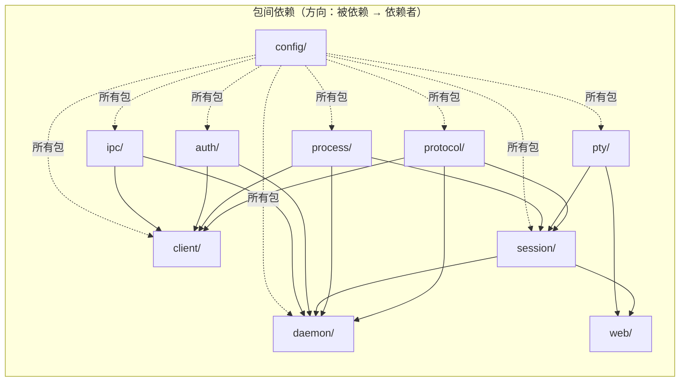

# pty-agent 架构设计

> 本文档描述 `src/` 包的模块化架构设计，为代码维护与扩展提供指导。

---

## 1. 概述

PTY-Agent 是一个通过伪终端（PTY）与交互式 CLI 程序双向通信的命令行代理。守护进程以独立子进程运行，首次执行命令时自动启动。支持 plain/token/tls 三监听器模型（本机 Token + HMAC 认证、明文无认证、跨机 TLS + Ed25519 认证），并提供 Web 管理界面、FastScreen 屏幕流、VNC 远程桌面等扩展能力。

**子命令**：`start | stop | status | list | exec | send | read | kill | events | closewin | mouse | wait | file <read|write|edit|grep|glob|upload|download> | set-default | keygen`

---

## 2. 架构设计原则

项目遵循以下设计原则：

1. **单一职责**：每个模块只做一件事
2. **高内聚低耦合**：相关功能内聚到同一模块，模块间通过明确定义的接口通信
3. **平台隔离**：Windows 特有代码完全隔离在 `pty/windows/` 子包下，Unix 平台零加载
4. **配置集中**：所有常量统一在 `config/` 包管理（TOML 文件 + 加载器）
5. **可测试性**：每个模块可独立测试，方便 mock
6. **可扩展性**：新增 PTY 后端只需添加单个文件；新增 CLI 子命令流程清晰
7. **清洁架构（洋葱模型）**：Web 层采用四层结构（domain → application → infrastructure → presentation），依赖只能从外层指向内层

---

## 3. 模块架构

### 3.1 目录结构总览

完整文件树见 [filestree/src.md](filestree/src.md)（以磁盘为准）；各层职责与模块说明详见 3.3。

### 3.2 分层架构图

```mermaid
graph TB
    subgraph CLI["CLI 入口层"]
        MAIN["__main__.py<br/>argparse → Client"]
    end

    subgraph CLIENT["前端客户端层"]
        CLIFE["client/lifecycle.py<br/>客户端日志配置"]
        TRANS["client/transport.py<br/>TCP/TLS 连接管理"]
        FORM["client/formatter.py<br/>JSON 输出"]
        CFGM["client/config_manager.py<br/>配置管理"]
        INP["client/input.py<br/>输入文本处理"]
        AI["client/ai_analyser.py<br/>AI 二次分析"]
        REND["client/renderer.py<br/>快照渲染"]
        DCTL["daemonctl/<br/>守护进程启停/探测/TLS 连接"]
        SHL["common/shells.py<br/>Shell 探测"]
        PIDX["common/process.py<br/>pid_exists"]
    end

    subgraph PROTO["通信协议层"]
        MSG["protocol/message.py<br/>JSON 换行分隔编解码 + ping"]
        SIGN["protocol/signing.py<br/>MessageSigner 签名抽象"]
        ANSI["protocol/ansi.py<br/>ANSI 转义过滤"]
        RESP["protocol/response.py<br/>统一响应构造器"]
    end

    subgraph DAEMON["守护进程层"]
        DLIFE["daemon/lifecycle.py<br/>入口 + 日志/控制台处理"]
        SRV["daemon/server.py<br/>多 Listener 编排 + 认证上下文"]
        HDL["daemon/handlers/<br/>命令派发与处理"]
    end

    subgraph SESS["会话管理层"]
        SMGR["session/manager.py<br/>SessionManager"]
        SES["session/session.py<br/>Session 协调器"]
        STHR["session/session_threads.py<br/>读者/监控线程"]
        PUB["session/publisher.py<br/>SessionPublisher"]
        OBUF["output/buffer.py<br/>OutputBuffer"]
        TRIG["output/trigger.py<br/>TriggerMatcher"]
        EHIST["output/events.py<br/>EventHistoryManager"]
        PMON["process/monitor.py<br/>ProcessMonitor"]
        EDET["encoding/detector.py<br/>EncodingDetector"]
        GDET["process/gui.py<br/>GuiDetector"]
        PROC["process/info.py<br/>进程查询 & 错误格式化"]
        ENC["encoding/codec.py<br/>编码探测与解码"]
        SHM["ipc/shm.py<br/>共享内存工具"]
        SLOCK["ipc/single_instance.py<br/>单实例锁"]
        IINT["input/interceptor.py<br/>InputInterceptor"]
        IMOUSE["input/mouse.py<br/>鼠标动作编码"]
        TGRID["terminal/grid.py<br/>字符网格"]
        TSCREEN["terminal/screen.py<br/>TerminalScreen"]
    end

    subgraph PTY["伪终端后端层"]
        PFAC["pty/pty_factory.py<br/>工厂函数 create_pty"]
        PBASE["pty/base.py<br/>PseudoTerminal 基类"]
        UNX["pty/unix/<br/>UnixPseudoTerminal + UnixProcessMonitor"]
        WIN["pty/windows/<br/>ConPTY + Job + GUI"]
    end

    subgraph AUTH["认证层"]
        AUTHB["auth/<br/>token + pubkey + tls"]
    end

    subgraph WEB["Web 层（洋葱架构）"]
        WEBD["web/domain/<br/>领域实体"]
        WEBA["web/application/<br/>用例 + 端口"]
        WEBI["web/infrastructure/<br/>基础设施适配器"]
        WEBP["web/presentation/<br/>FastAPI + 控制器"]
    end

    MAIN --> CLIENT
    CLIENT -->|TCP/TLS/JSON| DAEMON
    CLIENT --> PROTO
    CLIENT --> AUTH
    DAEMON --> PROTO
    DAEMON --> SESS
    DAEMON --> AUTH
    DAEMON --> WEB
    SESS -->|create_pty| PTY
    SES --> ENC
    WEB --> SESS
    WEB --> PTY
```



### 3.3 各层详细说明

#### 3.3.1 `protocol/` — 通信协议层

**定位**：被 `client/` 和 `daemon/` 双方共同依赖的基础层，零业务逻辑。

| 模块 | 类/函数 | 职责 |
|------|---------|------|
| `message.py` | `Message.encode(obj)` → `bytes` | 将 dict 编码为 JSON 行 + `\n` + UTF-8 |
| `message.py` | `Message.decode(data)` → `dict` | 从 bytes 解码为 dict |
| `message.py` | `Message.send(sock, obj)` | 发送一条消息到 socket |
| `message.py` | `Message.recv(sock)` → `dict\|None` | 从 socket 接收一条消息（带缓冲的行读取） |
| `message.py` | `Message.ping(host, port, timeout)` → `bool` | 探测对端是否响应 ping（单实例检查/健康探测，skip_sign） |
| `message.py` | `Message._recv_buffers` | 连接级别的接收缓冲区（按 fileno 索引） |
| `signing.py` | `MessageSigner`（ABC） | 消息签名器抽象接口：`sign(obj)` / `verify_and_strip(msg)` / `signature_fields`（协议域定义，auth 包实现） |
| `ansi.py` | `strip_ansi(text)` → `str` | 去除 ANSI 颜色/样式码，保留清屏/光标等控制序列 |
| `ansi.py` | `_ANSI_RE` | 匹配 CSI SGR + OSC 的正则（光标/清屏不匹配） |
| `response.py` | `Response` 类 | 统一响应构造器（静态方法 `error` / `ok` / `result` 等，CLI/TCP/WS 共用） |

**设计要点**：
- `Message` 维持静态类设计（无状态），所有方法为 `@staticmethod`
- `_recv_buffers` 字典保持类级别，不污染 socket 对象
- `strip_ansi` 与任何业务逻辑无关，独立可测；仅过滤 SGR 颜色/样式码 + OSC 窗口标题，保留清屏/光标定位等语义控制序列
- 控制序列（`\x1b[2J` 清屏、`\x1b[H` 归位、`\x1b[K` 清行等）不受 `keep_ansi` 影响，始终保留在输出中

#### 3.3.2 `client/` + `daemonctl/` — 前端客户端层与 daemon 控制

**定位**：封装与守护进程的通信（明文 / TLS / 本机 token），向 CLI 入口提供简洁接口。支持按 CONNECT_MODE 三路分流：本机 token（SHM 发现 + Token/HMAC）、明文无认证、跨机 TLS（Ed25519 认证）。
守护进程的启动/停止/探测属 client 侧控制能力，独立为 `daemonctl/` 包（与 daemon 核心解耦，仅依赖共享层）。

| 模块 | 类/函数 | 职责 |
|------|---------|------|
| `daemonctl/lifecycle.py` | `start_daemon()` / `stop_daemon(force)` / `is_running()` | 守护进程控制：子进程启动（Win: DETACHED_PROCESS，Unix: 双 fork + exec，监听位置全走配置文件）、停止（按 CONNECT_MODE 路由：tls→TLS / plain→明文 / token→SHM+明文）、ping-pong 存活探测 |
| `daemonctl/lifecycle.py` | `_find_daemon_port()` / `_find_daemon_pid()` | 查找运行中的守护进程端口/PID（token 模式经单实例锁 + ping 验证返回配置端口；plain/tls 模式返回配置目标） |
| `daemonctl/lifecycle.py` | `_try_stop_via_tls()` | TLS 停止远程守护进程（CONNECT_MODE=tls：KnownHosts + TOFU + Ed25519 签名） |
| `daemonctl/tls.py` | `TLSClient` 类 | TLS 客户端连接器：建立 TLS 连接 + TOFU 证书验证（CERT_NONE + 自定义指纹比对，类似 SSH known_hosts） |
| `daemonctl/tls.py` | `TLSClient.connect()` → `ssl.SSLSocket` | TCP 连接 + TLS 握手 + 获取服务端 DER 证书 → 计算 SHA-256 指纹 → TOFU 验证（首次自动信任，后续比对，不匹配按 `TOFU_STRICT` 拒绝或警告） |
| `client/lifecycle.py` | `setup_client_logging()` | 客户端日志配置（由 `__main__.py` 调用） |
| `client/transport.py` | `Client` 类 | 向 CLI 暴露 `cmd_start()` / `cmd_stop()` / `cmd_status()` / `cmd_list()` / `cmd_exec()` / `cmd_send()` / `cmd_read()` / `cmd_kill()` / `cmd_events()` / `cmd_closewin()` / `cmd_mouse()` / `cmd_wait()` |
| `transport.py` | `Client._connect()` | 按 CONNECT_MODE 三路分流：tls→`_connect_tls`；plain→`_connect_plain`（无认证）；token→`_connect_token`（SHM 发现，daemon 未运行则自动启动） |
| `transport.py` | `Client._connect_token()` | 本机 token 连接：SHM 发现 + 读取令牌/HMAC 密钥 + 明文 TCP 连接 TOKEN_HOST:TOKEN_PORT |
| `transport.py` | `Client._connect_plain()` | 明文无认证连接：直接连接 PLAIN_HOST:PLAIN_PORT（不自动启动） |
| `transport.py` | `Client._connect_tls()` | TLS 连接（CONNECT_MODE=tls）：加载私钥 → 构建 KnownHosts → TLSClient 建立 TLS + TOFU 验证 |
| `transport.py` | `Client._send_recv(msg)` | 发送请求 + 接收响应（完整的一次往返，自动注入认证凭证 + 消息签名） |
| `transport.py` | `Client._handle_output()` | `--output` 文件输出：解压 screenBufferZ → 调用 renderer 写入文件 |
| `transport.py` | `Client._apply_ai_analysis()` | AI 二次分析：调用 `ai_analyser.analyse_response()` 用 AI 输出覆盖原 outputStream |
| `transport.py` | `_decompress_screen_buffer()` | 解压 gzip+base64 编码的 screenBufferZ 为 screenBuffer |
| `transport.py` | `_has_shell_operators(cmd)` | 检测 shell 操作符 token（`\|`, `||`, `&`, `&&`, `;`, `>`, `<`, `>>`） |
| `transport.py` | `_parse_iso_time(s)` | 解析 ISO 8601 时间字符串为 Unix 时间戳 |
| `transport.py` | `_probe_port()` | 端口探测：token 模式经 SHM 发现（`_find_daemon_port`），plain/tls 模式返回配置目标端口 |
| `transport.py` | `_load_signer_and_providers()` | 认证装配：按 CONNECT_MODE 三路装配（token→HMAC 双向签名 + TokenCredentialProvider，tls→Ed25519 单向签名 + PubkeyCredentialProvider，plain→无装配） |
| `formatter.py` | `set_debug_mode(enabled)` | debug 输出开关（控制是否移除 `debugInformation` 字段） |
| `formatter.py` | `_strip_debug_info(obj)` | 递归移除所有 `debugInformation` 字段 |
| `formatter.py` | `print_response(resp)` | 打印守护进程响应：直接 `json.dumps(resp, ensure_ascii=False)` 到 stdout |
| `renderer.py` | `render_to_file(path, response)` | 根据文件后缀选择渲染器（GDI/SVG/Pillow/纯文本），写入文件 |
| `renderer.py` | `render_svg_string(buf, compression_level)` | 渲染 SVG 为字符串（供 `--response-format svg` 使用，支持压缩等级） |
| `renderer.py` | `_expand_lines(buf)` | 将稀疏/全量 `lines` 统一展开为全量二维数组 |
| `config_manager.py` | `ConfigManager` 类 | 客户端配置管理器，支持 `--default` 临时覆盖默认值（按 session 持久化到守护进程侧） |
| `config_manager.py` | `ConfigManager.get()` / `set()` / `show()` | 读取/设置/展示配置 |
| `config_manager.py` | `parse_terminal_size(size_str)` | 解析终端尺寸字符串（如 "80x24"） |
| `input.py` | `process_input(text)` → `str` | 完整 JSON 反转移 + 控制字符展开 + 自动追加换行（用于 send 命令） |
| `input.py` | `unescape_json_string(text)` → `str` | 仅解码 `\"` 和 `\\`（用于 exec 命令，避免误转义 Windows 路径） |
| `input.py` | `expand_control_characters(text)` | 展开 `\n`/`\r`/`\t` 等控制字符转义 |
| `input.py` | `safe_print(text, **kwargs)` | 安全打印（自适应控制台编码，GBK 终端强制 UTF-8 输出） |
| `ai_analyser.py` | `analyse_response(resp, mode, prompt, output_file, timeout)` | 对 PTY response 做 AI 二次分析，返回替换后的 response（outputStream 被覆盖为 AI 输出） |
| `ai_analyser.py` | `_load_aichat()` | 动态导入 `bin/aichat/common.py`（importlib 按文件路径加载，模块缓存） |
| `ai_analyser.py` | `_build_session_args(uid)` | 构造 aichat 会话续聊参数（`--session <uid> --save-session`） |

**设计要点**：
- `Client._connect()` 按 CONNECT_MODE 三路分流：tls 走 `_connect_tls`（TLS + TOFU + Ed25519），plain 走 `_connect_plain`（明文无认证），token 走 `_connect_token`（SHM 发现 + Token/HMAC）
- token 模式 `_connect_token()` 在 daemon 未运行（单实例锁未占用）时自动 `start_daemon()`，无需用户手动 start；plain/tls 模式不自动启动（目标位置固定，守护进程需手动管理）
- **formatter.py 仅支持 JSON 模式**：`print_response` 直接 `json.dumps(resp, ensure_ascii=False)` 输出到 stdout。所有非命令响应（守护进程启停信息、配置查询、帮助文本、警告等）均以 JSON 格式输出：`{"type":"info","message":"..."}` / `{"type":"config","content":"..."}` / `{"type":"help","content":"..."}` / `{"type":"warning","message":"..."}`
- `_SHOW_DEBUG` 全局标志控制是否移除 `debugInformation` 字段：`--no-debug` 或 `--default debug off` 关闭后，`_strip_debug_info` 递归移除所有 `debugInformation`
- `ConfigManager` 管理调用级默认配置（timeout/newline/encoding/keep_ansi/send_eol/response_format/svg_compression_level/terminal_size/ai_analyse/ai_prompt/debug/always_return_snapshot），`--default` 设置的值通过 `client_defaults` 字段发送给守护进程按 session UID 存储，会话结束后自动清理。`cmd_*()` 方法在构建请求时应用配置默认值
- `--default` 支持多个键值对（`action="append"`），设置值发送给守护进程按 session 存储，后续调用自动从 `sessionDefaults` 合并
- 每个 `cmd_*` 方法仅负责构建请求 dict + 调用 `_send_recv` + 调用 `print_response`
- **AI 二次分析**（`ai_analyser.py`）：exec/send/read/mouse 的 `--ai-analyse` 启用后，phase-1 守护进程返回 response 后，phase-2 调用 `bin/aichat` 对 outputStream 做二次分析，分析结果覆盖原 outputStream。三种模式：`none`（不分析）/ `fileOutput`（用 `aichat -f <文件>` 喂 AI）/ `responseOutput`（把 outputStream 拼进 prompt 喂 AI）。失败时回退原始 response 并追加 warning 字段，不阻断主流程。会话记忆通过 `response.uid` 作为 `aichat --session` 名实现按会话续聊

#### 3.3.3 `daemon/` — 守护进程层

**定位**：多监听器 TCP/TLS 服务器，接收客户端请求，委派会话管理/PTY 层处理，返回响应。三监听器模型支持明文（无认证）、token（Token + HMAC 认证，本机）、TLS（Ed25519 认证，跨机）三个 Listener，每个监听器可独立启停。

> 守护进程的启动/停止/探测（start_daemon / stop_daemon / is_running）属客户端控制能力，
> 位于 `daemonctl/` 包；本层仅含入口与进程上下文。

| 模块 | 类/函数 | 职责 |
|------|---------|------|
| `lifecycle.py` | `main()` | 守护进程入口：加载配置 + DaemonServer.run()（监听位置全走配置文件，不支持参数覆盖） |
| `lifecycle.py` | `_setup_logging()` | 按模块分组配置独立日志文件（时间戳命名，无轮转）+ 启动前一日日志 gzip 归档线程 |
| `lifecycle.py` | `_hide_console_window()` / `_ignore_console_ctrl()` | Windows 控制台处理（脱离窗口 / 忽略 Ctrl+C） |
| `server.py` | `DaemonServer` 类 | 多 Listener 编排（plain/token/tls 三监听器）、认证上下文构建、令牌轮换、`run()` / `stop()` / `_cleanup()` |
| `server.py` | `DaemonServer._build_token_auth_context()` | 构建 Token 认证上下文（token Listener 使用）：HMAC 对称签名，daemon 双向签/验 |
| `server.py` | `DaemonServer._build_pubkey_auth_context()` | 构建公私钥认证上下文（TLS Listener 使用）：Ed25519 非对称单向，daemon 仅验请求（fail-closed） |
| `server.py` | `DaemonServer._schedule_rotate()` / `_rotate_token()` | 令牌定时轮换（30 分钟周期 + 2 分钟宽限，仅 token 认证模式） |
| `listener.py` | `Listener` 类 | 单端口 accept 循环封装：bind() / start() / stop()，封装明文/TLS 传输类型 + AuthContext |
| `listener.py` | `Listener._accept_loop()` | accept 循环：每连接创建处理线程，TLS 模式在 accept 后自动 wrap_socket |
| `handler.py` | `RequestHandler` 类 | 委托 `handlers/` 子包，接收 AuthContext，`handle()` 派发到各命令处理器 |
| `handlers/base.py` | `DaemonHandler` 基类 / `HandlerContext` | 命令处理器抽象基类 + 上下文容器（manager / auth_context / server） |
| `handlers/dispatcher.py` | `DaemonDispatcher` | 消息派发：按 `msg["type"]` 路由到对应 handler 的 `handle()` 方法 |
| `handlers/exec_handler.py` | `ExecHandler` | exec 命令处理（含快照模式/触发流程，`_run_snapshot_flow` / `_run_trigger_flow` / `_run_no_trigger_flow`） |
| `handlers/send_handler.py` | `SendHandler` | send 命令处理 |
| `handlers/read_handler.py` | `ReadHandler` | read 命令处理 |
| `handlers/list_handler.py` | `ListHandler` | list 命令处理 |
| `handlers/kill_handler.py` | `KillHandler` | kill 命令处理 |
| `handlers/events_handler.py` | `EventsHandler` | events 命令处理 |
| `handlers/stop_handler.py` | `StopHandler` | stop 命令处理 |
| `handlers/closewin_handler.py` | `CloseWinHandler` | closewin 命令处理 |
| `handlers/mouse_handler.py` | `MouseHandler` | mouse 命令处理 |
| `handlers/status_handler.py` | `StatusHandler` | status 命令处理 |
| `handlers/wait_handler.py` | `WaitHandler` | wait 命令处理（恒等待指定秒数） |
| `handlers/utils.py` | 处理器工具函数 | `compress_screen_buffer` / `map_reason` / `filter_snapshot_lines` / `build_hint` / `validate_field` / `attach_screen_buffer` / `build_result` / `apply_lines_grep` / `apply_client_defaults` 等（含 Git-Bash 路径提示） |

**设计要点**：
- `daemon/lifecycle.py` 仅承担守护进程入口与进程上下文（日志/控制台/单实例获取）；启动/停止/探测属客户端控制能力，位于 `daemonctl/` 包；`daemon/__main__.py` 转调 `lifecycle.main()`
- 单实例互斥锁（`SingleInstanceLock`）位于 `ipc/single_instance.py`（守护进程与客户端共用）
- `DaemonServer` 按 daemon.toml `[listener]` 段编排多个 `Listener`（三监听器）：plain（明文无认证）、token（Token + HMAC 认证，本机 SHM 发现）、tls（TLS + Ed25519 认证，跨机）。三个监听器的启用/地址/端口由 `PLAIN_*`/`TOKEN_*`/`TLS_*` 独立配置，可同开或只开一个
- `Listener` 封装单端口 accept 循环，传输类型（`"plain"` / `"tls"`）和 `AuthContext` 在构造时绑定，TLS 模式在 accept 后自动 `wrap_socket`
- `handlers/` 子包采用每命令一文件的派发器模式：`DaemonDispatcher` 按 `msg["type"]` 路由到对应 `DaemonHandler` 子类，新增命令只需添加 handler 文件 + 注册到派发器
- `RequestHandler` 不直接操作 socket 读写（通过 `Message` 完成），便于测试
- `start_daemon()` 自动计算项目根目录作为子进程 `cwd`（`__file__` 向上 3 层），确保 `python -m src.daemon` 无论从何目录调用都能找到 `src` 包
- 子进程 `stderr` 重定向到 `daemon.log`（而非 `DEVNULL`），启动崩溃时可在日志中看到完整 Traceback
- `stop_daemon()` 按 CONNECT_MODE 路由：tls→经 TLS 连接远程 daemon 停止；plain→直接明文连接停止（无认证）；token→经 SHM 定位 + 明文 TCP stop。TLS stop 失败（如 TOFU 指纹不匹配）且 `force=True` 时回退到本地强制终止（通过互斥锁定位 PID）

#### 3.3.4 `pty/` — 伪终端后端层

**定位**：封装不同平台/路径的 PTY 实现，向 `session/` 层提供统一的 `PseudoTerminal` 接口。

| 模块 | 类/函数 | 职责 |
|------|---------|------|
| `pty_factory.py` | `create_pty(command, cols, rows, cwd, env, encoding)` → `PseudoTerminal` | 工厂函数，按优先级尝试各后端 |
| `base.py` | `PseudoTerminal` | 抽象基类：`read()` / `write()` / `drain()` / `close()` / `fileno()` / `get_child_pid()` / `get_exit_code()` / `get_type()` / `inject_mouse_event()`。进程树管理由 `process/` 包（ProcessTreeTracker）提供，PTY 基类不持有 |
| `unix/pty_impl.py` | `UnixPseudoTerminal` | `os.openpty()` + `os.fork()` + `execvpe()`，非阻塞 I/O |
| `unix/process.py` | `UnixProcessMonitor` | Unix 进程树监控：基于 pgid 追踪进程树，waitpid 轮询崩溃检测，os.killpg 终止 |
| `unix/process.py` | `UnixNotification` | Unix 进程通知（与 Windows `JobNotification` 接口对齐：`is_crash()` / `is_exit()` / `is_spawn()`） |
| `windows/wezterm_pty.py` | `WeztermPseudoTerminal` | wezterm-py Pty 适配（侧载 OpenConsole + conpty.dll，规避系统 conhost 的 VT 输入缺陷） |

> 注：进程树追踪（`process/windows/job_tracker.py`）、GUI 窗口检测（`process/windows/gui_monitor.py`）、Windows 错误码格式化（`process/win32_error.py`）位于 `process/` 包；
> Shell 探测（`detect_available_shells` / `format_shell_info`）位于跨侧共享层 `common/shells.py`（daemon 启动日志、web shell provider、daemonctl 输出共用）。

**设计要点**：
- `base.py` 定义了最小接口契约，所有具体 PTY 后端必须实现全部方法
- `drain()` 方法：`read()` 后立即调用，将 OS 管道缓冲区中所有当前就绪数据一次性取回。解决程序输出被多次 `read` 打散的问题，确保触发检测在完整数据块上进行
  - Unix PTY：非阻塞 `os.read` 循环排空
  - Windows wezterm-pty：内部 reader 线程 + 缓冲队列，`drain` 以 timeout=0 非阻塞读取当前缓冲
- `windows/` 子包仅在 `IS_WINDOWS` 为 True 时才被导入（在 `pty_factory.py` 中条件导入），Unix 平台零开销
- `create_pty` 工厂（Windows 优先级）：wezterm-py（唯一原生后端）> 沙箱（`[sandbox] enabled=true` 且传入 `SandboxProcessTreeTracker` 时）；Unix 使用 `UnixPseudoTerminal`
  - 命令归一化：工厂入口统一处理 `command`（`str` 时按 shell 语义 `shlex.split` 拆分，后端统一消费 `List[str]`），避免逐字符展开
  - 沙箱是安全边界：`[sandbox] enabled=true` 时**带沙箱 tracker 的会话强制走沙箱**（创建失败不回退原生）；未带 tracker（None）的裸后端调用视为非沙箱会话，回退原生后端
- Unix 进程监控基于 process group (pgid)：子进程通过 `os.setsid()` 创建新会话，同会话内所有子/孙进程共享 pgid，利用 pgid 追踪/杀死进程树。崩溃检测采用 waitpid 轮询（与 Windows IOCP 推送不同），由 `_monitor_loop` 每 2 秒调用 `drain_notifications()`
- 新增 PTY 后端只需：创建新文件 → 继承 `PseudoTerminal` → 在 `create_pty` 的优先级链中添加

#### 3.3.5 `session/` — 会话管理层

**定位**：管理 PTY 会话的生命周期，通过**组合模式**将职责委派给独立子组件。

| 模块 | 类/函数 | 职责 |
|------|---------|------|
| `manager.py` | `SessionManager` | `create_session(id, command, encoding, shell, cwd, env, cols, rows)` / `get_session()` / `list_sessions()` / `remove_session()` / `stop_all()` |
| `session.py` | `Session` 类（协调器） | 属性：`id`, `uid`, `command`, `running`, `snapshot_mode`, `exit_code`, `error_message`, `encoding`, `pty_type`, `output_offset`, `gui_windows`, `processes`, `cwd` |
| `session.py` | `Session.start()` / `stop()` | 创建 PTY + 启动读者/监控线程 + 组件重置 / 优雅关闭 |
| `session.py` | `Session.write_input()` / `send_signal()` | 写入输入到 PTY（编码感知） / 发送信号（SIGINT/SIGTERM/SIGHUP，Windows 用 GenerateConsoleCtrlEvent） |
| `session.py` | `Session.key_input()` / `mouse_input()` / `perform_mouse_action()` | wezterm 模式感知键盘/鼠标事件编码后写入 PTY / 执行鼠标动作（委托 InputInterceptor） |
| `session.py` | `Session.resize(cols, rows)` | 调整终端尺寸（PTY + TerminalScreen + InputInterceptor 同步） |
| `session.py` | `Session.set_trigger()` / `wait_for_trigger()` / `clear_trigger()` | 触发条件管理（委托 TriggerMatcher） |
| `session.py` | `Session.consume_events()` / `peek_events()` / `get_all_events()` / `check_event_existence()` | 事件消费/窥探/全量查询/存在性检测（委托 EventHistoryManager） |
| `session.py` | `Session.close_window()` | 关闭 GUI 窗口（委托 GuiDetector） |
| `session.py` | `Session.get_snapshot()` / `get_snapshot_diff()` / `get_snapshot_diagnostics()` / `export_screen_buffer()` / `capture_scrollback()` / `clear_scrollback()` | 终端屏幕快照 / 变化行 / 诊断信息 / 稀疏缓冲区 / 捕获 scrollback / 清除 scrollback（委托 TerminalScreen） |
| `session.py` | `Session.set_snapshot_trigger()` / `check_snapshot_trigger()` / `check_snapshot_idle_timeout()` / `notify_snapshot_changed()` | 快照级触发匹配 |
| `session.py` | `Session.detect_encoding()` | 编码探测（委托 EncodingDetector） |
| `session.py` | `Session.get_pty_process_list()` / `get_pty_child_pid()` | 查询 PTY 进程列表 / 子进程 PID |
| `session_threads.py` | `SessionThreads` | 后台读者线程 + 监控线程管理（启动/停止/循环逻辑） |
| `session_threads.py` | `SessionComponents` | 子组件引用容器数据类（pty_provider / out_buf / trig_mat / proc_mon / tracker / gui_detector / screen / session_id / on_exit / session_ref） |
| `session_threads.py` | `_capture_exit_code_retry()` | 带重试的退出码获取（retries=10） |
| `session_threads.py` | `_extract_crash_error_from_output()` / `_clean_error_candidate()` | 从输出提取崩溃错误信息 / 清理错误候选文本 |
| `publisher.py` | `SessionPublisher` | 订阅者与结束回调管理，向 Web 层发布会话状态变更（会话创建/结束/输出更新等） |

**设计要点**：
- `Session` 不直接创建 PTY 实例，而是通过 `create_pty()` 工厂获得
- Session 通过 `@property` 公开子组件：`session.output_buffer` / `session.trigger_matcher` / `session.event_history` / `session.process_monitor` / `session.publisher`
- `Session._reader_loop()` 和 `_monitor_loop()` 位于 `session_threads.py` 的 `SessionThreads` 类中，Session 通过组合持有 `SessionThreads` 实例，避免自身过于臃肿
- `SessionComponents` 数据类将后台线程所需的所有子组件引用打包传递，避免循环依赖
- `encoding/codec.py` 将编码探测逻辑从 `Session` 类中抽离为纯函数，便于测试
- `EncodingDetector` 维护编码状态（`encoding` / `_encoding_locked`），`detect_decode()` 在 `get_output` 中调用可修改状态，`decode_only()` 在持锁路径 `TriggerMatcher.check` 中使用无副作用
- `GuiDetector` 封装 GUI 窗口检测逻辑（2s 节流轮询），从 Session 中独立出来
- `InputInterceptor` 封装输入编码转换与鼠标动作执行（SGR 序列直接写 pty）；键盘/鼠标事件编码由 `WeztermInputEncoder`（wezterm-py Terminal 模式感知）完成，从 Session 中独立出来
- `SessionPublisher` 管理订阅者（Web WebSocket 连接）与结束回调，实现会话状态向 Web 层的发布
- 触发检测基于 `threading.Event`，线程安全
- 输出缓冲区大小上限由 `config/` 包集中控制（`MAX_OUTPUT_BUFFER`，定义于 `daemon/daemon.toml`）
- `OutputBuffer` 内部使用 `RLock`（可重入锁），允许 `_reader_loop` 在持锁上下文中调用 `append()`
- `encoding/codec.py` 新增智能裁剪（`_utf8_trim_tail` / `_gbk_trim_tail` / `_smart_trim`），避免线性截断性能损耗

#### 3.3.6 `auth/` — 认证层

**定位**：可插拔的认证基础设施，被 `client/` 和 `daemon/` 双方共同依赖。采用清洁架构，将两种认证方式（token/HMAC 和 pubkey/Ed25519）作为独立子包实现，共享抽象接口。消息签名抽象（`MessageSigner`）属协议域，定义在 `protocol/signing.py`，本包实现它。

| 模块 | 类/函数 | 职责 |
|------|---------|------|
| `base.py` | `Authenticator`（ABC） | 服务端认证器抽象接口：`authenticate(msg) → bool` 验证客户端身份 |
| `base.py` | `CredentialProvider`（ABC） | 客户端凭证提供者抽象接口：`enrich(msg) → dict` 向消息附加认证凭证 |
| `keys.py` | `PublicKey` / `PrivateKey` | Ed25519 密钥实体，OpenSSH 格式兼容，SHA-256 指纹（与 `ssh-keygen -lf` 一致） |
| `keys.py` | `generate_keypair()` / `load_authorized_keys()` / `_compute_fingerprint()` / `_check_private_key_permissions()` | 密钥对生成 / authorized_keys 文件加载（指纹→PublicKey 映射）/ 指纹计算 / 私钥权限检查 |
| `context.py` | `AuthContext` | 连接级认证上下文：绑定 `outbound_signer`（出站签名）、`inbound_verifier`（入站验证）、`authenticator`（身份认证） |
| `token/authenticator.py` | `TokenAuthenticator` | Token 认证器：通过 SHM 令牌验证客户端身份，支持轮换与宽限期 |
| `token/authenticator.py` | `TokenCredentialProvider` | Token 凭证提供者：从 SHM 读取令牌注入到请求消息 |
| `token/signer.py` | `HmacMessageSigner` | HMAC-SHA256 消息签名器（实现 `protocol/signing.MessageSigner`）：对称密钥，双向签名（请求签+验，响应签+验） |
| `pubkey/authenticator.py` | `PubkeyAuthenticator` | 公钥认证器：校验 `pubkey_fp` 是否在 authorized_keys 白名单（fail-closed） |
| `pubkey/authenticator.py` | `PubkeyCredentialProvider` | 公钥凭证提供者：向消息注入 `pubkey_fp` 字段 |
| `pubkey/signer.py` | `Ed25519MessageSigner` | Ed25519 消息签名器（实现 `protocol/signing.MessageSigner`）：非对称单向（请求签名，响应不验签），白名单验签 |
| `tls/cert_manager.py` | `CertificateManager` | 自签证书管理：首次启动自动生成 TLS 证书，计算 SHA-256 指纹（类似 SSH host key） |
| `tls/known_hosts.py` | `KnownHosts` | TOFU 信任存储：首次连接自动信任证书指纹，后续比对（类似 SSH known_hosts） |

**设计要点**：
- 两种认证方式独立分包：`token/`（同机，SHM 发现，对称双向签名）和 `pubkey/`（跨机，TLS 传输，非对称单向签名），互不依赖
- Token + HMAC 对称认证：HMAC 密钥通过 SHM 传递，daemon 既能签响应（出站）也能验请求（入站），复用同一 `HmacMessageSigner` 实例
- Ed25519 非对称单向认证：daemon 仅验请求（入站），不签响应（无私钥），客户端持私钥签请求，响应裸传
- `CONNECT_MODE` 单选模式：客户端在 client.toml `[connection]` 选择一种连接方式（`"plain"` / `"token"` / `"tls"`），须与 daemon 侧 `[listener]` 对应监听器 enabled 匹配
- `AuthContext` 是框架层对象，每个 `Listener` 持有一个，描述该端口的认证方式
- TLS 层提供证书自管理（`CertificateManager`）和 TOFU 信任存储（`KnownHosts`），无需部署 CA 证书到客户端
- `keygen` 子命令（`__main__.py:_cmd_keygen`）调用 `generate_keypair()` 生成 Ed25519 密钥对并写入文件

### 3.4 `config/` — 配置中心（TOML 文件 + 加载器）

配置系统采用 TOML 文件 + `config/` 包（加载器在 `src/config/`）分离守护进程与客户端配置，支持跨机部署时各机器独立配置。

#### 3.4.1 配置文件

| 文件 | 适用范围 | 主要配置项 |
|------|---------|-----------|
| `common.toml` | Daemon + Client 共有 | 终端默认值（`DEFAULT_COLS`/`DEFAULT_ROWS`）、压缩等级、输入长度限制、AI 分析超时（`AICHAT_TIMEOUT`） |
| `shared.toml` | 跨侧共享 | 协议（`SOCKET_RECV_BUFSIZE`/`MAX_MESSAGE_LENGTH`）、IPC 命名（`SINGLE_INSTANCE_MUTEX_NAME`/`AUTH_TOKEN_NAME`/`HMAC_KEY_NAME`）、daemon 控制（启动停止超时/轮询间隔）、日志格式（`LOG_FORMAT`/`LOG_DATE_FORMAT`） |
| `daemon/daemon.toml` | 仅 Daemon | 单实例互斥锁开关（`SINGLE_INSTANCE`，默认 true；false 仅 plain/tls 监听器场景生效，token 启用时强制保留锁）、三监听器（`[listener]`：`PLAIN_ENABLED`/`HOST`/`PORT`、`TOKEN_ENABLED`/`HOST`/`PORT`、`TLS_ENABLED`/`HOST`/`PORT`）、缓冲区上限（`MAX_OUTPUT_BUFFER`/`MAX_TRIGGER_SCAN`）、默认触发超时、监听 backlog、PTY 读取大小、Job 命名前缀、会话上限、认证参数（`[auth]`：令牌轮换周期/宽限、`PUBKEY_ALGORITHM`/`PUBKEY_AUTHORIZED_KEYS`/`PUBKEY_KEY_DIR`、TLS 证书 `TLS_CERT_DIR`/`FILE`/`KEY`/`TLS_CERT_VALIDITY_DAYS`/`TLS_CERT_SUBJECT_CN`） |
| `daemon/logging.toml` | 仅 Daemon | 日志级别、按模块分组的 logger 定义、前一日日志 gzip 归档间隔（格式见 shared.toml） |
| `daemon/web.toml` | 仅 Daemon（Web） | `ENABLE_WEB`/`WEB_HOST`/`WEB_PORT`/`WEB_PASSWORD_HASH`、VNC 集成（`ENABLE_VNC`/`VNC_WINVNC_PATH`）、fastscreen 参数（`ENABLE_FASTSCREEN`/`FASTSCREEN_*`）、网页端设置默认值（`DEFAULT_THEME`/`RIKKA_ENABLED`/`IME_*` 等） |
| `daemon/sandbox.toml` | 仅 Daemon | `[sandbox] enabled`/`log_level`、资源配额（`[quota]`）、隔离策略（`[isolation]`，net_policy/net_allowlist/clipboard_isolate） |
| `client/client.toml` | 仅 Client | 连接方式与目标（`[connection]`：`CONNECT_MODE`、`PLAIN_HOST`/`PLAIN_PORT`、`TOKEN_HOST`/`TOKEN_PORT`、`TLS_HOST`/`TLS_PORT`）、连接/触发超时、认证参数（`[auth]`：`PUBKEY_PRIVATE_KEY_PATH`、`KNOWN_HOSTS_FILE`、`TOFU_STRICT`）、客户端日志（`CLIENT_LOG_LEVEL`/`CLIENT_LOGGERS`） |
| `transfer.toml` | 传输协议（daemon + Client） | 数据帧大小（`TRANSFER_CHUNK_SIZE`）、控制帧上限（`TRANSFER_MAX_CONTROL`）、条目上限（`TRANSFER_MAX_FILES`）、单文件上限（`TRANSFER_MAX_SIZE`）、tmp 后缀、进度间隔、总时限（`TRANSFER_TIMEOUT`） |
| `daemon/vnc.toml` | VNC 运行时 | VNC 端口/密码/日志配置（由 winvnc.exe 读取，非 Python 加载） |
| `daemon/vnc.example.toml` | VNC 配置示例 | 同上，供用户参考 |

#### 3.4.2 加载机制

| 模块 | 职责 |
|------|------|
| `_loader.py` | `load_toml(filename)` 读取 TOML 文件 → `flatten(d)` 将嵌套 section 展平为 flat key→value（同名 key 冲突抛 `ValueError`）→ `merge(*sources)` 合并多个展平字典（跨文件同名 key 冲突抛 `ValueError`） |
| `common.py` | 加载 `common.toml`（config/ 根），追加运行时属性 `IS_WINDOWS`、`DATA_DIR`、`PROJECT_ROOT` |
| `shared.py` | 加载 `common.toml` + `shared.toml`（config/ 根），追加 `PORT_FILE`、`LOG_DIR`，复用 `common` 的 `IS_WINDOWS`/`DATA_DIR`/`PROJECT_ROOT` |
| `daemon.py` | 加载 `common.toml` + `shared.toml`（config/ 根）+ `daemon/daemon.toml` + `daemon/logging.toml` + `daemon/web.toml`，追加 `PORT_FILE`、`LOG_DIR`，复用 `common` 的 `IS_WINDOWS`/`DATA_DIR`/`PROJECT_ROOT` |
| `client.py` | 加载 `common.toml` + `shared.toml`（config/ 根）+ `client/client.toml`，追加 `PORT_FILE`、`LOG_DIR`，复用 `common` 的 `IS_WINDOWS`/`DATA_DIR`/`PROJECT_ROOT` |
| `transfer.py` | 加载 `transfer.toml`（config/ 根）的 `[transfer]` section，导出 `TRANSFER_*` 协议常量 |
| `sandbox.py` | 加载 `daemon/sandbox.toml`，导出 `ENABLED`/`LOG_LEVEL`/`QUOTA`/`ISOLATION`（Windows 专属，win-sandbox 委派） |

**加载流程**：

```
TOML 文件 → load_toml(filename, domain) → 嵌套 dict
                             ↓
                    flatten() → flat key→value dict
                             ↓
       merge(common, shared, daemon/…, …) → 统一命名空间
                             ↓
               globals().update() → 模块级常量（可直接 import）
```

**配置分离理由**：守护进程与客户端运行在不同机器时（跨机 TLS 部署），各机器只需部署对应的 TOML 文件。配置文件按侧物理分离：daemon 专属在 `config/daemon/`，client 专属在 `config/client/`，协议/IPC/daemon 控制等跨侧常量集中在根目录 `shared.toml`，client 侧与 daemon 侧各自聚合，互不依赖对方配置文件。同一 key 在不同 TOML 文件中重复定义会在 `merge()` 时抛出 `ValueError`，防止静默覆盖。

> 注：`daemon/vnc.toml` / `daemon/vnc.example.toml` 是 VNC 运行时配置文件，由 `winvnc.exe` 直接读取，不经过 Python `_loader.py` 加载。

---

## 4. 新增子系统

### 4.1 `process/windows/job_tracker.py` — Job Object 进程树追踪

> Session 通过 `process.create_process_tree_tracker()` 工厂获取 tracker（平台分支 + 沙箱委派），不直接持有 Job。

```python
class JobProcessTreeTracker:
    """Windows Job Object 进程树追踪器（ProcessTreeTracker 端口实现）

    追踪整个进程树（含子/孙进程），支持:
    - KILL_ON_JOB_CLOSE：关闭句柄时自动终止所有关联进程
    - 查询 Job 内所有进程 PID 列表
    - 获取单个子进程退出码（用于崩溃检测）
    - IOCP 实时通知（spawn / exit / crash）
    """
```

| 方法 | 功能 |
|------|------|
| `register_root(hprocess)` | 将进程分配到 Job（子进程自动继承） |
| `get_process_list()` | 获取 Job 内所有进程的 PID 列表 |
| `get_process_exit_code(pid)` | 获取单个进程退出码（STILL_ACTIVE → None） |
| `drain_notifications()` | 消费 IOCP 实时通知队列 |
| `kill_tree()` / `terminate()` | KILL_ON_JOB_CLOSE 终止所有进程 |
| `close()` | 关闭 Job 句柄 → 终止所有进程 |

所有后端经 `Session.create_process_tracker()` 获得 tracker：Windows 沙箱启用时返回 `SandboxProcessTreeTracker`（win-sandbox 委派），否则 `JobProcessTreeTracker`；Unix 用 pgid 追踪（`PgidProcessTreeTracker`）。

### 4.2 `process/windows/gui_monitor.py` — GUI 窗口检测

```python
class GuiWindowMonitor:
    """GUI 窗口检测器

    轮询 EnumWindows，交叉比对窗口所属进程 PID 是否在会话进程树内。
    - 基于 hwnd 去重，同一窗口只上报一次
    - 线程安全（使用锁保护内部状态）
    - 通过 SendMessage(WM_CLOSE) 关闭指定窗口
    """
```

| 方法 | 功能 |
|------|------|
| `poll()` | 轮询检测新增 GUI 窗口 |
| `close_window(hwnd)` | 发送 WM_CLOSE 关闭窗口 |
| `close_process_windows(pid)` | 关闭指定进程的所有窗口 |

GUI 检测**默认启用**，`SessionThreads` 监控线程每 2s 轮询，`exec/send` 等待 trigger 时也自动轮询。

### 4.3 事件系统（`output/events.py`）

Session 内部维护 **待处理事件队列** 和 **事件历史记录**，实时记录：

| 事件类型 | 触发条件 |
|---------|---------|
| `process_spawn` | 新进程在 Job 内创建 |
| `process_exit` | 进程退出 Job（退出码 = 0） |
| `process_crash` | 进程退出码 ≠ 0（异常崩溃） |
| `gui_window` | 检测到新 GUI 窗口 |

**存在性检测**：每个事件可通过 `EventHistoryManager.check_existence()` 检测关联进程/窗口是否仍存活。`still_active` 字段随 events 命令返回。

**历史记录**：`consume_events()` 将待处理事件移入 EventHistoryManager 的历史队列，`get_all_events()` 返回历史 + 待处理全部事件。

**崩溃自动返回**：`process/monitor.py:ProcessMonitor.check_events()` 检测到 `process_crash` 时设置 `crash_event`（`threading.Event`），`wait_for_trigger()` 在轮询循环中优先检测该标志，检测后立即返回 `reason="crashed"`，无需等待读线程 EOF。

事件消费方式：
- `exec/send` 返回时通过 `_build_result(consume_events=True).debug.pending_events` **自动附带并消费**待处理事件
- `events <id>` 命令单独拉取**所有事件**（历史 + 待处理，不消费），支持 `--last` / `--since` / `--until` 过滤
- 每个事件附带 `still_active` 字段（存在性检测）
- `list` 命令显示 `!N` 标记表示有待处理事件
- 事件 `time` 字段为 ISO 8601 格式（如 `"2026-06-07T18:00:00.12"`），非原始 Unix 时间戳

### 4.4 独立监控线程

每个 Session 通过 `SessionThreads` 启动一个**独立监控线程**，每 2 秒检测 GUI 窗口、补全进程列表变更和自然退出：

```python
def _monitor_loop(self):
    while not self._stop_event.is_set():
        self._proc_mon.drain_notifications()  # IOCP 实时通知（非阻塞）
        self._gui_detector.check(pty, session_id)
        self._proc_mon.check_events()         # 轮询补充（IOCP 未覆盖的变更）
        # 自然退出检测：进程列表为空 → 主动触发会话结束
        # （进程列表来自 tracker：PTY 基类无 get_process_list；
        #   沙箱后端的 Job 回调排除根进程，必须经 tracker 探测）
        if pty and not self._stop_event.is_set():
            try:
                pids = comp.tracker.get_process_list()
                if pids is not None and len(pids) == 0:
                    session = comp.session_ref()
                    if session and session.running:
                        session._on_all_processes_exited()
            except Exception:
                pass
        self._stop_event.wait(2.0)
```

### 4.5 Job Object IOCP 实时通知

进程崩溃检测通过 **I/O 完成端口（IOCP）** 实现，无需轮询：

1. `JobProcessTreeTracker.__init__()`（`process/windows/job_tracker.py`）创建 IOCP + 关联 Job Object
2. 后台线程 `_notification_loop()` 调用 `GetQueuedCompletionStatus` 等待通知
3. Windows 推送消息：`_JOB_OBJECT_MSG_NEW_PROCESS(3)` / `_JOB_OBJECT_MSG_EXIT_PROCESS(4)` / `_JOB_OBJECT_MSG_ABNORMAL_EXIT_PROCESS(5)`
4. 通知存入线程安全队列，`drain_notifications()` 消费（`ProcessMonitor` 每轮调取）
5. 根据退出码判定崩溃（不依赖消息类型）：非零且非 STILL_ACTIVE → `process_crash`

同时设置 `DIE_ON_UNHANDLED_EXCEPTION`（job_tracker.py），子进程崩溃时**不弹对话框**直接退出。

> 沙箱（win-sandbox）路径：`SandboxProcessTreeTracker` 经 win-sandbox 的 Job 回调提供同类通知，但**显式排除根进程**（native 端 notif.pid != process.pid 过滤），根进程退出由 `SandboxSessionManager.get_exit_code()` 经 `Process.wait(timeout_ms=0)` 探测，配合监控线程的空进程列表检测触发自然结束。

### 4.6 监听位置配置 + 共享内存

守护进程监听位置由 daemon.toml `[listener]` 段配置（`PLAIN_HOST`:`PLAIN_PORT` / `TOKEN_HOST`:`TOKEN_PORT` / `TLS_HOST`:`TLS_PORT`），
客户端按 client.toml `[connection]` 的 `CONNECT_MODE` 选择对应目标地址，端口不通过共享内存发现：

- `daemon/server.py` + `daemon/lifecycle.py`：按 `[listener]` 段启用/绑定监听器，不经共享内存发布端口
- `daemonctl/lifecycle.py`：`is_running()` 经单实例锁判断；`_find_daemon_pid()` 经 `SingleInstanceLock.find_owner_pid()` 定位；`_find_daemon_port()` 返回当前 `CONNECT_MODE` 对应的配置端口（token 模式经单实例锁确认存活）
- `client/transport.py`：直接使用 client.toml `[connection]` 对应目标连接
- 共享内存仅承载认证凭据：认证令牌（`AUTH_TOKEN_NAME`）与 HMAC 密钥（`HMAC_KEY_NAME`）

### 4.7 认证系统

三监听器模型下，认证按监听器区分：token 监听器走 Token + HMAC 认证（本机 SHM 发现），TLS 监听器走 Ed25519 公钥认证（跨机，TOFU 信任），plain 监听器无认证。机制细节见 3.3.6 `auth/` 认证层，监听器组件与连接流程见 4.14。

### 4.8 `process/win32_error.py` — Windows 错误码格式化

提供 Windows 特有错误退出码（NTSTATUS、Win32 错误码）的格式化输出：

| 函数 | 功能 |
|------|------|
| `translate_windows_error(code)` | 根据内置名称表 + FormatMessageW 格式化错误码 |
| `format_process_exit_code(code)` | 格式化进程退出码（含 NTSTATUS 十六进制显示） |
| `format_create_process_error(code)` | 格式化 CreateProcessW 失败信息 |

内置常见 NTSTATUS 名称映射（STATUS_ACCESS_VIOLATION、STATUS_DLL_NOT_FOUND 等）和 Win32 错误码名称（ERROR_FILE_NOT_FOUND 等），辅助崩溃诊断。

### 4.9 `terminal/` — 终端屏幕快照

使用 wezterm-py（wezterm-term 终端模型）将 PTY 输出的 VT 序列流解析为字符网格，
提供用户真正看到的终端界面文本：

```python
class TerminalScreen:
    """终端屏幕快照管理器

    线程安全地维护一个 wezterm-py Terminal 实例（WeztermBackend），通过
    feed() 喂入 PTY 输出的原始 VT 序列字节，终端模型解析并维护字符网格。
    snapshot() 方法返回当前终端屏幕的可见文本。
    """
```

| 模块 | 类 | 职责 |
|------|-----|------|
| `backends.py` | `WeztermBackend` | 包装 `pywezterm.Terminal`（wezterm-term 终端模型），提供与 wezterm 一致的 VT 解析/光标/scrollback；`cells()` 暴露稀疏网格（ScreenCell），渲染函数模块级共享 |
| `screen.py` | `TerminalScreen` | 门面：VT 序列解析 → 字符网格 → 屏幕快照 |

| 方法 | 功能 |
|------|------|
| `feed(data: bytes)` | 喂入 VT 序列数据（reader 线程每次读到数据时调用） |
| `snapshot() → str` | 返回当前终端屏幕快照（去除行尾空白和底部空行） |
| `export_buffer() → dict` | 导出稀疏字符网格（仅非默认单元格，含列号 `c` 字段） |
| `diagnostics() → dict` | 返回诊断信息（wezterm 可用性、feed 计数、display 行数等，用于调试空快照） |
| `resize(cols, rows)` | 调整终端尺寸（wezterm-term 原生 reflow） |
| `reset()` | 重置屏幕状态 |
| `capture_scrollback() → str` | 捕获 scrollback 历史内容 |
| `clear_scrollback()` | 清除 scrollback |

**设计要点**：
- `emulator` 属性暴露底层 `pywezterm.Terminal`，与输入编码器（WeztermInputEncoder）共享同一实例，保证模式状态一致
- reader 线程每次读到数据后同步调用 `screen.feed(data)`，确保终端模型与 PTY 输出同步
- `snapshot()` 和 `feed()` 通过 `threading.Lock` 保护，线程安全
- wezterm-py 不可用时 `available` 返回 False，`snapshot()` 返回空字符串
- 快照为空时响应附带 `snapshotDiagnostics` 字段辅助诊断
- `export_buffer()` 使用稀疏格式：仅传输非默认单元格（空格+default颜色+非粗体），每个单元格含 `c`（列号）、`d`（字符）、`f`（前景色）、`b`（背景色）、`bo`（粗体）。典型 80×24 终端从全量 1920 项减少到数十项
- 服务端通过 `_compress_screen_buffer()` 对稀疏 JSON 进行 gzip+base64 压缩，客户端通过 `_decompress_screen_buffer()` 解压
- `renderer.py` 中 `_expand_lines()` 将稀疏格式展开为全量二维数组
- 可见区/scrollback 以 `List[List[ScreenCell]]` 稀疏网格暴露（见 `backends.py`），渲染（纯文本 / 带 SGR 颜色 / 光标序列）由模块级函数完成

### 4.10 快照模式（snapshot-mode）

`exec --snapshot-mode` 启动的会话进入快照模式，行为如下：

| 命令 | 快照模式行为 |
|------|------------|
| `exec` | 等待并返回终端屏幕快照。支持 `--trigger`（匹配快照文本）、`--idle-timeout`（检测屏幕无变化）、`--idle-after-first-output` |
| `send` | 发送输入后等待，返回屏幕快照。同样支持 trigger/idle-timeout |
| `read` | 直接返回当前屏幕快照（无需 `--snapshot` 参数） |

**设计要点**：
- `Session.snapshot_mode` 字段标记会话是否处于快照模式
- `handler._run_snapshot_flow()` 实现快照模式专用流程：
  - 无 trigger/idle-timeout 时：等待 `--timeout` 秒后返回快照
  - 有 trigger 时：轮询快照文本检查正则匹配，匹配成功立即返回
  - 有 idle-timeout 时：检测屏幕快照是否变化，无变化超过指定秒数后返回
  - trigger 和 idle-timeout 可同时使用
- `TriggerMatcher.set_snapshot_trigger()` / `check_snapshot()` 实现快照级别的触发匹配
- `--always-return-snapshot on/off` 配置项可自动启用快照模式
- 非 snapshot-mode 会话也可通过 `--snapshot` 参数（`read --snapshot` / `send --snapshot`）单次获取快照（守护进程 `_handle_send`/`_handle_read` 检查 `msg.get("snapshot")`）
- `--snapshot-diff`/`-s` 仅返回屏幕变化的行：`Session.get_snapshot_diff()` 对比 `_last_snapshot_lines`，首次返回完整快照，后续只返回 `行号:内容` 格式的变化行。需快照模式，与 `--response-format svg` 互斥
- `--response-format svg` 通过 `include_screen_buffer` 隐式请求屏幕缓冲区，`_attach_screen_buffer` 在 `snapshot` 或 `include_screen_buffer` 时调用

### 4.11 `client/renderer.py` — 终端快照渲染器

将 `screenBuffer` 渲染为图片或写入文本文件，支持四种渲染路径：

| 渲染路径 | 文件格式 | 依赖 | 渲染方式 |
|---------|---------|------|---------|
| GDI + BuiltinGlyphs | `.png` / `.jpg` / `.bmp` | Windows + Pillow | GDI `ExtTextOutW` + 几何图元绘制 U+2500-U+259F（参考 Windows Terminal） |
| SVG | `.svg` | 无（零依赖） | XML 矢量图，Consolas 等宽字体，`<text>` 元素逐行渲染 |
| Pillow 回退 | `.png` / `.jpg` / `.bmp` | Pillow（可选） | 像素精确，TrueType 字体回退链（GDI 失败时降级） |
| 纯文本 | `.txt` / `.log` / 其他 | 无 | 直接写入 `outputStream` / `stdout` 内容 |

**GDI + BuiltinGlyphs 渲染器**（Windows 首选）：

参考 Windows Terminal 的 `BuiltinGlyphs` 模块，对 U+2500-U+259F（Box Drawing + Block Elements）使用 GDI `FillRect` 几何图元绘制，而非字体字形渲染，彻底消除字符间隙：

| 字符范围 | 渲染方式 | 说明 |
|---------|---------|------|
| U+2500-U+257F | `_SHAPE_LIGHT` / `_SHAPE_HEAVY` 线条 | 1/6 或 1/4 单元格宽的矩形，支持交叉、角落、T 型等全部变体 |
| U+2580-U+259F | `_SHAPE_FILL` 填充矩形 | 半块/象限/阴影字符，精确像素对齐 |
| U+2550-U+256C | `_SHAPE_EMPTY_RECT` 空心矩形 | 双线边框字符（╔╗╚╝╠╣╦╩╬） |
| U+256D-U+2570 | `_SHAPE_ROUND_RECT` 圆角矩形 | ╭╮╯╰ 圆角弧线 |
| 其他字符 | `ExtTextOutW` 字体渲染 | 系统自动字体回退（CJK → 微软雅黑等） |

**指令表数据驱动**：`_get_box_drawing_table()` 返回 160 个字符（U+2500-U+259F）的绘制指令，每条指令为 9 元组 `(shape, bx_frac, bx_lw_off, by_frac, by_lw_off, ex_frac, ex_lw_off, ey_frac, ey_lw_off)`，坐标计算公式为 `pixel = frac * cellSize + offset * lineWidth`，与 Windows Terminal 的 `Pos_Lut` 偏移机制等价。

**字符宽度计算**：`_char_width()` 优先使用 `wcwidth` 库（正确处理 CJK 双宽、零宽字符、组合字符），回退到 `unicodedata.east_asian_width()`。

**关键函数**：

| 函数 | 功能 |
|------|------|
| `render_to_file(path, response)` | 根据文件后缀选择渲染器，写入文件 |
| `_expand_lines(buf)` | 将稀疏/全量 `lines` 统一展开为全量二维数组 |
| `_char_width(c)` | 计算字符显示宽度（优先 wcwidth，回退 unicodedata） |
| `is_image_ext(path)` | 判断文件后缀是否为图片格式 |
| `_is_block_element(c)` | 判断字符是否属于 U+2500-U+259F 范围 |
| `_draw_block_element(...)` | GDI 几何图元绘制（FillRect + 指令表） |
| `_ext_text_out_fallback(...)` | GDI ExtTextOutW 字体渲染回退 |
| `_render_svg(path, buf)` | SVG 渲染（零依赖，同色连续字符合并） |
| `render_svg_string(buf, compression_level)` | 渲染 SVG 为字符串（供 `--response-format svg` 使用，支持压缩等级） |
| `_compress_svg(svg_str, level)` | SVG 压缩（level 0=仅移除空标签; level 1=轻度 scour; level 2=深度 scour，默认）。scour 未安装时降级为 level 0 |
| `_render_gdi(path, buf, ext, PIL_Image)` | GDI 渲染（Windows 首选，DIB 像素转 PIL Image 保存） |
| `_render_pillow(path, buf, ext)` | Pillow 渲染（GDI 失败时降级，含字体回退链） |

**设计要点**：
- Windows 下 PNG/JPG/BMP 优先走 GDI 渲染路径，GDI 失败自动降级 Pillow
- GDI 渲染器使用 `CreateFontW` + `GetTextMetricsW` 获取真实字体尺寸，`CreateDIBSection` 创建 32 位 DIB 位图
- DIB 像素格式为 BGRX，通过 `PIL_Image.frombytes("RGB", ..., "raw", "BGRX")` 转换后保存
- `_expand_lines()` 自动检测稀疏格式（单元格含 `c` 字段）和全量格式（单元格无 `c` 字段），统一展开后供渲染器使用
- SVG 渲染器使用 run-length 合并：相邻同色字符合并为单个 `<text>` 元素，减少 DOM 节点数
- `exec`/`read` 通过 `--output/-o` 参数触发渲染，`transport.py` 中 `_handle_output()` 调用

### 4.12 HMAC 签名验证

守护进程与客户端之间的 TCP 通信通过 HMAC-SHA256 签名验证消息完整性：

| 组件 | 职责 |
|------|------|
| `protocol/message.py` | `_canonical_json()` 规范化 JSON（sorted keys + ensure_ascii + 紧凑分隔符）→ HMAC-SHA256 签名/验证 |
| `daemon/server.py` | `set_hmac_key()` 启动时生成密钥，写入共享内存 |
| `client/transport.py` | `_load_signer_and_providers()` 连接后自动加载密钥并构建签名器 |

**设计要点**：
- 签名字段：`_sig`，值为 hex 编码的 HMAC-SHA256 摘要（`HmacMessageSigner`）
- `recv()` 保留 `skip_sign` 参数：`ping`/`pong` 使用 `skip_sign=True`（健康检查时密钥可能未加载），`stop` 消息正常签名验证
- 密钥通过共享内存传递（Windows: 命名 mmap `Local\PTYAgentHmac`；Unix: `daemon.hmac` 文件）
- `kill` 和 `stop` 命令均要求 token 认证 + HMAC 签名验证

### 4.13 screenBuffer 传输优化

屏幕缓冲区数据量巨大（80×24=1920 单元格×5 字段），采用三层优化：

| 优化层 | 机制 | 效果 |
|--------|------|------|
| 按需返回 | 客户端发 `include_screen_buffer: true`（`--output` 或 `--response-format svg` 时自动添加），服务端才返回 | 无 `--output`/`--snapshot`/`--response-format svg` 时零开销 |
| 稀疏表示 | 仅传输非默认单元格（空格+default颜色+非粗体），加 `c` 列号字段 | 典型终端减少 80%+ 数据项 |
| gzip 压缩 | `screenBufferZ` = gzip+base64 编码，`screenBufferMeta` 含元信息 | 94KB → <1KB（压缩比 99%+） |

**数据流**：
```
TerminalScreen.export_buffer() → 稀疏 JSON dict
    ↓
handler._compress_screen_buffer() → gzip + base64 → screenBufferZ 字段
    ↓
TCP 传输（screenBufferZ + screenBufferMeta）
    ↓
transport._decompress_screen_buffer() → base64 解码 → gzip 解压 → screenBuffer dict
    ↓
renderer._expand_lines() → 全量二维数组 → GDI/SVG/Pillow/文本渲染
```

**指定 `--output` 或 `--response-format svg` 时**：`screenBuffer`/`screenBufferMeta` 不打印到 stdout，仅写入目标文件或作为 SVG 响应数据。

### 4.14 三监听器模型

三监听器模型下，daemon 可同时或分别启动三个独立监听器：明文无认证（plain）、Token + HMAC 认证（token，本机）、TLS + Ed25519 认证（tls，跨机）。
每个监听器的启用/地址/端口由 daemon.toml `[listener]` 段独立配置，可同开或只开一个。

**监听器配置**（daemon.toml `[listener]`）：

| 监听器 | 启用开关 | 监听位置 | 认证 | 默认状态 |
|--------|---------|---------|------|---------|
| plain  | `PLAIN_ENABLED` | `PLAIN_HOST`:`PLAIN_PORT`（0.0.0.0:10521） | 无 | disabled |
| token  | `TOKEN_ENABLED` | `TOKEN_HOST`:`TOKEN_PORT`（127.0.0.1:10520） | Token + HMAC（本机 SHM 分发） | enabled |
| tls    | `TLS_ENABLED`   | `TLS_HOST`:`TLS_PORT`（0.0.0.0:18767） | TLS + Ed25519（跨机） | disabled |

**组件职责**：

| 组件 | 职责 |
|------|------|
| `daemon/listener.py:Listener` | 封装单端口 accept 循环：`bind()` 绑定端口 → `start()` 启动 accept 线程 → `stop()` 关闭。传输类型（`"plain"` / `"tls"`）和 `AuthContext` 在构造时绑定，TLS 模式在 accept 后自动 `wrap_socket` |
| `daemon/server.py:DaemonServer` | 编排多个 Listener：`run()` 根据 `[listener]` 段的 `*_ENABLED` 决定启动哪些 Listener，构建每个 Listener 的 `AuthContext`，管理生命周期 |
| `daemonctl/tls.py:TLSClient` | TLS 客户端连接器：CERT_NONE 模式（不验证 CA）+ TOFU 指纹验证。首次连接自动信任证书指纹，后续连接比对，不匹配按 `TOFU_STRICT` 拒绝或警告 |
| `auth/tls/cert_manager.py:CertificateManager` | 守护进程首次启动自动生成自签 TLS 证书（有效期 `TLS_CERT_VALIDITY_DAYS` 天），后续启动加载已有证书 |
| `auth/tls/known_hosts.py:KnownHosts` | 客户端 TOFU 信任存储：`~/.pty-agent/known_hosts` 文件，格式 `host:port fingerprint` |

**连接路由逻辑**（`client/transport.py:Client._connect()`）：

```
CONNECT_MODE == "tls"   → TLS 连接（_connect_tls: TLSClient + TOFU + Ed25519）
CONNECT_MODE == "plain" → 明文无认证连接（_connect_plain: 直接连接 PLAIN_HOST:PLAIN_PORT）
CONNECT_MODE == "token" → 明文连接 + SHM 发现（_connect_token: 本机 TOKEN_HOST:TOKEN_PORT + Token/HMAC）
```

**token 连接流程**（`_connect_token()`）：
1. 单实例锁判断守护进程是否运行（未运行且 `autostart=True` 时自动启动）
2. 从 SHM 读取认证令牌与 HMAC 密钥
3. 明文 TCP 连接本机 `TOKEN_HOST`:`TOKEN_PORT`，装配 `TokenCredentialProvider` + `HmacMessageSigner`（双向签名）

**TLS 连接流程**（`_connect_tls()`）：
1. 加载客户端 Ed25519 私钥（`PUBKEY_PRIVATE_KEY_PATH`）
2. 构建 `KnownHosts`（从 `KNOWN_HOSTS_FILE` 加载已信任指纹）
3. `TLSClient.connect()` → TCP 连接 + TLS 握手 + 获取服务端 DER 证书 → 计算 SHA-256 指纹
4. TOFU 验证：首次自动信任并存储指纹，后续比对（不匹配 → `TOFU_STRICT=true` 拒绝 / `false` 警告）
5. 连接建立后注入 `pubkey_fp` 凭证 + Ed25519 签名

**停止流程**（`daemonctl/lifecycle.py:stop_daemon()`）：
- tls 模式：先通过 TLS 连接远程 daemon 发送 stop，TLS stop 失败（如 TOFU 指纹不匹配）且 `force=True` 时回退到本地强制终止（通过互斥锁定位 PID）
- plain 模式：通过明文 TCP 连接 `PLAIN_HOST`:`PLAIN_PORT` 发送 stop（无认证）
- token 模式：通过 SHM 查找守护进程 → 明文 TCP stop → 强制 kill

### 4.15 AI 二次分析系统（`client/ai_analyser.py`）

exec/send/read/mouse 命令支持 `--ai-analyse` 参数，在 phase-1 守护进程返回 response 后，phase-2 调用 `bin/aichat` 对 outputStream 做二次分析。

**三种分析模式**：

| 模式 | 行为 |
|------|------|
| `none`（默认） | 不分析，直接返回原 response |
| `fileOutput` | phase-1 文本已写入 `-o` 文件，phase-2 用 `aichat -f <文件>` 喂 AI |
| `responseOutput` | phase-1 文本直接拼进 aichat prompt 喂 AI（写入临时文件避免 Windows 命令行编码问题） |

**会话记忆**：`response.uid`（daemon 侧 `Session.uid`）作为 `aichat --session` 名，实现按会话 uid 续聊。

**失败处理**：aichat 返回非零/超时/输出为空时，回退原始 response 并追加 `warning` 字段，不阻断主流程。

**调用链**：
```
Client.cmd_exec/send/read/mouse
  → _send_recv() → phase-1 response
  → _apply_ai_analysis(resp, ai_analyse, ai_prompt, output_file)
      → ai_analyser.analyse_response(...)
          → _load_aichat()（动态导入 bin/aichat/common.py）
          → aichat.run_aichat_capture(args, config, timeout)
          → 成功：resp["outputStream"] = AI 输出
          → 失败：resp["warning"] = 错误信息，返回原 resp
  → print_response(resp)
```

### 4.16 Web 密码认证（`web/presentation/controllers/auth_controller.py`）

Web 服务器支持可选的密码认证，由 `WEB_PASSWORD_HASH` 配置控制（空=免密，非空=需密码）。

**REST 端点**：

| 端点 | 方法 | 功能 |
|------|------|------|
| `/api/auth/login` | POST | 校验密码（SHA-256），创建会话，Set-Cookie + 返回 token |
| `/api/auth/logout` | POST | 撤销会话，清除 Cookie |
| `/api/auth/status` | GET | 返回认证状态（enabled + authenticated） |
| `/login` | GET | 返回登录页 HTML |

**双通道认证**：
1. **Cookie**（`pty_session`）：同源请求自动携带，`SameSite=Lax`
2. **X-Auth-Token 头 / authToken query param**：跨域场景，前端存 localStorage

后端同时支持两种方式，优先检查 `X-Auth-Token` 头，其次检查 Cookie。

**组件**：

| 组件 | 职责 |
|------|------|
| `auth_controller.py:hash_password(password)` | SHA-256 哈希 |
| `auth_controller.py:validate_request_auth(request, store)` | REST 请求认证校验 |
| `auth_controller.py:validate_ws_auth(ws, store)` | WebSocket 连接认证校验 |
| `infrastructure/auth/session_store.py:SessionStore` | 服务端会话 token 存储（`secrets.token_hex(32)`，线程安全，懒清理过期项，默认 24h 有效期） |

**设计要点**：
- 配置文件存储 SHA-256 哈希值（`WEB_PASSWORD_HASH`），不存明文
- 不使用 HTTP 中间件/重定向，由各受保护端点自行校验
- 前端检测到未授权错误后自行跳转 `/login`

`web/presentation/controllers/` 现有控制器：`auth_controller.py`（密码认证）、`websocket_controller.py`（终端 WebSocket 会话，经 `application/handlers.py` 的 `MessageHandler` 用例 + `MessageDispatcher` 派发）、`settings_controller.py`（网页端设置读写，`settings_schema.py` 校验）、`fastscreen_controller.py`（FastScreen 目标列表/状态 REST 端点）。WebSocket 消息处理经洋葱架构：`presentation` 收帧 → `application/dispatcher` 路由到 `MessageHandler` 子类（ListSessions/Input/Resize/VncStart/FsListTargets 等）→ 经 `application/ports.py` 端口调 `infrastructure` 适配器（WebSocketTransport / repositories / VncAdapter / FastScreenAdapter）。

### 4.17 前端 JS 分层架构

`web/static/js/` 按 domain / application / infrastructure / presentation 四层组织，与后端洋葱架构对应：domain（纯逻辑，无 DOM 依赖）、application（用例编排）、infrastructure（外部交互：WebSocket/存储/认证/终端适配）、presentation（视图 + 控制器）。

完整文件清单见 [filestree/web-static.md](filestree/web-static.md)。

### 4.18 插件系统（`src/plugins/`）

插件分两种形态，按声明区分（声明即契约，加载期校验）：

**会话级插件**（`triggers` 声明）：挂载到会话，围绕会话生命周期提供钩子
（`on_attach/on_detach/on_input/on_output/on_snapshot/on_event/on_poll`、
`handle_command`、`inspect_state`），由 `PluginHost` 调度，详见 §3.3 会话层插件接入。

**进程级插件**（`message_types` 非空）：守护进程启动时单例实例化常驻，
接管对应 daemon 消息类型，不参与会话挂载：

| 组件 | 职责 |
|------|------|
| `plugins/base.py` | `Plugin.message_types` / `needs_io` 声明；`handle_message(ctx, msg) -> dict` 钩子（返回 dict 原样作为响应发送；`HANDLED` 哨兵表示插件已自行完成多帧响应；None = 未处理）；`ProcessPluginContext`（manager/plugin/io） |
| `plugins/io.py` | `PluginIO` 连接收发端口：`send_message` + 帧收发（委托 `protocol/transfer`），仅 `needs_io=True` 插件注入 |
| `plugins/registry.py` | 进程级插件单例实例化（失败隔离）；`instantiate()` 拒绝进程级插件（不可会话挂载）；`list_all()` 含 messageTypes/needsIO |
| `plugins/loader.py` | 声明校验：message_types 非空须实现 handle_message、needs_io 须为 bool |
| `daemon/handlers/dispatcher.py` | `PluginMessageHandler` 适配器：按消息类型路由到进程级插件实例（与内置 handler 冲突时内置优先），异常隔离不中断 daemon |

典型接入（文件工具）：插件声明 `message_types` 接管 `file_*` 消息 →
dispatcher 注册表中该消息类型指向 `PluginMessageHandler` → 处理返回的 dict
直接 `Message.send`（响应签名由框架完成），upload/download 经 `PluginIO`
多帧收发后返回 `HANDLED`。

### 4.19 文件工具插件（`config/plugins/files/`）

文件工具已插件化（进程级插件），核心不再包含 `src/files`：

| 位置 | 职责 |
|------|------|
| `config/plugins/files/`（插件） | daemon 侧全部业务：read/write/edit/grep/glob 用例、状态机（state）、历史（history）、传输判定（judge/map）、daemon_upload/daemon_download |
| `config/plugins/files/files_plugin.py` | `FilesPlugin`：`message_types` 接管 `file_read/file_write/file_edit/file_grep/file_glob/file_upload_start/file_download_start`，`needs_io=True`，进程级单例 |
| `src/transfer/`（核心） | 双端共享与 CLI 侧驱动：帧协议错误/条目（common）、树扫描（scan）、client_upload/client_download |
| `src/protocol/transfer.py`（核心） | 二进制帧编解码（零业务） |

消息协议与响应形状（`commandType`）与原内置 handler 逐字段一致，客户端零改动。
内置的 `file_upload`/`file_download` 消息类型从未被客户端发送，随内置 handler 一并移除
（CLI 实际使用 `file_upload_start`/`file_download_start` 握手类型）。

### 4.20 `sandbox/` — 沙箱会话子系统（win-sandbox 委派）

Windows 专属，把 win-sandbox（Job Object + Low IL token + pybind11 原生库）作为会话的完整后端：

| 模块 | 类 | 职责 |
|------|-----|------|
| `manager.py` | `SandboxSessionManager` | 原生沙箱实例会话（进程内直调 + 回调通知流） |
| `pty.py` | `SandboxPty` | `PseudoTerminal` 端口实现（wezterm Pty 创建 ConPTY + 外部传入 hpcon，回显/方向键/resize/Ctrl+C 与原生 ConPTY 一致） |
| `tracker.py` | `SandboxProcessTreeTracker` | `ProcessTreeTracker` 端口实现（进程树/通知/终止，显式排除根进程） |

启用方式：`config/daemon/sandbox.toml` 的 `[sandbox] enabled = true`。启用后 `process.create_process_tree_tracker()` 返回 `SandboxProcessTreeTracker`（见 §4.1），带沙箱 tracker 的会话强制走沙箱后端（创建失败不回退原生）；未带 tracker 的裸后端调用回退原生后端。

### 4.21 `vnc/` — VNC 远程桌面子系统

| 模块 | 类 | 职责 |
|------|-----|------|
| `ports.py` | `VncServicePort`（ABC） | VNC 服务抽象：`is_available`/`start`/`stop`/`get_status`/`get_connection_info` |
| `adapter.py` | `VncAdapter` | winvnc.exe 进程启停与状态查询实现 |
| `adapter.py` | `get_novnc_web_dir()` | 返回 noVNC 前端静态目录路径 |
| `password_loader.py` | - | 读取 `daemon/vnc.toml` 中的 VNC 密码（winvnc 运行时配置） |
| `process_manager.py` | - | winvnc 进程生命周期管理 |
| `src/vnc_password.py` | - | VNC 密码工具（winvnc 密码文件格式） |

WebSocket→VNC TCP 代理由守护进程的 `/vnc/websockify` 端点实现，无需 websockify 子进程。依赖 `bin/ultravnc/`（构建时下载）。

### 4.22 `fastscreen/` — FastScreen 屏幕串流子系统

| 模块 | 类 | 职责 |
|------|-----|------|
| `ports.py` | `FastScreenServicePort`（ABC） | FastScreen 服务抽象：`is_available`/`list_targets`/`get_status`/`cleanup` |
| `adapter.py` | `FastScreenAdapter` | 服务实现（CaptureEngine + StreamManager） |
| `server.py` | - | 捕获会话服务器 |
| `streamers/` | `StreamManager` 等 | 串流管理器（h264 / h264_mse / mjpeg） |
| `streamers/encoding/` | `fmp4.py` / `h264.py` / `mjpeg.py` | 编码器：fMP4 / H.264 / MJPEG |

纯库调用（无子进程），按需连接（前端连即捕获，断即停止），仅查看（无键盘鼠标交互），天然多客户端共享同一目标捕获会话。依赖 `bin/fastscreencore/fastscreen.dll`（C++ 屏幕捕获引擎，构建时编译）。

### 4.23 `protocol/transfer.py` — 文件传输二进制帧协议

file upload/download 专用二进制帧协议（零业务编解码，不属于 JSON 消息）：

```
帧格式（大端）：[4B payload_len][1B frame_type][payload]
```

- 数据帧（`FT_DATA`）payload 为原始字节，上限 `TRANSFER_CHUNK_SIZE`；控制帧（`FT_MANIFEST`/`FT_PLAN`/`FT_FILE_END`/`FT_ACK`/`FT_ABORT`）payload 为 UTF-8 JSON，上限 `TRANSFER_MAX_CONTROL`
- 帧读取与 `Message._recv_buffers` 共享连接级缓冲：JSON 握手与二进制帧在同一 TCP 连接上顺序传输，续读必须从残留缓冲开始（协议正确性要求，非防御）
- `recv_frame` 支持单帧总时限（超时抛 `socket.timeout`，调用方按传输中止处理并清理临时文件）

---

## 5. 依赖关系与调用链

### 5.1 包间依赖图



**规则**：
- `config/` 是配置包（TOML 文件 + 加载器），被所有包导入，但不导入任何业务包
- `common/` 是跨侧共享工具层（pid_exists / Shell 探测），被 `client/`、`daemonctl/`、`daemon/`、`web/` 依赖
- `protocol/` 不依赖任何其他包（除 Python 标准库与 config 常量）
- `auth/` 是认证基础设施层，被 `client/`、`daemonctl/` 和 `daemon/` 双方依赖，不依赖业务包（消息签名抽象在 `protocol/signing.py`，auth 实现它）
- `ipc/` 是进程间通信层（共享内存 + 单实例锁），被 `daemon/` 和 `daemonctl/` 依赖
- `pty/` 不依赖 `session/` 或 `daemon/`
- `session/` 依赖 `pty/`（获取 PTY 实例）、`process/`（进程树追踪工厂）和 `protocol/`（ANSI 过滤 — 可选）
- `daemon/` 依赖 `session/`、`protocol/`、`auth/`、`ipc/`、`process/`、`web/`、`common/`
- `daemonctl/`（client 侧 daemon 控制）依赖 `protocol/`、`auth/`、`ipc/`、`common/` 与 config；不依赖 `daemon/` 侧任何模块
- `client/` 依赖 `protocol/`、`auth/`、`ipc/`、`common/` 和 `daemonctl/`（启动/检测守护进程）；不依赖 `daemon/`（守护进程控制与 daemon 入口双向解耦）
- `web/` 依赖 `session/`（会话管理）和 `common/`（Shell 探测），采用洋葱架构（domain ← application ← infrastructure ← presentation）
- `__main__.py` 只依赖 `client/`

### 5.2 典型调用链

#### exec 流程

```
用户: pty-agent exec myid -c "python -u -i" -t ">>>"

__main__.py:main()
  → argparse 解析 → Client.cmd_exec(...)
  → ConfigManager 加载默认配置，应用 timeout/encoding/newline/keep_ansi 默认值

client/transport.py:Client.cmd_exec()
  → 构建 request dict
  → Client._send_recv(msg)
      → Client._connect()
          → if not is_running(): start_daemon()  [自动启动]
          → TCP 连接
      → Message.send(sock, msg)  [写入 JSON]
      → Message.recv(sock)       [阻塞等待响应]
      ──TCP──┐

daemon/server.py:DaemonServer.run()        ← Listener accept 连接（plain/token/tls 监听器）
  → 创建线程 → handler.handle(conn, addr, auth_ctx)

daemon/handlers/dispatcher.py:DaemonDispatcher.dispatch()
  → Message.recv(conn) → 解析 JSON → 验证认证签名
  → msg["type"] == "exec"
  → ExecHandler.handle(conn, msg)

daemon/handlers/exec_handler.py:ExecHandler.handle()
  → manager.get_session(id)
   → if not exist: manager.create_session(id, command, encoding)
       → Session.__init__()
           → 创建 OutputBuffer / TriggerMatcher / EventHistoryManager / ProcessMonitor
             / EncodingDetector / GuiDetector / SessionThreads / InputInterceptor / SessionPublisher
       → Session.start()
           → pty/pty_factory.py:create_pty()
           → create PTY instance
           → 初始化进程快照 → ProcessMonitor.reset(initial_pids)
           → SessionThreads.start() → 启动读者线程 + 监控线程
  → session.set_trigger(">>>", newline=False, fresh=False,
  →                      idle_timeout=3, idle_after_first_output=True)
  →      → TriggerMatcher.set(pattern, ...)
  →      → 初次检查：持 OutputBuffer.lock → TriggerMatcher.check(OutputBuffer)
  → 若无 trigger：_run_no_trigger_flow 检测到 idle_timeout 时，使用永不匹配正
  →       则 `(?!x)x` 进入 wait_for_trigger 等待循环，同样支持静默超时检测
  → matched, reason = session.wait_for_trigger(timeout)
      → 读者线程持续读 PTY → 追加 OutputBuffer → TriggerMatcher 检测
      → 正则匹配命中 → TriggerMatcher._event.set()
      → 输出静默超时：TriggerMatcher.check_idle_timeout() → 返回 "idle_timeout"
       → 监控线程（SessionThreads._monitor_loop）每 2s 检测：ProcessMonitor.check_events() 崩溃 → crash_event.set()
       → 监控线程每 2s 检测 GUI（GuiDetector.check）→ 检测到新窗口 → 返回 "gui_detected"
  → output = session.get_output(from_offset=...)
   → Message.send(conn, result_dict)  [含 trigger_matched/reason/program/debug]
      ←─TCP──

client/transport.py:Client._apply_ai_analysis()  [若 --ai-analyse 启用]
  → ai_analyser.analyse_response(resp, mode, prompt, output_file, timeout)
  → 调用 bin/aichat → AI 输出覆盖 outputStream

client/formatter.py:print_response(resp)
  → json.dumps(resp, ensure_ascii=False) 输出到 stdout
```

#### send 流程

```
用户: pty-agent send myid -i "print('hello')" -t ">>>"

__main__.py → Client.cmd_send(...)
  → process_input("print('hello')")  → "print('hello')\n"
  → _send_recv({"type":"send", "id":"myid", "input":"print('hello')\n", ...})

daemon/handlers/send_handler.py:SendHandler.handle()
  → manager.get_session("myid")
  → session.write_input("print('hello')\n")
      → self._pty.write(data)  [写入 PTY 主端]
  → session.set_trigger(">>>")
  → matched, reason = session.wait_for_trigger(timeout)
  → output = session.get_output(from_offset=trigger_offset)
  → Message.send(conn, result_dict)
```

#### read 流程

```
用户: pty-agent read myid --lines 5 --grep "Error"

daemon/handlers/read_handler.py:ReadHandler.handle()
  → session.get_output(from_offset=read_offset)
  → 行过滤 + grep 过滤
  → Message.send(conn, result_dict)
```

---

## 6. 设计决策摘要

| 决策 | 说明 |
|------|------|
| `protocol/` 独立为层 | `Message` 类和 `strip_ansi` 被 client 和 daemon 两端使用，独立为底层设施，避免循环依赖 |
| `pty/windows/` 子包隔离 | Windows 特有代码（ctypes API 声明等）放入独立子包，Unix 平台零加载 |
| `client/` 拆为多模块 | `transport.py`（连接管理 + 明文/TLS 路由）、`daemonctl/`（守护进程启停/探测 + TLS + TOFU）、`formatter.py`（仅 JSON 输出）、`renderer.py`（快照渲染）、`input.py`（文本处理）、`ai_analyser.py`（AI 二次分析） |
| `daemonctl/` 独立 | 守护进程生命周期控制与 TLS 连接独立为 client 侧组件，仅依赖共享层（config/protocol/auth/ipc/common），与 daemon 核心彻底解耦 |
| `common/` 跨侧共享 | pid_exists 与 Shell 探测为纯 OS 级工具，client 与 daemon 两端共用（位于跨侧共享层） |
| `shared.toml` 共享配置域 | 协议/IPC 命名/daemon 控制/日志格式等跨侧常量集中管理，client 与 daemon 各自聚合，互不依赖对方配置文件 |
| `config/` 包集中管理 | TOML 数据文件位于项目根 `config/`（加载器在 `src/config/`），分离 daemon/client/web/sandbox/files 配置，支持跨机部署；vnc.toml 为 winvnc.exe 外部配置（Python 不加载）；所有魔数常量（端口、缓冲区、超时）统一管理，不在模块中散落 |
| `auth/` 认证层独立 | 两种认证方式（token/HMAC、pubkey/Ed25519）作为独立子包，共享抽象接口；被 client 和 daemon 双方依赖 |
| `encoding/codec.py` 独立 | 编码探测逻辑从 Session 类中抽离为纯函数，便于独立测试 |
| 三监听器模型 | plain（明文无认证）/ token（Token + HMAC 本机）/ tls（TLS + Ed25519 跨机）三个监听器由 `[listener]` 独立启停，可同开或只开一个，支持灵活部署 |
| Web 层洋葱架构 | domain（实体）← application（用例+端口）← infrastructure（适配器）← presentation（FastAPI+控制器），依赖只从外向内 |
| 前端 JS 分层 | `web/static/js/` 采用与后端对应的 domain/application/infrastructure/presentation 分层 |
| formatter 仅 JSON 模式 | 仅输出 JSON，统一格式，简化客户端输出逻辑，便于程序化消费 |
| AI 二次分析独立模块 | `ai_analyser.py` 作为 client/ 下独立模块，动态导入 `bin/aichat`，失败回退不阻断主流程 |
| Web 密码认证可选 | `WEB_PASSWORD_HASH` 空=免密，非空=需密码；双通道（Cookie + X-Auth-Token），SHA-256 哈希存储 |

---

## 7. 数据流设计

### 7.1 exec 数据流

```
输入: CLI 参数 → 请求 dict → JSON 字节流 → TCP → JSON 字节流 → 请求 dict
                                                              ↓
                                                          PTY 子进程启动
                                                              ↓
                                                          PTY 输出字节流
                                                              ↓
                                                          读者线程读取 → 输出缓冲区
                                                              ↓
                                                          触发检测（正则匹配）
                                                              ↓
输出: 响应 dict ← JSON 字节流 ← TCP ← JSON 字节流 ← 输出字符串 ← 解码
```

### 7.2 输出缓冲区数据流

```
PTY 后端 read() → 原始 bytes
                      ↓
          drain() 排空管道剩余数据 ← 每次 read 后立即调用
           (Unix: 非阻塞 os.read 循环 / Win: PeekNamedPipe)
                      ↓
         data + drained 拼接为完整块
                      ↓
             _output_buffer (bytearray)
                      ↓
           get_output(from_offset=N)  →  bytes → detect_decode() → str
```

### 7.3 触发检测数据流

```
读者线程读取到数据
       ↓
持锁 append 到 OutputBuffer
       ↓
TriggerMatcher.on_data_appended()  ← 输出静默超时计时重置
       ↓
TriggerMatcher.check(OutputBuffer)  ← 在 OutputBuffer.lock 内执行
       ↓
从 start_offset 切片 bytes（OutputBuffer.raw）
       ↓
decode_func(raw) → 解码为 str（Session._decode_only，无副作用）
       ↓
safe_regex_search(regex, text)  ← ReDoS 防护：独立 daemon 线程 + 2s 超时
       ↓
命中？→ _matched = True → _event.set()
```

```
wait_for_trigger 轮询循环（0.1s 间隔）
       ↓
┌─ 检查 TriggerMatcher.matched ───────→ "matched"
├─ 检查 ProcessMonitor.crash_event ───→ "crashed"
├─ 检查 session.running ──────────────→ "ended"
├─ 检查 GUI 窗口 ────────────────────→ "gui_detected"
├─ 检查 TriggerMatcher check_idle_timeout → "idle_timeout"
└─ deadline 超时 ────────────────────→ "timeout"
```

---

## 8. 错误处理策略

### 8.1 层级边界错误处理

每层只处理自己能处理的错误，向上传递不能处理的：

| 层 | 可处理错误 | 传递到上层 |
|----|-----------|-----------|
| `pty/` | PTY 创建失败、读取/写入失败 | `RuntimeError` / `OSError` |
| `session/` | 会话不存在、输入类型错误、PTY 写入异常 | 包装为 `RuntimeError` |
| `daemon/handlers/` | 无效消息类型、缺少必填参数 | 返回 `{"type":"error"}` 响应 |
| `daemon/server.py` | 连接断开、JSON 解析失败、未知异常 | 日志记录 + 返回错误响应 |
| `client/transport.py` | 连接超时、守护进程无响应 | 打印错误 + `sys.exit(1)` |
| `__main__.py` | `KeyboardInterrupt` | 打印中断提示 + 退出码 130 |

### 8.2 异常处理规范

- `daemon/handlers/` 中的各 `DaemonHandler.handle()` 方法是异常捕获的"防火墙"，捕获所有异常并记录日志，确保单个请求异常不导致守护进程崩溃
- `session/session.py` 中的读者线程异常不会传播到主线程，线程内捕获并记录后优雅退出
- `client/` 层不捕获 `ConnectionError` 之外的异常，留给 `__main__.py` 的 `except Exception` 兜底
- `ai_analyser.py` 失败时回退原始 response 并追加 `warning` 字段，不抛异常

---

## 9. 线程模型

```
守护进程主线程 (DaemonServer.run)
  │
  ├─ Thread: conn-<addr>  (请求处理)
  │    └─ synchronous: RequestHandler.handle()
  │         └─ 阻塞等待 session.wait_for_trigger()
  │
  ├─ Thread: pty-reader-<session_id>  (每个会话一个，SessionThreads._reader_loop)
  │    └─ 循环: pty.read() → drain() → OutputBuffer.append() → TriggerMatcher.check()
  │
  ├─ Thread: pty-monitor-<session_id>  (每个会话一个，SessionThreads._monitor_loop)
  │    └─ 循环: drain_iocp + GuiDetector.check + check_process → 每 2s 一次
  │
  └─ Thread: job-iocp-<name>  (每个 Job 一个，即每个会话一个)
       └─ 循环: GetQueuedCompletionStatus → 实时进程通知
```

| 线程 | 数量 | 角色 | 生命周期 |
|------|------|------|---------|
| 服务器主线程 | 1 | accept 连接 + 创建处理线程 | 守护进程生命周期 |
| 连接处理线程 | 每个请求 1 个 | 处理单次请求/响应 | 请求完成即结束 |
| PTY 读者线程 | 每个会话 1 个 | 后台读取 PTY 输出 | 会话生命周期 |
| PTY 监控线程 | 每个会话 1 个 | 定时检测 GUI + 轮询补全 | 会话生命周期 |
| Job IOCP 线程 | 每个会话 1 个 | IOCP 实时通知（崩溃/创建/退出） | 会话生命周期 |

**锁策略**：

| 锁 | 保护对象 | 粒度 |
|----|---------|------|
| `OutputBuffer._lock`（`RLock`） | `_buffer` 的读写 + TriggerMatcher.check 原子操作 | 每次 append/read/get_slice |
| `EventHistoryManager._lock`（`Lock`） | `_pending` + `_history` 的读写 | 每次 add/consume/clear/get |
| `SessionManager._lock`（`Lock`） | `_sessions` 字典的 CRUD | 每次 create/get/remove/list |
| `SessionStore._lock`（`Lock`） | Web 认证会话 token 字典 | 每次 create/validate/revoke |

**事件通知机制**（非锁，基于 `threading.Event`）：

| Event / 机制 | 所处组件 | 作用 |
|-------|---------|------|
| `TriggerMatcher._event` | TriggerMatcher | 触发条件命中或新鲜模式新数据到达 → 唤醒 `wait_for_trigger()` |
| `GuiDetector._detected_event` | GuiDetector | 检测到新 GUI 窗口 → 中断 `wait_for_trigger()` 返回 `gui_detected` |
| `ProcessMonitor._crash_event` | ProcessMonitor | 检测到进程崩溃 → 中断 `wait_for_trigger()` 返回 `crashed` |
| `TriggerMatcher.check_idle_timeout()` | TriggerMatcher | 轮询检查输出静默时间 >= 阈值时返回 `idle_timeout`（在轮询循环中直接检测） |
| `OutputBuffer.first_output_event` | OutputBuffer | 首次输出事件（`threading.Event`），用于 `idle_after_first_output` 判断 |
| `Session._stop_event` | Session | 会话停止信号 → 读者线程和监控线程优雅退出 |

**避免死锁**：
- `OutputBuffer` 使用 `RLock`（可重入锁），允许 `_reader_loop` 在持锁上下文中调用 `OutputBuffer.append()`
- `_reader_loop` 在持 `OutputBuffer.lock` 下调用 `TriggerMatcher.check()`，该路径不应再获取其他锁
- `SessionManager` 的锁不与 `Session` 的锁混合获取
- 读者线程和监控线程在 `_stop_event` 设置后立即退出，避免死循环
- Event 的 set/clear 操作不需要锁保护
- `SessionComponents` 数据类将子组件引用打包传递给 `SessionThreads`，避免 Session 与线程间的循环引用

---

## 附录 A：消息协议 JSON 格式参考

### 请求格式

```json
{
  "type": "exec|send|read|list|kill|stop|ping|events|closewin|mouse|wait|status",
  "token": "abcdef123456...",
  "id": "session_id",
  "command": "python -u -i",
  "input": "print(1)\n",
  "trigger": ">>>",
  "newline": false,
  "fresh": false,
  "timeout": 120,
  "idle_timeout": 3,
  "idle_after_first_output": false,
  "encoding": "utf-8",
  "lines": "5",
  "grep": "Error",
  "offset": 1234,
  "full": false,
  "keep_ansi": false,
  "snapshot_mode": false,
  "snapshot": false,
  "include_screen_buffer": false,
  "client_defaults": {"always_return_snapshot": true, "response_format": "svg", "ai_analyse": "responseOutput", "ai_prompt": "..."}
}
```

### 响应格式

#### result 响应（exec / send / read）

```json
{
  "type": "result",
  "session_id": "test",
  "uid": "a1b2c3d4-...",
  "output": "Python 3.11.9 ...\n>>> \n",
  "outputStream": "Python 3.11.9 ...\n>>> \n",
  "output_offset": 1234,
  "trigger_matched": true,
  "reason": "matched|timeout|idle_timeout|ended|crashed|gui_detected|ok",
  "program": {
    "command": "python -i -u",
    "start_time": "2026-06-22T14:32:15.47",
    "running": true,
    "pty_type": "win-wezterm"
  },
  "debug": {
    "processes": [{"pid": 1234, "path": "<进程可执行文件路径>"}, {"pid": 5678, "path": "<系统组件路径>"}],
    "gui_windows": [{"hwnd": 0x123456, "pid": 5678, "title": "cmd.exe", "class_name": "ConsoleWindowClass"}],
    "pending_events": [{"time": "2026-06-22T14:32:15.47", "type": "process_spawn", "pid": 5678, "info": "PID 5678 created"}]
  }
}
```

> 注：`exit_code` / `error_message` 仅在非 None 时出现在 `program` 中；`debug` 块仅在有数据时附带；`outputStream` 在 AI 二次分析成功时被覆盖为 AI 输出。

#### events 响应

```json
{
  "type": "ok",
  "session_id": "test",
  "pending_events": [
    {"time": "2026-06-07T18:00:00.12", "type": "process_spawn", "pid": 5678, "info": "PID 5678 created", "still_active": false},
    {"time": "2026-06-07T18:00:01.34", "type": "process_crash", "pid": 5678, "info": "PID 5678 crashed! exit=-1073741515", "still_active": false}
  ],
  "count": 2
}
```

#### 其他响应

```json
{"type": "ok", "sessions": [{"id": "s1", "command": "python", "running": true, "pending_events": 3}]}
{"type": "pong"}
{"type": "error", "error": "会话 'xxx' 不存在"}
{"type": "info", "message": "[pty-agent] Daemon started (port 12345)"}
{"type": "config", "content": "当前调用配置:\n  timeout = 120.0\n  ..."}
{"type": "help", "content": "usage: pty-agent ..."}
{"type": "warning", "message": "--idle-after-first-output 需要配合 --idle-timeout 使用"}
```

> 注：所有响应均以 JSON 格式输出到 stdout（formatter 仅支持 JSON 模式）。

---

## 附录 B：运行时计算常量

| 常量名 | 值 | 所属配置 | 说明 |
|--------|-----|---------|------|
| `DATA_DIR` | `~/.pty-agent/` | `common.py` | 数据目录（运行时计算） |
| `PROJECT_ROOT` | 动态 | `common.py` | 项目根目录（src 的父目录，运行时计算） |
| `LOG_DIR` | `~/.pty-agent/logs/` | `daemon.py` | 运行时日志目录（运行时计算） |
| `IS_WINDOWS` | 动态 | `common.py` | 平台标识（`sys.platform == "win32"`，运行时计算） |
| `_MAX_STRIP_TRIES` | `20` | `encoding/codec.py` | 尾部截断最大尝试次数 |

配置项明细（TOML 文件内容与默认值）见 [CLI.md](CLI.md) §6 配置系统。
