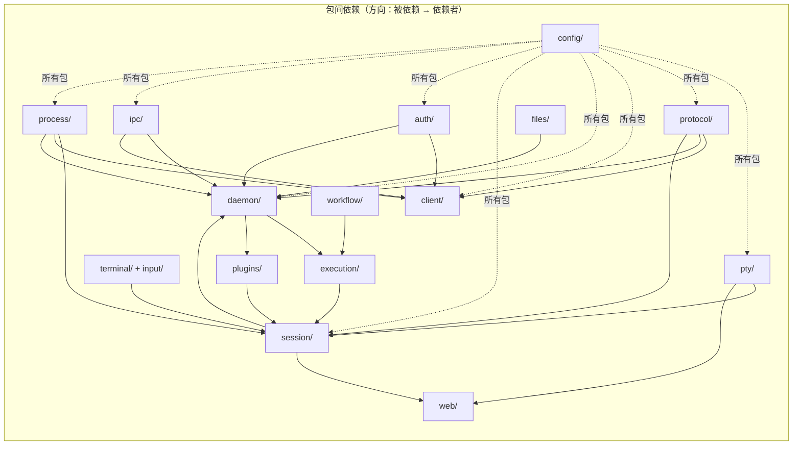

# PTY-Agent 架构设计

> 本文档描述 `src/` 包的模块化架构设计，为代码维护与扩展提供指导。
> 完整文件树见 [filestree/src.md](filestree/src.md)（以磁盘为准）；前端静态资源结构见 [filestree/web-static.md](filestree/web-static.md)；
> 命令用法与配置明细见 [CLI.md](CLI.md)；Workflow 编排见 [WORKFLOW.md](WORKFLOW.md)；
> 编码规范与依赖方向见 [CODEING-STANDARD.md](CODEING-STANDARD.md)；
> 设计决策记录见 [design/](design/)；沙箱安全报告见 [report/sandbox-security-blackbox-report.md](report/sandbox-security-blackbox-report.md)；
> 插件开发指南见 [PLUGINS_API.md](PLUGINS_API.md)。

---

## 1. 概述

PTY-Agent 是一个通过**伪终端（PTY）** 与交互式 CLI 程序双向通信的命令行代理。守护进程以独立子进程运行，exec 命令时自动启动。

**子命令**：
`start | stop | status | list | exec | send | advsend | read | kill | events | closewin | mouse | attend | wait | notice | keygen | set-default | plugin | workflow | file`

**会话模式**：
- **pty**（默认）—— 伪终端 + 屏幕快照，适合 TUI/REPL 等交互式程序。每次返回终端屏幕快照（用户真正看到的那一屏）。
- **subprocess**（`--subprocess`）—— Popen 捕获 stdout/stderr，增量输出 + stderr 分离，适合编译/下载等非交互程序。

**三监听器模型**：守护进程支持三种独立监听器，可同开或只开一个：

| 监听器 | 传输 | 认证 | 默认位置 | 典型场景 |
|--------|------|------|----------|----------|
| basic   | 明文 | 共享密码（空=无认证） | `0.0.0.0:10521`（默认关闭） | 内网/受信网络 |
| token   | 明文 | Token + HMAC（SHM 同机分发） | `127.0.0.1:10520`（默认开启） | 本机同机访问 |
| tls     | TLS  | Ed25519 公私钥 + TOFU | `0.0.0.0:18767`（默认关闭） | 跨机安全访问 |

**扩展能力**：Web 管理界面（xterm.js + FastAPI）、VNC 远程桌面、Screenshare 屏幕流、workflow YAML 编排、插件系统 v2（清单驱动）、Windows 沙箱（WRITE_RESTRICTED 令牌 + Job Object）、通知系统（`--notify` / `wait` / `notice`）、文件工具（内置 read/write/edit/grep/glob/upload/download）。

**会话身份模型**：
- `sid`（session id）：用户自定义标识，如 "cmd"，CLI 层使用，同一时刻一个 sid 只对应一个活跃会话。
- `uid`：uuid4，后端 `Session.__init__` 时自动生成，唯一不变。Web 层按 uid 操作。

---

### 1.1 相关文档导航

| 主题 | 文档 · 章节 |
|------|-------------|
| 命令用法、配置明细、认证、构建部署 | [CLI.md](CLI.md) §4-§13 |
| 配置系统总览（目录、加载、环境变量覆写） | [config/README.md](../config/README.md) |
| AI 版命令参考、返回条件矩阵 | [SKILL.md](../SKILL.md) |
| Architecture 模块分层与依赖 | 本文档（ARCHITECTURE.md） |
| 项目门面、安装、能力速览 | [README.md](../README.md) |
| 完整文件树（src 包） | [filestree/src.md](filestree/src.md) |
| 前端静态资源文件树 | [filestree/web-static.md](filestree/web-static.md) |
| Workflow 编排（YAML 定义、DAG、状态机） | [WORKFLOW.md](WORKFLOW.md) |
| 插件开发指南（完整 API） | [PLUGINS_API.md](PLUGINS_API.md) |
| 编码规范、依赖方向 | [CODEING-STANDARD.md](CODEING-STANDARD.md) |
| 执行链重构（请求契约、返回判定、统一等待引擎） | [design/EXECUTION-CHAIN-ARCHITECTURE.md](design/EXECUTION-CHAIN-ARCHITECTURE.md) |
| 插件自定义 CLI 选项（cliOptions）设计 | [design/PLUGIN-OPTIONS-设计文档.md](design/PLUGIN-OPTIONS-设计文档.md) |
| Web 终端架构 / WS 协议 / 身份模型 | [design/WEB-TERMINAL-REFACTOR.md](design/WEB-TERMINAL-REFACTOR.md) |
| wezterm-py 全量终端能力暴露计划 | [design/wezterm-py-全量终端能力暴露计划.md](design/wezterm-py-全量终端能力暴露计划.md) |
| WezTerm Mux 复用器 / 增量渲染合成 | [design/pywezterm-mux-复用器设计.md](design/pywezterm-mux-复用器设计.md) |
| 文本选区 / 剪贴板（OSC 52） | [design/stage4-selection-设计文档.md](design/stage4-selection-设计文档.md) |
| Win-Sandbox 黑盒安全测试报告 | [report/sandbox-security-blackbox-report.md](report/sandbox-security-blackbox-report.md) |

---

## 2. 架构设计原则

1. **单一职责**：每个模块只做一件事。
2. **高内聚低耦合**：相关功能内聚到同一模块，模块间通过明确定义的接口通信。
3. **平台隔离**：Windows 特有代码完全隔离在 `process/windows/` 子包（Job Object / IOCP / GUI 枚举 / API 绑定）与 `sandbox/` 包（原生 C++ 工程）下，Unix 平台零加载。
4. **配置集中**：所有魔数常量统一从 `config/` 包管理（TOML 文件 + 加载器），不在模块中散落。
5. **可测试性**：每个模块可独立测试，方便 mock。全量 2191+ 测试用例（unit/integration/e2e/web）。
6. **可扩展性**：新增 PTY 后端只需添加单个文件 + 在工厂链注册；新增 CLI 命令流程清晰；新增插件只需实现 `Plugin` 子类并声明清单。
7. **清洁架构（洋葱模型）**：Web 层采用 domain → application → infrastructure → presentation 四层，依赖只从外向内。
8. **只归一、不改行为**：执行链重构、响应装配等所有"统一化管理"均以行为零变化为前提，由全量单测守护。
9. **声明即契约**：插件系统清单（`plugin.json`）声明的触发器/钩子/权限必须在入口模块实现，校验失败跳过该插件，不污染主流程。
10. **可选模块惰性降级**：`src/optional.py` 网关统一管理 web/vnc/screenshare/cursorlocator/sandbox/plugins 的可用性探测，缺失模块返回 None 不抛 ImportError，主流程不受影响。

---

## 3. 模块架构

### 3.1 目录结构总览

完整文件树见 [filestree/src.md](filestree/src.md)（以磁盘为准，含每个文件/目录的一行注释）；前端静态资源见 [filestree/web-static.md](filestree/web-static.md)。此处仅给出**包级职责地图**与分层关系。

### 3.2 分层架构图

```mermaid
graph TB
    subgraph CLI["CLI 入口层"]
        MAIN["__main__.py<br/>转调 cli/main"]
        CLIR["cli/<br/>Command 基类 + CommandRegistry<br/>注册/构建解析器/派发"]
        CLIP["cli/pipeline.py<br/>公共管线：config ops / debug / 冲突校验"]
    end

    subgraph CLIENT["前端客户端层（Client 混入）"]
        CONN["client/connection.py<br/>ClientConnectionMixin<br/>三路分流 + 消息往返 + 认证装配"]
        DEFS["client/defaults.py<br/>ClientDefaultsMixin<br/>调用级默认值 + 会话回填"]
        PLGR["client/plugin_route.py<br/>ClientPluginMixin<br/>CLI 插件分流 + 自动挂钩"]
        CMDS["client/commands.py + file_commands.py + workflow_commands.py<br/>ClientCommands*Mixin<br/>cmd_* 会话/文件/workflow 命令"]
        ATTD["client/attend.py<br/>attend 实时终端接管引擎"]
        DCTL["client/daemonctl.py<br/>守护进程启停/探测/TLS 连接"]
        TLC["client/tls_client.py<br/>TLS 客户端（TOFU）"]
        PRES["client/presenter.py + result.py<br/>类型化结果 + 人类可读渲染"]
        CFGM["client/config_manager.py<br/>调用级配置"]
        SHL["common/shells.py<br/>Shell 探测"]
        PIDX["common/process.py<br/>pid_exists"]
    end

    subgraph PROTO["通信协议层"]
        MSG["protocol/message.py<br/>JSON 换行分隔编解码 + ping"]
        ENV["protocol/envelope.py<br/>线协议信封 + 分组载荷"]
        RS["protocol/reasons.py<br/>返回原因统一词汇"]
        SIGN["protocol/signing.py<br/>MessageSigner 抽象"]
        ANSI["protocol/ansi.py<br/>ANSI 转义过滤"]
        RESP["protocol/response.py<br/>统一响应构造器"]
        TRF["protocol/transfer.py<br/>二进制帧协议"]
    end

    subgraph DAEMON["守护进程层"]
        DLIFE["daemon/lifecycle.py<br/>入口 + 日志/控制台/单实例"]
        SRV["daemon/server.py<br/>多 Listener 编排 + 认证上下文<br/>+ 通知管理器"]
        HDL["daemon/handlers/<br/>命令派发与处理（每命令一文件）"]
        NOTI["daemon/notifications.py<br/>NotificationManager"]
    end

    subgraph EXEC["执行原语层"]
        EXF["execution/execution.py<br/>快照/子进程执行流程"]
        COND["execution/conditions.py<br/>RequestContext + ReturnConditions"]
        OPOL["execution/output_policy.py<br/>取源 + offset 校验"]
        RESP2["execution/response.py<br/>响应装配"]
        WAIT["session/wait.py<br/>统一等待引擎 wait_reason"]
    end

    subgraph SESS["会话管理层"]
        SMGR["session/manager.py<br/>SessionManager（uid 主键 + sid 索引）"]
        SES["session/session.py<br/>Session 协调器（组合 *Mixin）"]
        SIO["session/io.py<br/>InputMixin"]
        SOUT["session/output.py<br/>OutputMixin"]
        STRG["session/trigger.py<br/>TriggerMixin"]
        SEVT["session/events.py<br/>EventsMixin"]
        STHR["session/threads.py<br/>Threads 读者/监控线程"]
        OBUF["session/buffer.py<br/>OutputBuffer"]
        TRIG["session/trigger_matcher.py<br/>TriggerMatcher"]
        PUB["session/publisher.py<br/>SessionPublisher"]
    end

    subgraph PTY["伪终端后端层"]
        PFAC["pty/pty_factory.py<br/>create_pty 工厂"]
        PBASE["pty/base.py<br/>PseudoTerminal 基类"]
        WPTY["pty/wezterm_pty.py<br/>wezterm-py 后端（OpenConsole/openpty）"]
        SUBP["pty/subprocess_pty.py<br/>子进程后端（Popen 双管道）"]
    end

    subgraph PROC["进程管理层"]
        PBASE2["process/base.py<br/>ProcessTreeTracker 端口"]
        PMON["process/monitor.py<br/>ProcessMonitor"]
        GDET["process/gui.py<br/>GuiDetector"]
        JOBT["process/windows/job_tracker.py<br/>Job Object + IOCP"]
        PGID["process/unix/pgid_tracker.py<br/>process group"]
    end

    subgraph TERM["终端/输入层"]
        TSC["terminal/screen.py<br/>TerminalScreen 门面"]
        TBK["terminal/backends.py<br/>WeztermBackend（pywezterm Terminal）"]
        TXT["input/text.py<br/>JSON 转义/控制字符展开/行尾"]
        ITR["input/interceptor.py<br/>InputInterceptor"]
        WIE["input/wezterm_input.py<br/>WeztermInputEncoder"]
        MOU["input/mouse.py<br/>鼠标动作编码"]
    end

    subgraph AUTH["认证层"]
        AUTHB["auth/<br/>token + pubkey + password + tls"]
    end

    subgraph CFG["配置/IPC/日志"]
        CFGC["config/<br/>TOML 加载器"]
        SHMC["ipc/shm.py + single_instance.py"]
        LOGC["logging/<br/>异步队列日志"]
        OPT["optional.py<br/>可选模块惰性导入网关"]
    end

    subgraph WEB["Web 层（洋葱架构）"]
        WEBD["web/domain/<br/>领域实体"]
        WEBA["web/application/<br/>用例 + 端口 + 分发器"]
        WEBI["web/infrastructure/<br/>适配器 + 仓储"]
        WEBP["web/presentation/<br/>FastAPI + 控制器"]
    end

    subgraph WF["workflow 编排层"]
        WFMG["workflow/manager.py<br/>WorkflowManager"]
        WFEN["workflow/engine.py<br/>DAG 调度引擎"]
        WFRN["workflow/runner.py<br/>WorkflowRun"]
        WFDEF["workflow/definition.py<br/>YAML 解析校验"]
        WFEX["workflow/expr.py<br/>安全表达式求值"]
    end

    MAIN --> CLIR
    CLIR --> CLIENT
    CLIENT -->|TCP/TLS/JSON| DAEMON
    CLIENT --> PROTO
    CLIENT --> AUTH
    DAEMON --> PROTO
    DAEMON --> SESS
    DAEMON --> AUTH
    DAEMON --> EXEC
    DAEMON --> WF
    WF --> EXEC
    EXEC --> SESS
    SESS -->|create_pty| PTY
    SESS -->|create_process_tree_tracker| PROC
    SESS --> TERM
    WEB --> SESS
    WEB --> PTY
```



### 3.3 核心层详细说明

#### 3.3.1 `protocol/` — 通信协议层

**定位**：被 `client/` 和 `daemon/` 双方共同依赖的基础层，零业务逻辑。

| 模块 | 职责 |
|------|------|
| `message.py` | `Message` 类（全 @staticmethod）：JSON 换行分隔编解码 + `send`/`recv` + `ping` 探测。签名按方向分离为两个独立角色，存储于 `threading.local`（出站签名器 / 入站验证器），使双端口架构（basic/token 与 TLS Listener 在不同线程）各自独立装配 |
| `envelope.py` | 线协议信封 + 分组载荷封装（`PROTO=1`）：`request()` / `response()` / `wrap_response()` / `unwrap()`。信封字段 `proto/dir/type/mid/ts/kind/auth/payload`；四大终端命令（exec/send/read/mouse）请求载荷分组为 `op/condition/output/io`，响应分组为 `data/state/meta`。认证凭证在 `auth` 段，与业务载荷、签名解耦 |
| `reasons.py` | 返回原因统一词汇 `Reason`（str 子类枚举）+ `OUTWARD_REASON` 映射：原始原因（matched/timeout/idle_timeout/ended/crashed/gui_detected/cancelled）→ 对外原因（trigger_matched/trigger_timeout/program_ended/program_crashed/...）。`map_reason`（execution/response.py）做权威映射 |
| `signing.py` | `MessageSigner`（ABC）：`sign(obj)` / `verify_and_strip(msg)` / `signature_fields`。协议域定义，auth 包实现 |
| `ansi.py` | `strip_ansi(text)`：去除 SGR 颜色/样式码 + OSC，保留清屏/光标等语义控制序列 |
| `response.py` | `Response` 统一响应构造器（CLI/TCP/WS 共用）：error/warning/info/pong/config、各 `*_result`、`ws_*` 系列 |
| `transfer.py` | 文件传输二进制帧协议：`[4B payload_len][1B frame_type][payload]`，数据帧（原始字节）与控制帧（UTF-8 JSON）区分，与 `Message._recv_buffers` 共享连接级缓冲 |

**设计要点**：
- 线协议信封只在两端组装/拆解（客户端 `_send_recv` 出站套请求信封、daemon dispatcher 拆请求信封），内部业务层以扁平 body 交互，接入成本低。请求信封分组 `auth` 段承载凭证（token/password/pubkey_fp），供认证器在信封层面校验。
- file 传输握手（`file_upload_start`/`file_download_start`）与 `pong` 保持裸体不套响应信封（原样帧流协议正确性要求）。

#### 3.3.2 `cli/` + `client/` — CLI 入口层与前端客户端层

**定位**：`cli/` 负责命令注册/解析/派发（每命令一文件，与 `daemon/handlers/` 对称）；`client/` 封装与守护进程的通信（basic/token/tls 三路分流），向 CLI 入口提供简洁接口。

**cli/ 子包**：

| 模块 | 职责 |
|------|------|
| `cli/base.py` | `Command` 基类（`add_arguments`/`validate`/`run`）+ `CommandContext` 命令执行上下文 |
| `cli/registry.py` | `CommandRegistry`：注册/构建 argparse 解析器/派发，构建期选项冲突检测（内置 vs 插件 cliOptions）+ `_HintParser` |
| `cli/pipeline.py` | 公共管线：`apply_config_ops`（--show-config/--default）/ `resolve_debug_mode` / `check_common_conflicts`（通用冲突校验）/ `setup_cli_plugins` |
| `cli/common_args.py` | 共享参数组（common/session_io/output）+ 配置键转换 / idle 警告 |
| `cli/windows.py` | `fix_windows_exec_quoting`：Windows exec `-c` 命令引号修正 |
| `cli/commands/` | 每命令一个文件（start/stop/status/list/exec/send+advsend/read/kill/events/closewin/attend/mouse/wait/notice/keygen/set-default/plugin/workflow/file），`register_all` 注册顺序 = 帮助显示顺序 |

**client/ 子包**（`Client` 类经混入拆分，`transport.py` 仅 65 行聚合壳）：

| 模块 | 对应混入 / 职责 |
|------|----------------|
| `transport.py` | `Client` 聚合类：继承 6 个混入（connection/defaults/plugin_route/commands/file_commands/workflow_commands） |
| `connection.py` | `ClientConnectionMixin`：`_connect()` 按 CONNECT_MODE 三路分流（tls→TLS+TOFU+Ed25519；basic→密码认证，空=无认证；token→SHM 发现+Token/HMAC）、`_send_recv`（含信封封装+凭证注入+插件变换）、`_load_signer_and_providers` |
| `defaults.py` | `ClientDefaultsMixin`：调用级默认配置应用（`client_defaults`）、会话默认值回填（`sessionDefaults`）、编码记忆 |
| `plugin_route.py` | `ClientPluginMixin`：CLI 插件挂载分流（exec `--plugin`）、会话挂载自动挂钩（`_activate_session_cli`） |
| `commands.py` | `ClientCommandsMixin`：会话命令 `cmd_exec/cmd_send/cmd_read/cmd_kill/cmd_events/...` + 共享输出/解析工具 |
| `file_commands.py` | `ClientFileCommandsMixin`：file 子命令（read/write/edit/grep/glob/upload/download） |
| `workflow_commands.py` | `ClientWorkflowCommandsMixin`：workflow 子命令 |
| `daemonctl.py` | 守护进程生命周期控制（start/stop/is_running/端口发现/强制清理），独立于 daemon 核心，仅依赖共享层 |
| `tls_client.py` | `TLSClient`：TLS 连接 + TOFU 证书验证（CERT_NONE + 自定义指纹比对，类似 SSH known_hosts） |
| `attend.py` | `attend` 交互引擎：ReadConsoleInputW 输入 + 原始字节透传渲染 + 帧循环（完整实时终端接管） |
| `result.py` / `presenter.py` | 类型化结果模型（`Result.from_response`，含稳定错误码分类）/ 人类可读渲染（内容→stdout、元信息→stderr、错误+退出码） |
| `cli_plugins.py` | `CliPluginHost`：CLI 插件宿主（kind=cli），before_request/transform_response/render_response 三阶段钩子链 |
| `config_manager.py` | 调用级配置管理（`--default` 临时覆盖）；`set-default` 全局默认存守护进程内存 |
| `msg.py` | 面向用户消息的唯一格式 `(PTY-Agent message: <text>)`，供 presenter 与 daemonctl 共用 |
| `input.py` | `safe_print` 安全打印（自适应控制台编码，GBK 终端强制 UTF-8） |

**设计要点**：
- 输入文本处理（JSON 反转移、`{ctrl+a}`/`{enter}` 控制字符展开、行尾追加）集中在 `input/text.py`（CLI 与 daemon 共用），**转义展开由守护进程统一调用**（`daemon/handlers/utils.py:prepare_input`），按会话 mode 决定 `{enter}` 与默认行尾（pty=`\r`、subprocess=`\n`）。
- `client/__init__.py` 刻意不导入 daemon 侧依赖（`input/__init__.py` 不导入 interceptor/mouse，避免 CLI 进程加载 pywezterm），使用方按需从子模块导入。
- CLI 呈现层：`transport.cmd_*` → `result.from_response` 类型化 Result → `presenter.present`。放弃 JSON dump（原 formatter 已移除），内容→stdout / 元信息→stderr。
- 守护进程的启动/停止/探测属客户端控制能力（`client/daemonctl.py`），与 daemon 核心双向解耦。

#### 3.3.3 `daemon/` — 守护进程层

**定位**：多监听器 TCP/TLS 服务器，接收客户端请求，委派会话管理/执行层处理，返回响应。

| 模块 | 职责 |
|------|------|
| `lifecycle.py` | 守护进程入口：`main()` 加载配置 + DaemonServer.run()；支持 `--foreground`（前台运行，s6/systemd 监督器管理，日志输出到 stderr）与 `--survive`（生存模式：忽略结束信号与 stop 消息，仅 SIGKILL 可终止）|
| `server.py` | `DaemonServer`：多 Listener 编排（basic/token/tls）、认证上下文构建、令牌轮换、`NotificationManager` 注入插件环境。经 `src/optional` 网关惰性获取 WebServer（`ENABLE_WEB=False` 或 `src/web` 不可导入时跳过） |
| `listener.py` | `Listener`：单端口 accept 循环封装（bind/start/stop），封装明文/TLS 传输 + `AuthContext`；全局连接槽位 `MAX_CONNECTIONS`（Slowloris 防护）+ `CONNECTION_READ_TIMEOUT` 读超时 |
| `handlers/` | 每命令一文件的派发器模式：exec/send/read/list/kill/events/stop/closewin/mouse/attend/status/wait/notice/plugin/workflow/file/set_default+get_defaults。`DaemonDispatcher` 按 `msg["type"]` 路由 + 进程级插件消息路由同步（`_sync_plugin_handlers`）+ `PluginMessageHandler` 适配器 |
| `handlers/dispatcher.py` | 信封拆解（`unwrap`）+ 认证校验 + 派发；出站响应经 `envelope.wrap_response` 包装（含插件 `decorate_builtin_response` 装饰链）；自动消费通知的操作型命令（exec/send/read/mouse/kill） |
| `notifications.py` | `NotificationManager`：`--notify` 后端存储。全局 FIFO 通知队列 + 每会话计数上限（`MAX_NOTIF_PER_SESSION`）+ socketpair 唤醒通道；wait 消费摘要、notice 查询完整（待消费 + 已归档均可查） |

**设计要点**：
- 请求信封拆解：daemon `dispatcher` 拆请求信封并还原扁平 body 交 handler（业务零改动）；`Message.send` 经线程局部响应包装器套响应信封并分组。
- 单实例互斥锁（`SingleInstanceLock`）位于 `ipc/single_instance.py`（守护进程与客户端共用）。
- 日志系统位于 `src/logging/`：异步队列（`AsyncLogDispatcher`）+ 按模块分组独立日志文件 + 前一日 gzip 归档 + ContextVar 上下文绑定（session_id/connection_id/request_id）。
- handler 不直接操作 socket 读写（通过 `Message` 完成），便于测试。
- 每连接处理线程启动时 `AuthContext` 设置线程局部签名器/验证器（`Message.set_outbound_signer` 等）。

#### 3.3.4 `execution/` — 执行原语层

**定位**：exec/send/read 的核心执行流程，被 `daemon/handlers/` 与 `workflow/engine.py` 共用，避免行为分叉。详细设计见 [design/EXECUTION-CHAIN-ARCHITECTURE.md](design/EXECUTION-CHAIN-ARCHITECTURE.md)。

| 模块 | 职责 |
|------|------|
| `context.py` | `HandlerContext`：daemon 服务器与 workflow 共用的执行上下文（manager/authenticator/server），从 daemon/handlers 移出避免 daemon⇄workflow 循环依赖 |
| `conditions.py` | `ReturnConditions` + `RequestContext`：从请求消息一次解释全部返回条件（trigger/newline/fresh/idle/full/keep_ansi/snapshot_diff/explicit_timeout）与公共请求字段（id/command/input/encoding/cwd/env/mode/cols/rows/plugins） |
| `execution.py` | 执行原语：`_run_snapshot_flow`（快照流程）/ `_run_subprocess_trigger_flow` / `_run_subprocess_no_trigger_flow` / `_attach_subprocess_stderr` / `assemble_response`。支持 `send_response=False` 返回与 `cancel_event` 中断（workflow 取消支持） |
| `filtering.py` | 输出过滤：`filter_snapshot_lines` / `apply_lines_grep` / `strip_if_needed`（行/列/grep 过滤与 ANSI 剥离），`_apply_line_filters` 核心 + 薄包装 |
| `output_policy.py` | 取源策略：`resolve_output`（snapshot/full/diff 选源）/ `validate_offset_policy`（`--offset` 与 `--lines/--full/--snapshot-diff/等待模式` 互斥校验） |
| `response.py` | 响应装配：`build_result` / `attach_screen_buffer`（render_format 服务端渲染 / include_screen_buffer 稀疏网格）/ `map_reason` / `compress_screen_buffer` / `describe_output_format` / Git-Bash 路径提示 |
| `utils.py` | 请求工具：`validate_request` / `apply_client_defaults` / `prepare_input` / `check_ended_session` 等 |
| `session/wait.py` | 统一等待引擎骨架 `wait_reason`：cancel 检查 / remaining/timeout 判定 / 循环单源；各等待循环的检查顺序与等待原语经 `iteration` 回调保留（行为零变化） |

**设计要点**：
- 请求契约（`RequestContext`）→ 校验（`validate_offset_policy`）→ 执行引擎（`resolve_output` + 判定单源化）→ 响应装配（`assemble_response`）四层收敛；`resolve_exit_reason`（session/events.py）/ `check_gui_detected`（session/trigger.py）为 crash/ended 与 GUI 检测的单一判定点。
- 后台监控线程只投喂事件做 2s 兜底，请求线程主判定（低延迟主动判定 vs 2s 兜底为设计性并存，不做硬去重）。

#### 3.3.5 `session/` — 会话管理层

**定位**：管理 PTY 会话生命周期，通过**组合模式**将职责委派给独立子组件；输入/输出/触发/事件逻辑由 *Mixin 混入类提供。

| 模块 | 职责 |
|------|------|
| `manager.py` | `SessionManager`：会话 CRUD（uid 主键 + sid 索引，同一 sid 同时只对应一个活跃会话）、`stop_all`、set-default 全局默认（守护进程内存）、回调注册、`match_auto_load` |
| `session.py` | `Session` 协调器基类：子组件装配（`__init__`）、生命周期（`start`/`stop`）、状态代理。MRO 顺序 = 定义顺序（InputMixin/OutputMixin/TriggerMixin/EventsMixin） |
| `io.py` | `InputMixin`：`write_input` / `_dispatch_input` / `key_input` / `mouse_input` / `send_signal` / `perform_mouse_action`（经 InputInterceptor + 插件 on_input 链） |
| `output.py` | `OutputMixin`：`get_output`（流偏移）/ `get_snapshot` / `get_full_snapshot` / `get_snapshot_diff` / `resize`（先屏幕后 PTY，等待 ConPTY repaint）/ 终端状态查询 |
| `trigger.py` | `TriggerMixin`：`set_trigger` / `wait_for_trigger` / `check_idle_timeout` / `check_gui_detected`（委托 TriggerMatcher + 插件 request_return 中断） |
| `events.py` | `EventsMixin`：事件统一入口（插件链 + EventHistoryManager）/ 读者退出回调 / `resolve_exit_reason` 退出原因判定 / 事件消费与查询 |
| `threads.py` | `Threads`（读者线程 + 监控线程）+ `Components` 数据类（子组件引用打包，避免循环依赖）+ `_capture_exit_code_retry` |
| `buffer.py` | `OutputBuffer`：线程安全输出缓冲区（`RLock`，流偏移读取 + 头裁剪单调游标） |
| `trigger_matcher.py` | `TriggerMatcher`：正则匹配 + ReDoS 防护（`safe_regex_search`：独立线程 + 2s 超时）+ 空闲超时计时 + fresh/newline 语义 |
| `publisher.py` | `SessionPublisher`：订阅者（Web WebSocket）与结束回调管理 |
| `codec.py` / `detector.py` | 编码探测与解码纯函数 / `EncodingDetector` 状态管理（含智能裁剪避免线性截断损耗） |
| `events_history.py` | `EventHistoryManager`：待处理事件队列 + 历史记录 + 存在性检测 |
| `_win_console.py` | Windows Ctrl+C 发送（AttachConsole + GenerateConsoleCtrlEvent，失败回退写 `\x03`） |
| `wait.py` | `wait_reason` 统一等待引擎骨架（见 execution/ 层） |

**设计要点**：
- 读者线程数据流：`pty.read + drain → 插件 on_output 变换链 → OutputBuffer 追加 + TriggerMatcher 检测 → TerminalScreen.feed → 终端查询应答回写（drain_terminal_response）→ SessionPublisher 推送`。
- 监控线程高频（0.2s）排空 tracker 进程事件，低频（2s）执行 `check_events` 兜底 diff + `GuiDetector.check` + 插件 `poll_tick` + 自然退出检测（均自带节流）。
- 会话级插件经 `PluginHost` 挂载，on_input/on_output/on_snapshot 变换链贯穿输入输出与快照。

#### 3.3.6 `pty/` — 伪终端后端层

**定位**：封装跨平台 PTY 实现，向 `session/` 层提供统一 `PseudoTerminal` 接口。进程树追踪不在此包（`process/` 包持有 `ProcessTreeTracker` 端口）。

| 模块 | 职责 |
|------|------|
| `base.py` | `PseudoTerminal` 抽象基类：`read/write/close/fileno/get_child_pid/get_exit_code/get_type/drain/resize/inject_mouse_event` |
| `pty_factory.py` | `create_pty(command, cols, rows, cwd, env, encoding, tracker)`：所有平台统一优先 wezterm-py（Windows: OpenConsole 宿主；Unix: portable-pty openpty）；Windows 沙箱启用且带沙箱 tracker 时走沙箱后端 |
| `wezterm_pty.py` | `WeztermPseudoTerminal`：跨平台统一 wezterm-py 后端（Windows 侧载 conpty.dll + OpenConsole.exe 规避系统 conhost 的 VT 输入缺陷）；spawn 后 `register_root(pid, handle)` 登记根进程；命令可执行性预检 |
| `subprocess_pty.py` | `SubprocessPseudoTerminal`（`exec --subprocess`）：`subprocess.Popen` 直接捕获 stdout/stderr（无 PTY），双后台线程阻塞读两管道 → 队列 |

**设计要点**：
- `drain()`：`read()` 后立即调用，将 OS 管道缓冲中所有当前就绪数据一次性取回，确保触发检测在完整数据块上进行。
- 命令归一化：工厂入口统一处理 `command`（`str` 按 shell 语义 `shlex.split` 拆分，后端统一消费 `List[str]`）。
- 沙箱是安全边界：`[sandbox] enabled=true` 时**带沙箱 tracker 的会话强制走沙箱**（创建失败不回退原生）；未带 tracker（None）的裸后端调用视为非沙箱会话，回退原生后端。
- 新增 PTY 后端：创建新文件 → 继承 `PseudoTerminal` → 在 `create_pty` 优先级链中添加。

#### 3.3.7 `process/` — 进程管理层

**定位**：进程树追踪端口 + 平台实现 + 监控/GUI 检测/信息查询。

| 模块 | 职责 |
|------|------|
| `base.py` | `ProcessTreeTracker`（ABC）+ `ProcessNotification` 统一通知实体（type/pid/exit_code/process_name/process_path，is_spawn/is_exit/is_crash）+ `PendingEvent` |
| `monitor.py` | `ProcessMonitor`：进程树 diff + IOCP 排空 + 崩溃检测（`crash_event`） |
| `gui.py` | `GuiDetector`：GUI 窗口轮询检测（2s 节流），经 `ProcessTreeTracker` 抽象轮询，与具体追踪实现解耦 |
| `info.py` | 进程查询与错误格式化（`_get_process_name/_get_process_path/_format_exit_code_message/_format_pty_error`） |
| `windows/` | `JobProcessTreeTracker`（Job Object + IOCP 实时通知 + KILL_ON_JOB_CLOSE）、`GuiWindowMonitor`（EnumWindows 轮询 + WM_CLOSE）、`api.py`（ctypes API 绑定）、`win32_error.py`（NTSTATUS/Win32 错误码格式化） |
| `unix/` | `PgidProcessTreeTracker`（process group 追踪 + waitpid 轮询崩溃检测） |
| `__init__.py` | `create_process_tree_tracker()` 工厂：Windows 沙箱启用→`SandboxProcessTreeTracker`；否则 Job；Unix→Pgid |

**设计要点**：
- Session 通过 `process.create_process_tree_tracker()` 工厂获取 tracker（Session 生命周期 owner），不直接持有平台实现。
- 崩溃检测通过 IOCP 实时通知（`_JOB_OBJECT_MSG_NEW_PROCESS/EXIT_PROCESS/ABNORMAL_EXIT_PROCESS`）而非轮询；同时设置 `DIE_ON_UNHANDLED_EXCEPTION`（崩溃不弹对话框）。
- 沙箱路径 `SandboxProcessTreeTracker` 经原生 Job 回调提供同类通知，但**显式排除根进程**（根进程退出经 `SandboxSessionManager.get_exit_code()` 探测）。

#### 3.3.8 `terminal/` + `input/` — 终端屏幕层与输入层

**定位**：`terminal/` 将 PTY 输出的 VT 序列流解析为字符网格，提供终端屏幕快照；`input/` 处理输入编码与拦截。

| 模块 | 职责 |
|------|------|
| `terminal/backends.py` | `ScreenBackend`（接口）+ `WeztermBackend`（唯一实现）：包装 `pywezterm.Terminal`（wezterm-term 终端模型），可见区/scrollback 以 `List[List[ScreenCell]]` 稀疏网格暴露，渲染（纯文本/带 SGR/光标序列/scrollback）下沉 pywezterm 绑定层完成 |
| `terminal/screen.py` | `TerminalScreen` 门面：`feed` / `snapshot` / `export_buffer` / `resize`（原生 reflow）/ `capture_scrollback` / `clear_scrollback` / `drain_terminal_response` / 终端状态查询（光标/备用屏/鼠标追踪/模式恢复序列） |
| `input/text.py` | 输入文本处理：JSON 反转移 / 控制字符展开（`{ctrl+a}`/`{enter}`）/ 行尾追加，CLI 与 daemon 共用 |
| `input/interceptor.py` | `InputInterceptor`：SGR 鼠标拦截、键盘 VT 拦截与鼠标动作执行 |
| `input/wezterm_input.py` | `WeztermInputEncoder`：与终端模型共享同一 Terminal 实例的模式感知键盘/鼠标编码 |
| `input/mouse.py` | `Coord` / `MouseActionEncoder` / `MouseError` / `grep_screen`（鼠标坐标解析与编码，`--grep` 反查坐标） |

**设计要点**：
- `TerminalScreen` 与 `WeztermInputEncoder` 共享同一 `pywezterm.Terminal` 实例，保证模式状态一致（鼠标追踪/备用屏/键盘协议）。
- 快照为空时响应附带 `snapshotDiagnostics` 字段辅助诊断；`export_buffer()` 使用稀疏格式（仅非默认单元格），服务端 `_compress_screen_buffer()` gzip+base64 压缩。
- wezterm-py 不可用时 `available=False`，`snapshot()` 返回空字符串，PTY 仍可用（回退纯字节流）。
- 终端能力下钻（增量渲染、状态查询、选区、剪贴板）见 [design/wezterm-py-全量终端能力暴露计划.md](design/wezterm-py-全量终端能力暴露计划.md) 与 [design/pywezterm-mux-复用器设计.md](design/pywezterm-mux-复用器设计.md)、[design/stage4-selection-设计文档.md](design/stage4-selection-设计文档.md)。

#### 3.3.9 `auth/` — 认证层

**定位**：可插拔认证基础设施，被 `client/` 与 `daemon/` 双方依赖。三种认证方式（token/HMAC、pubkey/Ed25519、password/共享密码）作为独立子包，共享抽象接口。消息签名抽象（`MessageSigner`）定义于 `protocol/signing.py`，本包实现它。

| 模块 | 职责 |
|------|------|
| `base.py` | `Authenticator`（服务端验身份）/ `CredentialProvider`（客户端附凭证）ABC |
| `keys.py` | Ed25519 密钥实体（OpenSSH 兼容、SHA-256 指纹与 `ssh-keygen -lf` 一致）/ 生成 / authorized_keys 加载 / 私钥权限检查 |
| `context.py` | `AuthContext`：连接级认证上下文（出站签名器/入站验证器/认证器），每个 Listener 持有一个 |
| `token/` | `TokenAuthenticator` + `TokenCredentialProvider`（SHM 令牌，支持轮换与宽限）+ `HmacMessageSigner`（HMAC-SHA256 对称双向） |
| `pubkey/` | `PubkeyAuthenticator`（authorized_keys 白名单，fail-closed）+ `PubkeyCredentialProvider` + `Ed25519MessageSigner`（非对称单向：请求签名，响应不验签） |
| `password/` | `PasswordAuthenticator`（常量时间比较）+ `PasswordCredentialProvider`（basic 监听器，密码即 HMAC 密钥，空=无认证） |
| `tls/` | `CertificateManager`（自签证书生成/加载/指纹）+ `KnownHosts`（TOFU 信任存储，类似 SSH known_hosts） |

**设计要点**：
- 三种认证方式独立分包互不依赖；`CONNECT_MODE` 单选模式（client.toml 选择一种连接方式，须与 daemon 侧 `[listener]` enabled 匹配）。
- Token + HMAC：HMAC 密钥经 SHM 传递，daemon 既能签响应（出站）也能验请求（入站）。Ed25519：daemon 仅验请求（无私钥），客户端持私钥签请求，响应裸传。
- HMAC 签名字段 `_sig`（hex 编码）；Ed25519 签名字段 `_sig_ed25519`（签名内容为排除签名字段后的整封消息，含 `auth.pubkey_fp` 身份）；两种可共存（`MessageSigner.signature_fields` 声明）。
- 机制细节与部署工作流见 [CLI.md](CLI.md) §7 认证与监听方式。

#### 3.3.10 `config/` — 配置中心（TOML 文件 + 加载器）

**定位**：所有魔数常量统一从 `src/config/*.py` 导入。TOML 数据文件位于项目根 `config/`（与 `src/` 平级），配置按侧物理分离。体系总览见 [config/README.md](../config/README.md)，配置项明细（各 TOML 默认值）见 [CLI.md](CLI.md) §6。

| 文件 | 职责 |
|------|------|
| `common.toml` / `shared.toml` / `transfer.toml` | 共享配置（根目录）：数据目录、终端默认尺寸、压缩等级、输入限制、协议缓冲、IPC 命名、daemon 控制、日志格式、传输帧参数 |
| `daemon/daemon.toml` + `daemon/logging.toml` + `daemon/web.toml` | daemon 专属：三监听器 `[listener]`、缓冲、超时、认证参数、日志分组；web.toml **可选**（缺失即 web 关闭） |
| `daemon/sandbox.toml` | 沙箱配置（**可选**，缺失即沙箱关闭）：enabled / quota / isolation |
| `client/client.toml` + `client/logging.toml` | client 专属：连接方式 `[connection]`、认证参数、日志分组 |
| `logging.toml` | 跨侧共享日志配置（格式、归档间隔、异步队列容量） |
| `daemon/vnc.toml` / `vnc.example.toml` | VNC 运行时配置（winvnc.exe 读取，**不经过 Python 加载**） |

**加载器**（`src/config/`）：

| 模块 | 职责 |
|------|------|
| `_loader.py` | `load_toml`（读取）→ `flatten`（嵌套 section 展平为 flat key→value，同名冲突抛 ValueError）→ `merge`（跨文件合并，冲突抛 ValueError）+ `apply_env_overrides`（`PTY_AGENT_<key>` 覆写，优先级高于文件） |
| `_build.py` | `build_config(*extra)`：统一装配模板（common/shared/logging 基线 + 各侧专属）+ 运行时常量（IS_WINDOWS/DATA_DIR/PROJECT_ROOT/LOG_DIR），消除 shared/client/daemon 重复样板 |
| `common.py` / `shared.py` / `daemon.py` / `client.py` | 各侧配置装配（经 `build_config`），模块级常量 `globals().update()`，可直接 `from ..config.daemon import ...` 导入 |
| `sandbox.py` | 加载 `daemon/sandbox.toml`（可选）：`ENABLED`/`QUOTA`/`ISOLATION`/`CONFIG_LOADED` |
| `plugins.py` | 插件目录发现 + `registry.json` 状态/`policy.json` 策略：`ENABLED`/`PLUGIN_DIRS`/`PLUGIN_STATES`/`POLICY`/`PluginStateStore` |
| `transfer.py` | 加载 `transfer.toml` 的 `[transfer]` 段，导出 `TRANSFER_*` 协议常量 |
| `default_keys.py` | `DEFAULT_KEYS`/`DEFAULT_VALUES`/`normalize_default_value`：set-default / `--default` 的可用键与取值归一化（client ConfigManager 与 daemon set_default 共享） |
| `encoding.py` | `is_valid_encoding`：编码名称校验 |
| `optional.py` | （见 3.3.11）可选模块惰性导入网关 |

**设计要点**：
- 环境变量覆写：`PTY_AGENT_<key>`（大写），优先级**环境变量 > 文件**；bool/int/float/list/dict 按文件原值类型转换，失败警告并保留文件值；仅对已存在的 key 生效。
- 常量在模块 import 时固化，修改 TOML 后需重启进程生效。
- 配置按侧分离理由：跨机 TLS 部署时各机器只需部署对应的 TOML 文件；client 侧与 daemon 侧各自聚合，互不依赖对方配置文件。
- 运行时计算常量见本文档附录 B。

#### 3.3.11 `logging/`、`ipc/`、`common/`、`optional.py` — 支撑层

| 模块 | 职责 |
|------|------|
| `logging/` | 高性能日志系统：`get_logger`（注册表校验）/ `bind`/`unbind`（ContextVar 上下文绑定 session_id/connection_id/request_id）/ `setup_daemon_logging` / `setup_client_logging` / `shutdown`。异步队列（`AsyncLogDispatcher` 队列满丢最旧）+ 按模块分组独立日志文件（毫秒时间戳）+ 前一日 gzip 归档 |
| `ipc/shm.py` | 共享内存工具：认证令牌（seqlock 防撕裂读）+ HMAC 密钥读写（Windows 命名 mmap / Unix 文件回退）；daemon 端口为固定端口配置，不再经 SHM 发现 |
| `ipc/single_instance.py` | `SingleInstanceLock`：单实例互斥锁（Windows 命名互斥 / Unix flock），守护进程与客户端共用 |
| `common/process.py` | `pid_exists`：进程存在性探测（跨侧共享） |
| `common/shells.py` | `detect_available_shells` / `format_shell_info` / `wrap_command`（exec `--shell` / `set-default shell`） |
| `optional.py` | 可选模块惰性导入网关：集中探测并缓存 `web`/`vnc`/`screenshare`/`cursorlocator`/`sandbox`/`plugins` 可用性，提供 `*_available()` 与 `get_*_cls()` 工厂；缺失模块返回 None/False 不抛 ImportError；功能依赖（`_FEATURE_DEPS`）集中登记，daemon 启动时预检自动禁用 |

---

## 4. 子系统

### 4.1 `web/` — Web 服务器层（洋葱架构）

**定位**：Web 管理界面与终端网关，采用洋葱架构四层（domain ← application ← infrastructure ← presentation），依赖只从外向内。架构/Bug 分析/目标形态详见 [design/WEB-TERMINAL-REFACTOR.md](design/WEB-TERMINAL-REFACTOR.md)，终局形态（ttyd 式）见 [design/WEB-TERMINAL-REDESIGN.md](design/WEB-TERMINAL-REDESIGN.md)，实施记录见 [design/WEB-TERMINAL-REFACTOR-PLAN.md](design/WEB-TERMINAL-REFACTOR-PLAN.md)。

| 层 | 模块 | 职责 |
|----|------|------|
| 领域层 | `web/domain/` | 领域实体（`ActiveSession`/`HistorySession`/`HistoryDetail`/`SessionEndedInfo`/`SystemStats`）+ `settings_schema.py`（设置项 Schema） |
| 用例层 | `web/application/` | `dispatcher.py`（WS 消息分发）+ `handlers/`（按域分组：system/session/detail/history/vnc/screenshare/cursor/size_mode，`registry.py` 注册表）+ `ports.py`（端口抽象：SessionRepository/HistoryRepository/EventPublisher/...）+ `services.py`（编码服务、订阅服务）+ `adaptive_lock.py`（自适应排他锁服务） |
| 基础设施层 | `web/infrastructure/` | `repositories/`（SessionRepositoryAdapter/HistoryRepositoryAdapter/HistoryStore）、`system/`（ShellProviderImpl/SystemStatsProviderImpl）、`web/`（FastAPIWebSocketTransport/WebSocketConnectionContext/EventPublisherImpl）、`thread_executor.py`、`cursor_locator_adapter.py`、`auth/session_store.py` |
| 展示层 | `web/presentation/` | `server.py`（FastAPI + uvicorn 后台线程）+ `controllers/`（auth/websocket/settings/screenshare/filesystem） |

**通信协议**（见 [design/WEB-TERMINAL-REFACTOR.md](design/WEB-TERMINAL-REFACTOR.md) §1.3）：
- 单一 WS 端点 `/ws`（~30 消息类型：ping/list/shells/system_stats/history/history_detail/create/subscribe/unsubscribe/input/key/mouse/signal/resize/kill/delete_history/session_detail/session_detail_refresh/vnc_*/fs_*/cursor_locator_*/takeover_size_control/set_size_mode）
- REST：`/api/auth/login|logout|status`、`/api/settings`、`/api/listdir`（文件系统浏览）、`/login`
- `/vnc/websockify`（WS→VNC TCP 代理，无 websockify 子进程）
- Screenshare 流端点（`/fastscreen/mjpeg`、`/fastscreen/ws/mse`、`/fastscreen/ws/webcodecs`）

**设计要点**：
- Web 密码认证可选（`WEB_PASSWORD_HASH` 空=免密，非空=需密码）：双通道（Cookie `pty_session` + `X-Auth-Token` 头），SHA-256 哈希存储，`SessionStore` 服务端 token 会话（默认 24h）。
- `web/__init__.py` 刻意不执行任何子模块导入（避免 ScreenshareAdapter 顶级包导入冲突），所有使用方直接从子模块导入：`WebServer` ← `web.presentation.server`、`HistoryStore` ← `web.infrastructure.repositories.history_store`。
- VNC/Screenshare 适配器属于可选模块，经 `src/optional` 网关获取，不在 `infrastructure/__init__.py` 模块级导入（目录缺失时功能降级不崩）。
- 前端 JS 按 domain/application/infrastructure/presentation 四层组织（与后端洋葱对应），完整文件树见 [filestree/web-static.md](filestree/web-static.md)；会话身份模型（sid/uid）、resize scrollback 保留策略、鼠标模式推送见 [design/WEB-TERMINAL-REFACTOR.md](design/WEB-TERMINAL-REFACTOR.md)。

### 4.2 `workflow/` — workflow 脚本编排子系统

**定位**：YAML 定义 + DAG 并行调度的后台任务编排（daemon 侧执行，CLI 只下发定义与查询）。完整规范（定义文件结构、步骤类型、依赖并行、变量条件、错误策略、状态模型）见 [WORKFLOW.md](WORKFLOW.md)。

| 模块 | 职责 |
|------|------|
| `definition.py` | `parse_definition`：YAML 定义解析与校验（步骤 schema、id 唯一性、隐式依赖显式化、依赖环 DFS 检测） |
| `expr.py` | `eval_expr` / `render_text` / `render_value`：安全表达式求值（AST 白名单，拒绝 Call/属性方法执行） |
| `engine.py` | `WorkflowEngine`：DAG 调度（就绪集合 + ThreadPoolExecutor 并行）、if 条件跳过、依赖失败传播、on_error 策略、retry、cancel 中断 |
| `runner.py` | `WorkflowRun`：单次运行状态机（run/step 状态、事件日志 deque 上限 2000、取消事件） |
| `manager.py` | `WorkflowManager`：运行注册表（daemon 持有），启动独立线程执行，容量上限淘汰最旧终态 |

**设计要点**：
- 步骤执行复用 `execution/execution.py` 执行原语（与 exec/send/read handler 同源），`send_response=False` 进程内取结果，无需网络往返；行为与 CLI 一致。
- 变量/条件：全局 `vars`（可被 `--vars` 覆盖）+ 步骤结果核心字段（output/reason/exit_code/error，以步骤 id 为引用名）；`_RunNamespace` 懒视图避免 O(N²) 复制。
- 取消：`cancel_event` 贯穿执行原语（等待循环 0.1s 粒度），`workflow cancel` 后等待中的步骤最快 0.1s 内响应。
- 定义文件由 CLI 本机读取下发（跨机 tls 模式语义一致），daemon 侧按 `WORKFLOW_MAX_FILE_SIZE` 限制大小。

### 4.3 插件系统（`src/plugins/` + `config/plugins/`）

**定位**：清单驱动插件系统 v2：元数据由 `plugin.json` 声明（id/kind/triggers/messageTypes/权限/配置默认值/cliOptions 等），代码只实现钩子。**插件开发完整指南见 [PLUGINS_API.md](PLUGINS_API.md)**，cliOptions 设计见 [design/PLUGIN-OPTIONS-设计文档.md](design/PLUGIN-OPTIONS-设计文档.md)。

**三种形态**：

| 形态 | 执行位置 | 生命周期 |
|------|----------|----------|
| `process` | daemon 进程 | 注册表 enable 时构造单例（on_init → on_enable）；`messageTypes` 接管消息路由（handle_message）、`decorateTypes` 装饰内置响应、`on_session_created` 会话回调 |
| `session` | daemon 进程 | 规范实例随 enable 创建（收总线事件）；每次会话挂载构造独立实例（on_attach→on_detach） |
| `cli` | 客户端进程 | 每次命令进程启动时加载；before_request/transform_response/render_response 三阶段钩子，经 `exec --plugin` 或会话挂载列表 activate |

**核心模块**（`src/plugins/`）：

| 模块 | 职责 |
|------|------|
| `base.py` | `Plugin` 基类（只定义钩子签名）+ `PluginContext`（含 request_return/self_unload）+ `ProcessPluginContext` + `HANDLED` 哨兵 + `VALID_HOOKS` |
| `manifest.py` | plugin.json 解析与结构校验（含 `PluginCliOption`/`PluginManifest`，`cliOptions` 字段与 `commands` 白名单校验） |
| `loader.py` | 清单驱动加载（模块导入 + 声明-实现一致性校验） |
| `registry.py` | `PluginRegistry`：生命周期（enable/disable/reload/load_dir/remove）、状态机（LOADED/ENABLED/DISABLED/BROKEN）、进程级单例、auto_load 条件匹配（command/cwd/env） |
| `host.py` | `PluginHost`：会话级挂载链（HookEngine 驱动）、链式变换（modify）、返回控制（request_return）、自我卸载（self_unload）、总线发布 |
| `hooks.py` | `HookEngine`：优先级排序 + 五类调度语义（modify/observe/intercept/provide/aggregate），异常隔离 |
| `events.py` | `EventBus`：daemon 级 pub/sub，主题通配（`*` 单段 / `>` 多段），异常隔离 |
| `config.py` / `storage.py` | `PluginConfig`（清单默认 + 内存覆盖 + JSON Schema 子集）/ `PluginStorage`（kv/文件/sqlite 三种视图，按插件命名空间隔离） |
| `permissions.py` / `environment.py` | `PermissionChecker`（能力检查 + 审计）/ `PluginEnvironment`（daemon 全局共享能力集合） |
| `cli_options.py` | 插件自定义 CLI 选项：声明注册、冲突检测（`RESERVED_OPTIONS` + 不变量测试防漂移）、值收集、daemon 侧消息校验 |
| `context.py` | 插件上下文输出（`<插件目录>/<插件名>.md` 帮助文档，contextHidden 控制自动输出） |
| `decorate.py` | 内置响应装饰：按 `decorateTypes` 匹配进程级插件 `decorate_response`，异常隔离 |
| `io.py` | `PluginIO`：进程级插件连接收发端口（needs_io，多帧传输协议） |

**内置插件**（`config/plugins/`，registry.json 注册）：`ai`（CLI 侧 AI 二次分析，kind=cli）、`state_check`（会话级终端状态检测）、`subagent`（多 agent 子代理管理，kind=["cli","process"]，含 5 个会话 parser）、`2048`（CLI 演示游戏）。

**设计要点**：
- 会话级插件经 `PluginHost` 挂载（`--plugin` 注入 / `plugin attach` / auto_load 自动匹配），钩子链异常隔离（插件异常只记日志不中断主流程）。
- 插件系统接口更新时所有内置插件同步更新，不留兼容/旧/残留接口（见 `config/plugins/AGENTS.md`）。
- `registry.json` 缺失时插件系统整体禁用（`ENABLED=False`），主流程正常。

### 4.4 文件工具（`src/files/` + `daemon/handlers/file_handler.py`）

**定位**：文件工具是**主程序内置功能**（原 files 功能内化），不依赖插件系统。

| 位置 | 职责 |
|------|------|
| `src/files/` | daemon 侧全部业务：read/write/edit/grep/glob 用例（`read/`、`write/`、`search/`）、状态机（`state.py` FileRecordStore，read-before-write）、历史（`history.py` SQLite 版本链）、差异（`diff.py`）、权限策略（`permission.py`）、运行参数（`settings.py`）、传输（`transfer/` judge/map/daemon_upload/daemon_download） |
| `src/daemon/handlers/file_handler.py` | 内置 `FileHandler`：接管 `file_*` 消息类型，按 cwd_session 解析路径并分发 |
| `src/client/transfer/` | 双端共享与 CLI 侧驱动：帧协议错误/条目（common）、树扫描（scan）、client_upload/client_download |
| `src/protocol/transfer.py` | 二进制帧编解码（零业务） |

**设计要点**：
- 消息协议与响应形状（`commandType`）与原内置 handler 逐字段一致；upload/download 多帧收发直接基于连接 conn（`Message` + `protocol.transfer`），不再经插件系统的 `PluginIO`。
- `file` 命令 `-s/--cwd-session` 必填：取该会话 cwd 作路径基准（不操作该会话）。
- 搜索经 `bin/rg`（ripgrep 二进制）双引擎（可用/不可用降级）。

### 4.5 `sandbox/` — 沙箱会话子系统（Windows 专属）

**定位**：把 sandbox 原生 C++ 库（`sandbox/`，pybind11 编译为 win_sandbox_native.pyd）作为会话的完整后端。机制细节与黑盒安全验证见 [report/sandbox-security-blackbox-report.md](report/sandbox-security-blackbox-report.md)。

| 模块 | 职责 |
|------|------|
| `manager.py` | `SandboxSessionManager`：原生沙箱实例会话（进程内直调 + 回调通知流） |
| `pty.py` | `SandboxPty`：`PseudoTerminal` 端口实现（wezterm Pty 创建 ConPTY + 外部传入 hpcon） |
| `tracker.py` | `SandboxProcessTreeTracker`：`ProcessTreeTracker` 端口实现（显式排除根进程） |

**安全机制**：`CreateRestrictedToken` 以 `DISABLE_MAX_PRIVILEGE|LUA_TOKEN|WRITE_RESTRICTED` 派生受限令牌，restricting SIDs = [logon SID, Everyone, workspace SID, temp SID]；写保护来自 WRITE_RESTRICTED（写访问须命中 capability SID 的 ACE）；Job Object 资源配额（内存/CPU/进程数/墙钟）+ KILL_ON_CLOSE；宿主进程 DACL 加固（Deny ACE 拒绝沙箱内进程对宿主的 PROCESS_TERMINATE 等）。边界：**写受限；读、网络、进程可见性不受限**（对齐参考实现设计边界）。

**启用方式**：`config/daemon/sandbox.toml` 的 `[sandbox] enabled = true`。启用后 `process.create_process_tree_tracker()` 返回 `SandboxProcessTreeTracker`，带沙箱 tracker 的会话强制走沙箱后端（创建失败不回退原生）；`win_sandbox_native*.pyd` 缺失时 `_HAS_NATIVE=False`，`start()` 抛清晰的 `SandboxError`，不中断 daemon 启动。

### 4.6 `vnc/` + `screenshare/` — 远程桌面与屏幕串流

| 模块 | 职责 |
|------|------|
| `vnc/ports.py` | `VncServicePort`（ABC）：is_available/start/stop/get_status/get_connection_info |
| `vnc/adapter.py` | `VncAdapter`：winvnc.exe 进程启停 + `get_novnc_web_dir()`（noVNC 前端目录） |
| `vnc/password_loader.py` / `process_manager.py` / `src/vnc_password.py` | VNC 密码读取（daemon/vnc.toml）/ winvnc 生命周期 / VNC 密码文件格式工具 |
| `screenshare/ports.py` | `ScreenshareServicePort`（ABC）：is_available/list_targets/get_status/cleanup |
| `screenshare/adapter.py` | `ScreenshareAdapter`：服务实现（懒加载 CaptureEngine + StreamManager） |
| `screenshare/streamers/` | `StreamManager`（多客户端共享捕获会话）+ H264Streamer / H264MSEStreamer / MjpegStreamer |
| `screenshare/streamers/encoding/` | H264Encoder / FMP4Muxer / frame_to_jpeg 等编码器 |

**设计要点**：
- VNC 的 WebSocket→TCP 代理由守护进程 `/vnc/websockify` 端点实现（无 websockify 子进程）；Screenshare 流端点由 web 层 `screenshare_controller.py` 暴露（**无独立 server.py**），流是长连接，直接调用 StreamManager 不走应用层消息队列。
- 两者均为可选模块：仅当 web 可用（`ENABLE_WEB`）且对应开关（`ENABLE_VNC` / `ENABLE_FASTSCREEN`）为真且模块可导入时，经 `src/optional.get_*_adapter_cls()` 加载；`bin/ultravnc/winvnc.exe` / `bin/fastscreencore/fastscreen.dll` 缺失时 `is_available()` 返回 False，web 前端隐藏入口。

### 4.7 通知系统（`daemon/notifications.py`）

**定位**：`--notify` 异步返回的后端存储：后台通知线程把"命令原本的返回"（完整命令响应 + 返回原因）发布到 `NotificationManager`；`wait` 消费待消费通知摘要（移入归档）；`notice {nid}` 查询完整响应（待消费 + 已消费归档均可查，只读不消费）。

**设计要点**：
- 全局 FIFO（deque）+ 每会话计数上限（`MAX_NOTIF_PER_SESSION` 超限淘汰最旧），总量受 `MAX_SESSIONS` × 每会话上限约束。
- 自管道用 `socket.socketpair()`（Windows 上 os.pipe 不能 select），`wait` handler 用 select 同时监听客户端连接与唤醒通道，通知到达写 1 字节立即唤醒，无需轮询。
- 消费语义：wait 消费与操作会话自动消费（`_AUTO_CONSUME_COMMANDS` = exec/send/read/mouse/kill）都移入归档（上限 200 条淘汰最旧）不删除；查询型命令（plugin ls/list/status）不消费。
- 通知 nid 用 uuid4().hex；队列仅存内存（daemon 重启即清空，与 set-default 全局默认一致）。

---

## 5. 依赖关系与调用链

### 5.1 包间依赖图



**规则**（依赖方向权威定义见 [CODEING-STANDARD.md](CODEING-STANDARD.md) §3.3 单向依赖链）：

- `config/` 是配置包（TOML 文件 + 加载器），被所有包导入，但不导入任何业务包。
- `common/` 是跨侧共享工具层（pid_exists / Shell 探测），被 client/daemonctl/daemon/web 依赖。
- `protocol/` 不依赖任何其他包（除 Python 标准库与 config 常量）。
- `auth/` 是认证基础设施层，被 client 和 daemon 双方依赖，不依赖业务包。
- `ipc/` 是进程间通信层（共享内存 + 单实例锁），被 daemon 和 client/daemonctl 依赖。
- `pty/` 不依赖 session/daemon，只依赖 `process/`（ProcessTreeTracker 端口）与 config。
- `process/` 定义事件实体于 `process/base.py`，平台实现位于 `process/windows/`（Job/IOCP/GUI/api）与 `process/unix/`（pgid_tracker）。
- `session/` 依赖 `pty/`（PTY 实例）、`process/`（tracker 工厂）、`terminal/`、`input/`、`session/` 内部子组件、`plugins/`（PluginHost）、`protocol/`（ANSI/reasons）与 config。
- `execution/` 依赖 `session/`（执行原语），被 `daemon/handlers/` 与 `workflow/` 共用；`HandlerContext` 置于执行层消除 daemon⇄workflow 循环。
- `daemon/` 依赖 session/execution/protocol/auth/ipc/process/web/workflow/plugins/files/notifications/common/optional 与 config。
- `client/` 依赖 protocol/auth/ipc/common/input（text.py）与 client 内部子包；不依赖 daemon（守护进程控制与 daemon 入口双向解耦）。
- `web/` 采用洋葱架构（domain ← application ← infrastructure ← presentation），依赖 session/common/optional/protocol 与 config。
- `screenshare/` / `vnc/` 依赖 `bin/`（fastscreencore / ultravnc）与 config，作为可选模块仅被 `web/` 经 `optional/` 惰性加载。
- `__main__.py` 只依赖 `cli/`；`cli/` 依赖 `client/`（命令层只做 args → cmd_* 映射）。

### 5.2 典型调用链

#### exec 流程

```
用户: pty-agent exec myid -c "python -u -i" -t ">>>"

cli/main.py:main()  （src/__main__.py 转调）
  → CommandRegistry 构建解析器 → argparse 解析
  → 公共管线：apply_config_ops / resolve_debug_mode / check_common_conflicts
  → ExecCommand.run → Client.cmd_exec(...)

client/commands.py:ClientCommandsMixin.cmd_exec()
  → 构建 request dict
  → Client._send_recv(msg, autostart=True)
      → client/connection.py:_connect(autostart=True)
          → token 模式：if not is_running(): start_daemon()  [仅 exec 自动启动]
          → TCP 连接 + 信封封装 + 凭证注入 + 签名
      → Message.send(sock, msg)  [写入 JSON 信封]
      → Message.recv(sock)       [阻塞等待响应信封]
      ──TCP──┐

daemon/server.py:DaemonServer.run()        ← Listener accept 连接（basic/token/tls 监听器）
  → 创建线程 → Listener._handle_connection（读超时 + TLS 包装）
      → AuthContext 设置线程局部签名器/验证器
      → dispatcher.handle(conn, addr)

daemon/handlers/dispatcher.py:DaemonDispatcher.dispatch()
  → Message.recv(conn) → unwrap 拆请求信封 → 还原扁平 body
  → 验证认证签名 → msg["type"] == "exec"
  → ExecHandler.handle(conn, msg)

daemon/handlers/exec_handler.py:ExecHandler.handle()
  → manager.get_session(id)
   → if not exist: manager.create_session(id, command, encoding, ...)
       → Session.__init__()（装配全部子组件）
       → Session.start()
           → pty/pty_factory.py:create_pty(tracker=...)
           → create PTY instance（spawn 后 register_root 到 tracker）
           → 初始化进程快照 → ProcessMonitor.reset(initial_pids)
           → Threads.start() → 启动读者线程 + 监控线程
  → execution/execution.py:_run_snapshot_flow(...)
      → session.set_snapshot_trigger(trigger, idle_timeout, ...)
      → session.wait_for_trigger(timeout)  ← 统一等待引擎 wait_reason
          → 读者线程持续读 PTY → 追加 OutputBuffer → TriggerMatcher 检测
          → 监控线程 0.2s 排空 tracker 通知、2s 兜底 diff + GUI + 插件 poll
  → execution/response.py:assemble_response → build_result + attach_screen_buffer
  → Message.send(conn, result_dict)（经 envelope.wrap_response 套响应信封）
      ←─TCP──

client/cli_plugins.py:CliPluginHost.transform_response()  [若会话挂载了 CLI 插件（如 ai）]
  → ai.transform_response → config/plugins/ai/common.py → aichat → AI 输出覆盖 outputStream

client: Message.recv → unwrap 拆响应信封 → result.from_response → presenter.present
  → 内容→stdout / 元信息→stderr
```

#### send / read 流程

```
用户: pty-agent advsend myid -i "print('hello'){enter}"

cli/main.py → AdvSendCommand.run → Client.cmd_send(...)
  → _send_recv({"type":"send", "id":"myid", "input":"print('hello'){enter}", ...})
        # CLI 不再本地展开；输入文本与转义开关透传给守护进程
daemon/handlers/send_handler.py:SendHandler.handle()
  → manager.get_session("myid")
  → prepare_input(session.mode, input, json_escaping=true, send_eol=None)
      # 转义展开的守护进程侧权威落点：按会话模式决定 {enter} 与默认行尾
      #   （pty=\r / subprocess=\n）
  → session.write_input(expanded, pause_offsets=[...])
      → InputInterceptor 拦截 SGR/键盘 VT 后写 PTY
  → execution/execution.py:快照流程（set_snapshot_trigger → wait_reason）
  → 响应装配 + 返回

用户: pty-agent read myid --lines 5 --grep "Error"
daemon/handlers/read_handler.py:ReadHandler.handle()
  → session.get_output(from_offset=read_offset)
  → 行过滤 + grep 过滤（execution/filtering.py）
  → 响应装配 + 返回
```

#### wait / notice / --notify 异步流程

```
用户: pty-agent exec myid -c "long-task" --notify        # 立即返回，不阻塞
  → daemon 后台线程执行，满足条件后 publish 完整响应到 NotificationManager
用户: pty-agent wait --timeout 30                         # 等待通知
  → WaitHandler：有待消费通知立即返回摘要；否则 select 监听 conn + socketpair 唤醒通道
用户: pty-agent notice <nid>                             # 查看通知完整内容
  → NoticeHandler：按 nid 查 NotificationManager（待消费 + 归档），只读不消费
```

---

## 6. 线程模型

```
守护进程主线程 (DaemonServer.run)
  │
  ├─ Thread: conn-<addr>  (请求处理)
  │    └─ synchronous: dispatcher.handle()
  │         └─ 阻塞等待 session.wait_for_trigger()（wait_reason 0.1s 粒度）
  │
  ├─ Thread: pty-reader-<session_id>  (每个会话一个，Threads._reader_loop)
  │    └─ 循环: pty.read() → drain() → 插件 on_output → OutputBuffer.append()
  │            → TriggerMatcher.check() → TerminalScreen.feed() → 应答回写 → 推送
  │
  ├─ Thread: pty-monitor-<session_id>  (每个会话一个，Threads._monitor_loop)
  │    └─ 循环: drain_notifications（0.2s 高频）→ 低频（2s）: GuiDetector.check
  │            + check_events + 插件 poll_tick + 自然退出检测
  │
  └─ Thread: job-iocp-<name>  (每个 Job 一个，即每个会话一个)
       └─ 循环: GetQueuedCompletionStatus → 实时进程通知
```

| 线程 | 数量 | 角色 | 生命周期 |
|------|------|------|---------|
| 服务器主线程 | 1 | accept 连接 + 创建处理线程 | 守护进程生命周期 |
| 连接处理线程 | 每请求 1 个 | 处理单次请求/响应 | 请求完成即结束 |
| PTY 读者线程 | 每会话 1 个 | 后台读取 PTY 输出 | 会话生命周期 |
| PTY 监控线程 | 每会话 1 个 | 定时检测 GUI + 轮询补全 + 插件 poll | 会话生命周期 |
| Job IOCP 线程 | 每会话 1 个 | IOCP 实时通知（崩溃/创建/退出） | 会话生命周期 |
| 日志写入线程 | 1 | 异步队列消费：格式化 + 写文件（`src.logging._queue`） | 守护进程生命周期 |
| 日志归档线程 | 1 | 前一日日志 gzip 归档（`src.logging.archiver`） | 守护进程生命周期 |

**锁策略**：

| 锁 | 保护对象 | 粒度 |
|----|---------|------|
| `OutputBuffer._lock`（`RLock`） | `_buffer` 读写 + TriggerMatcher.check 原子操作 | 每次 append/read/get_slice |
| `EventHistoryManager._lock`（`Lock`） | `_pending` + `_history` 读写 | 每次 add/consume/clear/get |
| `SessionManager._lock`（`Lock`） | `_sessions` 字典 CRUD | 每次 create/get/remove/list |
| `SessionStore._lock`（`Lock`） | Web 认证会话 token 字典 | 每次 create/validate/revoke |

**事件通知机制**（非锁，基于 `threading.Event`）：

| Event / 机制 | 所处组件 | 作用 |
|-------|---------|------|
| `TriggerMatcher._event` | TriggerMatcher | 触发命中或新鲜模式新数据 → 唤醒 wait_for_trigger |
| `GuiDetector._detected_event` | GuiDetector | 检测到新 GUI 窗口 → 中断等待返回 gui_detected |
| `ProcessMonitor._crash_event` | ProcessMonitor | 检测到崩溃 → 中断等待返回 crashed |
| `OutputBuffer.first_output_event` | OutputBuffer | 首次输出事件（idle_after_first_output 判断） |
| `Session._stop_event` | Session | 会话停止信号 → 读者/监控线程优雅退出 |
| `WorkflowRun.cancel_event` | WorkflowRun | workflow 取消 → 执行原语 0.1s 粒度中断 |

**避免死锁**：
- `OutputBuffer` 使用 `RLock`（可重入），允许 `_reader_loop` 在持锁上下文中调用 `append()`。
- `_reader_loop` 在持 `OutputBuffer.lock` 下调用 `TriggerMatcher.check()`，该路径不应再获取其他锁。
- `SessionManager` 的锁不与 `Session` 的锁混合获取。
- `Components` 数据类将子组件引用打包传给 `Threads`，避免 Session 与线程间的循环引用。
- 会话等待序列持会话级锁 `_trig_lock`：同一会话同时仅一个等待者（前台命令与后台 notify worker 互斥，防 TriggerMatcher 状态并发覆写）。

---

## 7. 数据流设计

### 7.1 exec 数据流

```
输入: CLI 参数 → 请求 dict → 信封封装 → JSON 字节流 → TCP → 拆信封 → 请求 dict
                                                              ↓
                                                          PTY 子进程启动
                                                              ↓
                                                          PTY 输出字节流
                                                              ↓
                                                          读者线程读取 → 输出缓冲区
                                                              ↓
                                                          触发检测（正则匹配）
                                                              ↓
输出: 响应 dict ← 拆信封 ← JSON 字节流 ← TCP ← 套信封 ← 输出字符串 ← 解码
```

### 7.2 输出缓冲区数据流

```
PTY 后端 read() → 原始 bytes
                      ↓
          drain() 排空管道剩余数据 ← 每次 read 后立即调用
                      ↓
         data + drained 拼接为完整块
                      ↓
             _output_buffer (bytearray)  [流偏移 + 头裁剪单调游标]
                      ↓
           get_output(from_offset=N)  →  bytes → detect_decode() → str
```

### 7.3 触发检测数据流

```
读者线程读取到数据
       ↓
持锁 append 到 OutputBuffer
       ↓
TriggerMatcher.on_data_appended()  ← 输出静默超时计时重置
       ↓
TriggerMatcher.check(OutputBuffer)  ← 在 OutputBuffer.lock 内执行
       ↓
从 start_offset 切片 bytes
       ↓
decode_func(raw) → 解码为 str（无副作用）
       ↓
safe_regex_search(regex, text)  ← ReDoS 防护：独立 daemon 线程 + 2s 超时
       ↓
命中？→ _matched = True → _event.set()
```

wait_for_trigger 轮询循环（0.1s 间隔，经 wait_reason 统一骨架）：
```
┌─ 检查 TriggerMatcher.matched ───────→ "matched"
├─ 检查 ProcessMonitor.crash_event ───→ "crashed"
├─ 检查 session.running ──────────────→ "ended"
├─ 检查 GUI 窗口 ────────────────────→ "gui_detected"
├─ 检查 TriggerMatcher check_idle_timeout → "idle_timeout"
└─ deadline 超时 ────────────────────→ "timeout"
```

---

## 8. 错误处理策略

### 8.1 层级边界错误处理

每层只处理自己能处理的错误，向上传递不能处理的：

| 层 | 可处理错误 | 传递到上层 |
|----|-----------|-----------|
| `pty/` | PTY 创建失败、读取/写入失败 | `RuntimeError` / `OSError` |
| `session/` | 会话不存在、输入类型错误、PTY 写入异常 | 包装为 `RuntimeError` |
| `daemon/handlers/` | 无效消息类型、缺少必填参数 | 返回 `{"type":"error"}` 响应 |
| `daemon/server.py` | 连接断开、JSON 解析失败、未知异常 | 日志记录 + 返回错误响应 |
| `client/` | 连接超时、守护进程无响应 | 打印错误 + `sys.exit(1)` |
| `cli/main.py` | `KeyboardInterrupt` | 打印中断提示 + 退出码 130 |

### 8.2 异常处理规范

- `daemon/handlers/` 中的各 `DaemonHandler.handle()` 是异常捕获的"防火墙"，捕获所有异常并记录日志，确保单个请求异常不导致守护进程崩溃。
- `session/session.py` 中的读者线程异常不会传播到主线程，线程内捕获并记录后优雅退出。
- `client/` 层不捕获 `ConnectionError` 之外的异常，留给 `cli/main.py` 的 `except Exception` 兜底。
- 插件异常统一隔离（PluginHost 钩子 / PluginMessageHandler / decorate 装饰链），只记日志不中断主流程。
- CLI 插件（`config/plugins/ai` 等）失败时回退原始 response 并追加 `warning` 字段，不抛异常。
- 错误退出码语义见 [CLI.md](CLI.md) §13（业务错误 exit 1，缺参/用法错误 exit 2，中断 exit 130）。

---

## 9. 设计决策摘要

| 决策 | 说明 |
|------|------|
| `protocol/` 独立为层 | `Message`/`envelope`/`reasons` 被 client 与 daemon 两端使用，独立为底层设施，避免循环依赖 |
| 线协议信封 + 分组载荷 | `proto/dir/type/mid/ts/kind/auth/payload` 信封；请求分组 op/condition/output/io，响应分组 data/state/meta；业务层零改动 |
| `client/` 混入拆分 | `transport.py` 聚合壳继承 6 个 mixin（connection/defaults/plugin_route/commands/file_commands/workflow_commands），职责清晰 |
| `client/daemonctl` 独立 | 守护进程生命周期控制与 TLS 连接独立为 client 侧组件，仅依赖共享层，与 daemon 核心彻底解耦 |
| 转义展开下沉守护进程 | send 输入的全部转义展开从 CLI 端移到守护进程统一完成（知道会话 mode），CLI/workflow 只透传原始 input + 转义开关 + 显式 eol |
| 执行链"只归一、不改行为" | RequestContext/ReturnConditions 请求契约 → 校验 → 执行引擎 → 响应装配四层收敛；统一等待引擎 wait_reason；崩溃/GUI 判定单源化（详见 EXECUTION-CHAIN-ARCHITECTURE.md） |
| `config/` 包集中管理 | TOML 文件按侧分离（daemon/client/共享），支持环境变量覆写；`_build.py` 统一装配模板；魔数常量不散落 |
| `auth/` 认证层独立 | 三种认证方式（token/HMAC、pubkey/Ed25519、password）独立子包 + TLS/TOFU，每个 Listener 持有一个 AuthContext |
| 三监听器模型 | basic/token/tls 独立启停，支持灵活部署（本机/内网/跨机） |
| Web 层洋葱架构 | domain ← application ← infrastructure ← presentation，依赖只从外向内；前端 JS 同构四层 |
| 会话 uid/sid 身份模型 | uid（uuid4）唯一主键 + sid（用户自定义）索引；Web 层按 uid 操作，CLI 按 sid，解决 sid 复用污染 |
| Presenter 人类可读渲染 | `result.from_response` 类型化模型 → presenter：内容→stdout、元信息→stderr、错误+退出码；放弃 JSON dump |
| AI 二次分析移入 CLI 插件 | `config/plugins/ai`（kind=cli）自包含 aichat 资产，`exec --plugin ai` 挂载，失败回退不阻断主流程 |
| 可选模块惰性导入网关 | `src/optional.py` 集中管理 web/vnc/screenshare/cursorlocator/sandbox/plugins 可用性探测 + 惰性导入 + 缓存；缺失模块返回 None 不抛 ImportError |
| 通知系统（--notify/wait/notice） | 后台线程发布完整响应到 NotificationManager，wait 消费摘要、notice 查询完整，socketpair 唤醒无需轮询 |
| 文件工具内置化 | 原 files 功能内化为 `src/files/` + 内置 FileHandler，不再走插件路由；upload/download 二进制帧直连 conn |

---

## 附录 A：线协议信封与消息格式参考

> daemon↔CLI 的 JSON 线协议为「信封 + 分组载荷」，实现见 `protocol/envelope.py`（`PROTO=1`）。

**信封字段**：`proto`（版本）、`dir`（request/response）、`type`（命令/事件）、`mid`（消息关联 id）、`ts`（时间戳，防重放窗口时间源）、`kind`（呈现意图：session/list/events/keyval/cmd）、`auth`（凭证/签名，token/password/pubkey_fp）、`payload`（业务载荷）、`error`（统一错误，可选）。

**请求载荷分组**（exec/send/read/mouse）：
```
payload { op: 操作本体, condition: 返回条件(trigger/newline/fresh/timeout/idle_*), 
          output: 返回数据过滤(full/keep_ansi/lines/grep/offset/column/snapshot_diff/include_screen_buffer/render_format), 
          io: IO 偏好(encoding/send_eol) }
```
其余命令 `payload.op` 承载全量字段，纵向扩展同一信封。

**响应载荷分组**：
```
payload { data: 返回内容(outputStream/stderrOutput/screenBufferZ/...), 
          state: 状态与原因(sessionId/uid/outputOffset/triggerReturnReason/program/stderrOutputOffset), 
          meta: 渲染注解(hint/terminalState/sessionDefaults/debugInformation) }
```

**消息类型**：`exec | send | read | mouse | list | kill | stop | ping | events | closewin | wait | status | plugin | notice | attend | set_default | get_defaults | workflow_run | workflow_list | workflow_show | workflow_cancel | file_read | file_write | file_edit | file_grep | file_glob | file_upload_start | file_download_start`

**请求示例**（exec，信封 + 分组）：
```json
{
  "proto": 1, "dir": "request", "type": "exec",
  "mid": "17867776000001", "ts": "2026-06-22T14:32:15.47",
  "kind": "session", "auth": {"token": "abcdef123456..."},
  "payload": {
    "op": {"id": "myid", "command": "python -u -i", "encoding": "utf-8",
           "cwd": null, "env": {}, "mode": "pty", "cols": 120, "rows": 40,
           "plugins": ["ai"], "client_defaults": {"response_format": "svg"}},
    "condition": {"trigger": ">>>", "newline": false, "timeout": 120.0},
    "output": {"keep_ansi": false, "include_screen_buffer": false}
  }
}
```

**响应示例**（exec，信封 + data/state/meta）：
```json
{
  "proto": 1, "dir": "response", "type": "exec", "mid": null,
  "ts": "2026-06-22T14:32:17.02", "kind": "session",
  "payload": {
    "data": {
      "outputStream": "Python 3.11.9 ...\n>>> \n"
    },
    "state": {
      "sessionId": "myid", "uid": "a1b2c3d4-...", "outputOffset": 1234,
      "triggerReturnReason": "trigger_matched",
      "program": {
        "rawStartCommand": ["python", "-u", "-i"],
        "startTime": "2026-06-22T14:32:15.47", "nowTime": "2026-06-22T14:32:17.02",
        "running": true, "ptyType": "wezterm", "mode": "pty",
        "debugInformation": {"plugins": [...], "elapsedMs": 123.4}
      }
    },
    "meta": {"hint": "The program started successfully. ..."}
  }
}
```

**返回原因（triggerReturnReason）**：`ok | trigger_matched | trigger_timeout | idle_timeout | program_ended | program_crashed | gui_detected | cancelled`（对外值经 `map_reason` 权威映射；`exit_code==0` 且无 error_message 的正常完成绝不映射为 program_crashed）。

**事件格式**：`{"time": "2026-06-22T14:32:15.47", "type": "process_spawn|process_exit|process_crash|gui_window", "pid": 5678, "detail": {"info": "...", "exitCode": ..., "errorMessage": ...}}`（`time` 为本地时区 ISO 8601 毫秒精度；`currentlyActive` 存在性检测由 EventsHandler 逐事件设置）。

**其他响应**：
```json
{"type": "pong"}
{"type": "error", "message": "会话 'xxx' 不存在"}
{"type": "info", "message": "[pty-agent] Daemon started"}
{"type": "warning", "message": "--idle-after-first-output 需要配合 --idle-timeout 使用"}
{"type": "status", "running": true, "pid": 1234, "port": 10520, "uptime": 123.4, "activeSessions": 2, "endedSessions": 3, "webUrl": "http://127.0.0.1:18766/"}
{"commandType": "list", "sessions": [{"id": "s1", "uid": "...", "command": "python", "running": true, "startTime": "..."}]}
{"commandType": "plugin", "sessionId": "s1", "action": "attach", "plugin": "state_check", "plugins": [...]}
```

> 注：file 传输握手（`file_upload_start`/`file_download_start`）与 `pong` 保持裸体不套响应信封（原样帧流协议正确性要求）。消息格式细节与字段语义见 [CLI.md](CLI.md) §13 及本文档 §4.7 通知系统。

---

## 附录 B：运行时计算常量

| 常量名 | 值 | 所属配置 | 说明 |
|--------|-----|---------|------|
| `DATA_DIR` | `~/.pty-agent/` | `common.py` | 数据目录（`common.toml [paths]`，支持 `~` 与 `%VAR%/$VAR` 展开） |
| `PROJECT_ROOT` | 动态 | `common.py` | 项目根目录（src 的父目录，运行时计算） |
| `LOG_DIR` | `~/.pty-agent/logs/` | `_build.py` | 运行时日志目录（由 `DATA_DIR` 派生） |
| `IS_WINDOWS` | 动态 | `common.py` | 平台标识（`sys.platform == "win32"`） |

配置项明细（各 TOML 文件内容与默认值）见 [CLI.md](CLI.md) §6 配置系统；配置域加载与环境变量覆写规则见 [config/README.md](../config/README.md)。