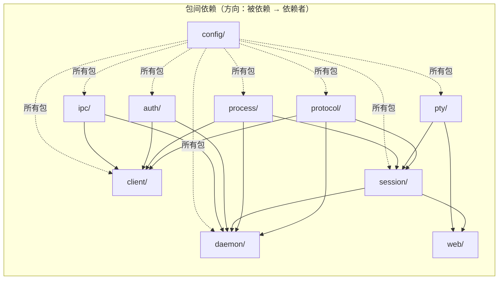

# pty-agent 架构设计

> 本文档描述 `src/` 包的模块化架构设计，为代码维护与扩展提供指导。

---

## 1. 概述

PTY-Agent 是一个通过伪终端（PTY）与交互式 CLI 程序双向通信的命令行代理。守护进程以独立子进程运行，首次执行命令时自动启动。支持 basic/token/tls 三监听器模型（明文共享密码认证、本机 Token + HMAC 认证、跨机 TLS + Ed25519 认证），并提供 Web 管理界面、Screenshare 屏幕流、VNC 远程桌面、workflow 脚本编排等扩展能力。伪终端统一由 wezterm-py 提供（Windows: OpenConsole 宿主；Unix: portable-pty openpty），进程树追踪位于 `process/` 包（Job Object / process group / 沙箱委派）。

**子命令**：`start | stop | status | list | exec | send | read | kill | events | closewin | mouse | attend | wait | plugin <list|ls|attach|detach|cmd> | file <read|write|edit|grep|glob|upload|download> | workflow <run|list|show|cancel> | set-default | keygen`

**会话模式**：`exec` 支持两种运行模式——**pty**（默认，伪终端+屏幕快照，TUI 交互）与 **subprocess**（`--subprocess`，Popen 捕获 stdout/stderr，增量输出 + stderr 分离）。子进程模式由 `pty/subprocess_pty.py` 后端实现，Session 按 `mode` 装配组件。

---

## 2. 架构设计原则

项目遵循以下设计原则：

1. **单一职责**：每个模块只做一件事
2. **高内聚低耦合**：相关功能内聚到同一模块，模块间通过明确定义的接口通信
3. **平台隔离**：Windows 特有代码完全隔离在 `process/windows/` 子包（Job Object / IOCP / GUI 枚举 / API 绑定）与 `sandbox/` 包（win-sandbox 委派）下，Unix 平台零加载
4. **配置集中**：所有常量统一在 `config/` 包管理（TOML 文件 + 加载器）
5. **可测试性**：每个模块可独立测试，方便 mock
6. **可扩展性**：新增 PTY 后端只需添加单个文件；新增 CLI 子命令流程清晰；新增插件只需实现 `Plugin` 子类并声明
7. **清洁架构（洋葱模型）**：Web 层采用四层结构（domain → application → infrastructure → presentation），依赖只能从外层指向内层

---

## 3. 模块架构

### 3.1 目录结构总览

完整文件树见 [filestree/src.md](filestree/src.md)（以磁盘为准）；各层职责与模块说明详见 3.3。

### 3.2 分层架构图

```mermaid
graph TB
    subgraph CLI["CLI 入口层"]
        MAIN["__main__.py<br/>转调 cli/main"]
        CLICMD["cli/<br/>CommandRegistry<br/>注册/构建解析器/派发"]
    end

    subgraph CLIENT["前端客户端层"]
        CLIFE["client/lifecycle.py<br/>客户端日志配置"]
        TRANS["client/transport.py<br/>TCP/TLS 连接管理"]
        PRES["client/presenter.py<br/>人类可读渲染 + result.py"]
        CFGM["client/config_manager.py<br/>配置管理"]
        INP["client/input.py<br/>输入文本处理"]
        CLIP["client/cli_plugins.py<br/>CLI 插件宿主（kind=cli）"]
        REND["client/renderer/<br/>快照渲染（GDI/SVG/Pillow/文本）"]
        DCTL["client/daemonctl<br/>守护进程启停/探测/TLS 连接"]
        TLC["client/tls_client.py<br/>TLS 客户端连接器（TOFU）"]
        SHL["common/shells.py<br/>Shell 探测"]
        PIDX["common/process.py<br/>pid_exists"]
    end

    subgraph PROTO["通信协议层"]
        MSG["protocol/message.py<br/>JSON 换行分隔编解码 + ping"]
        SIGN["protocol/signing.py<br/>MessageSigner 签名抽象"]
        ANSI["protocol/ansi.py<br/>ANSI 转义过滤"]
        RESP["protocol/response.py<br/>统一响应构造器"]
    end

    subgraph DAEMON["守护进程层"]
        DLIFE["daemon/lifecycle.py<br/>入口 + 日志/控制台处理"]
        SRV["daemon/server.py<br/>多 Listener 编排 + 认证上下文"]
        HDL["daemon/handlers/<br/>命令派发与处理"]
    end

    subgraph SESS["会话管理层"]
        SMGR["session/manager.py<br/>SessionManager"]
        SES["session/session.py<br/>Session 协调器"]
        SIO["session/io.py<br/>InputMixin"]
        SOUT["session/output.py<br/>OutputMixin"]
        STRG["session/trigger.py<br/>TriggerMixin"]
        SEVT["session/events.py<br/>EventsMixin"]
        STHR["session/threads.py<br/>Threads 读者/监控线程"]
        PUB["session/publisher.py<br/>SessionPublisher"]
        OBUF["session/buffer.py<br/>OutputBuffer"]
        TRIG["session/trigger_matcher.py<br/>TriggerMatcher"]
        EHIST["session/events_history.py<br/>EventHistoryManager"]
        EDET["session/detector.py<br/>EncodingDetector"]
        ENC["session/codec.py<br/>编码探测与解码"]
        SHM["ipc/shm.py<br/>共享内存工具"]
        SLOCK["ipc/single_instance.py<br/>单实例锁"]
        IINT["input/interceptor.py<br/>InputInterceptor"]
        IMOUSE["input/mouse.py<br/>鼠标动作编码"]
        WINPUT["input/wezterm_input.py<br/>WeztermInputEncoder"]
        TSCREEN["terminal/screen.py<br/>TerminalScreen"]
        PLUG["plugins/host.py<br/>PluginHost（会话级插件链）"]
    end

    subgraph PTY["伪终端后端层"]
        PFAC["pty/pty_factory.py<br/>工厂函数 create_pty"]
        PBASE["pty/base.py<br/>PseudoTerminal 基类"]
        WPTY["pty/wezterm_pty.py<br/>跨平台 wezterm-py 后端（OpenConsole/openpty）"]
        SUBP["pty/subprocess_pty.py<br/>子进程后端（Popen 双管道 stdout/stderr）"]
    end

    subgraph PROC["进程管理层"]
        PBASE2["process/base.py<br/>ProcessTreeTracker 端口"]
        PMON["process/monitor.py<br/>ProcessMonitor"]
        GDET["process/gui.py<br/>GuiDetector"]
        PINFO["process/info.py<br/>进程查询 & 错误格式化"]
        JOBT["process/windows/job_tracker.py<br/>Job Object + IOCP"]
        PGID["process/unix/pgid_tracker.py<br/>process group"]
    end

    subgraph AUTH["认证层"]
        AUTHB["auth/<br/>token + pubkey + tls"]
    end

    subgraph WEB["Web 层（洋葱架构）"]
        WEBD["web/domain/<br/>领域实体"]
        WEBA["web/application/<br/>用例 + 端口"]
        WEBI["web/infrastructure/<br/>基础设施适配器"]
        WEBP["web/presentation/<br/>FastAPI + 控制器"]
    end

    subgraph WF["workflow 编排层"]
        WFMG["workflow/manager.py<br/>WorkflowManager（运行注册表）"]
        WFEN["workflow/engine.py<br/>DAG 调度引擎（线程池并行）"]
        WFRN["workflow/runner.py<br/>WorkflowRun（运行状态）"]
        WFDEF["workflow/definition.py<br/>YAML 定义解析校验"]
        WFEX["workflow/expr.py<br/>安全表达式求值（AST 白名单）"]
    end

    subgraph EXEC["执行原语层"]
        EXECF["execution/execution.py<br/>快照/子进程执行流程（含 cancel）"]
        EXECC["execution/conditions.py<br/>返回条件声明"]
        EXECR["execution/response.py<br/>响应装配"]
    end

    MAIN --> CLIENT
    CLIENT -->|TCP/TLS/JSON| DAEMON
    CLIENT --> PROTO
    CLIENT --> AUTH
    DAEMON --> PROTO
    DAEMON --> SESS
    DAEMON --> AUTH
    DAEMON --> WEB
    DAEMON -->|handlers| EXEC
    DAEMON --> WF
    WF --> EXEC
    WF --> SESS
    EXEC --> SESS
    SESS -->|create_pty| PTY
    SESS -->|create_process_tree_tracker| PROC
    SES --> ENC
    WEB --> SESS
    WEB --> PTY
```



### 3.3 各层详细说明

#### 3.3.1 `protocol/` — 通信协议层

**定位**：被 `client/` 和 `daemon/` 双方共同依赖的基础层，零业务逻辑。

| 模块 | 类/函数 | 职责 |
|------|---------|------|
| `message.py` | `Message.encode(obj)` → `bytes` | 将 dict 编码为 JSON 行 + `\n` + UTF-8 |
| `message.py` | `Message.decode(data)` → `dict` | 从 bytes 解码为 dict |
| `message.py` | `Message.send(sock, obj, skip_sign=False)` | 发送一条消息到 socket（按线程局部出站签名器签名） |
| `message.py` | `Message.recv(sock)` → `dict\|None` | 从 socket 接收一条消息（带缓冲的行读取，按线程局部入站验证器验签） |
| `message.py` | `Message.ping(host, port, timeout)` → `bool` | 探测对端是否响应 ping（单实例检查/健康探测，skip_sign） |
| `message.py` | `Message.set_outbound_signer()` / `set_inbound_verifier()` / 对应 getter | 线程局部签名器/验证器设置（`threading.local`），双端口架构下各连接线程独立装配 |
| `message.py` | `Message._recv_buffers` | 连接级别的接收缓冲区（`weakref.WeakKeyDictionary`，按 socket 弱引用键索引，供二进制帧续读） |
| `signing.py` | `MessageSigner`（ABC） | 消息签名器抽象接口：`sign(obj)` / `verify_and_strip(msg)` / `signature_fields`（协议域定义，auth 包实现） |
| `ansi.py` | `strip_ansi(text)` → `str` | 去除 ANSI 颜色/样式码，保留清屏/光标等控制序列 |
| `ansi.py` | `_ANSI_RE` | 匹配 CSI SGR + OSC 的正则（光标/清屏不匹配） |
| `response.py` | `Response` 类 | 统一响应构造器（CLI/TCP/WS 共用）：`error` / `warning` / `info` / `pong` / `config`、TCP `command_result` / `debug_information` / 各 `*_result`、WS `ws_*` 系列 |

**设计要点**：
- `Message` 维持静态类设计（无状态），所有方法为 `@staticmethod`
- 签名按方向分离为两个独立角色，存储在线程局部变量（`threading.local`）：`outbound_signer`（send 签名）、`inbound_verifier`（recv 验签）。双端口架构（basic/TLS Listener 在不同线程）下各自独立装配，互不干扰；Ed25519 非对称单向（daemon 仅验、client 仅签）、HMAC 对称双向均由此实现
- `_recv_buffers` 字典保持类级别（弱引用键），不污染 socket 对象；`protocol/transfer.py` 二进制帧续读与其共享残留缓冲
- `strip_ansi` 与任何业务逻辑无关，独立可测；仅过滤 SGR 颜色/样式码 + OSC 窗口标题，保留清屏/光标定位等语义控制序列
- 控制序列（`\x1b[2J` 清屏、`\x1b[H` 归位、`\x1b[K` 清行等）不受 `keep_ansi` 影响，始终保留在输出中

#### 3.3.2 `client/` + `client/daemonctl` — 前端客户端层与 daemon 控制

**定位**：封装与守护进程的通信（明文 / TLS / 本机 token），向 CLI 入口提供简洁接口。支持按 CONNECT_MODE 三路分流：本机 token（SHM 发现 + Token/HMAC）、明文（共享密码认证，空密码=无认证）、跨机 TLS（Ed25519 认证）。
守护进程的启动/停止/探测属 client 侧控制能力，独立为 `client/daemonctl` 包（与 daemon 核心解耦，仅依赖共享层）。

| 模块 | 类/函数 | 职责 |
|------|---------|------|
| `client/daemonctl` | `start_daemon()` / `stop_daemon(force)` / `is_running()` | 守护进程控制：子进程启动（Win: DETACHED_PROCESS，Unix: 双 fork + exec，监听位置全走配置文件）、停止（按 CONNECT_MODE 路由：tls→TLS / basic→明文 / token→SHM+明文）、ping-pong 存活探测 |
| `client/daemonctl` | `_find_daemon_port()` / `_find_daemon_pid()` | 查找运行中的守护进程端口/PID（token 模式经单实例锁 + ping 验证返回配置端口；basic/tls 模式返回配置目标） |
| `client/daemonctl` | `_try_stop_via_tls()` | TLS 停止远程守护进程（CONNECT_MODE=tls：KnownHosts + TOFU + Ed25519 签名） |
| `client/tls_client.py` | `TLSClient` 类 | TLS 客户端连接器：建立 TLS 连接 + TOFU 证书验证（CERT_NONE + 自定义指纹比对，类似 SSH known_hosts） |
| `client/tls_client.py` | `TLSClient.connect()` → `ssl.SSLSocket` | TCP 连接 + TLS 握手 + 获取服务端 DER 证书 → 计算 SHA-256 指纹 → TOFU 验证（首次自动信任，后续比对，不匹配按 `TOFU_STRICT` 拒绝或警告） |
| `client/lifecycle.py` | `setup_client_logging()` | 客户端日志配置（由 `cli/main.py` 调用） |
| `client/transport.py` | `Client` 类 | 向 CLI 暴露 `cmd_start()` / `cmd_stop()` / `cmd_status()` / `cmd_list()` / `cmd_exec()` / `cmd_send()` / `cmd_read()` / `cmd_kill()` / `cmd_events()` / `cmd_closewin()` / `cmd_mouse()` / `cmd_wait()` / `cmd_plugin()` / `cmd_file_read()` / `cmd_file_write()` / `cmd_file_edit()` / `cmd_file_grep()` / `cmd_file_glob()` / `cmd_file_upload()` / `cmd_file_download()` |
| `transport.py` | `Client.connect_addr()` | 按 CONNECT_MODE 返回连接目标地址 (host, port) |
| `transport.py` | `Client._apply_config_defaults()` / `_get_client_defaults()` / `_merge_session_defaults()` / `_maybe_save_encoding()` | 配置默认值应用 / 客户端默认字段收集（`client_defaults`）/ 会话默认值回填 / 编码记忆 |
| `transport.py` | `Client._connect()` | 按 CONNECT_MODE 三路分流：tls→`_connect_tls`；basic→`_connect_basic`（密码认证，空密码=无认证）；token→`_connect_token`（SHM 发现，daemon 未运行则自动启动） |
| `transport.py` | `Client._connect_token()` | 本机 token 连接：SHM 发现 + 读取令牌/HMAC 密钥 + 明文 TCP 连接 TOKEN_HOST:TOKEN_PORT |
| `transport.py` | `Client._connect_basic()` | 明文连接（BASIC_PASSWORD 非空时密码 + HMAC 双向，空=无认证）：直接连接 BASIC_HOST:BASIC_PORT（不自动启动） |
| `transport.py` | `Client._connect_tls()` | TLS 连接（CONNECT_MODE=tls）：加载私钥 → 构建 KnownHosts → TLSClient 建立 TLS + TOFU 验证 |
| `transport.py` | `Client._send_recv(msg)` | 发送请求 + 接收响应（完整的一次往返，自动注入认证凭证 + 消息签名） |
| `transport.py` | `Client._handle_output()` | `--output` 文件输出：解压 screenBufferZ → 调用 renderer 写入文件 |
| `transport.py` | `Client._route_plugins()` | `exec --plugin` 按 kind 分流：CLI 形态客户端 activate + 写入 cliPlugins 记录到会话，会话/进程形态透传 daemon 挂载 |
| `transport.py` | `Client._activate_session_cli()` | `read/send/mouse` 自动挂载会话上记录的 CLI 插件钩子（无需 --plugin） |
| `transport.py` | `_decompress_screen_buffer()` | 解压 gzip+base64 编码的 screenBufferZ 为 screenBuffer |
| `transport.py` | `_has_shell_operators(cmd)` | 检测 shell 操作符 token（`\|`, `||`, `&`, `&&`, `;`, `>`, `<`, `>>`） |
| `transport.py` | `_parse_iso_time(s)` | 解析 ISO 8601 时间字符串为 Unix 时间戳 |
| `transport.py` | `_probe_port()` | 端口探测：token 模式经 SHM 发现（`_find_daemon_port`），basic/tls 模式返回配置目标端口 |
| `transport.py` | `_load_signer_and_providers()` | 认证装配：按 CONNECT_MODE 三路装配（token→HMAC 双向签名 + TokenCredentialProvider，tls→Ed25519 单向签名 + PubkeyCredentialProvider，basic→密码非空时 HMAC 双向 + PasswordCredentialProvider，空则无装配） |
| `result.py` | `from_response(resp)` / `Result` 类型 | 把 daemon 响应规范化为类型化结果模型（Error/Message/Session/List/Status/Events/...），含稳定错误码分类 |
| `presenter.py` | `present(result)` / `emit` / `emit_error` | 人类可读渲染：内容→stdout、元信息→stderr、错误+退出码；`--debug-output` 控制详略；插件 `render_response` 钩子 |
| `input.py` | `safe_print(text, **kwargs)` | 安全打印（自适应控制台编码，GBK 终端强制 UTF-8 输出） |
| `renderer/__init__.py` | `render_to_file(path, response, svg_compression_level)` | 根据文件后缀选择渲染器（GDI/SVG/Pillow/纯文本），写入文件 |
| `renderer/svg.py` | `render_svg_string(buf, compression_level)` | 渲染 SVG 为字符串（供 `--response-format svg` 使用，支持压缩等级） |
| `renderer/common.py` | `_expand_lines(buf)` | 将稀疏/全量 `lines` 统一展开为全量二维数组 |
| `renderer/image.py` | `render_gdi()` / `render_pillow()` | 像素渲染后端（Windows GDI 原生 / Pillow 跨平台回退） |
| `renderer/box_drawing.py` | - | Box Drawing 字符的 GDI 几何绘制原语（U+2500-U+259F） |
| `config_manager.py` | `ConfigManager` 类 | 客户端配置管理器，支持 `--default` 临时覆盖默认值；`set-default` 全局默认存守护进程内存（不写文件） |
| `config_manager.py` | `ConfigManager.get()` / `set()` / `show()` | 读取/设置/展示配置 |
| `config_manager.py` | `parse_terminal_size(size_str)` | 解析终端尺寸字符串（如 "80x24"） |
| `input.py` | `process_input(text, json_escaping, send_eol, enter_eol)` → tuple | 完整 JSON 反转移 + 控制字符展开 + 自动追加行尾符；**转义展开由守护进程统一调用**，`{enter}` 与默认行尾按会话模式决定（pty=`\r`、subprocess=`\n`） |
| `input.py` | `unescape_json_string(text)` → `str` | 仅解码 `\"` 和 `\\`（用于 exec 命令，避免误转义 Windows 路径） |
| `input.py` | `expand_control_characters(text)` / `expand_control_characters_full(text, enter_eol)` | 展开 `\n`/`\r`/`\t`、`{ctrl+a}`、`{enter}` 等控制字符转义（`{enter}` 展开值由 enter_eol 决定） |
| `input.py` | `safe_print(text, **kwargs)` | 安全打印（自适应控制台编码，GBK 终端强制 UTF-8 输出） |
| `cli_plugins.py` | `CliPluginHost` | CLI 插件宿主：加载 kind=cli 插件，执行 before_request/transform_response/render_response 三阶段钩子链；经 exec `--plugin` 或会话挂载列表 activate 后自动派发钩子 |

**设计要点**：
- `Client._connect()` 按 CONNECT_MODE 三路分流：tls 走 `_connect_tls`（TLS + TOFU + Ed25519），basic 走 `_connect_basic`（密码认证，空密码=无认证），token 走 `_connect_token`（SHM 发现 + Token/HMAC）
- token 模式 `_connect_token()` 在 daemon 未运行（单实例锁未占用）时自动 `start_daemon()`，无需用户手动 start；basic/tls 模式不自动启动（目标位置固定，守护进程需手动管理）
- **CLI 呈现层（presenter 人类可读）**：`transport.cmd_*` 经 `result.from_response` 规范化为类型化 Result，`presenter.present` 渲染——程序输出/表格主体/配置 → `stdout`，状态/原因/hint/调试 → `stderr`；错误走 `stderr` 并置退出码。原 `formatter.py` 已移除（无 JSON dump）。
- `_SHOW_DEBUG` 全局标志控制是否输出 `debugInformation`：默认关闭，`--debug-output` 或 `--default debug on` 开启后 presenter 在 stderr 元信息中展示 `debugInformation`
- `ConfigManager` 管理调用级默认配置（timeout/newline/encoding/keep_ansi/send_eol/response_format/svg_compression_level/terminal_size/debug），`--default` 设置的值通过 `client_defaults` 字段发送给守护进程按 session UID 存储，会话结束后自动清理。`cmd_*()` 方法在构建请求时应用配置默认值
- `--default` 支持多个键值对（`action="append"`），设置值发送给守护进程按 session 存储，后续调用自动从 `sessionDefaults` 合并
- 每个 `cmd_*` 方法仅负责构建请求 dict + 调用 `_send_recv` + 调用 `print_response`
- **CLI 插件**（`cli_plugins.py` + `config/plugins/`）：插件用 `kind` 声明自己支持哪侧钩子（`cli`=客户端进程 / `session`=会话级 / `process`=进程级 daemon 常驻）。`--plugin <name>` 仅在 `exec` 出现：一次性把插件挂载到会话，客户端按 kind 分流——CLI 形态 `CliPluginHost.activate` + 经 `cliPlugins` 记录到会话（后续 read/send/mouse 客户端自动挂钩回调），会话/进程形态透传 daemon 在会话创建时挂载。AI 二次分析即由 `config/plugins/ai`（kind=cli，自包含 aichat 资产：common.py/config_manager.py/talk.py/bin/aichat.exe/config.yaml）提供：`transform_response` 调本插件 common.py 对 outputStream 做二次分析并覆盖，失败回退原响应追加 warning 字段

#### 3.3.3 `daemon/` — 守护进程层

**定位**：多监听器 TCP/TLS 服务器，接收客户端请求，委派会话管理/PTY 层处理，返回响应。三监听器模型支持明文（共享密码认证，空密码=无认证）、token（Token + HMAC 认证，本机）、TLS（Ed25519 认证，跨机）三个 Listener，每个监听器可独立启停。

> 守护进程的启动/停止/探测（start_daemon / stop_daemon / is_running）属客户端控制能力，
> 位于 `client/daemonctl` 包；本层仅含入口与进程上下文。

| 模块 | 类/函数 | 职责 |
|------|---------|------|
| `lifecycle.py` | `main()` | 守护进程入口：加载配置 + DaemonServer.run()（监听位置全走配置文件，不支持参数覆盖） |
| `lifecycle.py` | `_setup_logging()` | 委托 `src.logging.setup_daemon_logging()`：异步队列 + 按模块分组独立日志文件 + gzip 归档线程 |
| `lifecycle.py` | `_hide_console_window()` / `_ignore_console_ctrl()` | Windows 控制台处理（脱离窗口 / 忽略 Ctrl+C） |
| `server.py` | `DaemonServer` 类 | 多 Listener 编排（basic/token/tls 三监听器）、认证上下文构建、令牌轮换、`run()` / `stop()` / `_cleanup()`。Web 服务器经 `src/optional` 网关惰性获取（`get_web_server_cls`）：`ENABLE_WEB=False` 或 `src/web` 不可导入时跳过 |
| `server.py` | `DaemonServer._build_BASIC_auth_context()` | 构建 basic 认证上下文：BASIC_PASSWORD 非空时密码 + HMAC 双向（密码即密钥），空时无认证 |
| `server.py` | `DaemonServer._build_token_auth_context()` | 构建 Token 认证上下文（token Listener 使用）：HMAC 对称签名（生成密钥），daemon 双向签/验 |
| `server.py` | `DaemonServer._build_pubkey_auth_context()` | 构建公私钥认证上下文（TLS Listener 使用）：Ed25519 非对称单向，daemon 仅验请求（fail-closed） |
| `server.py` | `DaemonServer._create_plugin_registry()` | 进程级插件注册表创建（目录发现 + registry.json 状态/策略，失败隔离，关闭时返回 None） |
| `server.py` | `DaemonServer._schedule_rotate()` / `_rotate_token()` | 令牌定时轮换（30 分钟周期 + 2 分钟宽限，仅 token 认证模式） |
| `listener.py` | `Listener` 类 | 单端口 accept 循环封装：bind() / start() / stop()，封装明文/TLS 传输类型 + AuthContext |
| `listener.py` | `Listener._accept_loop()` | accept 循环：每连接创建处理线程，TLS 模式在 accept 后自动 wrap_socket |
| `handlers/base.py` | `DaemonHandler` 基类 | 命令处理器抽象基类（上下文 `HandlerContext` 见 `execution/context.py`） |
| `handlers/dispatcher.py` | `DaemonDispatcher` | 消息派发：按 `msg["type"]` 路由到对应 handler 的 `handle()` 方法 |
| `handlers/exec_handler.py` | `ExecHandler` | exec 命令处理（校验 + 创建/附加会话，流程委托 `execution/execution.py`） |
| `handlers/send_handler.py` | `SendHandler` | send 命令处理 |
| `handlers/read_handler.py` | `ReadHandler` | read 命令处理 |
| `handlers/list_handler.py` | `ListHandler` | list 命令处理 |
| `handlers/kill_handler.py` | `KillHandler` | kill 命令处理 |
| `handlers/events_handler.py` | `EventsHandler` | events 命令处理 |
| `handlers/stop_handler.py` | `StopHandler` | stop 命令处理 |
| `handlers/closewin_handler.py` | `CloseWinHandler` | closewin 命令处理 |
| `handlers/mouse_handler.py` | `MouseHandler` | mouse 命令处理 |
| `handlers/status_handler.py` | `StatusHandler` | status 命令处理 |
| `handlers/wait_handler.py` | `WaitHandler` | wait 命令处理（恒等待指定秒数） |
| `handlers/plugin_handler.py` | `PluginHandler` | plugin 命令处理（list/ls/attach/detach/cmd：插件列表、会话挂载插件、动态挂载/卸载、插件自定义命令） |
| `handlers/workflow_handler.py` | `WorkflowHandler` | workflow 命令处理（run/list/show/cancel；定义解析校验 + WorkflowManager 委托） |
| `execution/execution.py` | 执行原语 | `_run_snapshot_flow` / `_run_subprocess_trigger_flow` / `_run_subprocess_no_trigger_flow` / `_attach_subprocess_stderr` / `assemble_response` — exec/send/read 核心执行流程（支持 `send_response=False` 返回与 `cancel_event` 中断），由 exec/send/read handler 与 workflow 引擎共用，避免行为分叉 |
| `execution/conditions.py` | 返回条件声明 | `ReturnConditions` / `RequestContext`：从请求消息一次解释全部返回条件（exec/send/read 与 workflow 共用） |
| `execution/filtering.py` | 输出过滤 | `filter_snapshot_lines` / `apply_lines_grep` / `strip_if_needed`：行/列/grep 过滤与 ANSI 剥离 |
| `execution/output_policy.py` | 取源策略 | `resolve_output` / `validate_offset_policy`：按返回条件选源（snapshot/full/diff）与 offset 互斥校验 |
| `execution/response.py` | 响应装配 | `build_result` / `compress_screen_buffer` / `attach_screen_buffer` / `map_reason` / `describe_output_format` / Git-Bash 路径提示 |
| `execution/utils.py` | 请求工具 | `validate_request` / `apply_client_defaults` / `prepare_input` / `check_ended_session` 等（含 Git-Bash 路径提示） |

**设计要点**：
- `daemon/lifecycle.py` 仅承担守护进程入口与进程上下文（日志/控制台/单实例获取）；启动/停止/探测属客户端控制能力，位于 `client/daemonctl` 包；`daemon/__main__.py` 转调 `lifecycle.main()`
- 日志系统位于 `src/logging/` 子包（`get_logger` / `bind` / `setup_daemon_logging` / `setup_client_logging` / `shutdown`），daemon 侧与 client 侧复用：异步队列（`QueueHandler` + 后台单线程 `pty-log-writer`）+ 按模块分组写带毫秒时间戳的独立日志文件 + 前一日日志 gzip 归档 + ContextVar 上下文绑定（session_id/connection_id/request_id 自动注入）
- 单实例互斥锁（`SingleInstanceLock`）位于 `ipc/single_instance.py`（守护进程与客户端共用）
- `DaemonServer` 按 daemon.toml `[listener]` 段编排多个 `Listener`（三监听器）：basic（明文，共享密码认证，空密码=无认证）、token（Token + HMAC 认证，本机 SHM 发现）、tls（TLS + Ed25519 认证，跨机）。三个监听器的启用/地址/端口由 `BASIC_*`/`TOKEN_*`/`TLS_*` 独立配置，可同开或只开一个
- `Listener` 封装单端口 accept 循环，传输类型（`"basic"` / `"tls"`）和 `AuthContext` 在构造时绑定，TLS 模式在 accept 后自动 `wrap_socket`
- `handlers/` 子包采用每命令一文件的派发器模式：`DaemonDispatcher` 按 `msg["type"]` 路由到对应 `DaemonHandler` 子类（含内置 `plugin` 类型），并把进程级插件声明的 `message_types` 注册到派发表（与内置 handler 冲突时内置优先）；新增命令只需添加 handler 文件 + 注册到派发器
- `RequestHandler` 不直接操作 socket 读写（通过 `Message` 完成），便于测试
- `start_daemon()` 自动计算项目根目录作为子进程 `cwd`（`__file__` 向上 3 层），确保 `python -m src.daemon` 无论从何目录调用都能找到 `src` 包
- 子进程 `stderr` 重定向到 `daemon.log`（而非 `DEVNULL`），启动崩溃时可在日志中看到完整 Traceback
- `stop_daemon()` 按 CONNECT_MODE 路由：tls→经 TLS 连接远程 daemon 停止；basic→直接明文连接停止（BASIC_PASSWORD 非空时带密码 + HMAC 签名）；token→经 SHM 定位 + 明文 TCP stop。TLS stop 失败（如 TOFU 指纹不匹配）且 `force=True` 时回退到本地强制终止（通过互斥锁定位 PID），basic 模式同此回退

#### 3.3.4 `pty/` — 伪终端后端层

**定位**：封装跨平台 PTY 实现，向 `session/` 层提供统一的 `PseudoTerminal` 接口。进程树追踪不在此包（`process/` 包持有 `ProcessTreeTracker` 端口）。

| 模块 | 类/函数 | 职责 |
|------|---------|------|
| `pty_factory.py` | `create_pty(command, cols, rows, cwd, env, encoding, tracker)` → `PseudoTerminal` | 工厂函数，所有平台统一优先 wezterm-py（Windows: OpenConsole 宿主；Unix: portable-pty openpty）；Windows 沙箱启用且带沙箱 tracker 时走沙箱后端 |
| `base.py` | `PseudoTerminal` | 抽象基类：`read()` / `write()` / `close()` / `fileno()` / `get_child_pid()` / `get_exit_code()` / `get_type()` / `drain()` / `resize()` / `inject_mouse_event()`。进程树管理由 `process/` 包（ProcessTreeTracker）提供，PTY 基类不持有 |
| `wezterm_pty.py` | `WeztermPseudoTerminal` | 跨平台统一 wezterm-py 后端：Windows 侧载 conpty.dll + OpenConsole.exe 规避系统 conhost 的 VT 输入缺陷，Unix 用 portable-pty 的 openpty；spawn 后同一代码路径内 `register_root(pid, handle)` 登记根进程到 tracker |
| `subprocess_pty.py` | `SubprocessPseudoTerminal` | 子进程模式后端（`exec --subprocess`）：用 `subprocess.Popen` 直接捕获 stdout/stderr（无 PTY）。双后台线程分别阻塞读两管道 → 队列，`read()`/`read_stderr()` 非阻塞取流；`write()` 写 stdin；`resize()` 报错；`send_signal()` 发信号。进程树仍经 tracker `register_root` |

> 注：进程树追踪端口（`process/base.py:ProcessTreeTracker` + 统一通知实体 `ProcessNotification`）、Windows Job 追踪（`process/windows/job_tracker.py`）、GUI 窗口检测（`process/windows/gui_monitor.py`）、Windows API 绑定（`process/windows/api.py`）、Unix 进程组追踪（`process/unix/pgid_tracker.py`）、Windows 错误码格式化（`process/windows/win32_error.py`）均位于 `process/` 包，经 `process.create_process_tree_tracker()` 工厂获取；
> Shell 探测（`detect_available_shells` / `format_shell_info`）与命令包装（`wrap_command`，exec `--shell` / `set-default shell` 用）位于跨侧共享层 `common/shells.py`（daemon 启动日志、web shell provider、daemonctl 输出、exec_handler 命令包装共用）。

**设计要点**：
- `base.py` 定义了最小接口契约，所有具体 PTY 后端必须实现全部方法
- `drain()` 方法：`read()` 后立即调用，将 OS 管道缓冲区中所有当前就绪数据一次性取回。解决程序输出被多次 `read` 打散的问题，确保触发检测在完整数据块上进行。wezterm-py 后端：内部 reader 线程 + 缓冲队列，`drain` 以 timeout=0 非阻塞读取当前缓冲
- 跨平台统一 wezterm-py 后端（`wezterm_pty.py`），Windows 与 Unix 共用同一后端实现；`process/windows/` 仅在 `IS_WINDOWS` 为 True 时被导入，Unix 平台零开销
- `create_pty` 工厂（Windows 优先级）：wezterm-py（唯一原生后端）> 沙箱（`[sandbox] enabled=true` 且传入 `SandboxProcessTreeTracker` 时）；Unix 统一 wezterm-py（portable-pty openpty）
  - 命令归一化：工厂入口统一处理 `command`（`str` 时按 shell 语义 `shlex.split` 拆分，后端统一消费 `List[str]`），避免逐字符展开
  - 沙箱是安全边界：`[sandbox] enabled=true` 时**带沙箱 tracker 的会话强制走沙箱**（创建失败不回退原生）；未带 tracker（None）的裸后端调用视为非沙箱会话，回退原生后端
- 进程树追踪与崩溃检测全部经 `ProcessTreeTracker` 端口（`process/` 包）：Windows Job Object + IOCP 推送（`JobProcessTreeTracker`），Unix process group + waitpid 轮询（`PgidProcessTreeTracker`），沙箱委派（`SandboxProcessTreeTracker`）
- 新增 PTY 后端只需：创建新文件 → 继承 `PseudoTerminal` → 在 `create_pty` 的优先级链中添加

#### 3.3.5 `session/` — 会话管理层

**定位**：管理 PTY 会话的生命周期，通过**组合模式**将职责委派给独立子组件。

| 模块 | 类/函数 | 职责 |
|------|---------|------|
| `manager.py` | `SessionManager` | `create_session(id, command, encoding, cwd, env, cols, rows, plugins, mode)` / `get_session()` / `list_sessions()` / `remove_session()` / `stop_all()`；构造注入 `history_store`（历史归档）与 `plugin_registry`（插件系统），含 `set_on_session_created/removed` 回调与 `match_auto_load()` |
| `session/session.py` | `Session` 基类（协调器） | 属性：`id`, `uid`, `command`, `running`, `mode`(pty/subprocess), `exit_code`, `error_message`, `encoding`, `pty_type`, `output_offset`, `gui_windows`, `processes`, `cwd`, `start_time`, `tracker`, `plugin_host`；`__init__` 装配全部子组件（按 mode 分支：subprocess 用双缓冲 `_out_buf`/`_err_buf`、无 `_screen`/`_input_encoder`）；`start()`/`stop()` 生命周期 |
| `session/session.py` | `Session.start()` / `stop()` | 创建 PTY（含 tracker 登记）+ 启动读者/监控线程 + 组件重置 / 优雅关闭（kill_tree → pty.close → tracker.close） |
| `session/session.py` | `Session.close_window()` / `get_pty_process_list()` / `get_pty_child_pid()` | 关闭 GUI 窗口（经 tracker.close_gui_window）/ 查询 PTY 进程列表 / 子进程 PID |
| `session/io.py` | `InputMixin`：`write_input()` / `_dispatch_input()` / `key_input()` / `key_up()` / `mouse_input()` / `send_signal()` / `perform_mouse_action()` | 输入写入（经 InputInterceptor 拦截 + 插件 on_input 链）/ 模式感知键盘/鼠标事件编码（WeztermInputEncoder）后写 PTY / 信号（Windows 走 `_win_console.send_ctrl_c`）/ 鼠标动作执行 |
| `session/output.py` | `OutputMixin`：`get_output()` / `get_output_with_offset()` / `detect_encoding()` / `get_snapshot()` / `get_full_snapshot()` / `get_snapshot_diff()` / `get_snapshot_diagnostics()` / `export_screen_buffer()` / `capture_scrollback()` / `clear_scrollback()` / `resize()` / `cursor_position()` / `is_alt_screen()` / `mode_restore_seq()` / `is_mouse_tracking()` | 增量输出与编码探测（委托 EncodingDetector）/ 屏幕快照（经插件 on_snapshot 变换链）/ 全量快照（`get_full_snapshot()` 拼接 scrollback 历史 + 当前可见区，供 `--full`）/ resize（先 TerminalScreen 后 PTY，等待 ConPTY repaint，返回含光标快照）/ 终端状态查询 |
| `session/trigger.py` | `TriggerMixin`：`set_trigger()` / `wait_for_trigger()` / `clear_trigger()` / `wait_for_initial_output()` / `set_snapshot_trigger()` / `check_snapshot_trigger()` / `check_snapshot_idle_timeout()` / `notify_snapshot_changed()` | 触发条件管理（委托 TriggerMatcher，含插件 request_return 中断与快照级匹配） |
| `session/events.py` | `EventsMixin`：`_on_event()` / `_on_reader_exit()` / `_on_all_processes_exited()` / `_update_exit_info()` / `consume_events()` / `peek_events()` / `get_all_events()` / `check_event_existence()` / `pending_event_count` | 事件统一入口（插件链 + EventHistoryManager）/ 读者退出回调 / 退出码捕获 / 事件消费与查询 |
| `session/_win_console.py` | `send_ctrl_c()` / `console_lock` | Windows Ctrl+C 发送（AttachConsole + GenerateConsoleCtrlEvent，失败回退写 `\x03`）+ 守护进程控制台处理器（模块导入时安装） |
| `session/threads.py` | `Threads` | 后台读者线程 + 监控线程管理（启动/停止/循环逻辑） |
| `session/threads.py` | `Components` | 子组件引用容器数据类（pty_provider / out_buf / trig_mat / proc_mon / tracker / gui_detector / screen / session_id / on_exit / session_ref / plugin_host） |
| `session/threads.py` | `_capture_exit_code_retry()` | 带重试的退出码获取（retries=10） |
| `session/threads.py` | `_extract_crash_error_from_output()` / `_clean_error_candidate()` | 从输出提取崩溃错误信息 / 清理错误候选文本 |
| `input/wezterm_input.py` | `WeztermInputEncoder` | wezterm-py Terminal 模式感知输入编码器：`key_down` / `key_up` / `mouse`（与终端模型共享同一 Terminal 实例，模式状态一致） |
| `publisher.py` | `SessionPublisher` | 订阅者与结束回调管理，向 Web 层发布会话输出/结束/事件（`notify_subscribers(data, stream)` / `notify_end(session)`） |

**设计要点**：
- `Session` 按职责拆分为多个混入类（`session/` 包内的 `io`/`output`/`trigger`/`events`），`Session` 基类仅保留子组件装配（`__init__`）、生命周期（`start`/`stop`）与状态代理/子组件公开访问；Windows 控制台信号逻辑独立到 `session/_win_console.py`
- `Session` 不直接创建 PTY 实例，而是通过 `create_pty()` 工厂获得；进程树 tracker 经 `process.create_process_tree_tracker()` 工厂创建（Session 生命周期 owner）
- Session 通过 `@property` 公开子组件：`session.output_buffer` / `session.trigger_matcher` / `session.event_history` / `session.process_monitor` / `session.tracker` / `session.publisher` / `session.plugin_host`
- `Session._reader_loop()` 和 `_monitor_loop()` 位于 `session/threads.py` 的 `Threads` 类中，Session 通过组合持有 `Threads` 实例，避免自身过于臃肿
- `Components` 数据类将后台线程所需的所有子组件引用打包传递，避免循环依赖
- 读者线程数据流：`pty.read + drain → 插件 on_output 变换链 → OutputBuffer 追加 + TriggerMatcher 检测 → TerminalScreen.feed → 终端查询应答回写（drain_terminal_response）→ SessionPublisher 推送`；监控线程高频（0.2s）排空 tracker 进程事件（崩溃/退出尽快反馈到 wait_for_trigger），低频（2s）执行 `check_events` 兜底 diff + `GuiDetector.check` + 插件 `poll_tick` + 自然退出检测（均自带节流）
- `session/codec.py` 将编码探测逻辑从 `Session` 类中抽离为纯函数，便于测试
- `EncodingDetector` 维护编码状态（`encoding` / `_encoding_locked`），`detect_decode()` 在 `get_output` 中调用可修改状态，`decode_only()` 在持锁路径 `TriggerMatcher.check` 中使用无副作用
- `GuiDetector` 封装 GUI 窗口检测逻辑（2s 节流轮询），从 Session 中独立出来
- `InputInterceptor` 封装 write_input 的编码转换与鼠标动作执行（perform_mouse_action）；键盘/鼠标事件编码由 `WeztermInputEncoder`（wezterm-py Terminal 模式感知）完成，从 Session 中独立出来
- 会话级插件经 `PluginHost` 挂载（`--plugin` 注入 / `plugin attach` / `auto_load` 自动匹配），on_input/on_output/on_snapshot 变换链贯穿输入输出与快照，`on_event`/`on_poll` 由宿主调度
- `SessionPublisher` 管理订阅者（Web WebSocket 连接）与结束回调，实现会话输出/状态向 Web 层的实时发布
- 触发检测基于 `threading.Event`，线程安全
- 输出缓冲区大小上限由 `config/` 包集中控制（`MAX_OUTPUT_BUFFER`，定义于 `daemon/daemon.toml`）
- `OutputBuffer` 内部使用 `RLock`（可重入锁），允许 `_reader_loop` 在持锁上下文中调用 `append()`
- `session/codec.py` 新增智能裁剪（`_utf8_trim_tail` / `_gbk_trim_tail` / `_smart_trim`），避免线性截断性能损耗

#### 3.3.6 `auth/` — 认证层

**定位**：可插拔的认证基础设施，被 `client/` 和 `daemon/` 双方共同依赖。采用清洁架构，将三种认证方式（token/HMAC、pubkey/Ed25519 和 password/共享密码）作为独立子包实现，共享抽象接口。消息签名抽象（`MessageSigner`）属协议域，定义在 `protocol/signing.py`，本包实现它。

| 模块 | 类/函数 | 职责 |
|------|---------|------|
| `base.py` | `Authenticator`（ABC） | 服务端认证器抽象接口：`authenticate(msg) → bool` 验证客户端身份 |
| `base.py` | `CredentialProvider`（ABC） | 客户端凭证提供者抽象接口：`enrich(msg) → dict` 向消息附加认证凭证 |
| `keys.py` | `PublicKey` / `PrivateKey` | Ed25519 密钥实体，OpenSSH 格式兼容，SHA-256 指纹（与 `ssh-keygen -lf` 一致） |
| `keys.py` | `generate_keypair()` / `load_authorized_keys()` / `_compute_fingerprint()` / `_check_private_key_permissions()` | 密钥对生成 / authorized_keys 文件加载（指纹→PublicKey 映射）/ 指纹计算 / 私钥权限检查 |
| `context.py` | `AuthContext` | 连接级认证上下文：绑定 `outbound_signer`（出站签名）、`inbound_verifier`（入站验证）、`authenticator`（身份认证） |
| `token/authenticator.py` | `TokenAuthenticator` | Token 认证器：校验请求 `auth.token`（SHM 令牌），支持轮换与宽限期 |
| `token/authenticator.py` | `TokenCredentialProvider` | Token 凭证提供者：从 SHM 读取令牌注入请求信封 `auth.token` |
| `token/signer.py` | `HmacMessageSigner` | HMAC-SHA256 消息签名器（实现 `protocol/signing.MessageSigner`）：对称密钥，双向签名（请求签+验，响应签+验） |
| `pubkey/authenticator.py` | `PubkeyAuthenticator` | 公钥认证器：校验请求 `auth.pubkey_fp` 是否在 authorized_keys 白名单（fail-closed） |
| `pubkey/authenticator.py` | `PubkeyCredentialProvider` | 公钥凭证提供者：向请求信封 `auth.pubkey_fp` 注入公钥指纹 |
| `pubkey/signer.py` | `Ed25519MessageSigner` | Ed25519 消息签名器（实现 `protocol/signing.MessageSigner`）：非对称单向（请求签名，响应不验签），白名单验签 |
| `password/authenticator.py` | `PasswordAuthenticator` | 密码认证器：常量时间比较请求 `auth.password` 与配置密码（`hmac.compare_digest`） |
| `password/authenticator.py` | `PasswordCredentialProvider` | 密码凭证提供者：向请求信封 `auth.password` 注入密码 |
| `tls/cert_manager.py` | `CertificateManager` | 自签证书管理：首次启动自动生成 TLS 证书，计算 SHA-256 指纹（类似 SSH host key） |
| `tls/known_hosts.py` | `KnownHosts` | TOFU 信任存储：首次连接自动信任证书指纹，后续比对（类似 SSH known_hosts） |

**设计要点**：
- 三种认证方式独立分包：`token/`（同机，SHM 发现，对称双向签名）、`pubkey/`（跨机，TLS 传输，非对称单向签名）和 `password/`（basic 明文监听器，密码即 HMAC 密钥，空密码=无认证），互不依赖
- Token + HMAC 对称认证：HMAC 密钥通过 SHM 传递，daemon 既能签响应（出站）也能验请求（入站），复用同一 `HmacMessageSigner` 实例
- Ed25519 非对称单向认证：daemon 仅验请求（入站），不签响应（无私钥），客户端持私钥签请求，响应裸传
- Password 认证（basic 监听器）：`BASIC_PASSWORD` 非空时密码即 HMAC 密钥（双向签名 + 密码身份校验），空时退化为无认证；密码以明文出现在请求消息，仅适用于受信网络
- `CONNECT_MODE` 单选模式：客户端在 client.toml `[connection]` 选择一种连接方式（`"basic"` / `"token"` / `"tls"`），须与 daemon 侧 `[listener]` 对应监听器 enabled 匹配
- `AuthContext` 是框架层对象，每个 `Listener` 持有一个，描述该端口的认证方式
- TLS 层提供证书自管理（`CertificateManager`）和 TOFU 信任存储（`KnownHosts`），无需部署 CA 证书到客户端
- `keygen` 子命令（`cli/commands/keygen.py:KeygenCommand`）调用 `generate_keypair()` 生成 Ed25519 密钥对并写入文件

### 3.4 `config/` — 配置中心（TOML 文件 + 加载器）

配置系统采用 TOML 文件 + `config/` 包（加载器在 `src/config/`）分离守护进程与客户端配置，支持跨机部署时各机器独立配置。

#### 3.4.1 配置文件

| 文件 | 适用范围 | 主要配置项 |
|------|---------|-----------|
| `common.toml` | Daemon + Client 共有 | 终端默认值（`DEFAULT_COLS`/`DEFAULT_ROWS`）、压缩等级、输入长度限制 |
| `shared.toml` | 跨侧共享 | 协议（`SOCKET_RECV_BUFSIZE`/`MAX_MESSAGE_LENGTH`）、IPC 命名（`SINGLE_INSTANCE_MUTEX_NAME`/`AUTH_TOKEN_NAME`/`HMAC_KEY_NAME`）、daemon 控制（启动停止超时/轮询间隔）、日志格式（`LOG_FORMAT`/`LOG_DATE_FORMAT`） |
| `daemon/daemon.toml` | 仅 Daemon | 单实例互斥锁开关（`SINGLE_INSTANCE`，默认 true；false 仅 basic/tls 监听器场景生效，token 启用时强制保留锁）、三监听器（`[listener]`：`BASIC_ENABLED`/`HOST`/`PORT`/`BASIC_PASSWORD`、`TOKEN_ENABLED`/`HOST`/`PORT`、`TLS_ENABLED`/`HOST`/`PORT`）、缓冲区上限（`MAX_OUTPUT_BUFFER`/`MAX_TRIGGER_SCAN`）、默认触发超时、监听 backlog、PTY 读取大小、Job 命名前缀、会话上限、认证参数（`[auth]`：令牌轮换周期/宽限、`PUBKEY_ALGORITHM`/`PUBKEY_AUTHORIZED_KEYS`/`PUBKEY_KEY_DIR`、TLS 证书 `TLS_CERT_DIR`/`FILE`/`KEY`/`TLS_CERT_VALIDITY_DAYS`/`TLS_CERT_SUBJECT_CN`） |
| `daemon/logging.toml` | 仅 Daemon | 日志级别、按模块分组的 logger 定义、前一日日志 gzip 归档间隔（格式见 shared.toml） |
| `daemon/web.toml` | 仅 Daemon（Web，**可选**） | `ENABLE_WEB`/`WEB_HOST`/`WEB_PORT`/`WEB_PASSWORD_HASH`、VNC 集成（`ENABLE_VNC`/`VNC_WINVNC_PATH`）、fastscreen 参数（`ENABLE_FASTSCREEN`/`FASTSCREEN_*`）、网页端设置默认值（`DEFAULT_THEME`/`RIKKA_ENABLED`/`IME_*` 等）。文件缺失时视为 web 未启用（`ENABLE_WEB=False`，连带 VNC/FastScreen 禁用），守护进程正常启动 |
| `daemon/sandbox.toml` | 仅 Daemon（**可选**） | `[sandbox] enabled`/`log_level`、资源配额（`[quota]`）、隔离策略（`[isolation]`，net_policy/net_allowlist/clipboard_isolate）。文件缺失时沙箱关闭（`ENABLED=False`） |
| `client/client.toml` | 仅 Client | 连接方式与目标（`[connection]`：`CONNECT_MODE`、`BASIC_HOST`/`BASIC_PORT`、`TOKEN_HOST`/`TOKEN_PORT`、`TLS_HOST`/`TLS_PORT`）、连接/触发超时、认证参数（`[auth]`：`PUBKEY_PRIVATE_KEY_PATH`、`KNOWN_HOSTS_FILE`、`TOFU_STRICT`）、客户端日志（`CLIENT_LOG_LEVEL`/`CLIENT_LOGGERS`） |
| `transfer.toml` | 传输协议（daemon + Client） | 数据帧大小（`TRANSFER_CHUNK_SIZE`）、控制帧上限（`TRANSFER_MAX_CONTROL`）、条目上限（`TRANSFER_MAX_FILES`）、单文件上限（`TRANSFER_MAX_SIZE`）、tmp 后缀、进度间隔、总时限（`TRANSFER_TIMEOUT`） |
| `daemon/vnc.toml` | VNC 运行时 | VNC 端口/密码/日志配置（由 winvnc.exe 读取，非 Python 加载） |
| `daemon/vnc.example.toml` | VNC 配置示例 | 同上，供用户参考 |
| `plugins/registry.json` | Daemon（插件系统，**可选**） | 插件系统总开关（`enabled`）+ 各插件启用状态（`plugins.<id>.enabled`），由 `src/config/plugins.py` 加载（enable/disable 自动持久化）。文件缺失时插件系统禁用（`ENABLED=False`） |

#### 3.4.2 加载机制

| 模块 | 职责 |
|------|------|
| `_loader.py` | `load_toml(filename, domain)` 读取 TOML 文件 → `flatten(d)` 将嵌套 section 展平为 flat key→value（同名 key 冲突抛 `ValueError`）→ `merge(*sources)` 合并多个展平字典（跨文件同名 key 冲突抛 `ValueError`） |
| `common.py` | 加载 `common.toml`（config/ 根），追加运行时属性 `IS_WINDOWS`、`DATA_DIR`、`PROJECT_ROOT` |
| `shared.py` | 加载 `common.toml` + `shared.toml`（config/ 根），追加 `LOG_DIR`，复用 `common` 的 `IS_WINDOWS`/`DATA_DIR`/`PROJECT_ROOT` |
| `daemon.py` | 加载 `common.toml` + `shared.toml`（config/ 根）+ `daemon/daemon.toml` + `daemon/logging.toml` + `daemon/web.toml`，追加 `LOG_DIR`，复用 `common` 的 `IS_WINDOWS`/`DATA_DIR`/`PROJECT_ROOT`。`web.toml` 为可选配置：缺失时用内置默认值（`ENABLE_WEB=False` 等），web 及其扩展（vnc/screenshare）不加载 |
| `client.py` | 加载 `common.toml` + `shared.toml`（config/ 根）+ `client/client.toml`，追加 `LOG_DIR`，复用 `common` 的 `IS_WINDOWS`/`DATA_DIR`/`PROJECT_ROOT` |
| `transfer.py` | 加载 `transfer.toml`（config/ 根）的 `[transfer]` section，导出 `TRANSFER_*` 协议常量 |
| `sandbox.py` | 加载 `daemon/sandbox.toml`（可选，文件不存在时 `CONFIG_LOADED=False`、`ENABLED=False`），导出 `ENABLED`/`LOG_LEVEL`/`QUOTA`/`ISOLATION`/`CONFIG_LOADED`（Windows 专属，win-sandbox 委派） |
| `plugins.py` | 插件目录发现（扫描 `config/plugins/` 下含 `plugin.json` 的目录 + 环境变量 `PTY_PLUGIN_DIRS` 追加）+ `registry.json` 状态/`policy.json` 策略，导出 `ENABLED` / `PLUGIN_DIRS` / `PLUGIN_STATES` / `POLICY` / `PluginStateStore`。`registry.json` 缺失时 `ENABLED=False`（插件系统禁用） |
| `optional.py` | 可选模块惰性导入网关：集中探测并缓存 `web`/`vnc`/`screenshare`/`cursorlocator`/`sandbox`/`plugins` 是否可用，提供 `*_available()` 与 `get_*_cls()` 工厂函数；缺失模块返回 None/False，不抛 ImportError，供 web 层与 daemon 惰性获取 adapter |

**加载流程**：

```
TOML 文件 → load_toml(filename, domain) → 嵌套 dict
                             ↓
                    flatten() → flat key→value dict
                             ↓
       merge(common, shared, daemon/…, …) → 统一命名空间
                             ↓
               globals().update() → 模块级常量（可直接 import）
```

**配置分离理由**：守护进程与客户端运行在不同机器时（跨机 TLS 部署），各机器只需部署对应的 TOML 文件。配置文件按侧物理分离：daemon 专属在 `config/daemon/`，client 专属在 `config/client/`，协议/IPC/daemon 控制等跨侧常量集中在根目录 `shared.toml`，client 侧与 daemon 侧各自聚合，互不依赖对方配置文件。同一 key 在不同 TOML 文件中重复定义会在 `merge()` 时抛出 `ValueError`，防止静默覆盖。

> 注：`daemon/vnc.toml` / `daemon/vnc.example.toml` 是 VNC 运行时配置文件，由 `winvnc.exe` 直接读取，不经过 Python `_loader.py` 加载。

---

## 4. 新增子系统

### 4.1 `process/windows/job_tracker.py` — Job Object 进程树追踪

> Session 通过 `process.create_process_tree_tracker()` 工厂获取 tracker（平台分支 + 沙箱委派），不直接持有 Job。

```python
class JobProcessTreeTracker:
    """Windows Job Object 进程树追踪器（ProcessTreeTracker 端口实现）

    追踪整个进程树（含子/孙进程），支持:
    - KILL_ON_JOB_CLOSE：关闭句柄时自动终止所有关联进程
    - 查询 Job 内所有进程 PID 列表
    - 获取单个子进程退出码（用于崩溃检测）
    - IOCP 实时通知（spawn / exit / crash）
    """
```

| 方法 | 功能 |
|------|------|
| `register_root(pid, hprocess)` | 将进程分配到 Job（子进程自动继承；hprocess 为 CreateProcess 返回的句柄，可空时按 PID 打开） |
| `get_process_list()` | 获取 Job 内所有进程的 PID 列表 |
| `get_process_exit_code(pid)` / `get_root_exit_code()` | 获取单个/根进程退出码（STILL_ACTIVE → 存活） |
| `drain_notifications()` | 消费 IOCP 实时通知队列（统一 `ProcessNotification` 实体） |
| `kill_tree(timeout)` | 枚举 Job 内 PID + TerminateProcess 终止（与 winsandbox TerminateAll 语义一致） |
| `close()` | 关闭 Job 句柄 → KILL_ON_JOB_CLOSE 终止所有进程 + 停通知线程 |

所有后端经 `process.create_process_tree_tracker()` 工厂获得 tracker（Session 生命周期 owner）：Windows 沙箱启用时返回 `SandboxProcessTreeTracker`（win-sandbox 委派），否则 `JobProcessTreeTracker`（Job Object）；Unix 用 process group 追踪（`process/unix/pgid_tracker.py` 的 `PgidProcessTreeTracker`）。统一通知实体 `ProcessNotification`（`type`/`pid`/`exit_code`/`process_name`/`process_path`，`is_spawn/is_exit/is_crash`）定义于 `process/base.py`。

### 4.2 `process/windows/gui_monitor.py` — GUI 窗口检测

```python
class GuiWindowMonitor:
    """GUI 窗口检测器

    轮询 EnumWindows，交叉比对窗口所属进程 PID 是否在会话进程树内。
    - 基于 hwnd 去重，同一窗口只上报一次
    - 线程安全（使用锁保护内部状态）
    - 通过 SendMessage(WM_CLOSE) 关闭指定窗口
    """
```

| 方法 | 功能 |
|------|------|
| `poll()` | 轮询检测新增 GUI 窗口 |
| `close_window(hwnd)` | 发送 WM_CLOSE 关闭窗口 |
| `close_process_windows(pid)` | 关闭指定进程的所有窗口 |

GUI 检测**默认启用**，`Threads` 监控线程每 2s 轮询，`exec/send` 等待 trigger 时也自动轮询。
`GuiWindowMonitor` 由 `JobProcessTreeTracker` 聚合持有（关联 tracker 的 `poll_gui_windows()` / `get_gui_windows()` / `close_gui_window()`），`GuiDetector`（`process/gui.py`）经 `ProcessTreeTracker` 抽象轮询，与具体追踪实现（Job / pgid / 沙箱委派）解耦。

### 4.3 事件系统（`session/events_history.py`）

Session 内部维护 **待处理事件队列** 和 **事件历史记录**，实时记录：

| 事件类型 | 触发条件 |
|---------|---------|
| `process_spawn` | 新进程在 Job 内创建 |
| `process_exit` | 进程退出 Job（退出码 = 0） |
| `process_crash` | 进程退出码 ≠ 0（异常崩溃） |
| `gui_window` | 检测到新 GUI 窗口 |

**存在性检测**：每个事件可通过 `EventHistoryManager.check_existence()` 检测关联进程/窗口是否仍存活。`events` 命令返回时由 `EventsHandler` 逐事件设置 `currentlyActive` 字段。

**历史记录**：`consume_events()` 将待处理事件移入 EventHistoryManager 的历史队列，`get_all_events()` 返回历史 + 待处理全部事件。

**崩溃自动返回**：`process/monitor.py:ProcessMonitor.check_events()` 检测到 `process_crash` 时设置 `crash_event`（`threading.Event`），`wait_for_trigger()` 在轮询循环中优先检测该标志，检测后立即返回 `reason="crashed"`，无需等待读线程 EOF。

事件消费方式：
- `exec/send/read/mouse` 返回时通过 `_build_result(consume_events=True)` 的 `program.debugInformation.pendingEvents` **自动附带并消费**待处理事件
- `events <id>` 命令单独拉取**所有事件**（历史 + 待处理，不消费），支持 `--last` / `--since` / `--until` 过滤；会话已结束时从历史仓储（`HistoryStore`）读取
- 每个事件附带 `currentlyActive` 字段（存在性检测）；事件 `detail` 内含 `info` 描述与 `exitCode`/`errorMessage` 等
- `list` 命令显示 `!N` 标记表示有待处理事件
- 事件 `time` 字段为 ISO 8601 格式（如 `"2026-06-07T18:00:00.12"`），非原始 Unix 时间戳

### 4.4 独立监控线程

每个 Session 通过 `Threads` 启动一个**独立监控线程**：高频（0.2s）排空 tracker 进程事件（`drain_notifications`，崩溃/退出尽快反馈），低频（2s）执行进程 diff 兜底、GUI 窗口检测和自然退出检测：

```python
def _monitor_loop(self):
    while not self._stop_event.is_set():
        self._proc_mon.drain_notifications()  # 0.2s 高频：IOCP 实时通知 / Unix 轮询
        now = time.monotonic()
        if now - slow_deadline >= 2.0:        # 2s 低频：均自带节流
            self._gui_detector.check(pty, session_id)
            self._proc_mon.check_events()     # 轮询补充（IOCP/pgid 未覆盖的变更）
            # 自然退出检测：进程列表为空 → 主动触发会话结束
            # （进程列表来自 tracker：PTY 基类无 get_process_list；
            #   沙箱后端的 Job 回调排除根进程，必须经 tracker 探测）
            if pty and not self._stop_event.is_set():
                try:
                    pids = comp.tracker.get_process_list()
                    if pids is not None and len(pids) == 0:
                        session = comp.session_ref()
                        if session and session.running:
                            session._on_all_processes_exited()
                except Exception:
                    pass
        self._stop_event.wait(0.2)
```

### 4.5 Job Object IOCP 实时通知

进程崩溃检测通过 **I/O 完成端口（IOCP）** 实现，无需轮询：

1. `JobProcessTreeTracker.__init__()`（`process/windows/job_tracker.py`）创建 IOCP + 关联 Job Object
2. 后台线程 `_notification_loop()` 调用 `GetQueuedCompletionStatus` 等待通知
3. Windows 推送消息：`_JOB_OBJECT_MSG_NEW_PROCESS(6)` / `_JOB_OBJECT_MSG_EXIT_PROCESS(7)` / `_JOB_OBJECT_MSG_ABNORMAL_EXIT_PROCESS(8)`（常量定义于 `process/windows/api.py`）
4. 通知存入线程安全队列，`drain_notifications()` 消费（`ProcessMonitor` 每轮调取），统一映射为 `ProcessNotification`
5. 崩溃判定：按消息类型（`ABNORMAL_EXIT_PROCESS` → crash）与退出码（非零且非 STILL_ACTIVE）共同判定 → `process_crash`

同时设置 `DIE_ON_UNHANDLED_EXCEPTION`（job_tracker.py），子进程崩溃时**不弹对话框**直接退出。

> 沙箱（win-sandbox）路径：`SandboxProcessTreeTracker` 经 win-sandbox 的 Job 回调提供同类通知，但**显式排除根进程**（native 端 notif.pid != process.pid 过滤），根进程退出由 `SandboxSessionManager.get_exit_code()` 经 `Process.wait(timeout_ms=0)` 探测，配合监控线程的空进程列表检测触发自然结束。

### 4.6 监听位置配置 + 共享内存

守护进程监听位置由 daemon.toml `[listener]` 段配置（`BASIC_HOST`:`BASIC_PORT` / `TOKEN_HOST`:`TOKEN_PORT` / `TLS_HOST`:`TLS_PORT`），
客户端按 client.toml `[connection]` 的 `CONNECT_MODE` 选择对应目标地址，端口不通过共享内存发现：

- `daemon/server.py` + `daemon/lifecycle.py`：按 `[listener]` 段启用/绑定监听器，不经共享内存发布端口
- `client/daemonctl`：`is_running()` 经单实例锁判断；`_find_daemon_pid()` 经 `SingleInstanceLock.find_owner_pid()` 定位；`_find_daemon_port()` 返回当前 `CONNECT_MODE` 对应的配置端口（token 模式经单实例锁确认存活）
- `client/transport.py`：直接使用 client.toml `[connection]` 对应目标连接
- 共享内存仅承载认证凭据：认证令牌（`AUTH_TOKEN_NAME`）与 HMAC 密钥（`HMAC_KEY_NAME`）

### 4.7 认证系统

三监听器模型下，认证按监听器区分：token 监听器走 Token + HMAC 认证（本机 SHM 发现），TLS 监听器走 Ed25519 公钥认证（跨机，TOFU 信任），basic 监听器走共享密码认证（`BASIC_PASSWORD` 非空时密码 + HMAC 双向，空=无认证）。机制细节见 3.3.6 `auth/` 认证层，监听器组件与连接流程见 4.14。

### 4.8 `process/windows/win32_error.py` — Windows 错误码格式化

提供 Windows 特有错误退出码（NTSTATUS、Win32 错误码）的格式化输出：

| 函数 | 功能 |
|------|------|
| `translate_windows_error(code)` | 根据内置名称表 + FormatMessageW 格式化错误码 |
| `format_process_exit_code(code)` | 格式化进程退出码（含 NTSTATUS 十六进制显示） |
| `format_create_process_error(code)` | 格式化 CreateProcessW 失败信息 |

内置常见 NTSTATUS 名称映射（STATUS_ACCESS_VIOLATION、STATUS_DLL_NOT_FOUND 等）和 Win32 错误码名称（ERROR_FILE_NOT_FOUND 等），辅助崩溃诊断。

### 4.9 `terminal/` — 终端屏幕快照

使用 wezterm-py（wezterm-term 终端模型）将 PTY 输出的 VT 序列流解析为字符网格，
提供用户真正看到的终端界面文本：

```python
class TerminalScreen:
    """终端屏幕快照管理器

    线程安全地维护一个 wezterm-py Terminal 实例（WeztermBackend），通过
    feed() 喂入 PTY 输出的原始 VT 序列字节，终端模型解析并维护字符网格。
    snapshot() 方法返回当前终端屏幕的可见文本。
    """
```

| 模块 | 类 | 职责 |
|------|-----|------|
| `backends.py` | `ScreenBackend`（接口） / `WeztermBackend` | 终端模拟后端公共契约 + wezterm-py 唯一实现：包装 `pywezterm.Terminal`（wezterm-term 终端模型），提供与 wezterm 一致的 VT 解析/光标/scrollback；`cells()` 暴露稀疏网格（ScreenCell），渲染函数模块级共享；`drain_terminal_response()` 取走终端查询应答（DA1/CPR/XTGETTCAP 等） |
| `backends.py` | `create_backend(cols, rows, hlimit)` | 创建 wezterm-py 后端（`ScreenCell` 命名元组：col/data/fg/bg/bold/italic/underline/reverse/strikethrough/width） |
| `screen.py` | `TerminalScreen` | 门面：VT 序列解析 → 字符网格 → 屏幕快照 |

| 方法 | 功能 |
|------|------|
| `feed(data: bytes)` | 喂入 VT 序列数据（reader 线程每次读到数据时调用，跟踪备用屏幕/DECSET 模式状态） |
| `snapshot(keep_ansi, include_cursor) → str` | 返回当前终端屏幕快照（去除行尾空白和底部空行；可含 SGR 颜色与光标序列） |
| `export_buffer() → dict` | 导出稀疏字符网格（仅非默认单元格，含列号 `c` 字段） |
| `diagnostics() → dict` | 返回诊断信息（wezterm 可用性、feed 计数、display 行数等，用于调试空快照） |
| `resize(cols, rows)` | 调整终端尺寸（wezterm-term 原生 reflow） |
| `reset()` | 重置屏幕状态 |
| `capture_scrollback(keep_ansi=False) → str` | 捕获 scrollback 历史区（keep_ansi=True 为带 SGR 的 ANSI 字符串；False 为纯文本，行间 `\n`） |
| `clear_scrollback()` | 清除 scrollback |
| `drain_terminal_response() → bytes` | 取走终端模型生成的应答字节（reader 循环回写 PTY 输入管道） |
| `get_cursor_seq()` / `cursor_position()` / `is_alt_screen()` / `is_mouse_tracking()` / `mode_restore_seq()` | 光标定位序列 / 光标位置 / 备用屏幕 / 鼠标追踪 / 模式恢复序列（Web 订阅与 resize 用） |

**设计要点**：
- `emulator` 属性暴露底层 `pywezterm.Terminal`，与输入编码器（WeztermInputEncoder）共享同一实例，保证模式状态一致
- reader 线程每次读到数据后同步调用 `screen.feed(data)`，确保终端模型与 PTY 输出同步
- `snapshot()` 和 `feed()` 通过 `threading.Lock` 保护，线程安全
- wezterm-py 不可用时 `available` 返回 False，`snapshot()` 返回空字符串
- 快照为空时响应附带 `snapshotDiagnostics` 字段辅助诊断
- `export_buffer()` 使用稀疏格式：仅传输非默认单元格（空格+default颜色+非粗体），每个单元格含 `c`（列号）、`d`（字符）、`f`（前景色）、`b`（背景色）、`bo`（粗体）。典型 80×24 终端从全量 1920 项减少到数十项
- 服务端通过 `_compress_screen_buffer()` 对稀疏 JSON 进行 gzip+base64 压缩，客户端通过 `_decompress_screen_buffer()` 解压
- `client/renderer/` 中 `_expand_lines()` 将稀疏格式展开为全量二维数组
- 可见区/scrollback 以 `List[List[ScreenCell]]` 稀疏网格暴露（见 `backends.py`），渲染（纯文本 / 带 SGR 颜色 / 光标序列 / scrollback）下沉 pywezterm 绑定层完成（`Terminal.render_plain` / `render_ansi` / `render_scrollback` / `mode_restore_seq` / `get_mouse_encoding` / `cursor_seq`），宿主仅透传/查询，不手写终端渲染与 VT 嗅探

### 4.10 PTY 屏幕快照（恒返回）

pty 模式会话恒返回终端屏幕快照，行为如下：

| 命令 | 快照行为 |
|------|--------|
| `exec` | 等待并返回终端屏幕快照。支持 `--trigger`（匹配快照文本）、`--idle-timeout`（检测屏幕无变化）、`--idle-after-first-output` |
| `send` | 发送输入后等待，返回屏幕快照。同样支持 trigger/idle-timeout |
| `read` | 直接返回当前屏幕快照 |

**设计要点**：
- `execution/execution.py:_run_snapshot_flow()` 实现快照流程（exec/send/read handler 与 workflow 引擎共用）：
  - 无 trigger/idle-timeout 时：等待 `--timeout` 秒后返回快照
  - 有 trigger 时：轮询快照文本检查正则匹配，匹配成功立即返回
  - 有 idle-timeout 时：检测屏幕快照是否变化，无变化超过指定秒数后返回
  - trigger 和 idle-timeout 可同时使用
  - `cancel_event` 置位时以 reason=cancelled 提前返回（workflow 取消支持）
- `TriggerMatcher.set_snapshot_trigger()` / `check_snapshot()` 实现快照级别的触发匹配
- `--snapshot-diff`/`-s` 仅返回屏幕变化的行：`Session.get_snapshot_diff()` 对比 `_last_snapshot_lines`，首次返回完整快照，后续只返回 `行号:内容` 格式的变化行。需快照模式，与 `--response-format svg` 互斥
- `--full` 返回全部内容：`Session.get_full_snapshot()` 拼接 scrollback 历史 + 当前可见区（子进程模式从偏移 0 返回全部累积输出）；PTY 下 `read -l/--lines` 同样作用于含 scrollback 历史的全量内容
- `--response-format svg` 通过 `include_screen_buffer` 隐式请求屏幕缓冲区，`_attach_screen_buffer` 在 `include_screen_buffer` 时调用

### 4.11 `client/renderer/` — 终端快照渲染器

将 `screenBuffer` 渲染为图片或写入文本文件，支持四种渲染路径。按单向依赖拆分为子模块包：

| 模块 | 类/函数 | 职责 |
|------|---------|------|
| `__init__.py` | `render_to_file(path, response, svg_compression_level)` | 对外入口：按文件后缀选择渲染器（.svg / 像素图 / 纯文本），写入文件 |
| `__init__.py` | `_render_image(path, buf, ext)` | 像素渲染编排：Windows 优先 GDI（失败回退 Pillow），非 Windows 直接 Pillow |
| `common.py` | `_IMAGE_EXTS` / `is_image_ext(path)` / `_expand_lines(buf)` | 图片后缀集合 / 判断是否图片格式 / 稀疏+全量 `lines` 统一展开为全量二维数组 |
| `common.py` | `_char_width(c)` 等 | 字符显示宽度（优先 wcwidth，回退 unicodedata）与颜色映射等共享基础 |
| `svg.py` | `render_svg_string(buf, compression_level)` / `_compress_svg(svg_str, level)` | SVG 矢量渲染（零依赖，run-length 合并同色字符）+ scour 压缩（level 0/1/2，scour 未安装降级 0） |
| `image.py` | `render_gdi(path, buf, ext, PIL_Image)` / `render_pillow(path, buf, ext)` | GDI 渲染（Windows 首选，DIB 像素转 PIL Image 保存）/ Pillow 回退（含字体回退链） |
| `box_drawing.py` | GDI 几何绘制原语 | U+2500-U+259F Box Drawing 字符的 `FillRect` 几何图元绘制（参考 Windows Terminal BuiltinGlyphs） |

**渲染路径**：

| 渲染路径 | 文件格式 | 依赖 | 渲染方式 |
|---------|---------|------|---------|
| GDI + BuiltinGlyphs | `.png` / `.jpg` / `.bmp` | Windows + Pillow | GDI `ExtTextOutW` + 几何图元绘制 U+2500-U+259F（参考 Windows Terminal） |
| SVG | `.svg` | 无（零依赖） | XML 矢量图，Consolas 等宽字体，`<text>` 元素逐行渲染 |
| Pillow 回退 | `.png` / `.jpg` / `.bmp` | Pillow（可选） | 像素精确，TrueType 字体回退链（GDI 失败时降级） |
| 纯文本 | `.txt` / `.log` / 其他 | 无 | 直接写入 `outputStream` / `stdout` 内容 |

**GDI + BuiltinGlyphs 渲染器**（Windows 首选）：

参考 Windows Terminal 的 `BuiltinGlyphs` 模块，对 U+2500-U+259F（Box Drawing + Block Elements）使用 GDI `FillRect` 几何图元绘制，而非字体字形渲染，彻底消除字符间隙：

| 字符范围 | 渲染方式 | 说明 |
|---------|---------|------|
| U+2500-U+257F | `_SHAPE_LIGHT` / `_SHAPE_HEAVY` 线条 | 1/6 或 1/4 单元格宽的矩形，支持交叉、角落、T 型等全部变体 |
| U+2580-U+259F | `_SHAPE_FILL` 填充矩形 | 半块/象限/阴影字符，精确像素对齐 |
| U+2550-U+256C | `_SHAPE_EMPTY_RECT` 空心矩形 | 双线边框字符（╔╗╚╝╠╣╦╩╬） |
| U+256D-U+2570 | `_SHAPE_ROUND_RECT` 圆角矩形 | ╭╮╯╰ 圆角弧线 |
| 其他字符 | `ExtTextOutW` 字体渲染 | 系统自动字体回退（CJK → 微软雅黑等） |

**指令表数据驱动**：`box_drawing.py` 的 `_get_box_drawing_table()` 返回 160 个字符（U+2500-U+259F）的绘制指令，每条指令为 9 元组 `(shape, bx_frac, bx_lw_off, by_frac, by_lw_off, ex_frac, ex_lw_off, ey_frac, ey_lw_off)`，坐标计算公式为 `pixel = frac * cellSize + offset * lineWidth`，与 Windows Terminal 的 `Pos_Lut` 偏移机制等价。

**字符宽度计算**：`_char_width()` 优先使用 `wcwidth` 库（正确处理 CJK 双宽、零宽字符、组合字符），回退到 `unicodedata.east_asian_width()`。

**设计要点**：
- Windows 下 PNG/JPG/BMP 优先走 GDI 渲染路径，GDI 失败自动降级 Pillow
- GDI 渲染器使用 `CreateFontW` + `GetTextMetricsW` 获取真实字体尺寸，`CreateDIBSection` 创建 32 位 DIB 位图
- DIB 像素格式为 BGRX，通过 `PIL_Image.frombytes("RGB", ..., "raw", "BGRX")` 转换后保存
- `_expand_lines()` 自动检测稀疏格式（单元格含 `c` 字段）和全量格式（单元格无 `c` 字段），统一展开后供渲染器使用
- SVG 渲染器使用 run-length 合并：相邻同色字符合并为单个 `<text>` 元素，减少 DOM 节点数
- `exec`/`read` 通过 `--output/-o` 参数触发渲染，`client/commands.py` 中 `_handle_output()` 调用

### 4.12 HMAC 签名验证

守护进程与客户端之间的 TCP 通信通过 HMAC-SHA256 签名验证消息完整性：

| 组件 | 职责 |
|------|------|
| `auth/token/signer.py` | `HmacMessageSigner._canonical_json()` 规范化 JSON（sorted keys + ensure_ascii + 紧凑分隔符）→ HMAC-SHA256 签名/验证 |
| `daemon/server.py` | `_build_token_auth_context()` 启动时生成 HMAC 密钥，`run()` 经 `write_hmac_key()` 写入共享内存 |
| `client/transport.py` | `_load_signer_and_providers()` 连接后从共享内存读取密钥并构建签名器（双向：出站签请求 + 入站验响应） |

**设计要点**：
- HMAC 签名字段：`_sig`，值为 hex 编码的 HMAC-SHA256 摘要；Ed25519 签名字段：`_sig_ed25519`（签名内容为排除签名字段后的整封消息，含 `auth.pubkey_fp` 身份）。两种签名字段可共存（`MessageSigner.signature_fields` 声明）
- `recv()` 保留 `skip_sign` 参数：`ping`/`pong` 使用 `skip_sign=True`（健康检查时密钥可能未加载），`stop` 消息正常签名验证
- 密钥通过共享内存传递（Windows: 命名 mmap `Local\PTYAgentHmac`；Unix: `daemon.hmac` 文件）
- `kill` 和 `stop` 命令均要求 token 认证 + HMAC 签名验证

### 4.13 screenBuffer 传输优化

屏幕缓冲区数据量巨大（80×24=1920 单元格×5 字段），采用三层优化：

| 优化层 | 机制 | 效果 |
|--------|------|------|
| 按需返回 | 客户端发 `include_screen_buffer: true`（`--output` 或 `--response-format svg` 时自动添加），服务端才返回 | 无 `--output`/`--response-format svg` 时零开销 |
| 稀疏表示 | 仅传输非默认单元格（空格+default颜色+非粗体），加 `c` 列号字段 | 典型终端减少 80%+ 数据项 |
| gzip 压缩 | `screenBufferZ` = gzip+base64 编码，`screenBufferMeta` 含元信息 | 94KB → <1KB（压缩比 99%+） |

**数据流**：
```
TerminalScreen.export_buffer() → 稀疏 JSON dict
    ↓
handlers/utils.py:compress_screen_buffer() → gzip + base64 → screenBufferZ 字段
（utils.attach_screen_buffer 按 include_screen_buffer 触发，附 screenBufferMeta）
    ↓
TCP 传输（screenBufferZ + screenBufferMeta）
    ↓
client/transport.py:_decompress_screen_buffer() → base64 解码 → gzip 解压 → screenBuffer dict
    ↓
client/renderer/:_expand_lines() → 全量二维数组 → GDI/SVG/Pillow/文本渲染
```

**指定 `--output` 或 `--response-format svg` 时**：`screenBuffer`/`screenBufferMeta` 不打印到 stdout，仅写入目标文件或作为 SVG 响应数据。

### 4.14 三监听器模型

三监听器模型下，daemon 可同时或分别启动三个独立监听器：明文共享密码认证（basic，`BASIC_PASSWORD` 空则无认证）、Token + HMAC 认证（token，本机）、TLS + Ed25519 认证（tls，跨机）。
每个监听器的启用/地址/端口由 daemon.toml `[listener]` 段独立配置，可同开或只开一个。

**监听器配置**（daemon.toml `[listener]`）：

| 监听器 | 启用开关 | 监听位置 | 认证 | 默认状态 |
|--------|---------|---------|------|---------|
| basic  | `BASIC_ENABLED` | `BASIC_HOST`:`BASIC_PORT`（0.0.0.0:10521） | 共享密码（`BASIC_PASSWORD`，空=无认证；非空时密码即 HMAC 密钥双向签名） | disabled |
| token  | `TOKEN_ENABLED` | `TOKEN_HOST`:`TOKEN_PORT`（127.0.0.1:10520） | Token + HMAC（本机 SHM 分发） | enabled |
| tls    | `TLS_ENABLED`   | `TLS_HOST`:`TLS_PORT`（0.0.0.0:18767） | TLS + Ed25519（跨机） | disabled |

**组件职责**：

| 组件 | 职责 |
|------|------|
| `daemon/listener.py:Listener` | 封装单端口 accept 循环：`bind()` 绑定端口 → `start()` 启动 accept 线程 → `stop()` 关闭。传输类型（`"basic"` / `"tls"`）和 `AuthContext` 在构造时绑定，TLS 模式在 accept 后自动 `wrap_socket` |
| `daemon/server.py:DaemonServer` | 编排多个 Listener：`run()` 根据 `[listener]` 段的 `*_ENABLED` 决定启动哪些 Listener，构建每个 Listener 的 `AuthContext`，管理生命周期 |
| `client/tls_client.py:TLSClient` | TLS 客户端连接器：CERT_NONE 模式（不验证 CA）+ TOFU 指纹验证。首次连接自动信任证书指纹，后续连接比对，不匹配按 `TOFU_STRICT` 拒绝或警告 |
| `auth/tls/cert_manager.py:CertificateManager` | 守护进程首次启动自动生成自签 TLS 证书（有效期 `TLS_CERT_VALIDITY_DAYS` 天），后续启动加载已有证书 |
| `auth/tls/known_hosts.py:KnownHosts` | 客户端 TOFU 信任存储：`~/.pty-agent/known_hosts` 文件，格式 `host:port fingerprint` |

**连接路由逻辑**（`client/connection.py:ClientConnectionMixin._connect()`）：

```
CONNECT_MODE == "tls"   → TLS 连接（_connect_tls: TLSClient + TOFU + Ed25519）
CONNECT_MODE == "basic" → 明文连接（_connect_basic: 直接连接 BASIC_HOST:BASIC_PORT；BASIC_PASSWORD 非空时密码 + HMAC 双向，空=无认证）
CONNECT_MODE == "token" → 明文连接 + SHM 发现（_connect_token: 本机 TOKEN_HOST:TOKEN_PORT + Token/HMAC）
```

**basic 连接流程**（`_connect_basic()`）：
1. 明文 TCP 连接 `BASIC_HOST`:`BASIC_PORT`（不自动启动 daemon）
2. `BASIC_PASSWORD` 非空时装配 `PasswordCredentialProvider`（注入 password）+ `HmacMessageSigner`（密码即密钥，双向签名）；空时不装配（无认证）
3. 密码认证须与 daemon 侧 `[listener] BASIC_PASSWORD` 一致，不一致时验签/认证失败被拒

**token 连接流程**（`_connect_token()`）：
1. 单实例锁判断守护进程是否运行（未运行且 `autostart=True` 时自动启动）
2. 从 SHM 读取认证令牌与 HMAC 密钥
3. 明文 TCP 连接本机 `TOKEN_HOST`:`TOKEN_PORT`，装配 `TokenCredentialProvider` + `HmacMessageSigner`（双向签名）

**TLS 连接流程**（`_connect_tls()`）：
1. 加载客户端 Ed25519 私钥（`PUBKEY_PRIVATE_KEY_PATH`）
2. 构建 `KnownHosts`（从 `KNOWN_HOSTS_FILE` 加载已信任指纹）
3. `TLSClient.connect()` → TCP 连接 + TLS 握手 + 获取服务端 DER 证书 → 计算 SHA-256 指纹
4. TOFU 验证：首次自动信任并存储指纹，后续比对（不匹配 → `TOFU_STRICT=true` 拒绝 / `false` 警告）
5. 连接建立后注入 `auth.pubkey_fp` 凭证 + Ed25519 签名

**停止流程**（`client/daemonctl:stop_daemon()`）：
- tls 模式：先通过 TLS 连接远程 daemon 发送 stop，TLS stop 失败（如 TOFU 指纹不匹配）且 `force=True` 时回退到本地强制终止（通过互斥锁定位 PID）
- basic 模式：通过明文 TCP 连接 `BASIC_HOST`:`BASIC_PORT` 发送 stop（BASIC_PASSWORD 非空时带密码 + HMAC 签名；stop 失败且 `force=True` 时回退本地强制终止）
- token 模式：通过 SHM 查找守护进程 → 明文 TCP stop → 强制 kill

### 4.15 AI 二次分析（`config/plugins/ai`，CLI 插件）

AI 二次分析已从主程序移出为 **CLI 级插件**（`config/plugins/ai`，`kind=cli`），
经 `exec --plugin ai` 一次性挂载到会话，挂载后客户端对 read/send/mouse 自动挂钩回调，
不再有 `--ai-analyse` / `--ai-prompt` 等主程序参数。

**挂载与分流**：`--plugin <name>` 仅在 `exec` 出现，客户端按插件 `kind` 自动分流——
CLI 形态（kind=cli）挂载到会话（`CliPluginHost.activate` + 经 `cliPlugins` 记录）；
会话/进程形态透传 daemon 挂载。`ai` 插件声明 `commands = ["exec", "send", "read", "mouse"]`，
这些命令的响应经 `transform_response` 钩子调 `config/plugins/ai/common.py`（aichat 桥接）做二次分析。

**两种分析模式**（按是否带 `-o` 自动判定）：

| 模式 | 行为 |
|------|------|
| `responseOutput`（无 -o） | 把 outputStream 拼进 prompt 写临时文件，`aichat -f` 喂 AI，避免 Windows 命令行编码问题 |
| `fileOutput`（有 -o） | 先经 `renderer` 渲染 `-o` 文件（txt/svg/图，可喂视觉模型），`aichat -f` 读该文件，并置 `resp["aiFileWritten"]` 让主程序跳过重复写入 |

**会话记忆**：`response.uid`（daemon 侧 `Session.uid`）作为 `aichat --session` 名，实现按会话 uid 续聊。

**失败处理**：aichat 返回非零/超时/输出为空/异常时，回退原始 response 并追加 `warning` 字段，不阻断主流程。

**调用链**：
```
pty-agent exec ... --plugin ai          # exec 一次性挂载 ai 到会话
  → ExecCommand.run → Client.cmd_exec 内 _route_plugins 按 kind 分流
      → CliPluginHost.activate(["ai"])
      + msg["cliPlugins"]=["ai"] 记录到 daemon 会话
pty-agent read <id> -s                   # 后续 read/send/mouse 自动挂钩，无需 --plugin
  → _activate_session_cli() → plugin ls 查询会话挂载 → CliPluginHost.activate(["ai"])
  → Client.cmd_read → _send_recv() → 收到 response
  → CliPluginHost.transform_response → ai.transform_response(resp)
      → _load_aichat()（动态导入插件目录 common.py）
      → aichat.run_aichat_capture(args, config, timeout)
      → 成功：resp["outputStream"] = AI 输出（有 -o 时置 resp["aiFileWritten"]）
      → 失败：resp["warning"] = 错误信息，返回原 resp
  → print_response(resp)
```

### 4.16 Web 密码认证（`web/presentation/controllers/auth_controller.py`）

Web 服务器支持可选的密码认证，由 `WEB_PASSWORD_HASH` 配置控制（空=免密，非空=需密码）。

**REST 端点**：

| 端点 | 方法 | 功能 |
|------|------|------|
| `/api/auth/login` | POST | 校验密码（SHA-256），创建会话，Set-Cookie + 返回 token |
| `/api/auth/logout` | POST | 撤销会话，清除 Cookie |
| `/api/auth/status` | GET | 返回认证状态（enabled + authenticated） |
| `/login` | GET | 返回登录页 HTML |

**双通道认证**：
1. **Cookie**（`pty_session`）：同源请求自动携带，`SameSite=Lax`
2. **X-Auth-Token 头 / authToken query param**：跨域场景，前端存 localStorage

后端同时支持两种方式，优先检查 `X-Auth-Token` 头，其次检查 Cookie。

**组件**：

| 组件 | 职责 |
|------|------|
| `auth_controller.py:hash_password(password)` | SHA-256 哈希 |
| `auth_controller.py:validate_request_auth(request, store)` | REST 请求认证校验 |
| `auth_controller.py:validate_ws_auth(ws, store)` | WebSocket 连接认证校验 |
| `infrastructure/auth/session_store.py:SessionStore` | 服务端会话 token 存储（`secrets.token_hex(32)`，线程安全，懒清理过期项，默认 24h 有效期） |

**设计要点**：
- 配置文件存储 SHA-256 哈希值（`WEB_PASSWORD_HASH`），不存明文
- 不使用 HTTP 中间件/重定向，由各受保护端点自行校验
- 前端检测到未授权错误后自行跳转 `/login`

`web/presentation/controllers/` 现有控制器：`auth_controller.py`（密码认证）、`websocket_controller.py`（终端 WebSocket 会话，经 `application/handlers/` 包的 `MessageHandler` 用例 + `application/dispatcher.py` 的 `MessageDispatcher` 派发）、`settings_controller.py`（网页端设置读写，`settings_schema.py` 校验）、`screenshare_controller.py`（Screenshare 目标列表/状态 REST 端点）。WebSocket 消息处理经洋葱架构：`presentation` 收帧 → `application/dispatcher` 路由到 `MessageHandler` 子类（ListSessions/Create/Subscribe/Input/KeyInput/MouseInput/Resize/Signal/VncStart/VncStop/FsStatus/FsListTargets/CursorLocator/TakeoverSizeControl/SetSizeMode/HistoryDetail/SessionDetail 等）→ 经 `application/ports.py` 端口（SessionRepository/HistoryRepository/OutboundMessageChannel/ConnectionContext/SystemStatsProvider/ShellProvider/EventPublisher/CursorLocatorServicePort/ThreadExecutor）调 `infrastructure` 适配器（`repositories/`（SessionRepositoryAdapter/HistoryRepositoryAdapter/HistoryStore）、`system/`（ShellProviderImpl/SystemStatsProviderImpl）、`web/`（FastAPIWebSocketTransport/WebSocketConnectionContext/EventPublisherImpl）、`thread_executor.py`（ThreadExecutorImpl）、`cursor_locator_adapter.py`、`auth/session_store.py`）。VNC/Screenshare 适配器（`VncAdapter`/`ScreenshareAdapter`）属于可选模块，经 `src/optional` 网关获取（`get_vnc_adapter_cls`/`get_screenshare_adapter_cls`），不在 `infrastructure/__init__.py` 模块级导入，目录缺失时相关功能降级不崩。

`web/` 包入口与辅助：`web/server.py`（`WebServer` 兼容导出，实现见 `web/presentation/server.py`，FastAPI + uvicorn 后台线程启动）、`web/history.py`（`HistoryStore` 导出，实现见 `web/infrastructure/repositories/history_store.py`，会话历史归档/查询）、`web/httpserver.ps1` / `web/httpserver.sh`（独立 Web 服务器启动脚本）。

### 4.17 前端 JS 分层架构

`web/static/js/` 按 domain / application / infrastructure / presentation 四层组织，与后端洋葱架构对应：domain（纯逻辑，无 DOM 依赖：constants/formatters/logger/settingsSchema/state）、application（用例编排：messageHandlers/ports/settingsStore）、infrastructure（外部交互：auth/wsClient/storage/settingsStorage/domUtils/fontLoader/logPanelAdapter/rimeManager/terminalAdapter + terminal/ 子目录）、presentation（视图 + 控制器：views/ui/vnc/fastscreen/settings/detail/autohide/sizeSelector/sessionHandlers + controllers/events.js）。

完整文件清单见 [filestree/web-static.md](filestree/web-static.md)。

### 4.18 插件系统（`src/plugins/` + `config/plugins/`）

插件系统 v2（清单驱动）：元数据由 `plugin.json` 清单声明（id/kind/triggers/
messageTypes/权限/配置默认值等），代码只实现钩子。三种形态按 `kind` 区分：

| 形态 | 执行位置 | 说明 |
|------|----------|------|
| `process` | daemon 进程 | 启动单例实例化，`messageTypes` 接管消息路由（`handle_message`） |
| `session` | daemon 进程 | 规范实例收总线事件；每次会话挂载构造独立实例（`on_attach`→`on_detach`） |
| `cli` | 客户端进程 | 每次命令进程启动时加载，处理请求/响应三阶段钩子（`before_request`/`transform_response`/`render_response`） |

| 组件 | 职责 |
|------|------|
| `plugins/base.py` | `Plugin` 基类（只定义钩子签名，无声明属性）、`PluginContext`（含 `request_return`/`self_unload`）、`ProcessPluginContext`（manager/plugin/io + 环境能力） |
| `plugins/manifest.py` | `plugin.json` 解析与结构校验（id/version/kind/triggers/messageTypes/权限/配置默认值/事件订阅等） |
| `plugins/loader.py` | 清单驱动加载：校验清单-实现一致性（声明 triggers 必须实现对应钩子） |
| `plugins/registry.py` | `PluginRegistry`：生命周期编排（enable/disable/reload/load_dir/remove）、状态机（LOADED/ENABLED/DISABLED/BROKEN）、进程级单例、auto_load 条件匹配 |
| `plugins/host.py` | `PluginHost`：会话级挂载链（`HookEngine` 驱动），含链式变换（modify）、事件分发（observe）、状态聚合（provide） |
| `plugins/hooks.py` | `HookEngine`：优先级排序 + 五类调度语义（modify/observe/intercept/provide/aggregate），异常隔离 |
| `plugins/events.py` | `EventBus`：daemon 级 pub/sub，主题通配（`*` 单段 / `>` 多段），异常隔离 |
| `plugins/config.py` | `PluginConfig`：分层配置（清单默认 → config.yaml → 环境变量），JSON Schema 子集校验 |
| `plugins/storage.py` | `PluginStorage`：kv/文件/sqlite 三种视图，惰性创建，按插件命名空间隔离 |
| `plugins/permissions.py` | `PermissionChecker`：基于能力的声明式检查 + 审计（拒绝事件记日志） |
| `plugins/environment.py` | `PluginEnvironment`：daemon 全局共享的插件能力集合（配置/存储/权限/总线） |
| `plugins/io.py` | `PluginIO`：连接收发端口，`needs_io=True` 插件注入 |
| `config/plugins/registry.json` | 插件系统总开关 + 各插件启用状态（enable/disable 自动持久化） |
| `daemon/handlers/dispatcher.py` | `PluginMessageHandler` 适配器 + 动态消息路由同步（`_sync_plugin_handlers`） |

典型接入（文件工具）：插件清单声明 `messageTypes` 接管 `file_*` 消息 →
dispatcher 动态同步把消息类型指向 `PluginMessageHandler` → 处理返回的 dict
直接 `Message.send`，upload/download 经 `PluginIO` 多帧收发后返回 `HANDLED`。

### 4.19 文件工具插件（`config/plugins/files/`）

文件工具已插件化（进程级插件），核心不再包含 `src/files`：

| 位置 | 职责 |
|------|------|
| `config/plugins/files/`（插件） | daemon 侧全部业务：read/write/edit/grep/glob 用例、状态机（state）、历史（history）、传输判定（judge/map）、daemon_upload/daemon_download |
| `config/plugins/files/plugin.json` | 清单：messageTypes/needsIO/权限/配置默认值 + config.schema.json |
| `config/plugins/files/settings.py` | 运行设置持有器（默认值来自 plugin.json，插件 on_init 从 ctx.config 注入） |
| `src/client/transfer/`（核心） | 双端共享与 CLI 侧驱动：帧协议错误/条目（common）、树扫描（scan）、client_upload/client_download |
| `src/protocol/transfer.py`（核心） | 二进制帧编解码（零业务） |

消息协议与响应形状（`commandType`）与原内置 handler 逐字段一致，客户端零改动。
内置的 `file_upload`/`file_download` 消息类型从未被客户端发送，随内置 handler 一并移除
（CLI 实际使用 `file_upload_start`/`file_download_start` 握手类型）。

另有 `config/plugins/state_check`（`StateCheckPlugin`，会话级）：纯启发式终端状态检测，
命令返回时 `inspect_state` 按优先级检查屏幕快照/光标位置/备用屏幕/前台进程，
检测结果作为 `terminalState` 附加到响应（Editor/Repl/WaitingForInput/Pager/Confirm/Password/Running/Error），
并支持 `plugin cmd` 查询。内置插件均在 `registry.json` 中注册加载。

### 4.20 `sandbox/` — 沙箱会话子系统（win-sandbox 委派）

Windows 专属，把 win-sandbox（Job Object + Low IL token + pybind11 原生库）作为会话的完整后端：

| 模块 | 类 | 职责 |
|------|-----|------|
| `manager.py` | `SandboxSessionManager` | 原生沙箱实例会话（进程内直调 + 回调通知流） |
| `pty.py` | `SandboxPty` | `PseudoTerminal` 端口实现（wezterm Pty 创建 ConPTY + 外部传入 hpcon，回显/方向键/resize/Ctrl+C 与原生 ConPTY 一致） |
| `tracker.py` | `SandboxProcessTreeTracker` | `ProcessTreeTracker` 端口实现（进程树/通知/终止，显式排除根进程） |

启用方式：`config/daemon/sandbox.toml` 的 `[sandbox] enabled = true`。启用后 `process.create_process_tree_tracker()` 返回 `SandboxProcessTreeTracker`（见 §4.1），带沙箱 tracker 的会话强制走沙箱后端（创建失败不回退原生）；未带 tracker 的裸后端调用回退原生后端。`sandbox/manager.py` 对 `win_sandbox`（`bin/win_sandbox`）做惰性导入：模块缺失/平台不支持时 `_HAS_WIN_SANDBOX=False`，`start()` 抛清晰的 `SandboxError`，不因导入失败中断 daemon 启动。

### 4.21 `vnc/` — VNC 远程桌面子系统

| 模块 | 类 | 职责 |
|------|-----|------|
| `ports.py` | `VncServicePort`（ABC） | VNC 服务抽象：`is_available`/`start`/`stop`/`get_status`/`get_connection_info` |
| `adapter.py` | `VncAdapter` | winvnc.exe 进程启停与状态查询实现 |
| `adapter.py` | `get_novnc_web_dir()` | 返回 noVNC 前端静态目录路径 |
| `password_loader.py` | - | 读取 `daemon/vnc.toml` 中的 VNC 密码（winvnc 运行时配置） |
| `process_manager.py` | - | winvnc 进程生命周期管理 |
| `src/vnc/src/vnc_password.py` | - | VNC 密码工具（winvnc 密码文件格式） |

WebSocket→VNC TCP 代理由守护进程的 `/vnc/websockify` 端点实现，无需 websockify 子进程。依赖 `bin/ultravnc/`（构建时下载）。VNC 为可选模块：仅当 `web` 可用（`ENABLE_WEB`）且 `ENABLE_VNC=True` 且 `src/vnc` 可导入时经 `src/optional.get_vnc_adapter_cls()` 加载；`bin/ultravnc/winvnc.exe` 缺失时 `is_available()` 返回 False，web 前端隐藏 VNC 入口。

### 4.22 `screenshare/` — Screenshare 屏幕串流子系统

| 模块 | 类 | 职责 |
|------|-----|------|
| `ports.py` | `ScreenshareServicePort`（ABC） | Screenshare 服务抽象：`is_available`/`list_targets`/`get_status`/`cleanup` |
| `adapter.py` | `ScreenshareAdapter` | 服务实现（懒加载 CaptureEngine + StreamManager，ENABLE_FASTSCREEN 控制） |
| `server.py` | `create_app()` / `main()` | 串流 HTTP 服务器（aiohttp），H.264/MSE/MJPEG 流端点 |
| `streamers/` | `StreamManager` / `H264Streamer` / `H264MSEStreamer` / `MjpegStreamer` | 共享捕获会话管理（多客户端复用）+ 各格式串流器 |
| `streamers/encoding/` | `H264Encoder` / `FMP4Muxer` / `frame_to_jpeg` 等 | 编码器：H.264 / fMP4 封装 / MJPEG |

纯库调用（无子进程），按需连接（前端连即捕获，断即停止），仅查看（无键盘鼠标交互），天然多客户端共享同一目标捕获会话。依赖 `bin/fastscreencore/fastscreen.dll`（C++ 屏幕捕获引擎，构建时编译）。Screenshare 为可选模块：仅当 `web` 可用（`ENABLE_WEB`）且 `ENABLE_FASTSCREEN=True` 且 `src/screenshare` 可导入时经 `src/optional.get_screenshare_adapter_cls()` 加载；`bin/fastscreencore`/DLL 缺失时 `is_available()` 返回 False，web 前端隐藏 FastScreen 入口。

### 4.23 `protocol/transfer.py` — 文件传输二进制帧协议

file upload/download 专用二进制帧协议（零业务编解码，不属于 JSON 消息）：

```
帧格式（大端）：[4B payload_len][1B frame_type][payload]
```

- 数据帧（`FT_DATA`）payload 为原始字节，上限 `TRANSFER_CHUNK_SIZE`；控制帧（`FT_MANIFEST`/`FT_PLAN`/`FT_FILE_END`/`FT_ACK`/`FT_ABORT`）payload 为 UTF-8 JSON，上限 `TRANSFER_MAX_CONTROL`
- 帧读取与 `Message._recv_buffers` 共享连接级缓冲：JSON 握手与二进制帧在同一 TCP 连接上顺序传输，续读必须从残留缓冲开始（协议正确性要求，非防御）
- `recv_frame` 支持单帧总时限（超时抛 `socket.timeout`，调用方按传输中止处理并清理临时文件）

### 4.24 `workflow/` — workflow 脚本编排子系统

YAML 定义 + DAG 并行调度的后台任务编排（daemon 侧执行，CLI 只下发定义与查询）：

| 模块 | 类/函数 | 职责 |
|------|---------|------|
| `definition.py` | `parse_definition()` / `WorkflowDefinition` / `ParsedStep` | YAML 定义解析与校验：步骤 schema、id 唯一性、隐式依赖显式化（未声明 depends_on 依赖前一个步骤）、依赖环 DFS 检测 |
| `expr.py` | `eval_expr()` / `render_text()` / `render_value()` | 安全表达式求值（AST 白名单，拒绝 Call/属性方法执行）：if 条件 + `{{...}}` 字段插值 |
| `engine.py` | `WorkflowEngine` | DAG 调度引擎：就绪检测 → ThreadPoolExecutor 并行执行；if 条件跳过、依赖失败传播、on_error 策略、retry 重试、cancel 中断 |
| `runner.py` | `WorkflowRun` | 单次运行状态机（run/step 状态、事件日志、取消事件），线程安全，供 show/list 序列化 |
| `manager.py` | `WorkflowManager` | 运行注册表（daemon 持有）：启动（独立线程执行）、列表/查询/取消、容量上限自动淘汰最旧终态 |

**设计要点**：
- 步骤执行复用 `execution/execution.py` 执行原语（与 exec/send/read handler 同源），行为与 CLI 一致；`send_response=False` 进程内取结果，无需网络往返
- 并行模型：显式依赖图（`depends_on`），无依赖步骤并行（`depends_on: []` 表示无依赖）；`max_parallel`（定义或 `--parallel`）控制线程池上限
- 变量/条件：全局 `vars`（可被 `--vars` 覆盖）+ 步骤结果核心字段（output/reason/exit_code/error，以步骤 id 为表达式引用名）；表达式经 AST 白名单求值，不可信定义无副作用风险
- 错误策略：`on_error=fail`（默认，终止并跳过其余）/ `continue`（标记失败继续调度）/ `ignore`（视为成功）；`retry` 失败重试
- 取消：`cancel_event` 贯穿执行原语（`wait_for_trigger` 与快照/子进程等待循环 0.1s 粒度），`workflow cancel` 后等待中的步骤最快 0.1s 内响应
- 定义文件由 CLI 本机读取下发（跨机 tls 模式语义一致），daemon 侧按 `WORKFLOW_MAX_FILE_SIZE` 限制大小
- 配置：`daemon.toml [workflow]`（`WORKFLOW_MAX_RUNS` / `WORKFLOW_DEFAULT_PARALLEL` / `WORKFLOW_STEP_OUTPUT_LIMIT` / `WORKFLOW_MAX_FILE_SIZE`）

---

## 5. 依赖关系与调用链

### 5.1 包间依赖图



**规则**：
- `config/` 是配置包（TOML 文件 + 加载器），被所有包导入，但不导入任何业务包
- `common/` 是跨侧共享工具层（pid_exists / Shell 探测），被 `client/`、`client/daemonctl`、`daemon/`、`web/` 依赖
- `protocol/` 不依赖任何其他包（除 Python 标准库与 config 常量）
- `auth/` 是认证基础设施层，被 `client/`、`client/daemonctl` 和 `daemon/` 双方依赖，不依赖业务包（消息签名抽象在 `protocol/signing.py`，auth 实现它）
- `ipc/` 是进程间通信层（共享内存 + 单实例锁），被 `daemon/` 和 `client/daemonctl` 依赖
- `pty/` 不依赖 `session/` 或 `daemon/`，只依赖 `process/`（ProcessTreeTracker 端口）与 config
- `process/` 定义事件实体（ProcessNotification / PendingEvent）于 `process/base.py`，平台实现位于 `process/windows/`（Job/IOCP/GUI/api）与 `process/unix/`（pgid_tracker）
- `session/` 依赖 `pty/`（获取 PTY 实例）、`process/`（进程树追踪工厂）、`terminal/`、`input/`、`session/buffer.py`（OutputBuffer）、`session/trigger_matcher.py`（TriggerMatcher）、`session/events_history.py`（EventHistoryManager）、`session/codec.py`+`session/detector.py`（编码）、`plugins/`（PluginHost）、`protocol/`（ANSI 过滤）与 config
- `daemon/` 依赖 `session/`、`protocol/`、`auth/`、`ipc/`、`process/`、`web/`、`common/`、`plugins/`（注册表）、`optional/`（惰性获取 WebServer）与 config
- `client/daemonctl`（client 侧 daemon 控制）依赖 `protocol/`、`auth/`、`ipc/`、`common/` 与 config；不依赖 `daemon/` 侧任何模块
- `client/` 依赖 `protocol/`、`auth/`、`ipc/`、`common/`、`client/transfer/`（上传下载驱动）和 `client/daemonctl`（启动/检测守护进程）；不依赖 `daemon/`（守护进程控制与 daemon 入口双向解耦）
- `client/transfer/`（文件传输核心）依赖 `protocol/transfer.py`（帧 IO）与 config，被 `client/`（CLI 驱动）与 files 插件（daemon 侧）双向依赖
- `sandbox/` 依赖 `process/base.py`（ProcessTreeTracker 端口）与 config；仅 Windows 加载
- `plugins/` 依赖 `protocol/`（Message/transfer）、`config/`；进程级插件经 dispatcher 路由
- `optional/`（`src/optional.py`）是可选模块惰性导入网关，依赖 `config/`（读取 ENABLE_WEB/ENABLE_VNC/ENABLE_FASTSCREEN/sandbox/plugins 开关）与 importlib；被 `daemon/`（惰性获取 WebServer）与 `web/`（惰性获取 Vnc/Screenshare/CursorLocator adapter）依赖
- `web/` 依赖 `session/`（会话管理）、`common/`（Shell 探测）、`optional/`（惰性获取 vnc/screenshare/cursorlocator adapter）、`protocol/`（Response）与 config，采用洋葱架构（domain ← application ← infrastructure ← presentation）
- `screenshare/` / `vnc/` 依赖 `bin/`（fastscreencore / ultravnc）与 config，作为可选模块仅被 `web/` 经 `optional/` 惰性加载
- `__main__.py` 只依赖 `cli/`；`cli/` 依赖 `client/`（Client 保持现状，命令层只做 args → cmd_* 映射）

### 5.2 典型调用链

#### exec 流程

```
用户: pty-agent exec myid -c "python -u -i" -t ">>>"

cli/main.py:main()  （src/__main__.py 转调）
  → CommandRegistry 构建解析器 → argparse 解析
  → 公共管线：ConfigManager 加载默认配置，应用 timeout/encoding/newline/keep_ansi
  → ExecCommand.run → Client.cmd_exec(...)

client/commands.py:ClientCommandsMixin.cmd_exec()
  → 构建 request dict
  → Client._send_recv(msg)
      → Client._connect()
          → if not is_running(): start_daemon()  [自动启动]
          → TCP 连接
      → Message.send(sock, msg)  [写入 JSON]
      → Message.recv(sock)       [阻塞等待响应]
      ──TCP──┐

daemon/server.py:DaemonServer.run()        ← Listener accept 连接（basic/token/tls 监听器）
  → 创建线程 → handler.handle(conn, addr, auth_ctx)

daemon/handlers/dispatcher.py:DaemonDispatcher.dispatch()
  → Message.recv(conn) → 解析 JSON → 验证认证签名
  → msg["type"] == "exec"
  → ExecHandler.handle(conn, msg)

daemon/handlers/exec_handler.py:ExecHandler.handle()
  → manager.get_session(id)
   → if not exist: manager.create_session(id, command, encoding, ...)
       → Session.__init__()
           → 创建 OutputBuffer / TriggerMatcher / EventHistoryManager
             / ProcessTreeTracker（create_process_tree_tracker）/ ProcessMonitor
             / GuiDetector / TerminalScreen / Threads / SessionPublisher
             / InputInterceptor / WeztermInputEncoder / PluginHost
       → Session.start()
           → pty/pty_factory.py:create_pty(tracker=...)
           → create PTY instance（spawn 后 register_root 到 tracker）
           → 初始化进程快照 → ProcessMonitor.reset(initial_pids)
           → Threads.start() → 启动读者线程 + 监控线程
  → session.set_trigger(">>>", newline=False, fresh=False,
  →                      idle_timeout=3, idle_after_first_output=True)
  →      → TriggerMatcher.set(pattern, ...)
  →      → 初次检查：持 OutputBuffer.lock → TriggerMatcher.check(OutputBuffer)
  → 若无 trigger：_run_subprocess_no_trigger_flow 检测到 idle_timeout 时，使用永不匹配正
  →       则 `(?!x)x` 进入 wait_for_trigger 等待循环，同样支持静默超时检测
  → matched, reason = session.wait_for_trigger(timeout)
      → 读者线程持续读 PTY → 追加 OutputBuffer → TriggerMatcher 检测
      → 正则匹配命中 → TriggerMatcher._event.set()
      → 输出静默超时：TriggerMatcher.check_idle_timeout() → 返回 "idle_timeout"
       → 监控线程（Threads._monitor_loop）高频（0.2s）排空 tracker 通知，崩溃 → crash_event.set()；低频（2s）diff 兜底
       → 监控线程低频（2s）检测 GUI（GuiDetector.check）→ 检测到新窗口 → 返回 "gui_detected"
       → 插件 request_return / 插件 poll_tick（若有会话级插件）
  → output = session.get_output(from_offset=...)
   → Message.send(conn, result_dict)  [含 commandType/sessionId/outputStream/outputOffset/triggerReturnReason/program/hint]
      ←─TCP──

client/cli_plugins.py:CliPluginHost.transform_response()  [若会话挂载了 CLI 插件（如 ai）]
  → ai.transform_response → config/plugins/ai/common.py → aichat → AI 输出覆盖 outputStream（失败回退原 resp）

transport.print_response(resp)（经 result.from_response + presenter 渲染）
  → 内容→stdout / 元信息→stderr（人类可读，不再 JSON dump）
```

#### send 流程

```
用户: pty-agent advsend myid -i "print('hello'){enter}"

cli/main.py → AdvSendCommand.run → Client.cmd_send(...)
  → _send_recv({"type":"send", "id":"myid", "input":"print('hello'){enter}",
                "json_escaping":true, "send_eol":None, ...})
        # CLI 不再本地展开；输入文本与转义开关透传给守护进程

daemon/handlers/send_handler.py:SendHandler.handle()
  → manager.get_session("myid")
  → prepare_input(session.mode, input, json_escaping=true, send_eol=None)
      # 转义展开的守护进程侧权威落点：按会话模式决定
      #   {enter} → pty: \r / subprocess: \n
      #   默认行尾 → pty: \r / subprocess: \n（"print('hello'){enter}" 已含行尾，不重复追加）
  → session.write_input(expanded, pause_offsets=[...])
      → self._pty.write(data)  [写入 PTY 主端 / 子进程 stdin]
  → session.set_trigger(">>>")
  → matched, reason = session.wait_for_trigger(timeout)
  → output = session.get_output(from_offset=trigger_offset)
  → Message.send(conn, result_dict)
```

#### read 流程

```
用户: pty-agent read myid --lines 5 --grep "Error"

daemon/handlers/read_handler.py:ReadHandler.handle()
  → session.get_output(from_offset=read_offset)
  → 行过滤 + grep 过滤
  → Message.send(conn, result_dict)
```

---

## 6. 设计决策摘要

| 决策 | 说明 |
|------|------|
| `protocol/` 独立为层 | `Message` 类和 `strip_ansi` 被 client 和 daemon 两端使用，独立为底层设施，避免循环依赖 |
| `process/windows/` 子包隔离 | Windows 特有代码（Job Object / IOCP / GUI 枚举 / ctypes API 绑定）放入独立子包，Unix 平台零加载 |
| `client/` 拆为多模块 | `transport.py`（连接管理 + 信封接缝 + 明文/TLS 路由）、`client/daemonctl`（守护进程启停/探测 + TLS + TOFU）、`result.py`（类型化结果模型）+ `presenter.py`（人类可读渲染，原 formatter 已移除）、`renderer/`（快照渲染包：common/svg/image/box_drawing）、`input.py`（文本处理）、`cli_plugins.py`（CLI 插件宿主） |
| `client/daemonctl` 独立 | 守护进程生命周期控制与 TLS 连接独立为 client 侧组件，仅依赖共享层（config/protocol/auth/ipc/common），与 daemon 核心彻底解耦 |
| `common/` 跨侧共享 | pid_exists 与 Shell 探测为纯 OS 级工具，client 与 daemon 两端共用（位于跨侧共享层） |
| `shared.toml` 共享配置域 | 协议/IPC 命名/daemon 控制/日志格式等跨侧常量集中管理，client 与 daemon 各自聚合，互不依赖对方配置文件 |
| `config/` 包集中管理 | TOML 数据文件位于项目根 `config/`（加载器在 `src/config/`），分离 daemon/client/web/sandbox/files 配置，支持跨机部署；vnc.toml 为 winvnc.exe 外部配置（Python 不加载）；所有魔数常量（端口、缓冲区、超时）统一管理，不在模块中散落 |
| `auth/` 认证层独立 | 三种认证方式（token/HMAC、pubkey/Ed25519、password/共享密码）作为独立子包，共享抽象接口；被 client 和 daemon 双方依赖 |
| `session/codec.py` 独立 | 编码探测逻辑从 Session 类中抽离为纯函数，便于独立测试 |
| 三监听器模型 | basic（明文共享密码，空密码=无认证）/ token（Token + HMAC 本机）/ tls（TLS + Ed25519 跨机）三个监听器由 `[listener]` 独立启停，可同开或只开一个，支持灵活部署 |
| Web 层洋葱架构 | domain（实体）← application（用例+端口）← infrastructure（适配器）← presentation（FastAPI+控制器），依赖只从外向内 |
| 前端 JS 分层 | `web/static/js/` 采用与后端对应的 domain/application/infrastructure/presentation 分层 |
| Presenter 人类可读渲染 | `transport.cmd_*` → `result` 类型化模型 → `presenter`：内容→stdout、元信息→stderr、错误+退出码；放弃 JSON dump（原 formatter 移除） |
| AI 二次分析移入 CLI 插件 | `config/plugins/ai`（kind=cli）自包含 aichat 资产（common.py/talk.py/bin/aichat.exe/config.yaml），`exec --plugin ai` 挂载到会话后自动回调，失败回退不阻断主流程 |
| Web 密码认证可选 | `WEB_PASSWORD_HASH` 空=免密，非空=需密码；双通道（Cookie + X-Auth-Token），SHA-256 哈希存储 |
| 可选模块惰性导入网关 | `src/optional.py` 集中管理 web/vnc/screenshare/cursorlocator/sandbox/plugins 等可选模块的可用性探测 + 惰性导入 + 缓存；`web.toml`/`registry.json`/`sandbox.toml` 允许缺失即功能禁用，缺失模块返回 None/False 不抛 ImportError，主流程正常，避免各模块散落 try/except |

---

## 7. 数据流设计

### 7.1 exec 数据流

```
输入: CLI 参数 → 请求 dict → JSON 字节流 → TCP → JSON 字节流 → 请求 dict
                                                              ↓
                                                          PTY 子进程启动
                                                              ↓
                                                          PTY 输出字节流
                                                              ↓
                                                          读者线程读取 → 输出缓冲区
                                                              ↓
                                                          触发检测（正则匹配）
                                                              ↓
输出: 响应 dict ← JSON 字节流 ← TCP ← JSON 字节流 ← 输出字符串 ← 解码
```

### 7.2 输出缓冲区数据流

```
PTY 后端 read() → 原始 bytes
                      ↓
          drain() 排空管道剩余数据 ← 每次 read 后立即调用
           (wezterm-pty: 内部 reader 线程 + 缓冲队列，timeout=0 非阻塞读取)
                      ↓
         data + drained 拼接为完整块
                      ↓
             _output_buffer (bytearray)
                      ↓
           get_output(from_offset=N)  →  bytes → detect_decode() → str
```

### 7.3 触发检测数据流

```
读者线程读取到数据
       ↓
持锁 append 到 OutputBuffer
       ↓
TriggerMatcher.on_data_appended()  ← 输出静默超时计时重置
       ↓
TriggerMatcher.check(OutputBuffer)  ← 在 OutputBuffer.lock 内执行
       ↓
从 start_offset 切片 bytes（OutputBuffer.raw）
       ↓
decode_func(raw) → 解码为 str（Session._decode_only，无副作用）
       ↓
safe_regex_search(regex, text)  ← ReDoS 防护：独立 daemon 线程 + 2s 超时
       ↓
命中？→ _matched = True → _event.set()
```

```
wait_for_trigger 轮询循环（0.1s 间隔）
       ↓
┌─ 检查 TriggerMatcher.matched ───────→ "matched"
├─ 检查 ProcessMonitor.crash_event ───→ "crashed"
├─ 检查 session.running ──────────────→ "ended"
├─ 检查 GUI 窗口 ────────────────────→ "gui_detected"
├─ 检查 TriggerMatcher check_idle_timeout → "idle_timeout"
└─ deadline 超时 ────────────────────→ "timeout"
```

---

## 8. 错误处理策略

### 8.1 层级边界错误处理

每层只处理自己能处理的错误，向上传递不能处理的：

| 层 | 可处理错误 | 传递到上层 |
|----|-----------|-----------|
| `pty/` | PTY 创建失败、读取/写入失败 | `RuntimeError` / `OSError` |
| `session/` | 会话不存在、输入类型错误、PTY 写入异常 | 包装为 `RuntimeError` |
| `daemon/handlers/` | 无效消息类型、缺少必填参数 | 返回 `{"type":"error"}` 响应 |
| `daemon/server.py` | 连接断开、JSON 解析失败、未知异常 | 日志记录 + 返回错误响应 |
| `client/transport.py` | 连接超时、守护进程无响应 | 打印错误 + `sys.exit(1)` |
| `cli/main.py` | `KeyboardInterrupt` | 打印中断提示 + 退出码 130 |

### 8.2 异常处理规范

- `daemon/handlers/` 中的各 `DaemonHandler.handle()` 方法是异常捕获的"防火墙"，捕获所有异常并记录日志，确保单个请求异常不导致守护进程崩溃
- `session/session.py` 中的读者线程异常不会传播到主线程，线程内捕获并记录后优雅退出
- `client/` 层不捕获 `ConnectionError` 之外的异常，留给 `cli/main.py` 的 `except Exception` 兜底
- CLI 插件（`config/plugins/ai` 等）失败时回退原始 response 并追加 `warning` 字段，不抛异常

---

## 9. 线程模型

```
守护进程主线程 (DaemonServer.run)
  │
  ├─ Thread: conn-<addr>  (请求处理)
  │    └─ synchronous: RequestHandler.handle()
  │         └─ 阻塞等待 session.wait_for_trigger()
  │
  ├─ Thread: pty-reader-<session_id>  (每个会话一个，Threads._reader_loop)
  │    └─ 循环: pty.read() → drain() → 插件 on_output → OutputBuffer.append()
  │            → TriggerMatcher.check() → TerminalScreen.feed() → 应答回写 → 推送
  │
  ├─ Thread: pty-monitor-<session_id>  (每个会话一个，Threads._monitor_loop)
  │    └─ 循环: drain_notifications（0.2s 高频）→ 低频（2s）: GuiDetector.check
  │            + check_events + 插件 poll_tick + 自然退出检测
  │
  └─ Thread: job-iocp-<name>  (每个 Job 一个，即每个会话一个)
       └─ 循环: GetQueuedCompletionStatus → 实时进程通知
```

| 线程 | 数量 | 角色 | 生命周期 |
|------|------|------|---------|
| 服务器主线程 | 1 | accept 连接 + 创建处理线程 | 守护进程生命周期 |
| 连接处理线程 | 每个请求 1 个 | 处理单次请求/响应 | 请求完成即结束 |
| PTY 读者线程 | 每个会话 1 个 | 后台读取 PTY 输出 | 会话生命周期 |
| PTY 监控线程 | 每个会话 1 个 | 定时检测 GUI + 轮询补全 + 插件 poll | 会话生命周期 |
| Job IOCP 线程 | 每个会话 1 个 | IOCP 实时通知（崩溃/创建/退出） | 会话生命周期 |
| 日志归档线程 | 1 | 前一日日志 gzip 归档（`src.logging.archiver.LogArchiver`） | 守护进程生命周期 |
| 日志写入线程 | 1 | 异步队列消费：格式化 + 写文件（`src.logging._queue.RoutingQueueListener`） | 守护进程生命周期 |

**锁策略**：

| 锁 | 保护对象 | 粒度 |
|----|---------|------|
| `OutputBuffer._lock`（`RLock`） | `_buffer` 的读写 + TriggerMatcher.check 原子操作 | 每次 append/read/get_slice |
| `EventHistoryManager._lock`（`Lock`） | `_pending` + `_history` 的读写 | 每次 add/consume/clear/get |
| `SessionManager._lock`（`Lock`） | `_sessions` 字典的 CRUD | 每次 create/get/remove/list |
| `SessionStore._lock`（`Lock`） | Web 认证会话 token 字典 | 每次 create/validate/revoke |

**事件通知机制**（非锁，基于 `threading.Event`）：

| Event / 机制 | 所处组件 | 作用 |
|-------|---------|------|
| `TriggerMatcher._event` | TriggerMatcher | 触发条件命中或新鲜模式新数据到达 → 唤醒 `wait_for_trigger()` |
| `GuiDetector._detected_event` | GuiDetector | 检测到新 GUI 窗口 → 中断 `wait_for_trigger()` 返回 `gui_detected` |
| `ProcessMonitor._crash_event` | ProcessMonitor | 检测到进程崩溃 → 中断 `wait_for_trigger()` 返回 `crashed` |
| `TriggerMatcher.check_idle_timeout()` | TriggerMatcher | 轮询检查输出静默时间 >= 阈值时返回 `idle_timeout`（在轮询循环中直接检测） |
| `OutputBuffer.first_output_event` | OutputBuffer | 首次输出事件（`threading.Event`），用于 `idle_after_first_output` 判断 |
| `Session._stop_event` | Session | 会话停止信号 → 读者线程和监控线程优雅退出 |

**避免死锁**：
- `OutputBuffer` 使用 `RLock`（可重入锁），允许 `_reader_loop` 在持锁上下文中调用 `OutputBuffer.append()`
- `_reader_loop` 在持 `OutputBuffer.lock` 下调用 `TriggerMatcher.check()`，该路径不应再获取其他锁
- `SessionManager` 的锁不与 `Session` 的锁混合获取
- 读者线程和监控线程在 `_stop_event` 设置后立即退出，避免死循环
- Event 的 set/clear 操作不需要锁保护
- `Components` 数据类将子组件引用打包传递给 `Threads`，避免 Session 与线程间的循环引用

---

## 附录 A：消息协议 JSON 格式参考

### 请求格式

```json
{
  "type": "exec|send|read|list|kill|stop|ping|events|closewin|mouse|wait|status|plugin|file_read|file_write|file_edit|file_grep|file_glob|file_upload_start|file_download_start",
  "token": "abcdef123456...",
  "id": "session_id",
  "command": "python -u -i",
  "input": "print(1)\n",
  "trigger": ">>>",
  "newline": false,
  "fresh": false,
  "timeout": 120,
  "explicit_timeout": false,
  "idle_timeout": 3,
  "idle_after_first_output": false,
  "encoding": "utf-8",
  "lines": "5",
  "grep": "Error",
  "offset": 1234,
  "full": false,
  "keep_ansi": false,
  "snapshot_diff": false,
  "include_screen_buffer": false,
  "plugins": ["plugin_name"],
  "cols": 120,
  "rows": 40,
  "client_defaults": {"response_format": "svg"}
}
```

> `plugin` 消息带 `action`（list/ls/attach/detach/cmd）；`file_*` 类型由进程级文件工具插件接管（`commandType` 逐字段兼容）。`set-default` 产生 `set_default` daemon 消息（默认配置存守护进程内存，不写文件）；CLI 启动时经 `get_defaults` 拉取全局默认合并到本地配置。

### 响应格式

#### result 响应（exec / send / read）

```json
{
  "commandType": "exec",
  "sessionId": "test",
  "uid": "a1b2c3d4-...",
  "outputStream": "Python 3.11.9 ...\n>>> \n",
  "outputOffset": 1234,
  "triggerReturnReason": "matched|timeout|idle_timeout|ended|crashed|gui_detected|ok",
  "program": {
    "rawStartCommand": ["python", "-i", "-u"],
    "startTime": "2026-06-22T14:32:15.47",
    "nowTime": "2026-06-22T14:32:17.02",
    "running": true,
    "ptyType": "wezterm",
    "debugInformation": {
      "plugins": [{"name": "...", "version": "..."}],
      "processes": [{"pid": 1234, "path": "<进程可执行文件路径>"}],
      "guiWindows": [{"hwnd": 1193046, "pid": 5678, "title": "cmd.exe", "class_name": "ConsoleWindowClass"}],
      "pendingEvents": [{"time": "2026-06-22T14:32:15.47", "type": "process_spawn", "pid": 5678, "detail": {"info": "..."}}],
      "hint": "Events are consumed ...",
      "elapsedMs": 123.4
    }
  },
  "hint": "The program started successfully. ...",
  "terminalState": {"state": "WaitingForInput", "reason": "...", "altScreen": false}
}
```

> 注：`exitCode` / `errorMessage` 仅在非 None 时出现在 `program` 中；`program.debugInformation` 仅在有数据时附带（默认关闭，`--debug-output` 时保留，否则客户端递归移除全部 `debugInformation`）；`terminalState` 仅在会话级插件 `inspect_state` 返回非 None 时出现；`outputStream` 在 AI 二次分析成功时被覆盖为 AI 输出；`sessionDefaults` 在会话持有客户端默认配置时出现。子进程模式响应额外带 `stderrOutput` 与 `stderrOutputOffset`：`stderrOutput` 为增量 stderr（自上次读取以来新增，非全文；已结束会话返回全量 stderr），`stderrOutputOffset` 为已交付的 stderr 字节偏移（随读取推进，与 stdout 的 `outputOffset` 语义一致）。

#### events 响应

```json
{
  "commandType": "events",
  "sessionId": "test",
  "pendingEvents": [
    {"time": "2026-06-07T18:00:00.12", "type": "process_spawn", "pid": 5678, "detail": {"info": "..."}},
    {"time": "2026-06-07T18:00:01.34", "type": "process_crash", "pid": 5678, "detail": {"info": "...", "exitCode": -1073741515, "errorMessage": "..."}}
  ],
  "count": 2,
  "hint": "Only unconsumed events are shown. Use -l <N> to view the full event history."
}
```

> 事件 `time` 字段为本地时区 ISO 8601 格式（毫秒精度）；`currentlyActive` 存在性检测由 `EventsHandler` 在 events 命令返回时逐事件设置（`EventHistoryManager.check_existence`）。

#### 其他响应

```json
{"type": "pong"}
{"type": "error", "message": "会话 'xxx' 不存在"}
{"type": "info", "message": "[pty-agent] Daemon started"}
{"type": "config", "content": "当前调用配置:\n  timeout = 120.0\n  ..."}
{"type": "warning", "message": "--idle-after-first-output 需要配合 --idle-timeout 使用"}
{"type": "status", "running": true, "pid": 1234, "port": 10520, "uptime": 123.4, "activeSessions": 2, "endedSessions": 3, "webUrl": "http://127.0.0.1:18766/"}
{"commandType": "list", "sessions": [{"id": "s1", "uid": "...", "command": "python", "running": true, "startTime": 1234.5}], "hint": "..."}
{"commandType": "kill", "code": 0, "msg": "ok"}
{"commandType": "stop", "code": 0, "msg": "ok"}
{"commandType": "closewin", "closed": true, "hwnd": 123456}
{"commandType": "plugin", "sessionId": "s1", "action": "attach", "plugin": "state_check", "plugins": [{"name": "...", "version": "..."}]}
```

> 注：线协议为信封 + 分组载荷（请求 op/condition/output/io，响应 data/state/meta，认证在 auth 段），详见附录 A 增补；CLI 以人类可读输出（内容→stdout / 元信息→stderr），不再 JSON dump。

---

## 附录 A 增补：线协议信封与分组载荷（重构后）

> daemon↔CLI 的 JSON 线协议已升级为「信封 + 分组载荷」，
> 实现见 `protocol/envelope.py`。

**信封字段**：`proto`（版本）、`dir`（request/response）、`type`（命令/事件）、`mid`（消息关联 id）、
`ts`（时间戳）、`kind`（呈现意图）、`auth`（凭证/签名）、`payload`（业务载荷）、`error`（统一错误，可选）。

**请求载荷分组**（exec/send/read/mouse）：
```
payload { op: 操作本体, condition: 返回条件, output: 返回数据过滤, io: IO 偏好 }
```
其余命令 `payload.op` 承载全量字段，纵向扩展同一信封。

**响应载荷分组**：
```
payload { data: 返回内容, state: 状态与原因, meta: 渲染注解 }
```

**两端接缝**：客户端 `client/transport.py:_send_recv` 出站套请求信封、入站拆响应信封；
daemon `daemon/handlers/dispatcher.py` 拆请求信封并还原扁平 body 交 handler（业务零改动），
`protocol/message.py` 经线程局部响应包装为 handler 的扁平响应套响应信封并分组。

---

## 附录 B：运行时计算常量

| 常量名 | 值 | 所属配置 | 说明 |
|--------|-----|---------|------|
| `DATA_DIR` | `~/.pty-agent/` | `common.py` | 数据目录（运行时计算） |
| `PROJECT_ROOT` | 动态 | `common.py` | 项目根目录（src 的父目录，运行时计算） |
| `LOG_DIR` | `~/.pty-agent/logs/` | `daemon.py` | 运行时日志目录（运行时计算） |
| `IS_WINDOWS` | 动态 | `common.py` | 平台标识（`sys.platform == "win32"`，运行时计算） |
| `_MAX_STRIP_TRIES` | `20` | `session/codec.py` | 尾部截断最大尝试次数 |

配置项明细（TOML 文件内容与默认值）见 [CLI.md](CLI.md) §6 配置系统。
