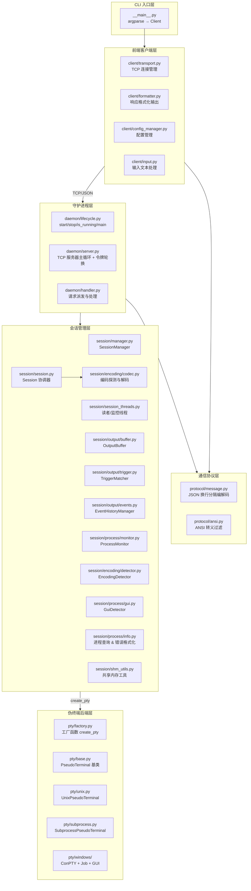
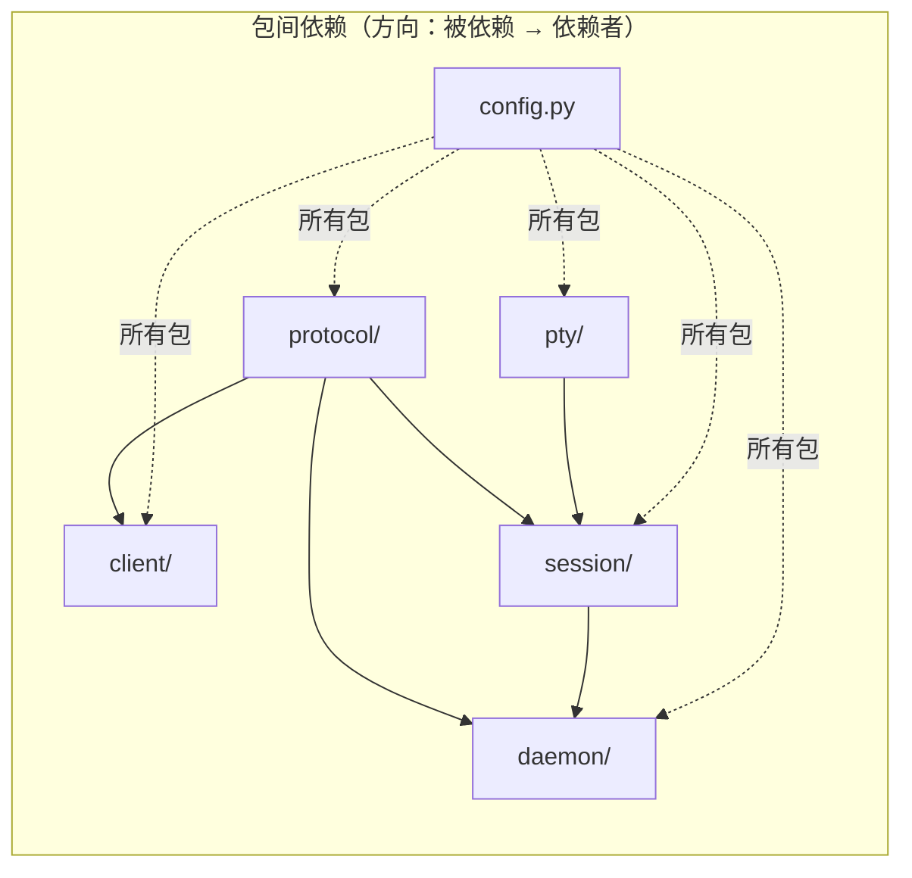

# pty-agent 重构架构设计

> 本文档描述 `src/` 包重构后的模块化架构设计方案，为后续代码重构提供指导。

---


## 3. 架构设计原则

项目遵循以下设计原则：

1. **单一职责**：每个模块只做一件事
2. **高内聚低耦合**：相关功能内聚到同一模块，模块间通过明确定义的接口通信
3. **平台隔离**：Windows 特有代码完全隔离在 `pty/windows/` 子包下，Unix 平台零加载
4. **配置集中**：所有常量统一在 `config.py` 管理
5. **可测试性**：每个模块可独立测试，方便 mock
6. **可扩展性**：新增 PTY 后端只需添加单个文件；新增 CLI 子命令流程清晰

---

## 4. 重构后架构

### 4.1 目录结构总览

```
src/
├── __main__.py              # CLI 入口（参数解析 + 配置管理 + 命令派发）
│
├── config.py                # 所有配置常量集中管理（纯数据，零依赖）
│
├── protocol/                # ═══════ 通信协议层 ═══════
│   ├── message.py           # Message 类（JSON 换行分隔协议：编码 / 解码 / 发送 / 接收）
│   └── ansi.py              # ANSI 转义序列过滤（strip_ansi）
│
├── client/                  # ═══════ 前端客户端层 ═══════
│   ├── transport.py         # TCP 连接管理 + Client 类（自动启动守护进程）
│   ├── formatter.py         # 响应格式化输出（JSON 模式 / 自然语言模式）
│   ├── config_manager.py    # 纯内存客户端配置管理（--default 临时覆盖）
│   └── input.py             # 输入文本处理（process_input / unescape_json_string / safe_print）
│
├── daemon/                  # ═══════ 守护进程层 ═══════
│   ├── __main__.py          # 入口（`python -m src.daemon`），转调 lifecycle.main()
│   ├── lifecycle.py         # 生命周期管理：start_daemon / stop_daemon / is_running / main
│   ├── server.py            # DaemonServer（TCP 主循环 + 令牌轮换 + 清理）
│   └── handler.py           # RequestHandler（消息派发 + 各命令处理逻辑）
│
├── pty/                     # ═══════ 伪终端后端层 ═══════
│   ├── factory.py           # 工厂函数 create_pty + 平台检测
│   ├── base.py              # PseudoTerminal 抽象基类
│   ├── unix.py              # UnixPseudoTerminal（os.openpty + fork + termios）
│   ├── subprocess.py        # SubprocessPseudoTerminal（纯管道保底，支持 --shell）
│   └── windows/             # ═══ Windows 子包（仅 Win32 加载） ═══
│       ├── convars.py       # Windows ctypes 类型定义 + 全部 API 函数绑定
│       ├── kernel32_api.py  # WindowsPseudoTerminal（CreatePseudoConsole 路径）
│       ├── condrv.py        # ConDrvPseudoTerminal（NT NtOpenFile 直连路径，已禁用）
│       ├── job.py           # ProcessJob + JobNotification（进程树追踪 + IOCP 通知）
│       ├── gui_monitor.py   # GuiWindowMonitor + GuiWindowInfo（EnumWindows GUI 窗口轮询）
│       └── error_msg.py     # Windows NTSTATUS/Win32 错误码格式化
│
└── session/                 # ═══════ 会话管理层 ═══════
    ├── manager.py           # SessionManager（会话 CRUD + stop_all）
    ├── session.py           # Session 协调器（组合各子组件，委托线程管理）
    ├── session_threads.py   # SessionThreads + SessionComponents（后台读者/监控线程管理）
    ├── shm_utils.py         # 共享内存工具（端口 + 认证令牌读写）
    ├── encoding/            # ═══ 编码子包 ═══
    │   ├── __init__.py      # 导出 detect_decode / EncodingDetector 等
    │   ├── codec.py         # 编码探测与解码纯函数（detect_decode / decode_strip_tail / auto_detect / 智能裁剪）
    │   └── detector.py      # EncodingDetector（编码探测状态管理）
    ├── output/              # ═══ 输出子包 ═══
    │   ├── __init__.py      # 导出 OutputBuffer / TriggerMatcher / EventHistoryManager
    │   ├── buffer.py        # OutputBuffer（线程安全输出缓冲区）
    │   ├── trigger.py       # TriggerMatcher + safe_regex_search（触发条件匹配 + ReDoS 防护）
    │   └── events.py        # EventHistoryManager + PendingEvent（事件队列 + 历史 + 存在性检测）
    └── process/             # ═══ 进程子包 ═══
        ├── __init__.py      # 导出 ProcessMonitor / GuiDetector / 工具函数
        ├── monitor.py       # ProcessMonitor（进程树 diff + IOCP 排空 + 崩溃检测）
        ├── info.py          # 进程查询与错误格式化（_get_process_name / _format_exit_code_message）
        └── gui.py           # GuiDetector（GUI 窗口轮询检测，2s 节流）
```

### 4.2 分层架构图



### 4.3 各层详细说明

#### 4.3.1 `protocol/` — 通信协议层

**定位**：被 `client/` 和 `daemon/` 双方共同依赖的基础层，零业务逻辑。

| 模块 | 类/函数 | 职责 |
|------|---------|------|
| `message.py` | `Message.encode(obj)` → `bytes` | 将 dict 编码为 JSON 行 + `\n` + UTF-8 |
| `message.py` | `Message.decode(data)` → `dict` | 从 bytes 解码为 dict |
| `message.py` | `Message.send(sock, obj)` | 发送一条消息到 socket |
| `message.py` | `Message.recv(sock)` → `dict\|None` | 从 socket 接收一条消息（带缓冲的行读取） |
| `message.py` | `Message._recv_buffers` | 连接级别的接收缓冲区（按 fileno 索引） |
| `ansi.py` | `strip_ansi(text)` → `str` | 去除 ANSI 颜色/样式码，保留清屏/光标等控制序列 |
| `ansi.py` | `_ANSI_RE` | 匹配 CSI SGR + OSC 的正则（光标/清屏不匹配） |

**设计要点**：
- `Message` 维持静态类设计（无状态），所有方法为 `@staticmethod`
- `_recv_buffers` 字典保持类级别，不污染 socket 对象
- `strip_ansi` 与任何业务逻辑无关，独立可测；仅过滤 SGR 颜色/样式码 + OSC 窗口标题，保留清屏/光标定位等语义控制序列
- 控制序列（`\x1b[2J` 清屏、`\x1b[H` 归位、`\x1b[K` 清行等）不受 `keep_ansi` 影响，始终保留在输出中

#### 4.3.2 `client/` — 前端客户端层

**定位**：封装与守护进程的 TCP 通信，向 CLI 入口提供简洁接口。

| 模块 | 类/函数 | 职责 |
|------|---------|------|
| `transport.py` | `Client` 类 | 向 CLI 暴露 `cmd_start()` / `cmd_stop()` / `cmd_list()` / `cmd_exec()` / `cmd_send()` / `cmd_read()` / `cmd_kill()` / `cmd_events()` / `cmd_closewin()` |
| `transport.py` | `Client._connect()` | 建立 TCP 连接（守护进程未运行则自动启动），注入认证令牌 |
| `transport.py` | `Client._send_recv(msg)` | 发送请求 + 接收响应（完整的一次往返，自动注入令牌） |
| `transport.py` | `_has_shell_operators(cmd)` | 检测 shell 操作符 token（`\|`, `||`, `&`, `&&`, `;`, `>`, `<`, `>>`） |
| `transport.py` | `_read_daemon_port()` / `_read_daemon_token()` | 从共享内存读取端口/令牌 |
| `formatter.py` | `set_color_mode()` / `set_output_mode()` / `set_debug_mode()` | 设置颜色模式 / JSON 模式（默认）或自然语言模式 / debug 输出开关 |
| `formatter.py` | `print_response(resp)` | 格式化并打印守护进程响应（双模式） |
| `formatter.py` | `_print_result(resp)` / `_print_ok(resp)` | 打印 result 类型 / ok 类型响应 |
| `formatter.py` | `_format_event(ev)` | 格式化单个事件为显示行 |
| `config_manager.py` | `ConfigManager` 类 | 纯内存配置管理器，支持 `--default` 临时覆盖默认值（不持久化） |
| `config_manager.py` | `ConfigManager.get()` / `set()` / `show()` | 读取/设置/展示配置 |
| `input.py` | `process_input(text)` → `str` | 完整 JSON 反转移 + 自动追加换行（用于 send 命令） |
| `input.py` | `unescape_json_string(text)` → `str` | 仅解码 `\"` 和 `\\`（用于 exec 命令，避免误转义 Windows 路径） |
| `input.py` | `safe_print(text, **kwargs)` | 安全打印（自适应控制台编码，GBK 终端强制 UTF-8 输出） |

**设计要点**：
- `Client._connect()` 在 `is_running()` 返回 False 时自动 `start_daemon()`，无需用户手动 start
- `print_response` 根据全局 `_USE_JSON` 标志决定输出格式：JSON 模式直接 `json.dumps` 到 stdout，自然语言模式做人类可读格式化
- `_SHOW_DEBUG` 全局标志控制 debug 段输出（进程树/GUI 窗口/事件）：`--no-debug` 或 `--default debug off` 关闭后，JSON 模式移除 `debug` 字段，自然语言模式隐藏 debug/事件段
- `ConfigManager` 管理调用级默认配置（timeout/newline/encoding/keep_ansi/output_by_natural_language/debug），纯内存不持久化，`cmd_*()` 方法在构建请求时应用配置默认值
- `--default` 临时覆盖默认值，仅本次调用有效
- 每个 `cmd_*` 方法仅负责构建请求 dict + 调用 `_send_recv` + 调用 `print_response`

#### 4.3.3 `daemon/` — 守护进程层

**定位**：TCP 服务器，接收客户端请求，委派会话管理/PTY 层处理，返回响应。

| 模块 | 类/函数 | 职责 |
|------|---------|------|
| `lifecycle.py` | `is_running()` → `bool` | ping-pong 探测守护进程存活 |
| `lifecycle.py` | `start_daemon()` | 以子进程方式启动守护进程（Win: DETACHED_PROCESS，Unix: 双 fork），动态端口 + 共享内存 |
| `lifecycle.py` | `stop_daemon()` | 发送 stop 指令并等待确认 |
| `lifecycle.py` | `main()` | 守护进程入口：端口参数解析 + DaemonServer.run() |
| `lifecycle.py` | `_find_free_port()` | 查找随机可用 TCP 端口 |
| `lifecycle.py` | `_setup_logging()` | 配置日志（仅文件输出 UTF-8，无控制台） |
| `server.py` | `DaemonServer` 类 | TCP 主循环、令牌轮换、`run()` / `stop()` / `_cleanup()` |
| `server.py` | `DaemonServer._schedule_rotate()` / `_rotate_token()` | 令牌定时轮换（30 分钟周期 + 2 分钟宽限） |
| `handler.py` | `RequestHandler` 类 | `handle()` 主派发 + `_handle_exec()` / `_handle_send()` / `_handle_read()` / `_handle_kill()` / `_handle_events()` / `_handle_closewin()` |
| `handler.py` | `RequestHandler._build_result()` | 构建统一 `result` 类型响应（含 trigger/program/debug 三层） |
| `handler.py` | `RequestHandler._strip_if_needed()` | 按 `keep_ansi` 开关过滤 ANSI |
| `handler.py` | `RequestHandler._run_trigger_flow()` | 通用触发流程（exec/send 复用） |
| `handler.py` | `RequestHandler._run_no_trigger_flow()` | 无触发条件流程 |
| `handler.py` | `RequestHandler.add_valid_token()` / `_is_token_valid()` | 多令牌验证（轮换宽限期） |
| `handler.py` | `RequestHandler._validate_request()` | 批量验证请求字段长度 |

**设计要点**：
- `daemon/lifecycle.py` 承担生命周期管理职责（启动/停止/检测/入口），`daemon/__main__.py` 仅转调 `lifecycle.main()`
- `RequestHandler` 不直接操作 socket 读写（通过 `Message` 完成），便于测试
- 新命令类型：在 `handle()` 中添加 `elif` 分支，加对应 `_handle_xxx()` 方法
- `start_daemon()` 自动计算项目根目录作为子进程 `cwd`（`__file__` 向上 3 层），确保 `python -m src.daemon` 无论从何目录调用都能找到 `src` 包
- 子进程 `stderr` 重定向到 `daemon.log`（而非 `DEVNULL`），启动崩溃时可在日志中看到完整 Traceback
- `_run_trigger_flow()` 将 exec/send 共用的触发等待逻辑抽取为通用方法，避免代码重复

#### 4.3.4 `pty/` — 伪终端后端层

**定位**：封装不同平台/路径的 PTY 实现，向 `session/` 层提供统一的 `PseudoTerminal` 接口。

| 模块 | 类/函数 | 职责 |
|------|---------|------|
| `factory.py` | `create_pty(command, cols, rows, shell=None)` → `PseudoTerminal` | 工厂函数，按优先级尝试各后端 |
| `base.py` | `PseudoTerminal` | 抽象基类：`read()` / `write()` / `drain()` / `close()` / `fileno()` / `get_child_pid()` / `get_exit_code()` / `get_child_process_exit_code()` / `get_job_notifications()` / `get_process_list()` / `get_gui_windows()` / `poll_gui_windows()` / `close_gui_window()` / `get_type()` |
| `unix.py` | `UnixPseudoTerminal` | `os.openpty()` + `os.fork()` + `execvpe()`，非阻塞 I/O |
| `subprocess.py` | `SubprocessPseudoTerminal` | `subprocess.Popen` 管道模式，集成 ProcessJob + GuiWindowMonitor（Windows） |
| `windows/convars.py` | 全部 `_*` ctypes 类型 + API 绑定 | 集中管理 Windows API 声明（唯一的 API 声明文件） |
| `windows/kernel32_api.py` | `WindowsPseudoTerminal` | `CreatePseudoConsole` API 路径，集成 ProcessJob + GuiWindowMonitor |
| `windows/condrv.py` | `ConDrvPseudoTerminal` | `NtOpenFile("\\Device\\ConDrv\\Server")` 直连路径（I/O 不完整，已禁用） |
| `windows/job.py` | `ProcessJob` + `JobNotification` | Job Object 封装：进程树追踪、IOCP 实时通知、KILL_ON_JOB_CLOSE |
| `windows/gui_monitor.py` | `GuiWindowMonitor` + `GuiWindowInfo` | EnumWindows 轮询检测 GUI 窗口，SendMessage(WM_CLOSE) 关闭 |
| `windows/error_msg.py` | `translate_windows_error()` / `format_process_exit_code()` / `format_create_process_error()` | Windows NTSTATUS/Win32 错误码格式化（名称映射 + FormatMessageW） |

**设计要点**：
- `base.py` 定义了最小接口契约，所有具体 PTY 后端必须实现全部方法
- `drain()` 方法：`read()` 后立即调用，将 OS 管道缓冲区中所有当前就绪数据一次性取回。解决程序输出被多次 `read` 打散的问题，确保触发检测在完整数据块上进行
  - Unix PTY：非阻塞 `os.read` 循环排空
  - Windows ConPTY：`PeekNamedPipe` 检查可用字节 + `ReadFile` 读取
  - Windows ConDrv：同名管道 + `PeekNamedPipe` + 重叠 I/O 排空
  - Subprocess：继承基类默认实现（返回 `b""`，因管道阻塞不可排空）
- `windows/` 子包仅在 `IS_WINDOWS` 为 True 时才被导入（在 `factory.py` 中条件导入），Unix 平台零开销
- `windows/convars.py` 作为唯一的 Windows API 声明文件，便于审计和维护；`_CONDRV_OK = False` 控制 ConDrv 后端禁用
- `create_pty` 工厂按优先级尝试：`kernel32 API → subprocess`（Win）/ `Unix → subprocess`（Unix）
  — 注意：ConDrv 直连因 I/O 不完整已禁用（`_CONDRV_OK=False`），仅保留源码供后续调试/恢复。字符串命令跳过所有 PTY 后端直接使用 subprocess。
- 新增 PTY 后端只需：创建新文件 → 继承 `PseudoTerminal` → 在 `create_pty` 的优先级链中添加

#### 4.3.5 `session/` — 会话管理层

**定位**：管理 PTY 会话的生命周期，通过**组合模式**将职责委派给独立子组件。

| 模块 | 类/函数 | 职责 |
|------|---------|------|
| `manager.py` | `SessionManager` | `create_session(id, command, encoding, shell)` / `get_session()` / `list_sessions()` / `remove_session()` / `stop_all()` |
| `session.py` | `Session` 类（协调器，~510 行） | 属性：`id`, `command`, `running`, `exit_code`, `error_message`, `encoding`, `pty_type`, `output_offset`, `gui_windows`, `processes` |
| `session.py` | `Session.start()` / `stop()` | 创建 PTY + 启动读者/监控线程 + 组件重置 / 优雅关闭 |
| `session.py` | `Session.write_input()` / `get_output()` | 写入输入到 PTY（编码感知） / 从输出缓冲区读取解码 |
| `session.py` | `Session.set_trigger()` / `wait_for_trigger()` / `clear_trigger()` | 触发条件管理（委托 TriggerMatcher） |
| `session.py` | `Session.consume_events()` / `get_all_events()` | 事件消费与全量查询（委托 EventHistoryManager） |
| `session.py` | `Session.close_window()` | 关闭 GUI 窗口（委托 GuiDetector） |
| `session_threads.py` | `SessionThreads` | 后台读者线程 + 监控线程管理（启动/停止/循环逻辑） |
| `session_threads.py` | `SessionComponents` | 子组件引用容器数据类（pty_provider / out_buf / trig_mat / proc_mon / gui_detector / session_id / on_exit） |
| `session_threads.py` | `_capture_exit_code_retry()` | 带重试的退出码获取（retries=10） |
| `output/buffer.py` | `OutputBuffer` | 线程安全字节缓冲区、读周期计数、首次输出 Event、超限丢弃前半部分 |
| `output/trigger.py` | `TriggerMatcher` | 正则/子串匹配、换行策略、新鲜模式、静默超时、ReDoS 防护 |
| `output/trigger.py` | `safe_regex_search()` | ReDoS 防护（共享线程池 + 超时降级） |
| `output/events.py` | `EventHistoryManager` + `PendingEvent` | 待处理队列 + 历史归档、存在性检测、`_events_to_dicts()` |
| `process/monitor.py` | `ProcessMonitor` | 进程树 diff、IOCP 通知排空、崩溃信号 Event、进程名称缓存、节流 2s |
| `process/info.py` | `_get_process_name()` / `_get_process_path()` | 通过 PID 获取可执行文件名/路径 |
| `process/info.py` | `_format_exit_code_message()` / `_format_pty_error()` / `_signal_name()` | 退出码与 PTY 错误格式化 |
| `encoding/codec.py` | `detect_decode()` / `decode_strip_tail()` / `detect_decode_ext()` / `auto_detect()` / `check_encoding_ok()` / `_utf8_trim_tail()` / `_gbk_trim_tail()` / `_smart_trim()` | 编码自动探测与解码（纯函数，无状态），含智能裁剪 |
| `encoding/detector.py` | `EncodingDetector` | 编码探测状态管理（维护 encoding / _encoding_locked 状态），`detect_decode()` 可修改状态，`decode_only()` 无副作用 |
| `process/gui.py` | `GuiDetector` | GUI 窗口轮询检测（节流 2s），`check()` / `clear()`，属性：`gui_windows` / `processes` / `detected_event` |
| `shm_utils.py` | `generate_auth_token()` / `read_auth_token()` / `write_auth_token()` / `read_port_from_shm()` / `write_port_to_shm()` | 共享内存工具（端口 + 认证令牌读写，Windows 用命名 mmap，Unix 用文件） |

**设计要点**：
- `Session` 不直接创建 PTY 实例，而是通过 `create_pty()` 工厂获得
- Session 通过 `@property` 公开子组件：`session.output_buffer` / `session.trigger_matcher` / `session.event_history` / `session.process_monitor`
- `Session._reader_loop()` 和 `_monitor_loop()` 已迁移到 `session_threads.py` 的 `SessionThreads` 类中，Session 通过组合持有 `SessionThreads` 实例，避免自身过于臃肿
- `SessionComponents` 数据类将后台线程所需的所有子组件引用打包传递，避免循环依赖
- `encoding/codec.py` 将编码探测逻辑从 `Session` 类中抽离为纯函数，便于测试
- `EncodingDetector` 维护编码状态（`encoding` / `_encoding_locked`），`detect_decode()` 在 `get_output` 中调用可修改状态，`decode_only()` 在持锁路径 `TriggerMatcher.check` 中使用无副作用
- `GuiDetector` 封装 GUI 窗口检测逻辑（2s 节流轮询），从 Session 中独立出来
- 触发检测基于 `threading.Event`，线程安全
- 输出缓冲区大小上限由 `config.py` 集中控制
- `OutputBuffer` 内部使用 `RLock`（可重入锁），允许 `_reader_loop` 在持锁上下文中调用 `append()`
- Session 支持 `shell` 参数指定解释器（cmd/powershell/pwsh/bash），传递给 `create_pty()` 工厂
- `encoding/codec.py` 新增智能裁剪（`_utf8_trim_tail` / `_gbk_trim_tail` / `_smart_trim`），避免线性截断性能损耗

### 4.4 `config.py` — 配置中心

```python
"""集中管理所有配置常量"""

import os
import sys

# ── 网络 ──
DAEMON_HOST = "127.0.0.1"
DEFAULT_DAEMON_PORT = 18765              # 默认端口（实际端口由动态分配写入 port 文件）

# ── 日志 ──
# 日志级别: "DEBUG" / "INFO" / "WARNING" / "ERROR" / "CRITICAL"
# 设为 None 则不写日志
DAEMON_LOG_LEVEL = None
CLIENT_LOG_LEVEL = None
CLIENT_DEBUG = True

# ── 文件路径 ──
DATA_DIR = os.path.join(os.path.expanduser("~"), ".pty-agent")
PROJECT_ROOT = os.path.dirname(os.path.dirname(os.path.abspath(__file__)))
LOG_DIR = os.path.join(PROJECT_ROOT, "logs")
PID_FILE = os.path.join(DATA_DIR, "daemon.pid")
PORT_FILE = os.path.join(DATA_DIR, "daemon.port")  # 动态分配的端口号

# ── 缓冲区 ──
MAX_OUTPUT_BUFFER = 100 * 1024 * 1024    # 100 MB，会话输出缓冲区上限
MAX_TRIGGER_SCAN  = 10 * 1024 * 1024     # 10 MB，触发检查最大扫描范围

# ── 超时 ──
DEFAULT_TRIGGER_TIMEOUT = 120.0          # 触发等待超时（秒）
DAEMON_START_TIMEOUT    = 3.0            # 守护进程启动等待（秒）
PING_TIMEOUT            = 1.0            # ping 探测超时（秒）
CONNECT_TIMEOUT         = 30.0           # 客户端连接超时（秒）
STOP_TIMEOUT            = 3.0            # 停止守护进程超时（秒）

# ── 其他 ──
SOCKET_LISTEN_BACKLOG  = 5
SOCKET_RECV_BUFSIZE    = 4096
PTY_READ_SIZE          = 65536

# ── 输入长度限制（防资源耗尽）──
MAX_SESSION_ID_LEN     = 128      # 会话标识符最大长度
MAX_COMMAND_LEN        = 65536    # 命令字符串最大长度（64 KB）
MAX_PATTERN_LEN        = 4096     # 触发/过滤正则最大长度（4 KB）
MAX_INPUT_LEN          = 65536    # send 输入文本最大长度

# ── 共享内存（Windows 命名 mmap 用于守护进程端口传递）─
# 安全说明：`Local\` 前缀限定同 Windows 会话/同 Unix 用户访问，
# 跨用户隔离由内核保证。
MMAP_NAME = "Local\\PTYAgentPort"
MMAP_SIZE = 16

# ── 认证令牌（同用户会话隔离，防跨用户越权）─
# 令牌通过共享内存在守护进程与客户端之间传递，随后在 TCP 连接中明文发送。
# 这是接受的设计决策：127.0.0.1 TCP 嗅探在 Windows 上需要管理员权限，
# 在 Linux 上需要 root 权限。令牌每 30 分钟轮换限制泄露窗口。
AUTH_TOKEN_NAME = "Local\\PTYAgentAuth"
AUTH_TOKEN_SIZE = 64  # hex-encoded 32-byte token
AUTH_TOKEN_ROTATE_INTERVAL = 1800  # 令牌轮换周期（秒），默认 30 分钟
AUTH_TOKEN_GRACE_PERIOD    = 120   # 旧令牌宽限期（秒），轮换后 2 分钟内仍有效

# ── 平台 ──
IS_WINDOWS = sys.platform == "win32"
```

---

## 4.5 新增子系统

### 4.5.1 `pty/windows/job.py` — Job Object 进程树追踪

```python
class ProcessJob:
    """Windows Job Object 封装

    追踪整个进程树（含子/孙进程），支持:
    - KILL_ON_JOB_CLOSE：关闭句柄时自动终止所有关联进程
    - 查询 Job 内所有进程 PID 列表
    - 获取单个子进程退出码（用于崩溃检测）
    """
```

| 方法 | 功能 |
|------|------|
| `assign(hprocess)` | 将进程分配到 Job（子进程自动继承） |
| `query_process_list()` | 获取 Job 内所有进程的 PID 列表 |
| `get_process_count()` | 当前进程数 |
| `close()` | 关闭 Job 句柄 → KILL_ON_JOB_CLOSE 终止所有进程 |

所有 PTY 后端（`SubprocessPseudoTerminal`、`WindowsPseudoTerminal`、`ConDrvPseudoTerminal`）均集成 Job Object。

### 4.5.2 `pty/windows/gui_monitor.py` — GUI 窗口检测

```python
class GuiWindowMonitor:
    """GUI 窗口检测器

    轮询 EnumWindows，交叉比对窗口所属进程 PID 是否在 Job Object 内。
    - 基于 hwnd 去重，同一窗口只上报一次
    - 线程安全（使用锁保护内部状态）
    - 通过 SendMessage(WM_CLOSE) 关闭指定窗口
    """
```

| 方法 | 功能 |
|------|------|
| `poll()` | 轮询检测新增 GUI 窗口 |
| `close_window(hwnd)` | 发送 WM_CLOSE 关闭窗口 |
| `close_process_windows(pid)` | 关闭指定进程的所有窗口 |

GUI 检测**默认启用**，每次 `exec/send` 等待 trigger 时自动轮询。

### 4.5.3 `session/` 事件系统

Session 内部维护 **待处理事件队列** 和 **事件历史记录**，实时记录：

| 事件类型 | 触发条件 |
|---------|---------|
| `process_spawn` | 新进程在 Job 内创建 |
| `process_exit` | 进程退出 Job（退出码 = 0） |
| `process_crash` | 进程退出码 ≠ 0（异常崩溃） |
| `gui_window` | 检测到新 GUI 窗口 |

**存在性检测**：每个事件可通过 `EventHistoryManager.check_existence()` 检测关联进程/窗口是否仍存活。`still_active` 字段随 events 命令返回。

**历史记录**：`consume_events()` 将待处理事件移入 EventHistoryManager 的历史队列，`get_all_events()` 返回历史 + 待处理全部事件。

**崩溃自动返回**：`process/monitor.py:ProcessMonitor.check_events()` 检测到 `process_crash` 时设置 `crash_event`（`threading.Event`），`wait_for_trigger()` 在轮询循环中优先检测该标志，检测后立即返回 `reason="crashed"`，无需等待读线程 EOF。

事件消费方式：
- `exec/send` 返回时通过 `_build_result(consume_events=True).debug.pending_events` **自动附带并消费**待处理事件
- `events <id>` 命令单独拉取**所有事件**（历史 + 待处理，不消费），支持 `--last` / `--since` / `--until` 过滤
- 每个事件附带 `still_active` 字段（存在性检测）
- `list` 命令显示 `!N` 标记表示有待处理事件
- 事件 `time` 字段为 ISO 8601 格式（如 `"2026-06-07T18:00:00.12"`），非原始 Unix 时间戳

### 4.5.4 独立监控线程

每个 Session 通过 `SessionThreads` 启动一个**独立监控线程**，每 2 秒检测 GUI 窗口和补全进程列表变更：

```python
def _monitor_loop(self):
    while not self._stop_event.is_set():
        self._proc_mon.drain_notifications()  # IOCP 实时通知（非阻塞）
        self._gui_detector.check(pty, session_id)
        self._proc_mon.check_events()         # 轮询补充（IOCP 未覆盖的变更）
        self._stop_event.wait(2.0)
```

### 4.5.5 Job Object IOCP 实时通知

进程崩溃检测通过 **I/O 完成端口（IOCP）** 实现，无需轮询：

1. `ProcessJob.__init__()` 创建 IOCP + 关联 Job Object
2. 后台线程 `_notification_loop()` 调用 `GetQueuedCompletionStatus` 等待通知
3. Windows 推送消息：`_JOB_OBJECT_MSG_NEW_PROCESS(3)` / `_JOB_OBJECT_MSG_EXIT_PROCESS(4)` / `_JOB_OBJECT_MSG_ABNORMAL_EXIT_PROCESS(5)`
4. 通知存入线程安全队列，`_drain_job_notifications()` 消费
5. 根据退出码判定崩溃（不依赖消息类型）：非零且非 STILL_ACTIVE → `process_crash`

同时设置 `DIE_ON_UNHANDLED_EXCEPTION`（job.py）和 `SetErrorMode`/`SetThreadErrorMode`（subprocess.py），崩溃时**不弹对话框**直接退出。

### 4.5.6 动态端口 + 共享内存

守护进程每次启动随机选取可用端口，通过 `session/shm_utils.py` 发布和获取：

- `daemon/lifecycle.py`：`_find_free_port()` 获取随机端口 → `write_port_to_shm()` 写入命名 mmap（Win）/ port 文件（Unix）
- `daemon/server.py`：入口 `main()` 通过 `--port N` 参数接收端口号
- `client/transport.py` + `daemon/lifecycle.py:is_running()`：`read_port_from_shm()` 获取端口号
- 不再需要固定端口 18765，彻底解决端口冲突和 TIME_WAIT 问题
- Unix 回退：通过 `daemon.port` 文件传递端口号（当 mmap 不可用）

### 4.5.7 认证令牌系统

客户端与守护进程之间的 TCP 连接通过**认证令牌**验证身份，防止同用户下其他进程越权操作：

- 守护进程启动时生成 32 字节随机令牌（hex 编码），通过 `write_auth_token()` 写入共享内存
- 客户端发送请求时附带令牌，守护进程验证匹配后才处理
- 令牌每 `AUTH_TOKEN_ROTATE_INTERVAL`（30 分钟）轮换一次
- 旧令牌有 `AUTH_TOKEN_GRACE_PERIOD`（2 分钟）宽限期，轮换后不影响进行中的连接
- `read_auth_token()` / `write_auth_token()` / `cleanup_auth_shm()` 封装在 `shm_utils.py`

### 4.5.8 `pty/windows/error_msg.py` — Windows 错误码格式化

提供 Windows 特有错误退出码（NTSTATUS、Win32 错误码）的格式化输出：

| 函数 | 功能 |
|------|------|
| `translate_windows_error(code)` | 根据内置名称表 + FormatMessageW 格式化错误码 |
| `format_process_exit_code(code)` | 格式化进程退出码（含 NTSTATUS 十六进制显示） |
| `format_create_process_error(code)` | 格式化 CreateProcessW 失败信息 |

内置常见 NTSTATUS 名称映射（STATUS_ACCESS_VIOLATION、STATUS_DLL_NOT_FOUND 等）和 Win32 错误码名称（ERROR_FILE_NOT_FOUND 等），辅助崩溃诊断。

---

## 5. 依赖关系与调用链

### 5.1 包间依赖图



**规则**：
- `config.py` 是纯数据文件，被所有包导入，但不导入任何包
- `protocol/` 不依赖任何其他包（除 Python 标准库）
- `pty/` 不依赖 `session/` 或 `daemon/`
- `session/` 依赖 `pty/`（获取 PTY 实例）和 `protocol/`（ANSI 过滤 — 可选）
- `daemon/` 依赖 `session/` 和 `protocol/`
- `client/` 依赖 `protocol/` 和 `daemon/lifecycle.py`（启动/检测守护进程）
- `__main__.py` 只依赖 `client/`

### 5.2 典型调用链

#### exec 流程

```
用户: pty-agent exec myid -c "python -u -i" -t ">>>"

__main__.py:main()
  → argparse 解析 → Client.cmd_exec(...)
  → ConfigManager 加载默认配置，应用 timeout/encoding/newline/keep_ansi 默认值

client/transport.py:Client.cmd_exec()
  → 构建 request dict
  → Client._send_recv(msg)
      → Client._connect()
          → if not is_running(): start_daemon()  [自动启动]
          → TCP 连接
      → Message.send(sock, msg)  [写入 JSON]
      → Message.recv(sock)       [阻塞等待响应]
      ──TCP──┐

daemon/server.py:DaemonServer.run()        ← accept 连接
  → 创建线程 → handler.handle(conn, addr)

daemon/handler.py:RequestHandler.handle()
  → Message.recv(conn) → 解析 JSON
  → msg["type"] == "exec"
  → self._handle_exec(conn, msg)

daemon/handler.py:_handle_exec()
  → manager.get_session(id)
   → if not exist: manager.create_session(id, command, encoding)
       → Session.__init__()
           → 创建 OutputBuffer / TriggerMatcher / EventHistoryManager / ProcessMonitor / EncodingDetector / GuiDetector / SessionThreads
       → Session.start()
           → pty/factory.py:create_pty()
           → create PTY instance
           → 初始化进程快照 → ProcessMonitor.reset(initial_pids)
           → SessionThreads.start() → 启动读者线程 + 监控线程
  → session.set_trigger(">>>", newline=False, fresh=False,
  →                      idle_timeout=3, idle_after_first_output=True)
  →      → TriggerMatcher.set(pattern, ...)
  →      → 初次检查：持 OutputBuffer.lock → TriggerMatcher.check(OutputBuffer)
  → 若无 trigger：_run_no_trigger_flow 检测到 idle_timeout 时，使用永不匹配正
  →       则 `(?!x)x` 进入 wait_for_trigger 等待循环，同样支持静默超时检测
  → matched, reason = session.wait_for_trigger(timeout)
      → 读者线程持续读 PTY → 追加 OutputBuffer → TriggerMatcher 检测
      → 正则匹配命中 → TriggerMatcher._event.set()
      → 输出静默超时：TriggerMatcher.check_idle_timeout() → 返回 "idle_timeout"
       → 监控线程（SessionThreads._monitor_loop）每 2s 检测：ProcessMonitor.check_events() 崩溃 → crash_event.set()
       → 监控线程每 2s 检测 GUI（GuiDetector.check）→ 检测到新窗口 → 返回 "gui_detected"
  → output = session.get_output(from_offset=...)
   → Message.send(conn, result_dict)  [含 trigger_matched/reason/program/debug]
      ←─TCP──

client/formatter.py:print_response(resp)
  → JSON 模式：json.dumps 输出到 stdout
  → 自然语言模式：格式化输出到 stdout/stderr
```

#### send 流程

```
用户: pty-agent send myid "print('hello')" -t ">>>"

__main__.py → Client.cmd_send(...)
  → process_input("print('hello')")  → "print('hello')\n"
  → _send_recv({"type":"send", "id":"myid", "input":"print('hello')\n", ...})

daemon/handler.py:_handle_send()
  → manager.get_session("myid")
  → session.write_input("print('hello')\n")
      → self._pty.write(data)  [写入 PTY 主端]
  → session.set_trigger(">>>")
  → matched, reason = session.wait_for_trigger(timeout)
  → output = session.get_output(from_offset=trigger_offset)
  → Message.send(conn, result_dict)
```

#### read 流程

```
用户: pty-agent read myid --lines 5 --grep "Error"

daemon/handler.py:_handle_read()
  → session.get_output(from_offset=read_offset)
  → 行过滤 + grep 过滤
  → Message.send(conn, result_dict)
```

---

---

## 6. 设计决策摘要

| 决策 | 说明 |
|------|------|
| `protocol/` 独立为层 | `Message` 类和 `strip_ansi` 被 client 和 daemon 两端使用，独立为底层设施，避免循环依赖 |
| `pty/windows/` 子包隔离 | Windows 特有代码（ctypes API 声明等）放入独立子包，Unix 平台零加载 |
| `client/` 拆为三模块 | `transport.py`（连接管理）、`formatter.py`（输出格式化）、`input.py`（文本处理） |
| `config.py` 集中管理 | 所有魔数常量（端口、缓冲区、超时）统一管理，不在模块中散落 |
| `session/encoding/codec.py` 独立 | 编码探测逻辑从 Session 类中抽离为纯函数，便于独立测试 |

---

## 8. 数据流设计

### 8.1 exec 数据流

```
输入: CLI 参数 → 请求 dict → JSON 字节流 → TCP → JSON 字节流 → 请求 dict
                                                              ↓
                                                          PTY 子进程启动
                                                              ↓
                                                          PTY 输出字节流
                                                              ↓
                                                          读者线程读取 → 输出缓冲区
                                                              ↓
                                                          触发检测（正则匹配）
                                                              ↓
输出: 响应 dict ← JSON 字节流 ← TCP ← JSON 字节流 ← 输出字符串 ← 解码
```

### 8.2 输出缓冲区数据流

```
PTY 后端 read() → 原始 bytes
                      ↓
          drain() 排空管道剩余数据 ← 每次 read 后立即调用
           (Unix: 非阻塞 os.read 循环 / Win: PeekNamedPipe)
                      ↓
         data + drained 拼接为完整块
                      ↓
             _output_buffer (bytearray)
                      ↓
           get_output(from_offset=N)  →  bytes → detect_decode() → str
```

### 8.3 触发检测数据流

```
读者线程读取到数据
       ↓
持锁 append 到 OutputBuffer
       ↓
TriggerMatcher.on_data_appended()  ← 输出静默超时计时重置
       ↓
TriggerMatcher.check(OutputBuffer)  ← 在 OutputBuffer.lock 内执行
       ↓
从 start_offset 切片 bytes（OutputBuffer.raw）
       ↓
decode_func(raw) → 解码为 str（Session._decode_only，无副作用）
       ↓
safe_regex_search(regex, text)  ← ReDoS 防护：独立 daemon 线程 + 2s 超时
       ↓
命中？→ _matched = True → _event.set()
```

```
wait_for_trigger 轮询循环（0.1s 间隔）
       ↓
┌─ 检查 TriggerMatcher.matched ───────→ "matched"
├─ 检查 ProcessMonitor.crash_event ───→ "crashed"
├─ 检查 session.running ──────────────→ "ended"
├─ 检查 GUI 窗口 ────────────────────→ "gui_detected"
├─ 检查 TriggerMatcher check_idle_timeout → "idle_timeout"
└─ deadline 超时 ────────────────────→ "timeout"
```

---

## 9. 错误处理策略

### 9.1 层级边界错误处理

每层只处理自己能处理的错误，向上传递不能处理的：

| 层 | 可处理错误 | 传递到上层 |
|----|-----------|-----------|
| `pty/` | PTY 创建失败、读取/写入失败 | `RuntimeError` / `OSError` |
| `session/` | 会话不存在、输入类型错误、PTY 写入异常 | 包装为 `RuntimeError` |
| `daemon/handler.py` | 无效消息类型、缺少必填参数 | 返回 `{"type":"error"}` 响应 |
| `daemon/server.py` | 连接断开、JSON 解析失败、未知异常 | 日志记录 + 返回错误响应 |
| `client/transport.py` | 连接超时、守护进程无响应 | 打印错误 + `sys.exit(1)` |
| `__main__.py` | `KeyboardInterrupt` | 打印中断提示 + 退出码 130 |

### 9.2 异常处理规范

- `daemon/handler.py` 中的 `handle()` 方法是异常捕获的"防火墙"，捕获所有异常并记录日志，确保单个请求异常不导致守护进程崩溃
- `session/session.py` 中的读者线程异常不会传播到主线程，线程内捕获并记录后优雅退出
- `client/` 层不捕获 `ConnectionError` 之外的异常，留给 `__main__.py` 的 `except Exception` 兜底

---

## 10. 线程模型

```
守护进程主线程 (DaemonServer.run)
  │
  ├─ Thread: conn-<addr>  (请求处理)
  │    └─ synchronous: RequestHandler.handle()
  │         └─ 阻塞等待 session.wait_for_trigger()
  │
  ├─ Thread: pty-reader-<session_id>  (每个会话一个，SessionThreads._reader_loop)
  │    └─ 循环: pty.read() → drain() → OutputBuffer.append() → TriggerMatcher.check()
  │
  ├─ Thread: pty-monitor-<session_id>  (每个会话一个，SessionThreads._monitor_loop)
  │    └─ 循环: drain_iocp + GuiDetector.check + check_process → 每 2s 一次
  │
  └─ Thread: job-iocp-<name>  (每个 Job 一个，即每个会话一个)
       └─ 循环: GetQueuedCompletionStatus → 实时进程通知
```

| 线程 | 数量 | 角色 | 生命周期 |
|------|------|------|---------|
| 服务器主线程 | 1 | accept 连接 + 创建处理线程 | 守护进程生命周期 |
| 连接处理线程 | 每个请求 1 个 | 处理单次请求/响应 | 请求完成即结束 |
| PTY 读者线程 | 每个会话 1 个 | 后台读取 PTY 输出 | 会话生命周期 |
| PTY 监控线程 | 每个会话 1 个 | 定时检测 GUI + 轮询补全 | 会话生命周期 |
| Job IOCP 线程 | 每个会话 1 个 | IOCP 实时通知（崩溃/创建/退出） | 会话生命周期 |

**锁策略**：

| 锁 | 保护对象 | 粒度 |
|----|---------|------|
| `OutputBuffer._lock`（`RLock`） | `_buffer` 的读写 + TriggerMatcher.check 原子操作 | 每次 append/read/get_slice |
| `EventHistoryManager._lock`（`Lock`） | `_pending` + `_history` 的读写 | 每次 add/consume/clear/get |

| `SessionManager._lock`（`Lock`） | `_sessions` 字典的 CRUD | 每次 create/get/remove/list |

**事件通知机制**（非锁，基于 `threading.Event`）：

| Event / 机制 | 所处组件 | 作用 |
|-------|---------|------|
| `TriggerMatcher._event` | TriggerMatcher | 触发条件命中或新鲜模式新数据到达 → 唤醒 `wait_for_trigger()` |
| `GuiDetector._detected_event` | GuiDetector | 检测到新 GUI 窗口 → 中断 `wait_for_trigger()` 返回 `gui_detected` |
| `ProcessMonitor._crash_event` | ProcessMonitor | 检测到进程崩溃 → 中断 `wait_for_trigger()` 返回 `crashed` |
| `TriggerMatcher.check_idle_timeout()` | TriggerMatcher | 轮询检查输出静默时间 >= 阈值时返回 `idle_timeout`（在轮询循环中直接检测） |
| `OutputBuffer.first_output_event` | OutputBuffer | 首次输出事件（`threading.Event`），用于 `idle_after_first_output` 判断 |
| `Session._stop_event` | Session | 会话停止信号 → 读者线程和监控线程优雅退出 |

**避免死锁**：
- `OutputBuffer` 使用 `RLock`（可重入锁），允许 `_reader_loop` 在持锁上下文中调用 `OutputBuffer.append()`
- `_reader_loop` 在持 `OutputBuffer.lock` 下调用 `TriggerMatcher.check()`，该路径不应再获取其他锁
- `SessionManager` 的锁不与 `Session` 的锁混合获取
- 读者线程和监控线程在 `_stop_event` 设置后立即退出，避免死循环
- Event 的 set/clear 操作不需要锁保护
- `SessionComponents` 数据类将子组件引用打包传递给 `SessionThreads`，避免 Session 与线程间的循环引用

---

## 附录 A：消息协议 JSON 格式参考

### 请求格式

```json
{
  "type": "exec|send|read|list|kill|stop|ping|events|closewin",
  "token": "abcdef123456...",
  "id": "session_id",
  "command": "python -u -i",
  "input": "print(1)\n",
  "trigger": ">>>",
  "newline": false,
  "fresh": false,
  "timeout": 120,
  "idle_timeout": 3,
  "idle_after_first_output": false,
  "encoding": "utf-8",
  "shell": "powershell",
  "lines": "5",
  "grep": "Error",
  "offset": 1234,
  "full": false,
  "keep_ansi": false
}
```

### 响应格式

#### result 响应（exec / send / read）v4 规范

```json
{
  "type": "result",
  "session_id": "test",
  "output": "Python 3.11.9 ...\n>>> \n",
  "output_offset": 1234,
  "trigger_matched": true,
  "reason": "matched|timeout|idle_timeout|ended|crashed|gui_detected|ok",
  "program": {
    "command": "python -i -u",
    "start_time": "2026-06-22T14:32:15.47",
    "running": true,
    "pty_type": "win-conpty"
  },
  "debug": {
    "processes": [{"pid": 1234, "path": "C:\\Python311\\python.exe"}, {"pid": 5678, "path": "C:\\Windows\\System32\\conhost.exe"}],
    "gui_windows": [{"hwnd": 0x123456, "pid": 5678, "title": "cmd.exe", "class_name": "ConsoleWindowClass"}],
    "pending_events": [{"time": "2026-06-22T14:32:15.47", "type": "process_spawn", "pid": 5678, "info": "PID 5678 created"}]
  }
}
```

> 注：`exit_code` / `error_message` 仅在非 None 时出现在 `program` 中；`debug` 块仅在有数据时附带。
```

#### events 响应

```json
{
  "type": "ok",
  "session_id": "test",
  "pending_events": [
    {"time": "2026-06-07T18:00:00.12", "type": "process_spawn", "pid": 5678, "info": "PID 5678 created", "still_active": false},
    {"time": "2026-06-07T18:00:01.34", "type": "process_crash", "pid": 5678, "info": "PID 5678 crashed! exit=-1073741515", "still_active": false}
  ],
  "count": 2
}
```

#### 其他响应

```json
{"type": "ok", "sessions": [{"id": "s1", "command": "python", "running": true, "pending_events": 3}]}
{"type": "pong"}
{"type": "error", "error": "会话 'xxx' 不存在"}
```

---

## 附录 B：关键常量清单

| 常量名 | 值 | 所属模块 | 说明 |
|--------|-----|---------|------|
| `DAEMON_HOST` | `"127.0.0.1"` | `config.py` | 监听地址 |
| `DEFAULT_DAEMON_PORT` | `18765` | `config.py` | 默认监听端口（实际端口动态分配） |
| `DAEMON_LOG_LEVEL` | `None` | `config.py` | 守护进程日志级别（设为 None 不写日志） |
| `CLIENT_LOG_LEVEL` | `None` | `config.py` | 客户端日志级别（设为 None 不写日志） |
| `CLIENT_DEBUG` | `True` | `config.py` | 客户端 debug 输出开关（进程树/GUI 窗口/事件） |
| `MAX_OUTPUT_BUFFER` | `104857600` (100MB) | `config.py` | 会话输出缓冲上限 |
| `MAX_TRIGGER_SCAN` | `10485760` (10MB) | `config.py` | 触发检查最大扫描范围 |
| `DEFAULT_TRIGGER_TIMEOUT` | `120.0` | `config.py` | 触发等待默认超时 |
| `PTY_READ_SIZE` | `65536` | `config.py` | PTY 单次读取字节数 |
| `SOCKET_RECV_BUFSIZE` | `4096` | `config.py` | TCP 接收缓冲区大小 |
| `SOCKET_LISTEN_BACKLOG` | `5` | `config.py` | TCP listen backlog |
| `DAEMON_START_TIMEOUT` | `3.0` | `config.py` | 等待守护进程就绪 |
| `DATA_DIR` | `~/.pty-agent/` | `config.py` | 数据目录（PID、端口文件） |
| `PROJECT_ROOT` | 动态 | `config.py` | 项目根目录（src 的父目录） |
| `LOG_DIR` | `<PROJECT_ROOT>/logs/` | `config.py` | 运行时日志目录 |
| `PORT_FILE` | `~/.pty-agent/daemon.port` | `config.py` | 动态分配的端口号（Unix 回退） |
| `MMAP_NAME` | `Local\\PTYAgentPort` | `config.py` | 端口共享内存名（Windows） |
| `MMAP_SIZE` | `16` | `config.py` | 端口共享内存大小 |
| `AUTH_TOKEN_NAME` | `Local\\PTYAgentAuth` | `config.py` | 认证令牌共享内存名 |
| `AUTH_TOKEN_SIZE` | `64` | `config.py` | 令牌字符串长度（hex 32 字节） |
| `AUTH_TOKEN_ROTATE_INTERVAL` | `1800` (30 分钟) | `config.py` | 令牌轮换周期 |
| `AUTH_TOKEN_GRACE_PERIOD` | `120` (2 分钟) | `config.py` | 旧令牌宽限期 |
| `MAX_SESSION_ID_LEN` | `128` | `config.py` | 会话标识符最大长度 |
| `MAX_COMMAND_LEN` | `65536` (64 KB) | `config.py` | 命令字符串最大长度 |
| `MAX_PATTERN_LEN` | `4096` (4 KB) | `config.py` | 触发/过滤正则最大长度 |
| `MAX_INPUT_LEN` | `65536` (64 KB) | `config.py` | send 输入文本最大长度 |
| `_MAX_STRIP_TRIES` | `20` | `session/encoding/codec.py` | 尾部截断最大尝试次数（配合智能裁剪从 100 降到 20） |
