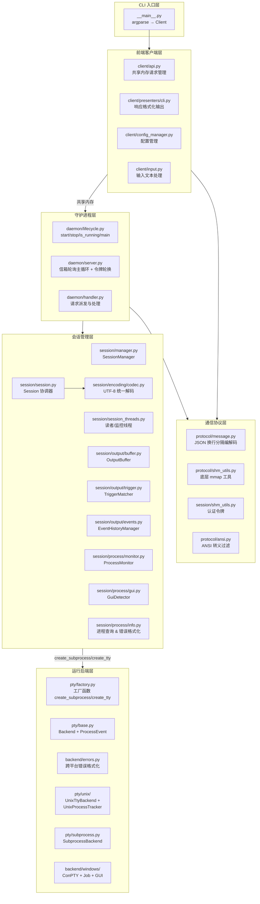
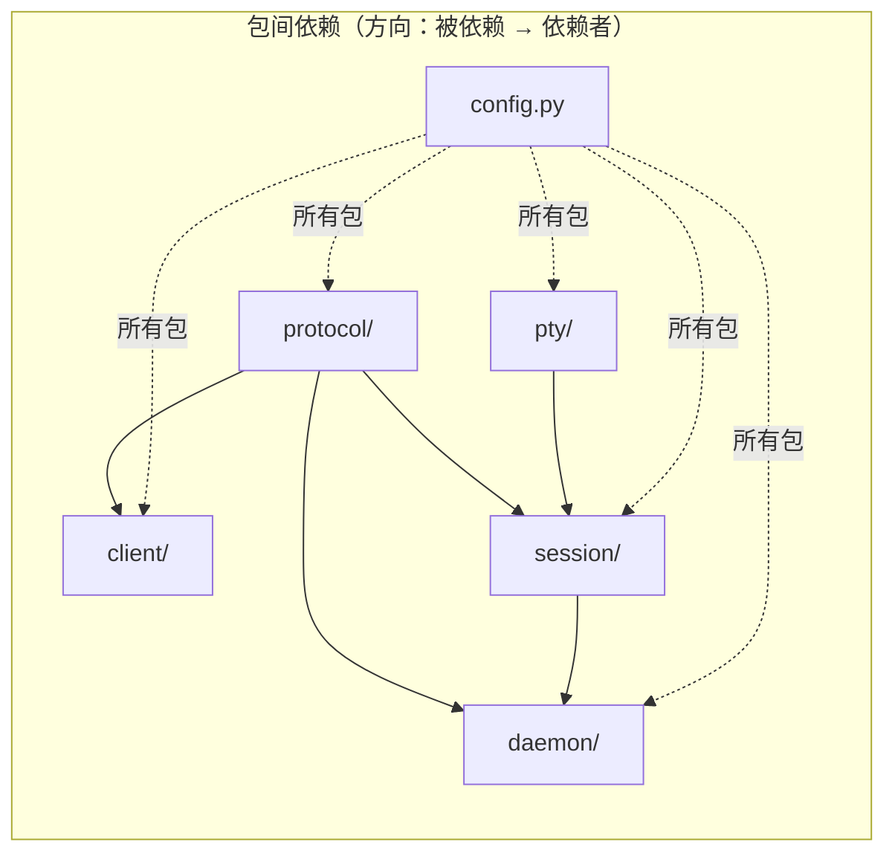

# pty-agent 架构设计

## 1. 文档定位

本文档描述 `src/` 的分层架构与设计决策。**与代码冲突时以代码为准**；
§4.4 与附录 A/B 是两份易漂移的清单，改动 `src/config.py` 或协议字段时同步它们。

## 2. 现状一览（与代码一致）

- **分层**：`CLI(__main__) → client/api.PtyClient → protocol/request.roundtrip →
  daemon/server + handler → session.Session → backend`；`client` 与 `daemon`
  唯一共享层是 `protocol/`，互不 import。
- **通信**：纯命名共享内存（Windows mmap / Unix 文件 mmap）——信息区（单实例 +
  心跳）、32 槽公平信箱、每次请求一对 req/resp 通道；无 socket、无端口、无锁文件。
- **两种后端互不回退**：`subprocess`（纯管道，默认，`SubprocessBackend`）与
  `pty`（真实终端 `--pty`，`WinTtyBackend`/`UnixTtyBackend` + pyte 仿真）；
  `backend/factory.create_subprocess` / `create_tty` 显式创建，TTY 失败直接报错。
- **呈现与传输解耦**：`client/presenters/cli.py` 负责自然语言呈现，
  `client/api.py` 只返回结构化 dict（MCP 等前端可复用同一门面）。
- **2026-09 一次性大重构（无兼容残留）**：删除 TCP 通信、`--offset` 增量读取、
  `strip_ansi`、JSON 输出模式、编码探测、ConDrv 后端、`kill` 命令（改名 `remove`）；
  `send` 的输入文本改为 `-i/--input` 选项。
---


## 3. 架构设计原则

项目遵循以下设计原则：

1. **单一职责**：每个模块只做一件事
2. **高内聚低耦合**：相关功能内聚到同一模块，模块间通过明确定义的接口通信
3. **平台对称隔离**：Windows 实现隔离在 `backend/windows/`、Unix 实现隔离在 `backend/unix/`，
   两平台通过统一的 `Backend` 抽象接口对齐，互不加载对方代码
4. **配置集中**：所有常量统一在 `config.py` 管理
5. **可测试性**：每个模块可独立测试，方便 mock
6. **可扩展性**：新增 PTY 后端只需添加单个文件；新增 CLI 子命令流程清晰

---

## 4. 重构后架构

### 4.1 目录结构总览

```
src/
├── __main__.py              # CLI 入口（参数解析 + 配置管理 + 命令派发）
│
├── config.py                # 所有配置常量集中管理（纯数据，零依赖）
│
├── protocol/                # ═══════ 通信协议层 ═══════
│   ├── message.py           # Message 类（JSON 换行分隔协议：编码 / 解码）
│   ├── shm_utils.py         # 共享内存底层工具（Windows 命名 mmap / Unix 文件 mmap）
│   ├── shm.py               # 共享内存通信协议（信息区 / 信箱 / 请求响应通道）
│   ├── request.py           # roundtrip() 统一共享内存请求门面
│   ├── auth.py              # 认证令牌（生成/读写/清理）
│   └── daemon_utils.py      # 守护进程存活检测（pid_exists/heartbeat_fresh）
│
├── client/                  # ═══════ 前端客户端层 ═══════
│   ├── api.py               # PtyClient 门面（构建请求 → roundtrip → dict，不呈现）
│   ├── controller.py        # 守护进程管控（start/stop/is_running/客户端日志）
│   ├── config_manager.py    # 纯内存客户端配置管理（--default 临时覆盖）
│   ├── input.py             # 输入文本处理（process_input / safe_print）
│   └── presenters/          # 呈现层（cli.py 自然语言；MCP 契约位）
│
├── daemon/                  # ═══════ 守护进程层 ═══════
│   ├── __main__.py          # 入口（`python -m src.daemon`），转调 lifecycle.main()
│   ├── lifecycle.py         # 生命周期管理：start_daemon / stop_daemon / is_running / main
│   ├── server.py            # DaemonServer（信箱轮询主循环 + 令牌轮换 + 清理）
│   └── handler.py           # RequestHandler（消息派发 + 各命令处理逻辑）
│
├── pty/                     # ═══════ 运行后端层 ═══════
│   ├── factory.py           # 工厂函数 create_subprocess/create_tty + 平台检测
│   ├── base.py              # Backend 抽象基类 + ProcessEvent（统一接口）
│   ├── errors.py            # 跨平台退出码/错误格式化（STILL_ACTIVE / format_exit_code_message）
│   ├── subprocess.py        # SubprocessBackend（纯管道保底，支持 --shell）
│   ├── unix/                # ═══ Unix 实现包（仅 Unix 加载） ═══
│   │   ├── __init__.py      # 导出 UnixTtyBackend / UnixProcessTracker
│   │   ├── pty.py           # UnixTtyBackend（os.openpty + fork + termios）
│   │   └── tracker.py       # UnixProcessTracker（/proc 进程树追踪，对齐 Job Object）
│   └── windows/             # ═══ Windows 实现包（仅 Win32 加载） ═══
│       ├── __init__.py      # 导出 WinTtyBackend / ProcessJob 等
│       ├── convars.py       # Windows ctypes 类型定义 + 全部 API 函数绑定
│       ├── kernel32_api.py  # WinTtyBackend（CreatePseudoConsole 路径）
│       ├── job.py           # ProcessJob + JobNotification（进程树追踪 + IOCP 通知）
│       ├── gui_monitor.py   # GuiWindowMonitor + GuiWindowInfo（EnumWindows GUI 窗口轮询）
│       └── error_msg.py     # Windows NTSTATUS/Win32 错误码格式化
│
└── session/                 # ═══════ 会话管理层 ═══════
    ├── manager.py           # SessionManager（会话 CRUD + stop_all）
    ├── session.py           # Session 协调器（组合各子组件，委托线程管理）
    ├── wake.py              # WakeSignal —— 多路唤醒锚（触发/GUI/崩溃/退出共用）
    ├── session_threads.py   # SessionThreads + SessionComponents（后台读者/监控线程管理）
    ├── shm_utils.py         # 认证令牌共享内存工具
    ├── encoding/            # ═══ 编码子包 ═══
    │   ├── __init__.py      # 导出 decode_utf8
    │   └── codec.py         # UTF-8 统一解码 + 智能尾部裁剪（decode_utf8 / _utf8_trim_tail）
    ├── output/              # ═══ 输出子包 ═══
    │   ├── __init__.py      # 导出 OutputBuffer / TriggerMatcher / EventHistoryManager
    │   ├── buffer.py        # OutputBuffer（线程安全输出缓冲区）
    │   ├── trigger.py       # TriggerMatcher + safe_regex_search（触发条件匹配 + ReDoS 防护）
    │   └── events.py        # EventHistoryManager + PendingEvent（事件队列 + 历史归档）
    └── process/             # ═══ 进程子包 ═══
        ├── __init__.py      # 导出 ProcessMonitor / GuiDetector / 工具函数
        ├── monitor.py       # ProcessMonitor（IOCP 通知排空 + 崩溃检测）
        ├── info.py          # 进程查询与错误格式化（_get_process_name / _format_exit_code_message）
        └── gui.py           # GuiDetector（GUI 窗口轮询检测，2s 节流）
```

### 4.2 分层架构图


```mermaid
graph TB
    subgraph CLI["CLI 入口层"]
        MAIN["__main__.py<br/>argparse → Client"]
    end

    subgraph CLIENT["前端客户端层"]
        TRANS["client/api.py<br/>共享内存请求管理"]
        FORM["client/presenters/cli.py<br/>响应格式化输出"]
        CFGM["client/config_manager.py<br/>配置管理"]
        INP["client/input.py<br/>输入文本处理"]
    end

    subgraph PROTO["通信协议层"]
        MSG["protocol/message.py<br/>JSON 换行分隔编解码"]
        SHM_UTIL["protocol/shm_utils.py<br/>底层 mmap 工具"]
        SHM["protocol/shm.py<br/>共享内存协议（信箱/信息区/通道）"]
        ANSI["protocol/ansi.py<br/>ANSI 转义过滤"]
    end

    subgraph DAEMON["守护进程层"]
        DLIFE["daemon/lifecycle.py<br/>start/stop/is_running/main"]
        SRV["daemon/server.py<br/>信箱轮询主循环 + 令牌轮换"]
        HDL["daemon/handler.py<br/>请求派发与处理"]
    end

    subgraph SESS["会话管理层"]
        SMGR["session/manager.py<br/>SessionManager"]
        SES["session/session.py<br/>Session 协调器"]
        STHR["session/session_threads.py<br/>读者/监控线程"]
        OBUF["session/output/buffer.py<br/>OutputBuffer"]
        TRIG["session/output/trigger.py<br/>TriggerMatcher"]
        EHIST["session/output/events.py<br/>EventHistoryManager"]
        PMON["session/process/monitor.py<br/>ProcessMonitor"]
        GDET["session/process/gui.py<br/>GuiDetector"]
        PROC["session/process/info.py<br/>进程查询 & 错误格式化"]
        ENC["session/encoding/codec.py<br/>UTF-8 统一解码"]
        SHM["session/shm_utils.py<br/>认证令牌"]
    end

    subgraph PTY["运行后端层"]
        PFAC["pty/factory.py<br/>工厂函数 create_subprocess/create_tty"]
        PBASE["pty/base.py<br/>Backend + ProcessEvent"]
        ERR["backend/errors.py<br/>跨平台错误格式化"]
        UNX["pty/unix/<br/>UnixTtyBackend +<br/>UnixProcessTracker"]
        SUB["pty/subprocess.py<br/>SubprocessBackend"]
        WIN["backend/windows/<br/>ConPTY + Job + GUI"]
    end

    MAIN --> CLIENT
    CLIENT -->|共享内存| DAEMON
    CLIENT --> PROTO
    DAEMON --> PROTO
    DAEMON --> SESS
    SESS -->|create_subprocess/create_tty| PTY
    SES --> ENC
```

### 4.3 各层详细说明

#### 4.3.1 `protocol/` — 通信协议层

**定位**：被 `client/` 和 `daemon/` 双方共同依赖的基础层，零业务逻辑。
自共享内存重构后，本层承担全部进程间通信（替代原 TCP socket）。

| 模块 | 类/函数 | 职责 |
|------|---------|------|
| `message.py` | `Message.encode(obj)` → `bytes` | 将 dict 编码为 JSON 行 + `\n` + UTF-8 |
| `message.py` | `Message.decode(data)` → `dict\|None` | 从 bytes 解码为 dict（解析失败返回 None） |
| `shm_utils.py` | `open_shm(name, size)` / `close_shm()` / `read_bytes()` / `write_bytes()` / `read_text()` / `write_text()` / `cleanup_shm()` | 底层跨平台 mmap 工具（Windows 命名 mmap / Unix 文件 mmap），零业务逻辑 |
| `shm.py` | `write_daemon_info_handle()` / `read_daemon_info()` / `cleanup_daemon_info()` | 守护进程信息区（PID + 状态 + 心跳），单实例检测 |
| `shm.py` | `Mailbox` 类 | 请求信箱：`acquire_slot()` / `wait_done()` / `release_slot()` / `find_pending()` / `mark_done_owned()` / `reclaim_orphan_claimed()`，32 固定槽位，状态机：EMPTY → CLAIMED → PENDING → PROCESSING → DONE → EMPTY |
| `shm.py` | `make_channel_names(pid, seq)` | 生成请求/响应共享内存名（`PTYAgentReq_{pid}_{seq}` / `PTYAgentResp_{pid}_{seq}`） |
| `shm.py` | `write_message()` / `read_message()` | 向共享内存通道写入/读取 JSON 消息（支持大响应截断 + truncated 标志） |
| ~~`ansi.py`~~ 已删除 | `strip_ansi(text)` → `str` | 去除 ANSI 颜色/样式码，保留清屏/光标等控制序列 |
| ~~`ansi.py`~~ 已删除 | `_ANSI_RE` | 匹配 CSI SGR + OSC 的正则（光标/清屏不匹配） |

**设计要点**：
- `Message` 维持静态类设计（无状态），仅负责编解码，不依赖传输层
- 通信协议：客户端创建命名共享内存（请求 + 响应各一块），注册到信箱槽位；守护进程轮询信箱、处理请求、写响应、标记 DONE；客户端轮询等待 DONE 后读取
- 槽位状态机：`EMPTY → PENDING → PROCESSING → DONE → EMPTY`（单字节写 + 读回验证实现抢槽原子性）
- 大响应处理：JSON 超限时先移除 debug 段，再二分截断 output 字段，标记 `truncated`

#### 4.3.2 `client/` — 前端客户端层

**定位**：封装与守护进程的共享内存通信，向 CLI 入口提供简洁接口。

| 模块 | 类/函数 | 职责 |
|------|---------|------|
| `api.py` | `PtyClient` 类 | 向 CLI 暴露 `cmd_start()` / `cmd_stop()` / `cmd_list()` / `cmd_exec()` / `cmd_send()` / `cmd_read()` / `cmd_remove()` / `cmd_closewin()`，一律返回结构化 dict（不呈现） |
| `api.py` | `PtyClient._send(msg)` | 确保守护进程在运行后发一次往返（委托 `client.controller.ensure_daemon`） |
| `protocol/request.py` | `roundtrip(msg, timeout)` | 共享内存一次往返：注册信箱槽→写请求→等 DONE→读响应；令牌在此注入 |
| `api.py` | `_has_shell_operators(cmd)` | 检测 shell 操作符 token（`\|`, `||`, `&`, `&&`, `;`, `>`, `<`, `>>`） |
| `presenters/cli.py` | `print_response(resp, show_debug=…)` | 由调用方传入呈现开关（无全局 setter） |
| `presenters/cli.py` | `CliPresenter` / `print_response` | 把响应 dict 呈现为自然语言（呈现与传输解耦） |
| `presenters/cli.py` | `_print_result(resp)` / `_print_ok(resp)` | 打印 result 类型 / ok 类型响应 |
| `presenters/cli.py` | `_format_event(ev)` | 格式化单个事件为显示行 |
| `config_manager.py` | `ConfigManager` 类 | 纯内存配置管理器，支持 `--default` 临时覆盖默认值（不持久化） |
| `config_manager.py` | `ConfigManager.get()` / `set()` / `show()` | 读取/设置/展示配置 |
| `input.py` | `process_input(text)` → `str` | 原样发送 + 自动追加换行（用于 send 命令） |
| `input.py` | `safe_print(text, **kwargs)` | 安全打印（自适应控制台编码，GBK 终端强制 UTF-8 输出） |

**设计要点**：
- `Client._ensure_daemon()` 在 `is_running()` 返回 False 时自动 `start_daemon()`，无需用户手动 start
- `print_response` 以**自然语言模式**做人类可读格式化：程序输出到 stdout，元数据/调试信息到 stdout
- `_setup_logging()` 在 `DAEMON_LOG_LEVEL=None` 时为所有守护进程 logger 添加 `NullHandler` + `propagate=False`，阻止 Python lastResort handler 将 WARNING+ 日志泄漏到 stderr
- `_SHOW_DEBUG` 全局标志控制 debug 段输出（进程树/GUI 窗口/事件）：`--no-debug` 或 `--default debug off` 关闭后隐藏 debug/事件段
- `ConfigManager` 管理调用级默认配置（timeout/newline/debug），纯内存不持久化，`cmd_*()` 方法在构建请求时应用配置默认值
- `--default` 临时覆盖默认值，仅本次调用有效
- 每个 `cmd_*` 方法仅负责构建请求 dict + 调用 `_send_recv` + 调用 `print_response`

#### 4.3.3 `daemon/` — 守护进程层

**定位**：共享内存信箱服务器，轮询客户端请求，委派会话管理/PTY 层处理，返回响应。

| 模块 | 类/函数 | 职责 |
|------|---------|------|
| `lifecycle.py` | `is_running()` → `bool` | 共享内存单实例检测（PID 存在 + 心跳新鲜） |
| `lifecycle.py` | `start_daemon()` | 以子进程方式启动守护进程（Win: DETACHED_PROCESS，Unix: 双 fork），纯共享内存 |
| `lifecycle.py` | `stop_daemon()` | 发送 stop 请求（信箱）并等待确认，失败则强制终止 |
| `lifecycle.py` | `main()` | 守护进程入口：创建 DaemonServer 并运行 |
| `lifecycle.py` | `_safe_print(text)` | 安全打印 UTF-8 文本到 stdout |
| `lifecycle.py` | `_cleanup_shm_resources()` | 清理共享内存（守护进程信息区 + 认证令牌） |
| `lifecycle.py` | `_setup_logging()` | 配置日志（仅文件输出 UTF-8，无控制台；`DAEMON_LOG_LEVEL=None` 时添加 NullHandler 阻止 lastResort 泄漏） |
| `server.py` | `DaemonServer` 类 | 信箱轮询主循环、令牌轮换、`run()` / `stop()` / `_cleanup()` |
| `server.py` | `DaemonServer._schedule_rotate()` / `_rotate_token()` | 令牌定时轮换（30 分钟周期 + 2 分钟宽限） |
| `server.py` | `DaemonServer._handle_slot()` | 处理信箱槽位：读请求通道 → handler.handle → 写响应通道 → 标记 DONE |
| `handler.py` | `RequestHandler` 类 | `handle(msg)` → `dict` 主派发 + `_handle_exec()` / `_handle_send()` / `_handle_read()` / `_handle_remove()` / `_handle_closewin()` |
| `handler.py` | `RequestHandler._build_result()` | 构建统一 `result` 类型响应（含 trigger/program/debug 三层） |
| `handler.py` | `RequestHandler._run_trigger_flow()` | 通用触发流程（exec/send 复用） |
| `handler.py` | `RequestHandler._run_no_trigger_flow()` | 无触发条件流程 |
| `handler.py` | `RequestHandler.add_valid_token()` / `_is_token_valid()` | 多令牌验证（轮换宽限期） |
| `handler.py` | `RequestHandler._validate_request()` | 批量验证请求字段长度 |

**设计要点**：
- `daemon/lifecycle.py` 承担生命周期管理职责（启动/停止/检测/入口），`daemon/__main__.py` 仅转调 `lifecycle.main()`
- 通信协议：守护进程通过 Mailbox 轮询发现请求，通过共享内存通道收发 JSON 消息，无 socket 依赖
- `RequestHandler.handle(msg)` 接收请求 dict，返回响应 dict，由 `DaemonServer._handle_slot()` 负责写入共享内存通道
- 新命令类型：在 `handler.py` 中添加 `elif` 分支，加对应 `_handle_xxx()` 方法
- `start_daemon()` 自动计算项目根目录作为子进程 `cwd`（`__file__` 向上 3 层），确保 `python -m src.daemon` 无论从何目录调用都能找到 `src` 包
- 子进程 `stderr` 重定向到 `daemon.log`（而非 `DEVNULL`），启动崩溃时可在日志中看到完整 Traceback
- `_run_trigger_flow()` 将 exec/send 共用的触发等待逻辑抽取为通用方法，避免代码重复

#### 4.3.4 `backend/` — 运行后端层

**定位**：封装不同平台/路径的 PTY 实现，向 `session/` 层提供统一的 `Backend` 接口。

| 模块 | 类/函数 | 职责 |
|------|---------|------|
| `factory.py` | `create_subprocess/create_tty(command, cols, rows, shell=None)` → `Backend` | 工厂函数，按优先级尝试各后端 |
| `base.py` | `Backend` + `ProcessEvent` | 统一抽象接口 + 跨平台进程事件数据结构 |
| `errors.py` | `STILL_ACTIVE` / `format_exit_code_message()` / `translate_exit_code()` / `signal_name()` | 跨平台退出码/错误格式化（Windows 委托 error_msg，Unix 信号名描述） |
| `unix/__init__.py` | `UnixTtyBackend` / `UnixProcessTracker` | 导出 Unix 后端实现 |
| `unix/pty.py` | `UnixTtyBackend` | `os.openpty()` + `os.fork()` + `execvpe()`，非阻塞 I/O，集成 UnixProcessTracker |
| `unix/tracker.py` | `UnixProcessTracker` | /proc BFS 进程树追踪（对齐 Windows Job Object），`get_process_list()` / `remove_tree()`（退出码由 pty.py 缓存管理） |
| `subprocess.py` | `SubprocessBackend` | `subprocess.Popen` 管道模式，集成 ProcessJob + GuiWindowMonitor（Windows） |
| `windows/__init__.py` | 导出全部 Windows 后端 | 对称包结构 |
| `windows/convars.py` | 全部 `_*` ctypes 类型 + API 绑定 | 集中管理 Windows API 声明（唯一的 API 声明文件） |
| `windows/kernel32_api.py` | `WinTtyBackend` | `CreatePseudoConsole` API 路径，集成 ProcessJob + GuiWindowMonitor |
| `windows/job.py` | `ProcessJob` + `JobNotification(ProcessEvent)` | Job Object 封装：进程树追踪、IOCP 实时通知、KILL_ON_JOB_CLOSE |
| `windows/gui_monitor.py` | `GuiWindowMonitor` + `GuiWindowInfo` | EnumWindows 轮询检测 GUI 窗口，SendMessage(WM_CLOSE) 关闭 |
| `windows/error_msg.py` | `translate_windows_error()` / `format_process_exit_code()` / `format_create_process_error()` | Windows NTSTATUS/Win32 错误码格式化（名称映射 + FormatMessageW） |

**设计要点**：
- `base.py` 定义了最小接口契约，所有具体 PTY 后端必须实现全部方法
- `ProcessEvent` 跨平台数据结构统一 Windows（JobNotification）与 Unix 的事件通知
- `errors.py` 提供跨平台退出码格式化，Windows 委托 `error_msg.py`，Unix 通用格式
- `drain()` 方法：`read()` 后立即调用，将 OS 管道缓冲区中所有当前就绪数据一次性取回。解决程序输出被多次 `read` 打散的问题，确保触发检测在完整数据块上进行
  - Unix PTY：非阻塞 `os.read` 循环排空
  - Windows ConPTY：`PeekNamedPipe` 检查可用字节 + `ReadFile` 读取
  - Subprocess：继承基类默认实现（返回 `b""`，因管道阻塞不可排空）
- 平台包结构对称：`unix/` 与 `windows/` 均为独立包，各有 `__init__.py` 导出
  - `unix/` 仅在非 Windows 平台被实例化（模块导入安全，POSIX 特有导入延迟在函数内）
  - `windows/` 仅在 `IS_WINDOWS` 为 True 时才被导入（在 `factory.py` 中条件导入）
- `unix/tracker.py` 通过 `/proc` 文件系统 BFS 遍历构建进程树，对齐 Windows Job Object 的
  `get_process_list()` / `remove_tree()` 能力。退出码查询仅直接子进程可用（Unix 限制）
- `windows/convars.py` 作为唯一的 Windows API 声明文件，便于审计和维护
- `create_subprocess/create_tty` 工厂按优先级尝试：`ConPTY → subprocess`（Win）/ `Unix → subprocess`（Unix）
  — 字符串命令跳过所有 PTY 后端直接使用 subprocess。
- 新增 PTY 后端只需：创建新文件 → 继承 `Backend` → 在 `create_subprocess/create_tty` 的优先级链中添加

#### 4.3.5 `session/` — 会话管理层

**定位**：管理 PTY 会话的生命周期，通过**组合模式**将职责委派给独立子组件。

| 模块 | 类/函数 | 职责 |
|------|---------|------|
| `manager.py` | `SessionManager` | `create_session(id, command, shell)` / `get_session()` / `list_sessions()` / `remove_session()` / `stop_all()` |
| `session.py` | `Session` 类（协调器，~510 行） | 属性：`id`, `command`, `running`, `exit_code`, `error_message`, `mode`, `pty_type`, `gui_windows`, `processes` |
| `session.py` | `Session.start()` / `stop()` | 创建 PTY + 启动读者/监控线程 + 组件重置 / 优雅关闭 |
| `session.py` | `Session.write_input()` / `get_output()` | 写入输入到 PTY（UTF-8 编码） / 从输出缓冲区读取解码 |
| `session.py` | `Session.set_trigger()` / `wait_for_trigger()` / `clear_trigger()` | 触发条件管理（委托 TriggerMatcher） |
| `session.py` | `Session.consume_events()` | 事件消费（委托 EventHistoryManager） |
| `session.py` | `Session.close_window()` | 关闭 GUI 窗口（委托 GuiDetector） |
| `session_threads.py` | `SessionThreads` | 后台读者线程 + 监控线程管理（启动/停止/循环逻辑） |
| `session_threads.py` | `SessionComponents` | 子组件引用容器数据类（pty_provider / out_buf / trig_mat / proc_mon / gui_detector / session_id / on_exit） |
| `session_threads.py` | `_capture_exit_code_retry()` | 带重试的退出码获取（retries=10） |
| `output/buffer.py` | `OutputBuffer` | 线程安全字节缓冲区、读周期计数、首次输出 Event、超限丢弃前半部分 |
| `output/trigger.py` | `TriggerMatcher` | 正则/子串匹配、换行策略、新鲜模式、静默超时、ReDoS 防护 |
| `output/trigger.py` | `safe_regex_search()` | ReDoS 防护（共享线程池 + 超时降级） |
| `output/events.py` | `EventHistoryManager` + `PendingEvent` | 待处理队列 + 历史归档、`_events_to_dicts()` |
| `process/monitor.py` | `ProcessMonitor` | IOCP 通知排空、崩溃信号 Event、进程名称缓存 |
| `process/info.py` | `_get_process_name()` / `_get_process_path()` | 通过 PID 获取可执行文件名/路径 |
| `process/info.py` | `_format_exit_code_message()` / `_format_pty_error()` / `_signal_name()` | 退出码与 PTY 错误格式化 |
| `encoding/codec.py` | `decode_utf8()` / `_utf8_trim_tail()` | UTF-8 统一解码（纯函数，无状态），含智能尾部裁剪 |
| `process/gui.py` | `GuiDetector` | GUI 窗口轮询检测（节流 2s），`check()` / `clear()` / `arm()`（建立本轮基线）/ `consume_detection()`（判定并消费新窗口边沿），属性：`gui_windows` / `processes` / `detected_event` |
| `shm_utils.py` | `generate_auth_token()` / `read_auth_token()` / `write_auth_token()` / `cleanup_auth_shm()` | 认证令牌共享内存工具（Windows 命名 mmap，Unix 文件回退） |

**设计要点**：
- `Session` 不直接创建 PTY 实例，而是通过 `create_subprocess/create_tty()` 工厂获得
- Session 通过 `@property` 公开子组件：`session.output_buffer` / `session.trigger_matcher` / `session.event_history` / `session.process_monitor`
- `Session._reader_loop()` 和 `_monitor_loop()` 已迁移到 `session_threads.py` 的 `SessionThreads` 类中，Session 通过组合持有 `SessionThreads` 实例，避免自身过于臃肿
- `SessionComponents` 数据类将后台线程所需的所有子组件引用打包传递，避免循环依赖
- `encoding/codec.py` 将 UTF-8 解码逻辑从 `Session` 类中抽离为纯函数，便于测试
- `decode_utf8()` 统一解码终端输出，`_utf8_trim_tail()` 处理管道跨读周期的截断字符
- `GuiDetector` 封装 GUI 窗口检测逻辑（2s 节流轮询），从 Session 中独立出来
- 触发检测基于 `threading.Event`，线程安全
- 输出缓冲区大小上限由 `config.py` 集中控制
- `OutputBuffer` 内部使用 `RLock`（可重入锁），允许 `_reader_loop` 在持锁上下文中调用 `append()`
- Session 支持 `shell` 参数指定解释器（cmd/powershell/pwsh/bash），传递给 `create_subprocess/create_tty()` 工厂
- `encoding/codec.py` 保留智能裁剪（`_utf8_trim_tail`），避免线性截断性能损耗

### 4.4 `config.py` — 配置中心

```python
"""集中管理所有配置常量"""

import os
import sys

# ── 日志 ──
# 日志级别: "DEBUG" / "INFO" / "WARNING" / "ERROR" / "CRITICAL"
# 设为 None 则不写日志
DAEMON_LOG_LEVEL = "DEBUG"
CLIENT_LOG_LEVEL = "DEBUG"
CLIENT_DEBUG = True

# ── 文件路径 ──
DATA_DIR = os.path.join(os.path.expanduser("~"), ".pty-agent")  # Unix 共享内存文件目录
PROJECT_ROOT = os.path.dirname(os.path.dirname(os.path.abspath(__file__)))
LOG_DIR = os.path.join(PROJECT_ROOT, "logs")

# ── 输出缓冲 ──
MAX_OUTPUT_BUFFER = 100 * 1024 * 1024    # 100 MB，会话输出缓冲区上限
MAX_TRIGGER_SCAN  = 10 * 1024 * 1024     # 10 MB，触发检查最大扫描范围

# ── 超时 ──
DEFAULT_TRIGGER_TIMEOUT = 120.0          # 触发等待超时（秒）
DAEMON_START_TIMEOUT    = 3.0            # 守护进程启动等待（秒）
DAEMON_START_POLL_INTERVAL = 0.2         # 等待守护进程就绪的轮询间隔（秒）
STOP_TIMEOUT            = 3.0            # 停止守护进程超时（秒）
EXIT_CODE_POLL_INTERVAL = 0.05           # 退出码获取重试间隔（秒）

# ── 共享内存轮询 ──
DAEMON_POLL_INTERVAL    = 0.1            # 守护进程信箱轮询间隔（秒）
CLIENT_POLL_INTERVAL    = 0.01           # 客户端等待 DONE 标记的轮询间隔（秒）
DAEMON_HEARTBEAT_INTERVAL = 1.0          # 守护进程心跳更新间隔（秒）
DAEMON_HEARTBEAT_FRESH  = 10.0           # 心跳新鲜阈值（秒，超过视为僵死）

# ── 其他 ──
PTY_READ_SIZE          = 65536

# ── 输入长度限制（防资源耗尽）──
MAX_SESSION_ID_LEN     = 128      # 会话标识符最大长度
MAX_COMMAND_LEN        = 65536    # 命令字符串最大长度（64 KB）
MAX_PATTERN_LEN        = 4096     # 触发/过滤正则最大长度（4 KB）
MAX_INPUT_LEN          = 65536    # send 输入文本最大长度

# ── 共享内存 — 守护进程信息区（单实例 + 心跳）─
# 格式: "PID:状态:心跳时间戳"（如 "5488:1:1234567890.123"）
# 状态: 0=停止, 1=运行
MMAP_DAEMON_INFO_NAME = "Local\\PTYAgentDaemon"
MMAP_DAEMON_INFO_SIZE = 64

# ── 共享内存 — 请求信箱（客户端 → 守护进程）─
MMAP_MAILBOX_NAME = "Local\\PTYAgentMailbox"
MAILBOX_SLOT_COUNT = 32
MAILBOX_SLOT_SIZE = 256
MAILBOX_SIZE = MAILBOX_SLOT_COUNT * MAILBOX_SLOT_SIZE

# ── 共享内存 — 请求/响应通道 ──
REQ_SHM_SIZE = 256 * 1024         # 256 KB，请求 JSON 最大 64KB
RESP_SHM_SIZE = 64 * 1024 * 1024  # 64 MB，响应 JSON（超出截断+truncated 标志）

# ── 认证令牌（同用户会话隔离，防跨用户越权）─
# 令牌通过共享内存在守护进程与客户端之间传递，每次请求携带。
# 令牌每 30 分钟轮换限制泄露窗口。
AUTH_TOKEN_NAME = "Local\\PTYAgentAuth"
AUTH_TOKEN_SIZE = 64  # hex-encoded 32-byte token
AUTH_TOKEN_ROTATE_INTERVAL = 1800  # 令牌轮换周期（秒），默认 30 分钟
AUTH_TOKEN_GRACE_PERIOD    = 120   # 旧令牌宽限期（秒），轮换后 2 分钟内仍有效

# ── 平台 ──
IS_WINDOWS = sys.platform == "win32"

# ── 日志体积与受管 logger（清单见附录 B）──
LOG_MAX_BYTES / LOG_BACKUP_COUNT / MANAGED_LOGGERS
```

---

## 4.5 新增子系统

### 4.5.1 `backend/windows/job.py` — Job Object 进程树追踪

```python
class ProcessJob:
    """Windows Job Object 封装

    追踪整个进程树（含子/孙进程），支持:
    - KILL_ON_JOB_CLOSE：关闭句柄时自动终止所有关联进程
    - 查询 Job 内所有进程 PID 列表
    - 获取单个子进程退出码（用于崩溃检测）
    """
```

| 方法 | 功能 |
|------|------|
| `assign(hprocess)` | 将进程分配到 Job（子进程自动继承） |
| `query_process_list()` | 获取 Job 内所有进程的 PID 列表 |
| `get_process_count()` | 当前进程数 |
| `set_pid_listener(fn)` | 注册新进程回调（IOCP NEW_PROCESS 时调用；驱动 GUI hook 装载） |
| `set_exit_listener(fn)` | 注册进程退出回调（驱动 GUI hook 卸载，防长时间会话泄漏） |
| `close()` | 关闭 Job 句柄 → KILL_ON_JOB_CLOSE 终止所有进程 |

所有 PTY 后端（`SubprocessBackend`、`WinTtyBackend`）均集成 Job Object。

### 4.5.2 `backend/windows/gui_monitor.py` — GUI 窗口检测

```python
class GuiWindowMonitor:
    """GUI 窗口检测器（事件驱动 + 兜底扫描）

    主路径：对 Job 进程树中每个 PID 装载 SetWinEventHook(WINEVENT_OUTOFCONTEXT)，
      窗口有可访问性变化时系统立即回调，回调内校验「可见 + 非 WS_CHILD」后入队。
      hook 的装载/卸载都在专用消息泵线程上进行（OUTOFCONTEXT 回调只投递给
      装载它的线程），新 PID 经 PostThreadMessageW 转交给泵线程。
    辅路径：EnumWindows 扫描 + Job PID 比对，默认 5s 一次，兜住
      「窗口在 hook 装载完成前就已显示」的竞态并自愈漏投。
    - 基于 hwnd 去重（事件与扫描共用同一集合），同一窗口只上报一次
    - 线程安全（RLock：扫描持锁期间 EnumWindows 回调在同线程重入取锁）
    - 标题用 SendMessageTimeoutW(WM_GETTEXT, SMTO_ABORTIFHUNG) 读取，
      目标 UI 线程假死时最多损失 200ms，不会挂死检测线程
    - 通过 SendMessage(WM_CLOSE) 关闭指定窗口
    """
```

| 方法 | 功能 |
|------|------|
| `poll()` | 取走事件队列 + 按节流执行一次兜底扫描，返回本轮新增窗口 |
| `sweep_now()` | 立即全量扫描（忽略节流） |
| `take_pending()` | 只取事件队列（无节流；等待循环每轮调用） |
| `set_listener(cb)` | 注册"有新窗口待取"回调；注册时若有积压立即补触发一次 |
| `attach_pid(pid)` / `detach_pid(pid)` | 为进程树新增/退出 PID 装卸 hook（由 Job 通知驱动） |
| `close_window(hwnd)` | 发送 WM_CLOSE 关闭窗口 |
| `clear()` / `close()` | 重置去重状态 / 停泵线程并卸载全部 hook |

> **实测坑位（务必保留此说明）**：本机 Win11 + Python 3.11 下，`EVENT_OBJECT_*`
> 的 event 参数以 `常量 >> 16` 的形式送达（SHOW 到达时为 `0x8002`），且把
> `eventMin/eventMax` 限定在 `0x80000000+` 区间会**一条都收不到**。因此装载一律
> 用全范围 `EVENT_MIN..EVENT_MAX`，并且**回调不判读 event 号**，改由 hwnd 的
> 可见性与样式决定 —— CREATE 时窗口尚不可见自然被拒，随后的 SHOW 通过。
> 另：`GetAncestor(GA_PARENT)` 对 Tk 的 `TkTopLevel` 也返回非零父，不能用于顶层判定。

GUI 检测**默认启用**，是 `exec/send` 等待循环的**返回条件之一**：与 `--trigger`
平级竞争，谁先命中谁先返回（不存在让位关系）。检测以本轮基线为准——`set_trigger()`
在武装触发条件的同时调用 `GuiDetector.arm()` 丢弃遗留边沿，故只有基线之后新弹出的
窗口才命中；已检出窗口仍在 `debug` 段呈现并作为 `gui_window` 事件上报。
仅 Windows 支持（Job Object + WinEvent hook + EnumWindows 兜底），其余平台
`poll_gui_windows()` / `take_pending_gui_windows()` 恒返回空、`set_gui_listener()` 无操作。

### 4.5.3 `session/` 事件系统

Session 内部维护 **待处理事件队列** 和 **事件历史记录**，实时记录：

| 事件类型 | 触发条件 |
|---------|---------|
| `process_spawn` | 新进程在 Job 内创建 |
| `process_exit` | 进程退出 Job（退出码 = 0） |
| `process_crash` | 进程退出码 ≠ 0（异常崩溃） |
| `gui_window` | 检测到新 GUI 窗口 |

**历史记录**：`consume_events()` 将待处理事件移入 EventHistoryManager 的历史队列，供 `exec/send` 响应携带。

**崩溃自动返回**：`process/monitor.py:ProcessMonitor.drain_notifications()` 从 Job Object IOCP 通知队列检测到 `process_crash` 时设置 `crash_event`（`threading.Event`），`wait_for_trigger()` 在轮询循环中优先检测该标志，检测后立即返回 `reason="crashed"`，无需等待读线程 EOF。

事件消费方式：
- `exec/send` 返回时通过 `_build_result(consume_events=True).debug.pending_events` **自动附带并消费**待处理事件
- `list` 命令显示 `!N` 标记表示有待处理事件
- 事件 `time` 字段为 ISO 8601 格式（如 `"2026-06-07T18:00:00.12"`），非原始 Unix 时间戳

### 4.5.4 独立监控线程

每个 Session 通过 `SessionThreads` 启动一个**独立监控线程**，负责排空 IOCP 进程事件和检测 GUI 窗口：

- **通知消费是事件驱动**的：`ProcessJob` 在收到 IOCP 通知时置位 `_notif_event`，监控线程等待该事件，有通知立即处理，无需 2 秒轮询
- **GUI 检测以事件为主**：WinEvent hook 在窗口显示的瞬间经消息泵线程投回调，
  经 `GuiDetector` 监听回调置边沿并 `WakeSignal.notify()` 唤醒等待循环（实测毫秒级）；
  `GuiDetector.check()` 的 2s 节流与 `GuiWindowMonitor` 的 5s 扫描周期**只约束兜底
  EnumWindows 扫描**，不再决定返回延迟

```python
def _monitor_loop(self):
    while not self._stop_event.is_set():
        self._proc_mon.drain_notifications()  # IOCP 实时通知（非阻塞）
        self._gui_detector.check(pty, session_id)
        # 事件驱动等待：通知到达立即返回，超时则继续循环
        if pty and hasattr(pty, "wait_for_job_notification"):
            pty.wait_for_job_notification(2.0)
        else:
            self._stop_event.wait(2.0)
```

### 4.5.5 Job Object IOCP 实时通知

进程崩溃检测通过 **I/O 完成端口（IOCP）** 实现，无需轮询：

1. `ProcessJob.__init__()` 创建 IOCP + 关联 Job Object
2. 后台线程 `_notification_loop()` 调用 `GetQueuedCompletionStatus` 等待通知
3. Windows 推送消息：`_JOB_OBJECT_MSG_NEW_PROCESS(3)` / `_JOB_OBJECT_MSG_EXIT_PROCESS(4)` / `_JOB_OBJECT_MSG_ABNORMAL_EXIT_PROCESS(5)`
4. 通知存入线程安全队列，`_drain_job_notifications()` 消费
5. 根据退出码判定崩溃（不依赖消息类型）：非零且非 STILL_ACTIVE → `process_crash`

同时设置 `DIE_ON_UNHANDLED_EXCEPTION`（job.py）和 `SetErrorMode`/`SetThreadErrorMode`（subprocess.py），崩溃时**不弹对话框**直接退出。

### 4.5.6 共享内存 + 公平信箱

守护进程通信完全基于共享内存，无 socket、无端口、无锁文件：

- 客户端与守护进程通过命名共享内存（Windows 命名 mmap / Unix 文件 mmap）传递 JSON 消息
- **请求信箱**：固定 32 槽位环形缓冲区，客户端抢占空槽注册请求，守护进程轮询消费
  - 槽位状态机：`EMPTY → PENDING → PROCESSING → DONE → EMPTY`
  - 单字节写 + 读回验证实现跨进程抢槽原子性，无需锁文件
- **请求/响应通道**：每次请求独立命名（`PTYAgentReq_{pid}_{seq}` / `PTYAgentResp_{pid}_{seq}`），请求 256KB，响应 64MB（超限截断 + truncated 标志）
- 守护进程信息区（PID + 状态 + 心跳时间戳）用于单实例检测，心跳每 1 秒刷新，10 秒过期 → 视为僵死
- 通知机制：客户端轮询（10ms 间隔），守护进程轮询（100ms 间隔），跨平台可靠

### 4.5.7 认证令牌系统

客户端与守护进程之间的请求通过**认证令牌**验证身份，防止同用户下其他进程越权操作：

- 守护进程启动时生成 32 字节随机令牌（hex 编码），通过 `write_auth_token()` 写入共享内存
- 客户端发送请求时从信箱槽位携带令牌，守护进程验证匹配后才处理
- 令牌每 `AUTH_TOKEN_ROTATE_INTERVAL`（30 分钟）轮换一次
- 旧令牌有 `AUTH_TOKEN_GRACE_PERIOD`（2 分钟）宽限期，轮换后不影响进行中的请求
- `read_auth_token()` / `write_auth_token()` / `cleanup_auth_shm()` 封装在 `session/shm_utils.py`

### 4.5.8 `backend/windows/error_msg.py` — Windows 错误码格式化

提供 Windows 特有错误退出码（NTSTATUS、Win32 错误码）的格式化输出：

| 函数 | 功能 |
|------|------|
| `translate_windows_error(code)` | 根据内置名称表 + FormatMessageW 格式化错误码 |
| `format_process_exit_code(code)` | 格式化进程退出码（含 NTSTATUS 十六进制显示） |
| `format_create_process_error(code)` | 格式化 CreateProcessW 失败信息 |

内置常见 NTSTATUS 名称映射（STATUS_ACCESS_VIOLATION、STATUS_DLL_NOT_FOUND 等）和 Win32 错误码名称（ERROR_FILE_NOT_FOUND 等），辅助崩溃诊断。

---

## 5. 依赖关系与调用链

### 5.1 包间依赖图


```mermaid
graph LR
    subgraph "包间依赖（方向：被依赖 → 依赖者）"
        PROTO["protocol/"] --> CLIENT["client/"]
        PROTO --> DAEMON["daemon/"]
        PROTO --> SESSION["session/"]
        PTY["pty/"] --> SESSION
        SESSION --> DAEMON
        CONFIG["config.py"] -.->|所有包| PTY
        CONFIG -.->|所有包| PROTO
        CONFIG -.->|所有包| CLIENT
        CONFIG -.->|所有包| DAEMON
        CONFIG -.->|所有包| SESSION
    end
```

**规则**：
- `config.py` 是纯数据文件，被所有包导入，但不导入任何包
- `protocol/` 不依赖任何其他包（除 Python 标准库）
- `backend/` 不依赖 `session/` 或 `daemon/`
- `session/` 依赖 `backend/`（获取 PTY 实例）和 `protocol/`（ANSI 过滤 — 可选）
- `daemon/` 依赖 `session/` 和 `protocol/`
- `client/` 依赖 `protocol/` 和 `daemon/lifecycle.py`（启动/检测守护进程）
- `__main__.py` 只依赖 `client/`

### 5.2 典型调用链

#### exec 流程

```
用户: pty-agent exec myid -c "python -u -i" -t ">>>"

__main__.py:main()
  → argparse 解析 → Client.cmd_exec(...)
  → ConfigManager 加载默认配置，应用 timeout/newline 默认值

client/api.py:PtyClient.cmd_exec()
  → 构建 request dict
  → Client._send_recv(msg)
      → Client._ensure_daemon()
          → if not is_running(): start_daemon()  [自动启动]
      → 创建请求/响应共享内存（PTYAgentReq_{pid}_{seq} / PTYAgentResp_{pid}_{seq}）
      → write_message(req_shm, msg)  [写入 JSON]
      → Mailbox.acquire_slot()  [注册到信箱槽位]
      → Mailbox.wait_done(slot)  [轮询等待 DONE]
      → read_message(resp_shm)   [读取响应]
      → Mailbox.release_slot()
      ──共享内存──┐

daemon/server.py:DaemonServer.run()        ← 轮询信箱
  → Mailbox.find_pending() → 发现 PENDING 槽位 → 创建线程 → _handle_slot()

daemon/server.py:DaemonServer._handle_slot()
  → read_message(req_shm) → 解析 JSON
  → msg["token"] = 槽位令牌（不信任请求体中的 token）
  → RequestHandler.handle(msg) → 返回响应 dict

daemon/handler.py:RequestHandler.handle()
  → msg["type"] == "exec" → self._handle_exec(msg)

daemon/handler.py:_handle_exec()
  → manager.get_session(id)
   → if not exist: manager.create_session(id, command)
       → Session.__init__()
           → 创建 OutputBuffer / TriggerMatcher / EventHistoryManager / ProcessMonitor / GuiDetector / SessionThreads
       → Session.start()
           → pty/factory.py:create_subprocess/create_tty()
           → create PTY instance
           → ProcessMonitor.reset()（清空名称缓存与崩溃信号）
           → SessionThreads.start() → 启动读者线程 + 监控线程
  → session.set_trigger(">>>", newline=False, fresh=False,
  →                      idle_timeout=3, idle_after_first_output=True)
  →      → TriggerMatcher.set(pattern, ...)
  →      → 初次检查：持 OutputBuffer.lock → TriggerMatcher.prepare_snapshot(OutputBuffer)
   → 锁外：TriggerMatcher.check_snapshot(snapshot)，耗时正则不阻塞缓冲区
  → 若无 trigger：_run_no_trigger_flow 检测到 idle_timeout 时，使用永不匹配正
  →       则 `(?!x)x` 进入 wait_for_trigger 等待循环，同样支持静默超时检测
  → matched, reason = session.wait_for_trigger(timeout)
      → 读者线程持续读 PTY → 追加 OutputBuffer → TriggerMatcher 检测
      → 正则匹配命中 → TriggerMatcher._event.set()
      → 输出静默超时：TriggerMatcher.check_idle_timeout() → 返回 "idle_timeout"
       → 监控线程（SessionThreads._monitor_loop）每 2s 排空：ProcessMonitor.drain_notifications() 崩溃 → crash_event.set()
       → WinEvent hook 即时回调检出 new window（兜底扫描仅补漏）→ 唤醒等待循环
         → 与 -t 平级竞争，谁先命中谁先返回 → "gui_detected"
  → output = session.get_output_since_cursor()
  → 返回 result_dict  [含 trigger_matched/reason/program/debug]
      ←─共享内存──
  → write_message(resp_shm, result_dict)
  → Mailbox.mark_done(slot)

client/presenters/cli.py:print_response(resp)
  → 自然语言模式：程序输出到 stdout，元数据格式化输出到 stdout
```

#### send 流程

```
用户: pty-agent send myid -i "print('hello')" -t ">>>"

__main__.py（argparse：输入文本经 --input/-i 传入，无位置参数写法）
  → Client.cmd_send(input_text="print('hello')", ...)
  → process_input("print('hello')")  → "print('hello')\n"
  → _send_recv({"type":"send", "id":"myid", "input":"print('hello')\n", ...})

daemon/handler.py:_handle_send()
  → manager.get_session("myid")
  → session.write_input("print('hello')\n")
      → self._pty.write(data)  [写入 PTY 主端]
  → session.set_trigger(">>>")
  → matched, reason = session.wait_for_trigger(timeout)
  → output = session.get_output_since_cursor()
  → 返回 result_dict（通过共享内存通道返回）
```

#### read 流程

```
用户: pty-agent read myid --lines 5 --grep "Error"

daemon/handler.py:_handle_read()
  → pty 默认 get_output_visible()；--full/--lines/--grep 走 get_output_full()/get_output_lines()
  → 行过滤 + grep 过滤
  → 返回 result_dict（通过共享内存通道返回）
```

---

---

## 6. 设计决策摘要

| 决策 | 说明 |
|------|------|
| `protocol/` 独立为层 | `Message`、`shm_utils`、`shm`（以及 `request.roundtrip`）被 client 和 daemon 两端使用，独立为底层设施，避免循环依赖 |
| 通信改为共享内存 | 替代原 TCP socket：无端口、无锁文件，单实例检测基于 PID + 心跳，避免端口冲突/TIME_WAIT/锁文件残留 |
| `backend/windows/` 子包隔离 | Windows 特有代码（ctypes API 声明等）放入独立子包，Unix 平台零加载 |
| `pty/unix/` 对称包结构 | 由单文件 `unix.py` 重构为 `unix/` 包，与 `windows/` 对称，两者通过统一接口对齐 |
| `errors.py` 跨平台 | 退出码/错误格式化统一抽象，Windows 委托 error_msg，Unix 通用格式 |
| `ProcessEvent` 统一数据结构 | 替代 `JobNotification` 独占，Windows 继承该类，Unix 返回空列表（接口对齐） |
| `client/` 分层 | `api.py`（请求构建门面）、`controller.py`（守护进程管控）、`presenters/`（输出呈现）、`input.py`（文本处理） |
| `config.py` 集中管理 | 所有魔数常量（共享内存、缓冲区、超时）统一管理，不在模块中散落 |
| `session/encoding/codec.py` 独立 | UTF-8 解码逻辑从 Session 类中抽离为纯函数，便于独立测试 |

---

## 7. 数据流设计

### 7.1 exec 数据流

```
输入: CLI 参数 → 请求 dict → JSON 字节流 → 共享内存 → JSON 字节流 → 请求 dict
                                                                   ↓
                                                               PTY 子进程启动
                                                                   ↓
                                                               PTY 输出字节流
                                                                   ↓
                                                           读者线程读取 → 输出缓冲区
                                                                   ↓
                                                           触发检测（正则匹配）
                                                                   ↓
输出: 响应 dict ← JSON 字节流 ← 共享内存 ← JSON 字节流 ← 输出字符串 ← 解码
```

### 7.2 输出缓冲区数据流

```
PTY 后端 read() → 原始 bytes
                      ↓
          drain() 排空管道剩余数据 ← 每次 read 后立即调用
           (Unix: 非阻塞 os.read 循环 / Win: PeekNamedPipe)
                      ↓
         data + drained 拼接为完整块
                      ↓
             _output_buffer (bytearray)
                      ↓
           get_output_since_cursor() / get_output_visible() / get_output_full()
                                             → 文本行（游标语义，无字节 offset）
```

### 7.3 触发检测数据流

```
读者线程读取到数据
       ↓
持锁 append 到 OutputBuffer
       ↓
TriggerMatcher.on_data_appended()  ← 输出静默超时计时重置
       ↓
TriggerMatcher.prepare_snapshot(OutputBuffer)  ← 锁内：状态判断 + 从 start_idx 切片文本行
       ↓
（释放锁后）TriggerMatcher.check_snapshot(snapshot)  ← 锁外执行
       ↓
decode_func(raw) → 解码为 str（Session._decode_only，无副作用）
       ↓
safe_regex_search(regex, text)  ← ReDoS 防护：独立 daemon 线程 + 2s 超时
       ↓
命中？→ _matched = True → _event.set()
```

```
wait_for_trigger 轮询循环（0.1s 间隔）—— 以下条件平级竞争，谁先命中谁先返回
       ↓
┌─ 检查 TriggerMatcher.matched ───────→ "matched"
├─ 检查 ProcessMonitor.crash_event ───→ "crashed"
├─ 检查 session.running ──────────────→ "ended"
├─ 检查 GuiDetector.consume_detection() → "gui_detected"（本轮基线之后的新窗口）
├─ 检查 TriggerMatcher check_idle_timeout → "idle_timeout"
└─ deadline 超时 ────────────────────→ "timeout"
```

---

## 8. 错误处理策略

### 8.1 层级边界错误处理

每层只处理自己能处理的错误，向上传递不能处理的：

| 层 | 可处理错误 | 传递到上层 |
|----|-----------|-----------|
| `backend/` | PTY 创建失败、读取/写入失败 | `RuntimeError` / `OSError` |
| `session/` | 会话不存在、输入类型错误、PTY 写入异常 | 包装为 `RuntimeError` |
| `daemon/handler.py` | 无效消息类型、缺少必填参数 | 返回 `{"type":"error"}` 响应 |
| `daemon/server.py` | 请求通道不可用、JSON 解析失败、未知异常 | 日志记录 + 返回错误响应 |
| `client/controller.py` + `protocol/request.py` | 守护进程启动失败、信箱满、响应超时 | 打印错误 + `sys.exit(1)`（请求失败以 error 响应返回） |
| `__main__.py` | `KeyboardInterrupt` | 打印中断提示 + 退出码 130 |

### 8.2 异常处理规范

- `daemon/handler.py` 中的 `handle()` 方法是异常捕获的"防火墙"，捕获所有异常并记录日志，确保单个请求异常不导致守护进程崩溃
- `session/session.py` 中的读者线程异常不会传播到主线程，线程内捕获并记录后优雅退出
- `client/` 层捕获共享内存通信异常（信箱满/超时/无响应）并返回错误响应，其他异常留给 `__main__.py` 的 `except Exception` 兜底

---

## 9. 线程模型

```
守护进程主线程 (DaemonServer.run)
  │
  ├─ Thread: req-<slot>  (请求处理，每个信箱槽位一个)
  │    └─ synchronous: DaemonServer._handle_slot()
  │         └─ RequestHandler.handle() → 阻塞等待 session.wait_for_trigger()
  │
  ├─ Thread: pty-reader-<session_id>  (每个会话一个，SessionThreads._reader_loop)
  │    └─ 循环: pty.read() → drain() → OutputBuffer.append() → prepare_snapshot(锁内) → check_snapshot(锁外)
  │
  ├─ Thread: pty-monitor-<session_id>  (每个会话一个，SessionThreads._monitor_loop)
  │    └─ 循环: drain_iocp + GuiDetector.check + check_process → 每 2s 一次
  │
  ├─ Thread: gui-winevent-<obj_id>  (每个会话一个，仅 Windows，GuiWindowMonitor._pump_loop)
  │    └─ 循环: GetMessageW() 阻塞 → WinEvent 回调（窗口显示）→ 校验 hwnd →
  │         入待取队列 → GuiDetector 监听回调 → WakeSignal.notify() 唤醒等待循环
  │
  └─ Thread: job-iocp-<name>  (每个 Job 一个，即每个会话一个)
       └─ 循环: GetQueuedCompletionStatus → 实时进程通知
            └─ NEW_PROCESS → GuiWindowMonitor.attach_pid()（转交泵线程装载 hook）
             EXIT/ABNORMAL → GuiWindowMonitor.detach_pid()（卸载 hook，防泄漏）
```

| 线程 | 数量 | 角色 | 生命周期 |
|------|------|------|---------|
| 服务器主线程 | 1 | 信箱轮询 + 创建请求处理线程 | 守护进程生命周期 |
| 请求处理线程 | 每个信箱槽位 1 个 | 处理单次请求/响应 | 请求完成即结束 |
| PTY 读者线程 | 每个会话 1 个 | 后台读取输出 → 管线 → 缓冲 → 触发匹配 | 会话生命周期 |
| PTY 监控线程 | 每个会话 1 个 | 排空 IOCP 通知 + GUI 兜底扫描 | 会话生命周期 |
| Job IOCP 线程 | 每个会话 1 个 | IOCP 实时通知（崩溃/创建/退出）+ 装卸 GUI hook | 会话生命周期 |
| GUI 消息泵线程 | 每个会话 1 个（仅 Windows，首次需要 hook 时惰性创建） | 装载/卸载 WinEvent hook、接收窗口回调并唤醒等待循环 | 会话生命周期 |

**锁策略**：

| 锁 | 保护对象 | 粒度 |
|----|---------|------|
| `OutputBuffer._lock`（`RLock`） | `_buffer` 的读写 + TriggerMatcher.prepare_snapshot（快照提取，锁内）+ GuiDetector 基线 `arm()` | 每次 append/read/get_slice |
| `EventHistoryManager._lock`（`Lock`） | `_pending` + `_history` 的读写 | 每次 add/consume/clear/get |
| `GuiWindowMonitor._lock`（**RLock**） | `_known_hwnds` / `_windows` / `_pending` / hook 表 | 每次回调入队与扫描 |
| `GuiDetector._lock`（`Lock`） | `gui_windows` / `processes` 列表 | 每次并入与读取 |

| `SessionManager._lock`（`Lock`） | `_sessions` 字典的 CRUD | 每次 create/get/remove/list |

**事件通知机制**（非锁，基于 `threading.Event`）：

| Event / 机制 | 所处组件 | 作用 |
|-------|---------|------|
| `WakeSignal`（`session/wake.py`） | Session 持有，TriggerMatcher / ProcessMonitor / GuiDetector 共用 | **多路唤醒锚**：任一平级返回条件命中都经它唤醒 `wait_for_trigger()`，使各条件响应延迟同量级。协议：生产者先发布状态再 `notify()`，等待方每轮先 `reset()` 再判定（0.1s 超时仅防漏醒的安全网） |
| `TriggerMatcher._event` | TriggerMatcher | 触发条件命中或新鲜模式新数据到达 → 同时 `WakeSignal.notify()` |
| `GuiDetector._detected_event` | GuiDetector | 检测到基线之后的新 GUI 窗口 → 等待循环以 `gui_detected` 返回（与 `--trigger` 平级，无让位关系）；由 `arm()` 建立基线、`consume_detection()` 一次性消费 |
| `GuiWindowMonitor` → `set_listener` 回调 | GuiWindowMonitor / GuiDetector | GUI 消息泵线程检出窗口后直接回调，取走队列并唤醒等待循环（不等任何轮询周期） |
| `ProcessMonitor._crash_event` | ProcessMonitor | 检测到进程崩溃 → 置位后 `WakeSignal.notify()`，等待循环返回 `crashed` |
| `TriggerMatcher.check_idle_timeout()` | TriggerMatcher | 轮询检查输出静默时间 >= 阈值时返回 `idle_timeout`（在轮询循环中直接检测） |
| `OutputBuffer.first_output_event` | OutputBuffer | 首次输出事件（`threading.Event`），用于 `idle_after_first_output` 判断 |
| `Session._stop_event` | Session | 会话停止信号 → 读者线程和监控线程优雅退出 |

**避免死锁**：
- `OutputBuffer` 使用 `RLock`（可重入锁），允许 `_reader_loop` 在持锁上下文中调用 `OutputBuffer.append()`
- `GuiWindowMonitor` 必须用 `RLock`：`_sweep()` 持锁期间调用 `EnumWindows`，回调 `_enum_proc` 在**同一线程**再次取锁 —— 用普通 `Lock` 会自死锁（实测踩过）
- `_reader_loop` 在持 `OutputBuffer.lock` 下仅调用 `TriggerMatcher.prepare_snapshot()`（快照提取），耗时正则搜索移到锁外 `check_snapshot()` 执行，避免长正则阻塞缓冲区读写
- `SessionManager` 的锁不与 `Session` 的锁混合获取
- GUI 消息泵线程只做校验与入队，回调内不发复杂 IPC；`SendMessageTimeoutW` 带 200ms 超时，目标窗口假死不会拖住泵线程
- 读者线程和监控线程在 `_stop_event` 设置后立即退出，避免死循环
- Event 的 set/clear 操作不需要锁保护
- `SessionComponents` 数据类将子组件引用打包传递给 `SessionThreads`，避免 Session 与线程间的循环引用

---

## 附录 A：消息协议 JSON 格式参考

### 请求格式

```json
{
  "type": "exec|send|read|list|remove|stop|ping|closewin",
  "token": "abcdef123456...",
  "id": "session_id",
  "command": "python -u -i",
  "input": "print(1)\n",
  "trigger": ">>>",
  "newline": false,
  "fresh": false,
  "timeout": 120,
  "idle_timeout": 3,
  "idle_after_first_output": false,
  "shell": "powershell",
  "cwd": "C:\\work",
  "pty": false,
  "force": false,
  "lines": "5",
  "grep": "Error",
  "hwnd": 1313450,
  "full": false
}
```

### 响应格式

#### result 响应（exec / send / read）v4 规范

```json
{
  "type": "result",
  "session_id": "test",
  "output": "Python 3.11.9 ...\n>>> \n",
  "trigger_matched": true,
  "reason": "matched|timeout|idle_timeout|ended|crashed|gui_detected|ok",
  "program": {
    "command": "python -i -u",
    "mode": "subprocess|pty",
    "start_time": "2026-06-22T14:32:15.47",
    "running": true,
    "pty_type": "subprocess|win-conpty|unix-pty"
  },
  "debug": {
    "processes": [{"pid": 1234, "path": "C:\\Python311\\python.exe"}, {"pid": 5678, "path": "C:\\Windows\\System32\\conhost.exe"}],
    "gui_windows": [{"hwnd": 0x123456, "pid": 5678, "title": "cmd.exe", "class_name": "ConsoleWindowClass"}],
    "pending_events": [{"time": "2026-06-22T14:32:15.47", "type": "process_spawn", "pid": 5678, "info": "PID 5678 created"}]
  }
}
```

> 注：`exit_code` / `error_message` 仅在非 None 时出现在 `program` 中；`debug` 块仅在有数据时附带。
>
> 输出定位是**游标语义**（`OutputBuffer` 的历史行索引）：`--full` 把游标复位到 0（返回全量），
> 否则标记当前末尾（只返回本轮新增）。请求与响应里都没有字节 offset 字段（`--offset` 已删除）。
> `token` 由 `protocol/request.roundtrip()` 自动注入；`closewin` 用 `hwnd`，`read` 用 `lines`/`grep`/`full`。

#### 其他响应

```json
{"type": "ok", "sessions": [{"id": "s1", "command": "python", "running": true, "pending_events": 3}]}
{"type": "pong"}
{"type": "error", "error": "会话 'xxx' 不存在", "suggest": "使用 'app.py list' 查看可用会话"}
```

> 注：守护进程只会回 `result` / `ok` / `pong` / `error` 四种 `type`。
> 守护进程启动信息、`--show-config` 文本、`--default` 与 `--idle-after-first-output`
> 的提示/警告都是**客户端本地**输出（`__main__.py` / `client/controller.py`），
> 不经过共享内存，不是协议响应。

---

## 附录 B：关键常量清单

| 常量名 | 值 | 所属模块 | 说明 |
|--------|-----|---------|------|
| `DAEMON_LOG_LEVEL` | `"DEBUG"` | `config.py` | 守护进程日志级别（设为 None 不写日志） |
| `CLIENT_LOG_LEVEL` | `"DEBUG"` | `config.py` | 客户端日志级别（设为 None 不写日志） |
| `MAX_HISTORY_LINES` | `10000` | `config.py` | 滚动历史最大行数（pty scrollback） |
| `MAX_OUTPUT_CHARS` | `20971520` (20MB) | `config.py` | 行缓冲字符预算（全量输出上限） |
| `MAX_TRIGGER_SCAN` | `10485760` (10MB) | `config.py` | 触发检查最大扫描范围 |
| `DEFAULT_TRIGGER_TIMEOUT` | `120.0` | `config.py` | 触发等待默认超时 |
| `READ_SIZE` | `65536` | `config.py` | 后端单次读取字节数 |
| `DAEMON_START_TIMEOUT` | `3.0` | `config.py` | 等待守护进程就绪 |
| `DAEMON_START_POLL_INTERVAL` | `0.2` | `config.py` | 等待守护进程就绪的轮询间隔 |
| `EXIT_CODE_POLL_INTERVAL` | `0.05` | `config.py` | 退出码获取重试间隔 |
| `DEFAULT_COLS` / `DEFAULT_ROWS` | `80` / `24` | `config.py` | pty 模式 pyte 屏幕尺寸 |
| `LOG_MAX_BYTES` | `5242880` (5MB) | `config.py` | 单个日志文件体积上限 |
| `LOG_BACKUP_COUNT` | `3` | `config.py` | daemon.log 轮转保留份数 |
| `MANAGED_LOGGERS` | 15 个 logger 名 | `config.py` | 受管 logger 名单（新增模块必须登记） |
| `STOP_TIMEOUT` | `3.0` | `config.py` | 停止守护进程超时 |
| `DAEMON_POLL_INTERVAL` | `0.1` | `config.py` | 守护进程信箱轮询间隔 |
| `CLIENT_POLL_INTERVAL` | `0.01` | `config.py` | 客户端等待 DONE 的轮询间隔 |
| `DAEMON_HEARTBEAT_INTERVAL` | `1.0` | `config.py` | 守护进程心跳更新间隔 |
| `DAEMON_HEARTBEAT_FRESH` | `10.0` | `config.py` | 心跳新鲜阈值（超过视为僵死） |
| `DATA_DIR` | `~/.pty-agent/` | `config.py` | 数据目录（Unix 共享内存文件） |
| `PROJECT_ROOT` | 动态 | `config.py` | 项目根目录（src 的父目录） |
| `LOG_DIR` | `<PROJECT_ROOT>/logs/` | `config.py` | 运行时日志目录 |
| `MMAP_DAEMON_INFO_NAME` | `Local\\PTYAgentDaemon` | `config.py` | 守护进程信息区共享内存名 |
| `MMAP_DAEMON_INFO_SIZE` | `64` | `config.py` | 守护进程信息区大小 |
| `MMAP_MAILBOX_NAME` | `Local\\PTYAgentMailbox` | `config.py` | 请求信箱共享内存名 |
| `MAILBOX_SLOT_COUNT` | `32` | `config.py` | 信箱槽位数 |
| `MAILBOX_SLOT_SIZE` | `256` | `config.py` | 信箱槽位大小 |
| `MAILBOX_SIZE` | `8192` | `config.py` | 信箱总大小 = SLOT_COUNT × SLOT_SIZE |
| `REQ_SHM_SIZE` | `262144` (256KB) | `config.py` | 请求共享内存大小 |
| `RESP_SHM_SIZE` | `67108864` (64MB) | `config.py` | 响应共享内存大小 |
| `AUTH_TOKEN_NAME` | `Local\\PTYAgentAuth` | `config.py` | 认证令牌共享内存名 |
| `AUTH_TOKEN_SIZE` | `64` | `config.py` | 令牌字符串长度（hex 32 字节） |
| `AUTH_TOKEN_ROTATE_INTERVAL` | `1800` (30 分钟) | `config.py` | 令牌轮换周期 |
| `AUTH_TOKEN_GRACE_PERIOD` | `120` (2 分钟) | `config.py` | 旧令牌宽限期 |
| `MAX_SESSION_ID_LEN` | `128` | `config.py` | 会话标识符最大长度 |
| `MAX_COMMAND_LEN` | `65536` (64 KB) | `config.py` | 命令字符串最大长度 |
| `MAX_PATTERN_LEN` | `4096` (4 KB) | `config.py` | 触发/过滤正则最大长度 |
| `MAX_INPUT_LEN` | `65536` (64 KB) | `config.py` | send 输入文本最大长度 |
